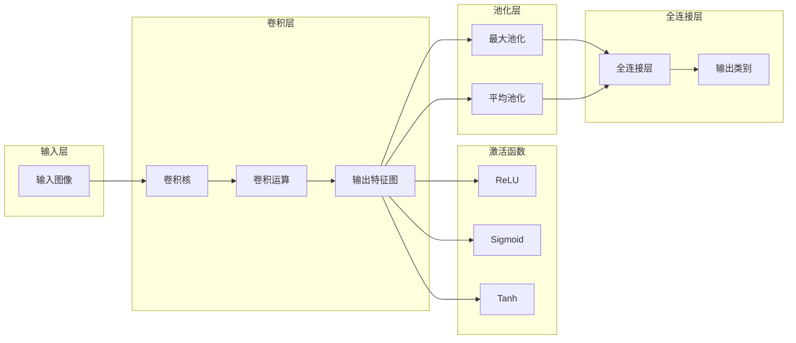

## 第二部分：卷积神经网络

## 1. 背景介绍

### 1.1 从人工神经网络到卷积神经网络

人工神经网络（ANN）作为一种模拟人脑神经元结构和功能的计算模型，在机器学习领域取得了巨大成功。然而，传统的ANN在处理图像等高维数据时存在一些局限性，例如参数过多、容易过拟合等。为了克服这些问题，研究人员提出了卷积神经网络（Convolutional Neural Network，CNN）。

CNN是一种特殊的神经网络结构，其核心思想是利用局部连接和权值共享来提取图像的空间特征。相比于传统的ANN，CNN具有以下优点：

* **局部连接:** CNN中的神经元只与输入图像中的局部区域相连接，而不是像ANN那样全连接。这种局部连接的特性使得CNN能够更好地捕捉图像的局部特征，例如边缘、角点等。
* **权值共享:** CNN中的卷积核参数在不同的位置共享，这意味着同一个卷积核可以提取图像不同位置的相同特征。这种权值共享的机制大大减少了模型的参数量，提高了模型的泛化能力。
* **平移不变性:** 由于卷积核参数共享，CNN对输入图像的平移具有一定的不变性。这意味着即使图像中的目标物体发生了平移，CNN仍然能够识别出来。

### 1.2 卷积神经网络的发展历程

CNN的发展可以追溯到20世纪80年代，当时Yann LeCun等人提出了LeNet-5网络结构，成功应用于手写数字识别任务。近年来，随着深度学习的兴起，CNN在图像分类、目标检测、图像分割等领域取得了突破性进展，例如AlexNet、VGG、GoogLeNet、ResNet等网络模型的提出，不断刷新着ImageNet等图像识别竞赛的记录。

### 1.3 卷积神经网络的应用领域

CNN作为一种强大的图像处理工具，在各个领域都有着广泛的应用，例如：

* **计算机视觉:** 图像分类、目标检测、图像分割、人脸识别、视频分析等。
* **自然语言处理:** 文本分类、情感分析、机器翻译等。
* **语音识别:** 语音识别、声纹识别等。
* **医疗诊断:** 医学影像分析、疾病诊断等。

## 2. 核心概念与联系

### 2.1 卷积层

卷积层是CNN的核心组件，其主要功能是利用卷积核提取输入数据的特征。

**卷积核:** 卷积核是一个可学习的权重矩阵，用于与输入数据进行卷积运算。卷积核的大小通常为3x3或5x5，其值决定了提取特征的类型。

**卷积运算:** 卷积运算是一种数学运算，用于计算两个函数之间的相似度。在CNN中，卷积运算将卷积核与输入数据对应位置的元素相乘并求和，得到输出特征图的对应位置的值。

**填充:** 为了保持输出特征图的大小与输入数据一致，通常需要在输入数据的周围添加填充值。

**步幅:** 步幅是指卷积核在输入数据上移动的步长。步幅越大，输出特征图的尺寸越小。

### 2.2 激活函数

激活函数用于对卷积层的输出进行非线性变换，增强网络的表达能力。常用的激活函数有：

* **ReLU:** ReLU函数是一种线性整流单元，其表达式为：$f(x) = max(0, x)$。ReLU函数具有计算简单、收敛速度快等优点。
* **Sigmoid:** Sigmoid函数是一种S形函数，其表达式为：$f(x) = 1 / (1 + exp(-x))$。Sigmoid函数的输出值在0到1之间，可以用于二分类问题。
* **Tanh:** Tanh函数是一种双曲正切函数，其表达式为：$f(x) = (exp(x) - exp(-x)) / (exp(x) + exp(-x))$。Tanh函数的输出值在-1到1之间，可以用于回归问题。

### 2.3 池化层

池化层用于对卷积层的输出进行降维操作，减少计算量和参数量，同时提高模型的鲁棒性。常用的池化操作有：

* **最大池化:** 最大池化操作选择池化窗口内的最大值作为输出值。
* **平均池化:** 平均池化操作计算池化窗口内所有值的平均值作为输出值。

### 2.4 全连接层

全连接层通常位于CNN的末端，用于将卷积层和池化层提取的特征映射到最终的输出类别。全连接层中的每个神经元都与上一层的所有神经元相连接。

### 2.5 核心概念联系图



## 3. 核心算法原理具体操作步骤

### 3.1 卷积操作

卷积操作是CNN的核心操作，其计算过程如下：

1. 将卷积核滑动到输入数据的每个位置。
2. 将卷积核与输入数据对应位置的元素相乘并求和。
3. 将求和结果作为输出特征图对应位置的值。

例如，假设输入数据是一个3x3的矩阵，卷积核是一个2x2的矩阵，步幅为1，填充为0，则卷积操作的计算过程如下：

```
输入数据：
1 2 3
4 5 6
7 8 9

卷积核：
-1  0
 0  1

输出特征图：
-3 -4
-3 -4
```

### 3.2 池化操作

池化操作用于对卷积层的输出进行降维操作，其计算过程如下：

1. 将池化窗口滑动到输入数据的每个位置。
2. 根据选择的池化操作计算池化窗口内所有值的统计量（例如最大值或平均值）。
3. 将统计量作为输出特征图对应位置的值。

例如，假设输入数据是一个4x4的矩阵，池化窗口大小为2x2，步幅为2，则最大池化操作的计算过程如下：

```
输入数据：
1 2 3 4
5 6 7 8
9 10 11 12
13 14 15 16

输出特征图：
6 8
14 16
```

### 3.3 前向传播

CNN的前向传播过程是指将输入数据从输入层传递到输出层的过程，其具体步骤如下：

1. 将输入数据输入到卷积层，进行卷积操作，得到输出特征图。
2. 对输出特征图应用激活函数，得到激活后的特征图。
3. 对激活后的特征图进行池化操作，得到降维后的特征图。
4. 重复步骤1-3，直到最后一层卷积层或池化层。
5. 将最后一层卷积层或池化层的输出展平成一维向量。
6. 将一维向量输入到全连接层，进行线性变换和激活函数运算，得到最终的输出结果。

### 3.4 反向传播

CNN的反向传播过程是指根据损失函数计算梯度，并利用梯度更新网络参数的过程，其具体步骤如下：

1. 计算损失函数对输出结果的梯度。
2. 利用链式法则计算损失函数对网络参数的梯度。
3. 利用梯度下降等优化算法更新网络参数。

## 4. 数学模型和公式详细讲解举例说明

### 4.1 卷积操作的数学公式

卷积操作的数学公式如下：

$$
y_{i,j} = \sum_{m=1}^{k} \sum_{n=1}^{k} x_{i+m-1, j+n-1} \cdot w_{m,n}
$$

其中：

* $y_{i,j}$ 表示输出特征图的第 $i$ 行第 $j$ 列的值。
* $x_{i+m-1, j+n-1}$ 表示输入数据的第 $i+m-1$ 行第 $j+n-1$ 列的值。
* $w_{m,n}$ 表示卷积核的第 $m$ 行第 $n$ 列的值。
* $k$ 表示卷积核的大小。

### 4.2 池化操作的数学公式

最大池化操作的数学公式如下：

$$
y_{i,j} = \max_{m=1}^{p} \max_{n=1}^{p} x_{i \cdot s + m - 1, j \cdot s + n - 1}
$$

平均池化操作的数学公式如下：

$$
y_{i,j} = \frac{1}{p^2} \sum_{m=1}^{p} \sum_{n=1}^{p} x_{i \cdot s + m - 1, j \cdot s + n - 1}
$$

其中：

* $y_{i,j}$ 表示输出特征图的第 $i$ 行第 $j$ 列的值。
* $x_{i \cdot s + m - 1, j \cdot s + n - 1}$ 表示输入数据的第 $i \cdot s + m - 1$ 行第 $j \cdot s + n - 1$ 列的值。
* $p$ 表示池化窗口的大小。
* $s$ 表示步幅。

## 5. 项目实践：代码实例和详细解释说明

### 5.1 使用Python和TensorFlow实现一个简单的CNN模型

```python
import tensorflow as tf

# 定义输入数据
(x_train, y_train), (x_test, y_test) = tf.keras.datasets.mnist.load_data()

# 数据预处理
x_train = x_train.astype('float32') / 255.0
x_test = x_test.astype('float32') / 255.0
y_train = tf.keras.utils.to_categorical(y_train, num_classes=10)
y_test = tf.keras.utils.to_categorical(y_test, num_classes=10)

# 构建CNN模型
model = tf.keras.models.Sequential([
    tf.keras.layers.Conv2D(32, (3, 3), activation='relu', input_shape=(28, 28, 1)),
    tf.keras.layers.MaxPooling2D((2, 2)),
    tf.keras.layers.Conv2D(64, (3, 3), activation='relu'),
    tf.keras.layers.MaxPooling2D((2, 2)),
    tf.keras.layers.Flatten(),
    tf.keras.layers.Dense(10, activation='softmax')
])

# 编译模型
model.compile(optimizer='adam',
              loss='categorical_crossentropy',
              metrics=['accuracy'])

# 训练模型
model.fit(x_train, y_train, epochs=5)

# 评估模型
loss, accuracy = model.evaluate(x_test, y_test)
print('Test loss:', loss)
print('Test accuracy:', accuracy)
```

**代码解释:**

* 导入必要的库，包括TensorFlow和MNIST数据集。
* 加载MNIST数据集，并将数据类型转换为`float32`，将像素值缩放到0到1之间。
* 使用`to_categorical`函数将标签转换为独热编码。
* 使用`Sequential`类构建CNN模型，模型包括两个卷积层、两个最大池化层、一个扁平化层和一个全连接层。
* 使用`compile`函数编译模型，指定优化器、损失函数和评估指标。
* 使用`fit`函数训练模型，指定训练数据、训练轮数等参数。
* 使用`evaluate`函数评估模型，计算测试集上的损失值和准确率。

### 5.2 使用预训练的CNN模型进行图像分类

```python
import tensorflow as tf
from tensorflow.keras.applications import ResNet50

# 加载预训练的ResNet50模型
model = ResNet50(weights='imagenet')

# 加载图像并进行预处理
img = tf.keras.preprocessing.image.load_img('image.jpg', target_size=(224, 224))
x = tf.keras.preprocessing.image.img_to_array(img)
x = tf.keras.applications.resnet50.preprocess_input(x)
x = tf.expand_dims(x, axis=0)

# 进行预测
predictions = model.predict(x)

# 解码预测结果
decoded_predictions = tf.keras.applications.resnet50.decode_predictions(predictions, top=5)[0]

# 打印预测结果
for (imagenetID, label, probability) in decoded_predictions:
    print(f'{label}: {probability * 100:.2f}%')
```

**代码解释:**

* 导入必要的库，包括TensorFlow和ResNet50模型。
* 加载预训练的ResNet50模型，指定使用ImageNet数据集上训练的权重。
* 加载图像并进行预处理，包括调整图像大小、转换为数组、进行模型特定的预处理等。
* 使用`predict`函数进行预测，得到预测结果。
* 使用`decode_predictions`函数解码预测结果，得到预测类别和概率。
* 打印预测结果，显示预测类别和对应的概率。

## 6. 实际应用场景

### 6.1 图像分类

* **电商平台:** 商品图片分类、识别商品属性等。
* **社交网络:** 图片内容审核、人脸识别等。
* **医疗诊断:** 医学影像分析、疾病诊断等。

### 6.2 目标检测

* **自动驾驶:** 车辆检测、行人检测、交通标志识别等。
* **安防监控:** 人脸识别、目标跟踪等。
* **工业检测:** 产品缺陷检测等。

### 6.3 图像分割

* **自动驾驶:** 道路分割、车道线检测等。
* **医学影像分析:** 肿瘤分割、器官分割等。
* **遥感图像分析:** 土地利用分类、目标识别等。

## 7. 工具和资源推荐

### 7.1 深度学习框架

* **TensorFlow:** Google开源的深度学习框架，功能强大，文档完善。
* **PyTorch:** Facebook开源的深度学习框架，灵活易用，社区活跃。
* **Keras:** 基于TensorFlow或Theano的高级神经网络API，易于使用，适合快速原型设计。

### 7.2 数据集

* **ImageNet:** 大规模图像分类数据集，包含超过1400万张图片，涵盖1000多个类别。
* **COCO:** 大规模目标检测、分割和图像描述数据集，包含超过33万张图片，涵盖80个类别。
* **PASCAL VOC:** 目标检测数据集，包含20个类别。

### 7.3 学习资源

* **CS231n: Convolutional Neural Networks for Visual Recognition:** 斯坦福大学的深度学习课程，涵盖CNN的理论和实践。
* **Deep Learning Specialization:** deeplearning.ai提供的深度学习专项课程，涵盖CNN等深度学习模型。

## 8. 总结：未来发展趋势与挑战

### 8.1 未来发展趋势

* **更深、更复杂的网络结构:** 研究人员将继续探索更深、更复杂的CNN网络结构，以进一步提高模型的性能。
* **轻量级CNN模型:** 为了满足移动设备和嵌入式设备的需求，研究人员将致力于开发轻量级CNN模型，以减少模型的计算量和存储空间。
* **与其他技术的结合:** CNN将与其他技术，例如强化学习、生成对抗网络等相结合，以解决更复杂的任务。

### 8.2 挑战

* **数据需求:** CNN模型的训练需要大量的标注数据，而获取标注数据成本高昂。
* **可解释性:** CNN模型的决策过程难以解释，这限制了其在某些领域的应用。
* **对抗样本:** CNN模型容易受到对抗样本的攻击，对抗样本是指经过精心设计的输入数据，可以导致模型输出错误的结果。

## 9. 附录：常见问题与解答

### 9.1 什么是卷积？

卷积是一种数学运算，用于计算两个函数之间的相似度。在CNN中，卷积运算将卷积核与输入数据对应位置的元素相乘并求和，得到输出特征图的对应位置的值。

### 9.2 什么是池化？

池化操作用于对卷积层的输出进行降维操作，减少计算量和参数量，同时提高模型的鲁棒性。常用的池化操作有最大池化和平均池化。

### 9.3 什么是激活函数？

激活函数用于对卷积层的输出进行非线性变换，增强网络的表达能力。常用的激活函数有ReLU、Sigmoid和Tanh。

### 9.4 如何选择CNN模型的超参数？

CNN模型的超参数包括卷积核大小、步幅、填充、池化窗口大小等。选择合适的超参数对模型的性能至关重要。通常可以使用网格搜索、随机搜索等方法来寻找最优的超参数。