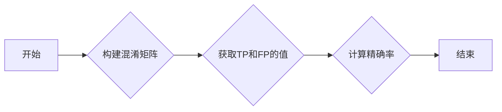

# 精确率Precision原理与代码实例讲解

作者：禅与计算机程序设计艺术

## 1. 背景介绍

### 1.1 什么是机器学习模型评估指标？

在机器学习领域，我们通常会使用各种指标来评估一个模型的性能。这些指标可以帮助我们了解模型在不同场景下的表现，从而更好地选择和优化模型。常见的机器学习模型评估指标包括：

* **准确率 (Accuracy)**
* **精确率 (Precision)**
* **召回率 (Recall)**
* **F1-score**
* **ROC曲线与AUC值**

等等。

### 1.2 为什么需要精确率？

**准确率 (Accuracy)** 是最直观的评估指标，它表示模型预测正确的样本数占总样本数的比例。然而，在很多实际应用场景中，仅仅依靠准确率来评估模型是不够的。

考虑一个垃圾邮件分类问题，假设我们有100封邮件，其中90封是正常邮件，10封是垃圾邮件。如果我们的模型将所有邮件都预测为正常邮件，那么它的准确率将达到90%。但这显然不是一个好的模型，因为它完全没有识别出任何垃圾邮件。

为了解决这个问题，我们需要引入其他的评估指标。**精确率 (Precision)** 就是其中一个重要的指标，它关注的是**在模型预测为正例的样本中，有多少是真正例**。

### 1.3 精确率的应用场景

精确率在很多领域都有着广泛的应用，例如：

* **信息检索:**  搜索引擎需要尽可能提高返回结果的精确率，避免用户被无关的信息淹没。
* **医学诊断:** 在疾病诊断中，我们希望模型能够尽可能准确地识别出患病的病人，避免漏诊和误诊。
* **金融风控:** 在金融领域，我们需要识别出潜在的风险用户，避免造成经济损失。

## 2. 核心概念与联系

### 2.1 混淆矩阵

在介绍精确率的计算公式之前，我们需要先了解一下**混淆矩阵 (Confusion Matrix)**。混淆矩阵是一个用于可视化分类模型预测结果的表格，它将模型的预测结果与实际标签进行对比，从而展示模型在各个类别上的预测情况。

对于一个二分类问题，混淆矩阵通常如下所示：

|           | 实际为正例 | 实际为负例 |
|-----------|------------|------------|
| 预测为正例 | TP         | FP         |
| 预测为负例 | FN         | TN         |

其中：

* **TP (True Positive):**  模型预测为正例，实际也为正例的样本数量。
* **FP (False Positive):** 模型预测为正例，实际为负例的样本数量。
* **FN (False Negative):** 模型预测为负例，实际为正例的样本数量。
* **TN (True Negative):**  模型预测为负例，实际也为负例的样本数量。

### 2.2 精确率的定义

**精确率 (Precision)** 的定义为：

$$
Precision = \frac{TP}{TP + FP}
$$

即**模型预测为正例的样本中，真正例的比例**。

### 2.3 精确率与其他指标的关系

精确率与其他评估指标之间存在着密切的联系，例如：

* **召回率 (Recall):** 召回率是指**在实际为正例的样本中，模型预测为正例的比例**。
* **F1-score:** F1-score 是精确率和召回率的调和平均数，它可以综合考虑模型的精确率和召回率。

## 3. 核心算法原理具体操作步骤

计算精确率的步骤非常简单：

1. 根据模型的预测结果和实际标签构建混淆矩阵。
2. 从混淆矩阵中获取 TP 和 FP 的值。
3. 根据公式计算精确率。

## 4. 数学模型和公式详细讲解举例说明

### 4.1 例子

假设我们有一个垃圾邮件分类模型，对100封邮件进行分类，得到如下混淆矩阵：

|           | 实际为垃圾邮件 | 实际为正常邮件 |
|-----------|----------------|----------------|
| 预测为垃圾邮件 | 8              | 2              |
| 预测为正常邮件 | 2              | 88             |

### 4.2 计算精确率

根据公式，我们可以计算出该模型的精确率为：

$$
Precision = \frac{TP}{TP + FP} = \frac{8}{8 + 2} = 0.8
$$

即该模型在预测为垃圾邮件的样本中，有80%是真正的垃圾邮件。

## 5. 项目实践：代码实例和详细解释说明

### 5.1 Python 代码实现

```python
from sklearn.metrics import precision_score

# 假设 y_true 是真实标签，y_pred 是模型的预测结果
y_true = [0, 1, 0, 0, 1, 1, 0, 1, 0, 1]
y_pred = [1, 1, 0, 0, 1, 0, 0, 1, 1, 1]

# 计算精确率
precision = precision_score(y_true, y_pred)

# 打印结果
print("Precision:", precision)
```

### 5.2 代码解释

* 首先，我们导入了 `precision_score` 函数，该函数可以方便地计算精确率。
* 然后，我们定义了真实标签 `y_true` 和模型的预测结果 `y_pred`。
* 接着，我们调用 `precision_score` 函数计算精确率，并将结果保存到变量 `precision` 中。
* 最后，我们打印了精确率的值。

## 6. 实际应用场景

### 6.1 信息检索

在信息检索领域，精确率可以用来评估搜索引擎返回结果的质量。一个高精确率的搜索引擎应该返回尽可能多与用户查询相关的结果，同时尽量减少无关结果的数量。

### 6.2 医学诊断

在医学诊断中，精确率可以用来评估诊断模型的准确性。一个高精确率的诊断模型应该能够尽可能准确地识别出患病的病人，同时尽量减少误诊的发生。

### 6.3 金融风控

在金融风控领域，精确率可以用来评估风险模型的有效性。一个高精确率的风险模型应该能够尽可能准确地识别出潜在的风险用户，同时尽量减少对正常用户的误判。

## 7. 总结：未来发展趋势与挑战

精确率是机器学习模型评估中一个非常重要的指标，它可以帮助我们更好地理解模型在特定场景下的表现。未来，随着机器学习技术的不断发展，精确率的应用将会越来越广泛。

## 8. 附录：常见问题与解答

### 8.1 如何提高模型的精确率？

提高模型的精确率的方法有很多，例如：

* **增加训练数据:**  更多的数据可以帮助模型更好地学习数据的特征，从而提高模型的泛化能力。
* **选择合适的模型:** 不同的模型适用于不同的场景，选择合适的模型可以有效提高模型的性能。
* **调整模型参数:**  模型的参数对模型的性能有很大影响，可以通过调整参数来优化模型。
* **特征工程:** 特征工程是指对原始数据进行处理，提取更有用的特征，从而提高模型的性能。

### 8.2 精确率和召回率之间如何权衡？

在实际应用中，我们通常需要在精确率和召回率之间进行权衡。例如，在垃圾邮件分类问题中，我们可能希望模型能够识别出尽可能多的垃圾邮件，即使会误判一些正常邮件。在这种情况下，我们可以选择一个召回率较高的模型。反之，如果我们希望模型尽可能减少误判，即使会漏掉一些垃圾邮件，那么我们可以选择一个精确率较高的模型。


##  Mermaid流程图




