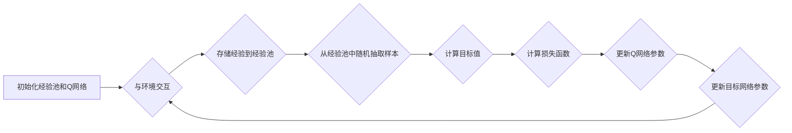

## 1. 背景介绍

### 1.1 强化学习与深度学习的融合

近年来，深度学习在计算机视觉、自然语言处理等领域取得了巨大成功，而强化学习作为一种重要的机器学习方法，也在游戏AI、机器人控制等领域展现出巨大潜力。将深度学习强大的表征学习能力与强化学习的决策能力相结合，催生了深度强化学习（Deep Reinforcement Learning, DRL）这一新兴领域，并取得了一系列突破性进展，例如DeepMind开发的AlphaGo、AlphaZero等。

### 1.2  DQN算法的突破与挑战

深度Q网络（Deep Q-Network，DQN）是深度强化学习的开山之作，它成功地将深度神经网络应用于强化学习中的价值函数逼近问题，在Atari游戏等任务上取得了超越人类水平的成绩。然而，DQN算法也面临着一些挑战：

* **样本效率低**: DQN算法需要与环境进行大量的交互才能学习到一个较优的策略，这在实际应用中往往是难以接受的。
* **训练不稳定**: DQN算法的训练过程容易出现震荡甚至发散的情况，这主要是由于数据之间的相关性和目标函数的非平稳性造成的。

### 1.3 经验回放：解决DQN算法难题的关键

为了解决DQN算法面临的挑战，研究人员提出了一系列改进方法，其中经验回放（Experience Replay）技术被证明是一种非常有效的方法。经验回放通过存储和重复利用智能体 past experiences 来提高样本效率和训练稳定性，从而提升DQN算法的性能。

## 2. 核心概念与联系

### 2.1 强化学习基础

在深入探讨经验回放之前，我们先简单回顾一下强化学习的基本概念。强化学习研究的是智能体（Agent）在与环境（Environment）交互过程中，如何通过学习策略（Policy）来最大化累积奖励（Cumulative Reward）。

* **智能体（Agent）**:  执行动作并与环境交互的实体。
* **环境（Environment）**:  智能体所处的外部世界，它会根据智能体的动作改变自身状态并给出相应的奖励。
* **状态（State）**:  描述环境当前情况的变量，智能体可以观察到环境的状态。
* **动作（Action）**: 智能体可以采取的操作。
* **奖励（Reward）**: 环境在每个时间步给智能体的反馈信号，用于指示当前状态下采取某个动作的好坏。
* **策略（Policy）**:  智能体根据当前状态选择动作的规则。
* **价值函数（Value Function）**:  用于评估某个状态或状态-动作对的长期价值，通常表示为从该状态或状态-动作对开始，按照某个策略执行到结束所能获得的累积奖励的期望值。

### 2.2 DQN算法回顾

DQN算法的核心思想是利用深度神经网络来逼近强化学习中的价值函数。具体来说，DQN算法使用一个深度神经网络 $Q(s, a; \theta)$ 来表示状态-动作价值函数（Q函数），其中 $s$ 表示状态，$a$ 表示动作，$\theta$ 表示神经网络的参数。$Q(s, a; \theta)$ 表示在状态 $s$ 下采取动作 $a$ 后，按照当前策略执行到结束所能获得的累积奖励的期望值。

DQN算法的训练目标是最小化Q函数的损失函数，通常使用如下均方误差损失函数：

$$
L(\theta) = \mathbb{E}[(r + \gamma \max_{a'} Q(s', a'; \theta) - Q(s, a; \theta))^2]
$$

其中：

* $r$ 是智能体在状态 $s$ 下采取动作 $a$ 后获得的奖励；
* $s'$ 是智能体在状态 $s$ 下采取动作 $a$ 后转移到的下一个状态；
* $\gamma$ 是折扣因子，用于平衡当前奖励和未来奖励的重要性；
* $\max_{a'} Q(s', a'; \theta)$ 表示在下一个状态 $s'$ 下，选择最优动作 $a'$ 所能获得的最大Q值。

### 2.3 经验回放的作用

经验回放通过将智能体与环境交互过程中的经验（即状态、动作、奖励、下一个状态）存储在一个经验池中，并在训练过程中随机抽取样本来更新Q网络的参数，从而实现以下目标：

* **打破数据相关性**:  在强化学习中，智能体采集到的数据是连续的，相邻的数据之间存在着很强的相关性。这种相关性会导致Q网络的训练出现震荡甚至发散。经验回放通过随机抽取样本，可以有效地打破数据之间的相关性，提高训练的稳定性。
* **提高样本利用率**:  在传统的DQN算法中，智能体每与环境交互一次，只会利用当前的经验更新一次Q网络的参数。而经验回放可以将过去的经验存储起来，并在之后的训练过程中重复利用，从而提高样本的利用率，加快训练速度。

## 3. 核心算法原理具体操作步骤

### 3.1 经验池的设计

经验池通常被实现为一个固定大小的循环队列。当经验池满了之后，新的经验会覆盖掉最旧的经验。经验池中存储的每个元素是一个四元组 $(s_t, a_t, r_t, s_{t+1})$，表示智能体在时间步 $t$ 从状态 $s_t$ 采取动作 $a_t$，获得奖励 $r_t$，并转移到下一个状态 $s_{t+1}$。

### 3.2 经验回放的执行流程

在使用经验回放的DQN算法中，智能体与环境交互和训练Q网络的过程如下：

1. **初始化**: 初始化经验池和Q网络。
2. **与环境交互**: 智能体根据当前的策略与环境交互，并将交互过程中的经验存储到经验池中。
3. **训练Q网络**: 从经验池中随机抽取一批样本，利用这些样本来更新Q网络的参数。
4. **更新目标网络**:  为了使目标函数更加稳定，DQN算法通常会使用两个Q网络：一个用于计算目标值的目标网络，一个用于计算当前值的预测网络。目标网络的参数会定期从预测网络复制过来。

### 3.3 算法流程图



## 4. 数学模型和公式详细讲解举例说明

### 4.1 经验回放的目标函数

使用经验回放后，DQN算法的目标函数仍然是最小化Q函数的损失函数，但使用的样本不再是当前时刻收集到的数据，而是从经验池中随机抽取的样本。因此，目标函数可以表示为：

$$
L(\theta) = \mathbb{E}_{(s, a, r, s') \sim D}[(r + \gamma \max_{a'} Q(s', a'; \theta^-) - Q(s, a; \theta))^2]
$$

其中：

* $D$ 表示经验池；
* $(s, a, r, s') \sim D$ 表示从经验池中随机抽取一个样本；
* $\theta^-$ 表示目标网络的参数。

### 4.2 举例说明

假设经验池中存储了以下4条经验：

| 状态 $s$ | 动作 $a$ | 奖励 $r$ | 下一个状态 $s'$ |
|---|---|---|---|
| $s_1$ | $a_1$ | $r_1$ | $s_2$ |
| $s_2$ | $a_2$ | $r_2$ | $s_3$ |
| $s_3$ | $a_3$ | $r_3$ | $s_4$ |
| $s_4$ | $a_4$ | $r_4$ | $s_5$ |

假设我们从经验池中随机抽取了2个样本：$(s_1, a_1, r_1, s_2)$ 和 $(s_3, a_3, r_3, s_4)$。那么，使用这两个样本更新Q网络参数时，目标函数为：

$$
\begin{aligned}
L(\theta) &= \frac{1}{2}[(r_1 + \gamma \max_{a'} Q(s_2, a'; \theta^-) - Q(s_1, a_1; \theta))^2 \\
&+ (r_3 + \gamma \max_{a'} Q(s_4, a'; \theta^-) - Q(s_3, a_3; \theta))^2]
\end{aligned}
$$

## 5. 项目实践：代码实例和详细解释说明

### 5.1 Python代码实现

```python
import random
from collections import deque

import torch
import torch.nn as nn
import torch.optim as optim

class DQN(nn.Module):
    def __init__(self, state_dim, action_dim, hidden_dim=128):
        super(DQN, self).__init__()
        self.fc1 = nn.Linear(state_dim, hidden_dim)
        self.fc2 = nn.Linear(hidden_dim, hidden_dim)
        self.fc3 = nn.Linear(hidden_dim, action_dim)

    def forward(self, state):
        x = torch.relu(self.fc1(state))
        x = torch.relu(self.fc2(x))
        return self.fc3(x)

class ReplayBuffer:
    def __init__(self, capacity):
        self.buffer = deque(maxlen=capacity)

    def push(self, state, action, reward, next_state, done):
        self.buffer.append((state, action, reward, next_state, done))

    def sample(self, batch_size):
        transitions = random.sample(self.buffer, batch_size)
        state, action, reward, next_state, done = zip(*transitions)
        return torch.tensor(state, dtype=torch.float), torch.tensor(action), \
               torch.tensor(reward, dtype=torch.float), torch.tensor(next_state, dtype=torch.float), \
               torch.tensor(done, dtype=torch.float)

    def __len__(self):
        return len(self.buffer)

class DQNAgent:
    def __init__(self, state_dim, action_dim, lr=1e-3, gamma=0.99, batch_size=64, buffer_capacity=10000):
        self.device = torch.device("cuda" if torch.cuda.is_available() else "cpu")
        self.policy_net = DQN(state_dim, action_dim).to(self.device)
        self.target_net = DQN(state_dim, action_dim).to(self.device)
        self.target_net.load_state_dict(self.policy_net.state_dict())
        self.target_net.eval()

        self.optimizer = optim.Adam(self.policy_net.parameters(), lr=lr)
        self.loss_fn = nn.MSELoss()
        self.gamma = gamma
        self.batch_size = batch_size
        self.replay_buffer = ReplayBuffer(buffer_capacity)

    def select_action(self, state, epsilon=0.1):
        if random.random() > epsilon:
            with torch.no_grad():
                return self.policy_net(state.to(self.device)).max(1)[1].view(1, 1)
        else:
            return torch.tensor([[random.randrange(action_dim)]], device=self.device, dtype=torch.long)

    def update(self):
        if len(self.replay_buffer) < self.batch_size:
            return

        state, action, reward, next_state, done = self.replay_buffer.sample(self.batch_size)
        state = state.to(self.device)
        action = action.to(self.device)
        reward = reward.to(self.device)
        next_state = next_state.to(self.device)
        done = done.to(self.device)

        q_values = self.policy_net(state).gather(1, action)
        next_q_values = self.target_net(next_state).max(1)[0].detach()
        target_q_values = reward + self.gamma * next_q_values * (1 - done)
        loss = self.loss_fn(q_values, target_q_values.unsqueeze(1))

        self.optimizer.zero_grad()
        loss.backward()
        self.optimizer.step()

    def sync_target_net(self):
        self.target_net.load_state_dict(self.policy_net.state_dict())

```

### 5.2 代码解释

* `DQN` 类定义了DQN网络的结构，包括三个全连接层。
* `ReplayBuffer` 类实现了经验回放机制，包括存储经验、采样经验等功能。
* `DQNAgent` 类实现了DQN算法，包括选择动作、更新网络参数、同步目标网络等功能。

## 6. 实际应用场景

经验回放技术在强化学习的各个领域都有着广泛的应用，例如：

* **游戏AI**:  在游戏AI中，经验回放可以帮助智能体更快地学习到游戏规则和策略，例如AlphaGo、AlphaZero等都使用了经验回放技术。
* **机器人控制**:  在机器人控制中，经验回放可以帮助机器人从过去的经验中学习，提高控制精度和效率。
* **推荐系统**:  在推荐系统中，经验回放可以帮助系统更好地理解用户的兴趣和偏好，从而推荐更精准的内容。

## 7. 总结：未来发展趋势与挑战

### 7.1 未来发展趋势

* **更高效的经验回放机制**:  研究更高效的经验回放机制，例如优先级经验回放（Prioritized Experience Replay）、重要性采样（Importance Sampling）等，可以进一步提高样本效率和训练稳定性。
* **与其他强化学习算法的结合**:  将经验回放技术与其他强化学习算法相结合，例如Actor-Critic算法、策略梯度算法等，可以进一步提升强化学习算法的性能。
* **应用于更复杂的场景**:  将经验回放技术应用于更复杂的场景，例如多智能体强化学习、分层强化学习等，解决更具挑战性的问题。

### 7.2 面临的挑战

* **经验回放的存储效率**:  经验回放需要存储大量的经验数据，这会占用大量的存储空间。如何设计更高效的经验存储机制是一个挑战。
* **经验回放的参数选择**:  经验回放的参数，例如经验池大小、样本批次大小等，对算法的性能有很大影响。如何选择合适的参数是一个挑战。

## 8. 附录：常见问题与解答

### 8.1 经验回放为什么可以提高训练稳定性？

经验回放通过随机抽取样本来更新Q网络的参数，可以有效地打破数据之间的相关性。在传统的DQN算法中，智能体采集到的数据是连续的，相邻的数据之间存在着很强的相关性。这种相关性会导致Q网络的训练出现震荡甚至发散。经验回放通过随机抽取样本，可以有效地打破数据之间的相关性，提高训练的稳定性。

### 8.2 经验回放的参数如何选择？

经验回放的参数，例如经验池大小、样本批次大小等，对算法的性能有很大影响。通常情况下：

* 经验池大小越大，存储的经验越多，训练越稳定，但占用的内存也越多。
* 样本批次大小越大，每次更新参数使用的样本越多，训练越稳定，但计算量也越大。

需要根据具体的应用场景和计算资源来选择合适的参数。

### 8.3 经验回放有哪些缺点？

经验回放的主要缺点是需要占用大量的存储空间来存储经验数据。另外，经验回放的参数选择也比较困难，需要根据具体的应用场景进行调整。
