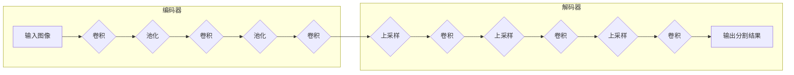

# 编码器-解码器架构：SegNet的核心理念

作者：禅与计算机程序设计艺术

## 1. 背景介绍

### 1.1 图像分割的意义

图像分割是计算机视觉领域的一项基础性任务，其目标是将图像分割成多个具有语义意义的区域。这项技术在许多领域都有着广泛的应用，例如：

* **自动驾驶**:  识别道路、车辆、行人等，为车辆提供安全驾驶的环境感知信息。
* **医学影像分析**:  分割器官、病灶等，辅助医生进行诊断和治疗。
* **遥感图像解译**:  识别土地类型、水体、植被等，用于资源调查、环境监测等。
* **工业检测**:  识别产品缺陷、定位目标物体等，提高生产效率和产品质量。

### 1.2 语义分割与实例分割

图像分割根据分割粒度的不同，可以分为语义分割和实例分割：

* **语义分割**:  对图像中的每个像素进行分类，将其分配到预定义的类别中。例如，将图像中的所有像素标记为“道路”、“车辆”、“行人”等。
* **实例分割**:  在语义分割的基础上，进一步区分同一类别的不同实例。例如，将图像中的每辆车都用不同的颜色标记出来。

### 1.3 SegNet的提出

SegNet是一种基于深度学习的语义分割网络，于2015年由Vijay Badrinarayanan等人提出。它采用编码器-解码器架构，通过编码器逐步提取图像特征，再通过解码器将特征映射回原始图像大小，最终得到像素级别的分类结果。

## 2. 核心概念与联系

### 2.1 编码器-解码器架构

编码器-解码器架构是一种常用的深度学习网络结构，广泛应用于图像分割、目标检测、机器翻译等领域。它由编码器和解码器两部分组成：

* **编码器**:  通常由卷积层和池化层组成，用于逐步提取输入数据的特征表示。随着网络层数的加深，特征图的尺寸逐渐变小，语义信息逐渐丰富。
* **解码器**:  通常由反卷积层和上采样层组成，用于将编码器提取的特征映射回原始输入数据的尺寸，并恢复空间信息。

### 2.2 SegNet的网络结构

SegNet的网络结构如下图所示：



* **编码器**:  SegNet的编码器部分与VGG16网络的前13层结构相同，包含5个卷积块，每个卷积块包含2-3个卷积层和一个最大池化层。
* **解码器**:  SegNet的解码器部分与编码器部分对称，包含5个反卷积块，每个反卷积块包含一个上采样层和2-3个卷积层。

### 2.3 SegNet的关键特性

SegNet与其他编码器-解码器网络的主要区别在于其解码器部分的设计：

* **索引池化**:  SegNet在编码器的池化层中记录了最大值的位置信息，并在解码器的上采样层中使用这些信息来指导特征图的上采样过程。这种方式可以减少由于池化操作导致的空间信息丢失，提高分割精度。
* **跳跃连接**:  SegNet在解码器中使用跳跃连接将编码器中对应层的特征图与解码器中对应层的特征图进行融合。这种方式可以将编码器中学习到的低级特征传递给解码器，帮助解码器恢复更精细的空间信息。

## 3. 核心算法原理具体操作步骤

### 3.1 编码器部分

1. 输入图像经过多个卷积层和池化层，逐步提取特征。
2. 在每个池化层中，记录最大值的位置信息，用于解码器部分的上采样操作。

### 3.2 解码器部分

1. 使用编码器部分记录的最大值位置信息，对特征图进行上采样。
2. 将上采样后的特征图与编码器部分对应层的特征图进行融合。
3. 经过多个反卷积层和卷积层，逐步恢复空间信息。
4. 最后，使用softmax函数对每个像素进行分类，得到分割结果。

## 4. 数学模型和公式详细讲解举例说明

### 4.1 卷积操作

卷积操作是卷积神经网络的核心操作，用于提取图像的局部特征。其数学公式如下：

$$
y_{i,j} = \sum_{m=1}^{M} \sum_{n=1}^{N} w_{m,n} x_{i+m-1,j+n-1}
$$

其中：

* $y_{i,j}$ 表示输出特征图的第 $i$ 行第 $j$ 列的值。
* $x_{i+m-1,j+n-1}$ 表示输入特征图的第 $i+m-1$ 行第 $j+n-1$ 列的值。
* $w_{m,n}$ 表示卷积核的第 $m$ 行第 $n$ 列的值。
* $M$ 和 $N$ 分别表示卷积核的行数和列数。

### 4.2 最大池化操作

最大池化操作是一种常用的下采样操作，用于减少特征图的尺寸并保留最重要的特征。其操作过程如下：

1. 将输入特征图划分成多个不重叠的区域。
2. 对每个区域，选择最大值作为输出特征图对应位置的值。

### 4.3 反卷积操作

反卷积操作是卷积操作的逆操作，用于将特征图的尺寸放大。其数学公式与卷积操作类似，只是将卷积核旋转180度。

### 4.4 上采样操作

上采样操作用于将特征图的尺寸放大，SegNet中使用的是最邻近插值法。其操作过程如下：

1. 将输入特征图的每个像素复制到输出特征图对应位置。
2. 对输出特征图中空缺的像素，使用其周围像素的值进行填充。

## 5. 项目实践：代码实例和详细解释说明

### 5.1 使用PyTorch实现SegNet

```python
import torch
import torch.nn as nn
import torch.nn.functional as F

class SegNet(nn.Module):
    def __init__(self, num_classes):
        super(SegNet, self).__init__()

        # 编码器部分
        self.conv11 = nn.Conv2d(3, 64, kernel_size=3, padding=1)
        self.bn11 = nn.BatchNorm2d(64)
        self.conv12 = nn.Conv2d(64, 64, kernel_size=3, padding=1)
        self.bn12 = nn.BatchNorm2d(64)
        self.pool1 = nn.MaxPool2d(kernel_size=2, stride=2, return_indices=True)

        # ... 其他卷积块 ...

        # 解码器部分
        self.unpool5 = nn.MaxUnpool2d(kernel_size=2, stride=2)
        self.conv56 = nn.Conv2d(512, 512, kernel_size=3, padding=1)
        self.bn56 = nn.BatchNorm2d(512)
        self.conv55 = nn.Conv2d(512, 512, kernel_size=3, padding=1)
        self.bn55 = nn.BatchNorm2d(512)

        # ... 其他反卷积块 ...

        # 输出层
        self.conv_out = nn.Conv2d(64, num_classes, kernel_size=1)

    def forward(self, x):
        # 编码器部分
        x = F.relu(self.bn11(self.conv11(x)))
        x = F.relu(self.bn12(self.conv12(x)))
        x, indices1 = self.pool1(x)

        # ... 其他卷积块 ...

        # 解码器部分
        x = self.unpool5(x, indices1)
        x = F.relu(self.bn56(self.conv56(x)))
        x = F.relu(self.bn55(self.conv55(x)))

        # ... 其他反卷积块 ...

        # 输出层
        x = self.conv_out(x)

        return x
```

### 5.2 代码解释

* `__init__` 函数定义了网络的结构，包括编码器部分和解码器部分。
* `forward` 函数定义了数据的流动过程，包括编码器部分的卷积和池化操作，以及解码器部分的上采样、卷积和反卷积操作。
* `MaxPool2d` 函数中的 `return_indices` 参数设置为 `True`，表示记录最大值的位置信息。
* `MaxUnpool2d` 函数使用 `indices` 参数来获取最大值的位置信息，并进行上采样操作。

## 6. 实际应用场景

### 6.1 自动驾驶

SegNet可以用于自动驾驶中的道路分割、车辆检测、行人检测等任务，为车辆提供安全驾驶的环境感知信息。

### 6.2 医学影像分析

SegNet可以用于医学影像分析中的器官分割、病灶分割等任务，辅助医生进行诊断和治疗。

### 6.3 遥感图像解译

SegNet可以用于遥感图像解译中的土地类型识别、水体提取、植被覆盖度估计等任务，用于资源调查、环境监测等。

## 7. 总结：未来发展趋势与挑战

### 7.1 未来发展趋势

* **实时性**:  随着自动驾驶、机器人等领域的快速发展，对图像分割的实时性要求越来越高。
* **精度**:  更高的分割精度可以提高自动驾驶、医学影像分析等应用的可靠性和安全性。
* **小样本学习**:  在实际应用中，标注数据往往非常有限，如何利用少量的标注数据训练出高性能的分割模型是一个挑战。

### 7.2 面临的挑战

* **计算复杂度**:  SegNet等深度学习模型的计算复杂度较高，难以部署到资源受限的设备上。
* **泛化能力**:  深度学习模型的泛化能力有限，如何提高模型对不同场景、不同数据的适应性是一个挑战。
* **可解释性**:  深度学习模型的可解释性较差，如何理解模型的决策过程是一个挑战。

## 8. 附录：常见问题与解答

### 8.1 SegNet与FCN的区别是什么？

SegNet和FCN都是基于编码器-解码器架构的语义分割网络，但它们在解码器部分的设计上有所不同：

* **上采样方式**:  SegNet使用记录最大值位置信息的索引池化进行上采样，而FCN使用反卷积进行上采样。
* **跳跃连接**:  SegNet使用跳跃连接将编码器中对应层的特征图与解码器中对应层的特征图进行融合，而FCN使用跳跃连接将编码器中所有层的特征图与解码器中对应层的特征图进行融合。

### 8.2 如何提高SegNet的分割精度？

* **使用更深的网络**:  更深的网络可以提取更丰富的特征，提高分割精度。
* **使用更多的数据**:  更多的数据可以提高模型的泛化能力，减少过拟合。
* **使用数据增强**:  数据增强可以增加训练数据的多样性，提高模型的鲁棒性。
* **使用预训练模型**:  使用在ImageNet等大型数据集上预训练的模型可以加速模型的收敛速度，提高分割精度。

### 8.3 如何将SegNet应用到其他领域？

SegNet是一种通用的语义分割网络，可以应用到任何需要进行图像分割的领域。只需要根据具体的应用场景，调整网络的输入输出尺寸、类别数量等参数即可。