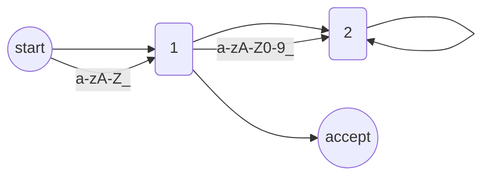

## 1. 背景介绍

### 1.1 编译原理课程教学现状与挑战

编译原理作为计算机科学的核心课程之一，在计算机专业人才培养中扮演着至关重要的角色。然而，传统的编译原理课程教学模式面临着诸多挑战：

* **理论性强，实践环节薄弱：** 编译原理涉及大量的理论知识，学生往往难以将理论与实践相结合，缺乏实际操作经验。
* **教学资源有限，难以满足个性化需求：**  传统的课堂教学模式难以满足学生个性化的学习需求，缺乏灵活性和互动性。
* **评估方式单一，难以全面考察学生能力：**  传统的考试方式主要以笔试为主，难以全面考察学生的实际编程能力和问题解决能力。

### 1.2 在线考试系统的优势与价值

为了解决上述问题，开发一个功能完善、易于使用的编译原理在线考试系统势在必行。在线考试系统具有以下优势：

* **提高学习效率：**  在线考试系统可以提供丰富的学习资源，例如在线编译器、代码示例、测试用例等，帮助学生更好地理解和掌握编译原理知识。
* **增强学习兴趣：**  在线考试系统可以采用更加生动活泼的教学方式，例如游戏化学习、互动式练习等，激发学生的学习兴趣。
* **实现个性化学习：**  在线考试系统可以根据学生的学习进度和水平，提供个性化的学习内容和练习题，帮助学生查漏补缺，巩固知识。
* **提高评估效率和准确性：**  在线考试系统可以自动批改客观题，并提供详细的答案解析，帮助学生及时发现和纠正错误。

## 2. 核心概念与联系

### 2.1 编译原理核心概念

* **词法分析：** 将源程序代码分解成一个个独立的词法单元（Token）。
* **语法分析：**  根据语法规则，将词法单元序列组合成语法树，检查语法错误。
* **语义分析：**  对语法树进行语义检查，例如类型检查、符号表管理等。
* **中间代码生成：**  将语法树转换成中间代码，例如三地址码、四元式等。
* **代码优化：**  对中间代码进行优化，提高程序的执行效率。
* **目标代码生成：**  将中间代码转换成目标机器代码。

### 2.2 在线考试系统核心功能

* **用户管理：**  包括学生、教师、管理员等不同角色的用户注册、登录、权限管理等功能。
* **题库管理：**  支持多种题型，例如选择题、填空题、编程题等，并提供题目编辑、导入、导出等功能。
* **考试管理：**  支持创建、编辑、发布考试，设置考试时间、考试规则等。
* **在线答题：**  提供友好的在线答题界面，支持代码编辑、编译、运行、调试等功能。
* **自动评卷：**  支持客观题自动评卷，并提供详细的答案解析。
* **成绩管理：**  记录学生的考试成绩，并提供成绩查询、统计分析等功能。

### 2.3 核心概念联系

在线考试系统的设计与实现需要综合运用编译原理的各个核心概念。例如，在词法分析阶段，可以使用正规表达式来定义词法单元的规则；在语法分析阶段，可以使用上下文无关文法来描述程序的语法结构；在语义分析阶段，需要构建符号表来存储变量和函数的信息；在代码生成阶段，需要根据目标机器的指令集来生成相应的机器代码。

## 3. 核心算法原理具体操作步骤

### 3.1 词法分析器设计与实现

#### 3.1.1 正规表达式与有限自动机

词法分析器的核心是正规表达式和有限自动机。正规表达式用于描述词法单元的规则，有限自动机则用于识别词法单元。

* **正规表达式：**  一种用于描述字符串模式的工具，可以使用一些特殊字符来表示字符集合、重复次数等。
    * 例如，正规表达式 `[a-zA-Z_][a-zA-Z0-9_]*` 可以匹配标识符，`[0-9]+` 可以匹配整数。
* **有限自动机：**  一种具有有限个状态的计算模型，可以根据输入的字符序列进行状态转移，最终到达接受状态或拒绝状态。
    * 例如，下图是一个识别标识符的有限自动机：



#### 3.1.2 词法分析器生成工具

可以使用词法分析器生成工具来自动生成词法分析器代码，例如 Lex、Flex 等。

* **Lex/Flex：**  将正规表达式定义的词法规则转换成 C 代码，生成词法分析器。

#### 3.1.3 词法分析器工作流程

1.  读取源程序代码。
2.  根据正规表达式定义的规则，识别词法单元。
3.  将识别出的词法单元及其属性存储到词法单元流中。

### 3.2 语法分析器设计与实现

#### 3.2.1 上下文无关文法

语法分析器的核心是上下文无关文法。上下文无关文法用于描述程序的语法结构。

* **上下文无关文法：**  由一组产生式组成，每个产生式由一个非终结符和一组终结符或非终结符组成。
    * 例如，下面的上下文无关文法描述了一个简单的算术表达式：

```
E -> E + T | T
T -> T * F | F
F -> ( E ) | id
```

#### 3.2.2 自顶向下分析

自顶向下分析是一种语法分析方法，从语法树的根节点开始，逐步推导出叶子节点。

* **递归下降分析：**  为每个非终结符编写一个递归函数，根据当前输入的词法单元选择相应的产生式进行推导。
* **LL(1) 分析：**  使用预测分析表来指导语法分析过程，避免回溯。

#### 3.2.3 自底向上分析

自底向上分析是一种语法分析方法，从输入的词法单元序列开始，逐步构建语法树。

* **算符优先分析：**  根据算符的优先级和结合性来指导语法分析过程。
* **LR 分析：**  使用 LR 分析表来指导语法分析过程，可以处理更加复杂的语法结构。

### 3.3 语义分析器设计与实现

#### 3.3.1 符号表

语义分析器的核心是符号表。符号表用于存储变量、函数等标识符的信息，例如类型、作用域等。

* **符号表结构：**  可以使用哈希表、二叉树等数据结构来实现符号表。
* **符号表操作：**  包括插入、查找、删除等操作。

#### 3.3.2 类型检查

类型检查是语义分析的重要任务之一，用于确保程序中变量的使用符合类型规则。

* **类型系统：**  定义了程序中允许使用的数据类型及其操作。
* **类型推导：**  根据变量的使用上下文推导出变量的类型。
* **类型转换：**  在必要时进行类型转换，例如将整数类型转换为浮点数类型。

#### 3.3.3 中间代码生成

中间代码生成是语义分析的另一个重要任务，用于将语法树转换成中间代码。

* **三地址码：**  一种常用的中间代码形式，每条指令最多包含三个地址。
* **四元式：**  另一种常用的中间代码形式，每条指令包含四个部分：操作符、操作数 1、操作数 2、结果。

### 3.4 代码生成器设计与实现

#### 3.4.1 目标机器体系结构

代码生成器需要根据目标机器的体系结构来生成相应的机器代码。

* **指令集：**  目标机器支持的指令集合。
* **寄存器：**  目标机器提供的存储单元。
* **寻址模式：**  访问内存地址的方式。

#### 3.4.2 代码生成算法

* **目标代码生成：**  将中间代码转换成目标机器代码。
* **寄存器分配：**  为变量分配寄存器。
* **指令调度：**  对指令进行重新排序，提高程序的执行效率。

## 4. 数学模型和公式详细讲解举例说明

### 4.1 正规表达式

正规表达式是一种用于描述字符串模式的工具，可以使用一些特殊字符来表示字符集合、重复次数等。

| 特殊字符 | 描述 |
|---|---|
| `.` | 匹配任意字符 |
| `*` | 匹配前一个字符 0 次或多次 |
| `+` | 匹配前一个字符 1 次或多次 |
| `?` | 匹配前一个字符 0 次或 1 次 |
| `[ ]` | 匹配字符集合中的任意字符 |
| `[^ ]` | 匹配不在字符集合中的任意字符 |
| `( )` | 将表达式分组 |
| `\|` | 匹配左右任意一个表达式 |
| `^` | 匹配字符串开头 |
| `$` | 匹配字符串结尾 |

**举例说明：**

* 正规表达式 `a*b+` 可以匹配字符串 "ab"、"aab"、"aaab" 等。
* 正规表达式 `[0-9]{3}-[0-9]{4}-[0-9]{4}` 可以匹配电话号码，例如 "123-4567-8901"。

### 4.2 有限自动机

有限自动机是一种具有有限个状态的计算模型，可以根据输入的字符序列进行状态转移，最终到达接受状态或拒绝状态。

* **形式化定义：**  一个有限自动机可以表示为一个五元组 $(Q, \Sigma, \delta, q_0, F)$，其中：
    * $Q$ 是状态集合。
    * $\Sigma$ 是输入字母表。
    * $\delta$ 是状态转移函数，$\delta: Q \times \Sigma \rightarrow Q$。
    * $q_0$ 是初始状态。
    * $F$ 是接受状态集合。

**举例说明：**

下图是一个识别标识符的有限自动机：


该有限自动机的形式化定义为：

* $Q = \{start, 1, 2, accept\}$
* $\Sigma = \{a, b, ..., z, A, B, ..., Z, 0, 1, ..., 9, \_ \}$
* $\delta(start, a) = 1$
* $\delta(start, b) = 1$
* ...
* $\delta(start, Z) = 1$
* $\delta(start, \_) = 1$
* $\delta(1, a) = 2$
* $\delta(1, b) = 2$
* ...
* $\delta(1, Z) = 2$
* $\delta(1, 0) = 2$
* $\delta(1, 1) = 2$
* ...
* $\delta(1, 9) = 2$
* $\delta(1, \_) = 2$
* $\delta(2, a) = 2$
* $\delta(2, b) = 2$
* ...
* $\delta(2, Z) = 2$
* $\delta(2, 0) = 2$
* $\delta(2, 1) = 2$
* ...
* $\delta(2, 9) = 2$
* $\delta(2, \_) = 2$
* $q_0 = start$
* $F = \{accept\}$

## 5. 项目实践：代码实例和详细解释说明

### 5.1 词法分析器代码示例

```c
%{
#include <stdio.h>
#include "y.tab.h"

int yylineno = 1;
%}

%%

[ \t\n]   ; // 忽略空格、制表符、换行符

[0-9]+    { yylval.ival = atoi(yytext); return INT; } // 识别整数

[a-zA-Z_][a-zA-Z0-9_]* { yylval.sval = strdup(yytext); return ID; } // 识别标识符

"+"       { return PLUS; }
"-"       { return MINUS; }
"*"       { return TIMES; }
"/"       { return DIVIDE; }
"("       { return LPAREN; }
")"       { return RPAREN; }
";"       { return SEMICOLON; }

.         { printf("词法错误：无法识别的字符 '%c'\n", yytext[0]); }

%%

int main()
{
  yyparse();
  return 0;
}
```

**代码解释：**

* `%{ ... %}`：包含 C 代码，用于定义头文件、变量等。
* `%% ... %%`：包含词法规则，每个规则由正规表达式和对应的动作组成。
* `yytext`：指向当前识别出的词法单元的指针。
* `yylval`：存储当前词法单元的属性。
* `return`：返回词法单元类型。

### 5.2 语法分析器代码示例

```c
%{
#include <stdio.h>
#include <stdlib.h>
#include "lex.yy.h"

void yyerror(const char *s);
%}

%token INT ID PLUS MINUS TIMES DIVIDE LPAREN RPAREN SEMICOLON

%%

program : statement_list
        ;

statement_list : statement
              | statement_list statement
              ;

statement : expression SEMICOLON
          ;

expression : expression PLUS term
           | expression MINUS term
           | term
           ;

term : term TIMES factor
     | term DIVIDE factor
     | factor
     ;

factor : INT
       | ID
       | LPAREN expression RPAREN
       ;

%%

void yyerror(const char *s)
{
  fprintf(stderr, "语法错误：%s\n", s);
  exit(1);
}

int main()
{
  yyparse();
  return 0;
}
```

**代码解释：**

* `%token`：声明词法单元类型。
* `%% ... %%`：包含语法规则，每个规则由非终结符和对应的产生式组成。
* `yyerror`：语法错误处理函数。

## 6. 实际应用场景

编译原理在线考试系统可以应用于以下场景：

* **高校计算机专业课程教学：**  作为编译原理课程的辅助教学工具，帮助学生更好地理解和掌握编译原理知识。
* **企业招聘考试：**  作为软件开发工程师招聘考试的测试平台，考察应聘者的编译原理基础知识和编程能力。
* **在线编程竞赛：**  作为在线编程竞赛的评测系统，自动评判参赛者的程序代码。

## 7. 工具和资源推荐

### 7.1 词法分析器生成工具

* **Lex/Flex：**  经典的词法分析器生成工具，支持正规表达式定义词法规则。

### 7.2 语法分析器生成工具

* **Yacc/Bison：**  经典的语法分析器生成工具，支持上下文无关文法定义语法规则。

### 7.3 在线编译器

* **JDoodle：**  支持多种编程语言的在线编译器，提供代码编辑、编译、运行、调试等功能。
* **OnlineGDB：**  功能强大的在线编译器，支持 C、C++、Java 等多种编程语言。

### 7.4 编译原理学习资源

* **《编译原理》（龙书）：**  编译原理领域的经典教材，全面介绍了编译原理的各个方面。
* **编译原理网：**  提供丰富的编译原理学习资源，包括教程、视频、代码示例等。

## 8. 总结：未来发展趋势与挑战

### 8.1 未来发展趋势

* **智能化：**  利用人工智能技术，实现更加智能的题目生成、答案评判、学习路径推荐等功能。
* **个性化：**  根据学生的学习进度和水平，提供更加个性化的学习内容和练习题。
* **游戏化：**  采用更加生动活泼的教学方式，例如游戏化学习、互动式练习等，激发学生的学习兴趣。

### 8.2 面临的挑战

* **题库建设：**  需要不断更新和完善题库，以满足不同层次、不同需求的学生。
* **技术更新：**  需要不断跟踪编译原理领域的技术发展趋势，更新考试内容和平台功能。
* **用户体验：**  需要不断优化平台的用户体验，提高平台的易用性和用户粘性。

## 9. 附录：常见问题与解答

### 9.1 如何编写正规表达式？

正规表达式可以使用一些特殊字符来表示字符集合、重复次数等。

* **字符集合：**  可以使用 `[ ]` 来表示字符集合，例如 `[a-z]` 表示所有小写字母。
* **重复次数：**  可以使用 `*`、`+`、`?` 来表示重复次数，例如 `a*` 表示 0 个或多个 a。
* **分组：**  可以使用 `( )` 来将表达式分组，例如 `(ab)+` 表示 1 个或