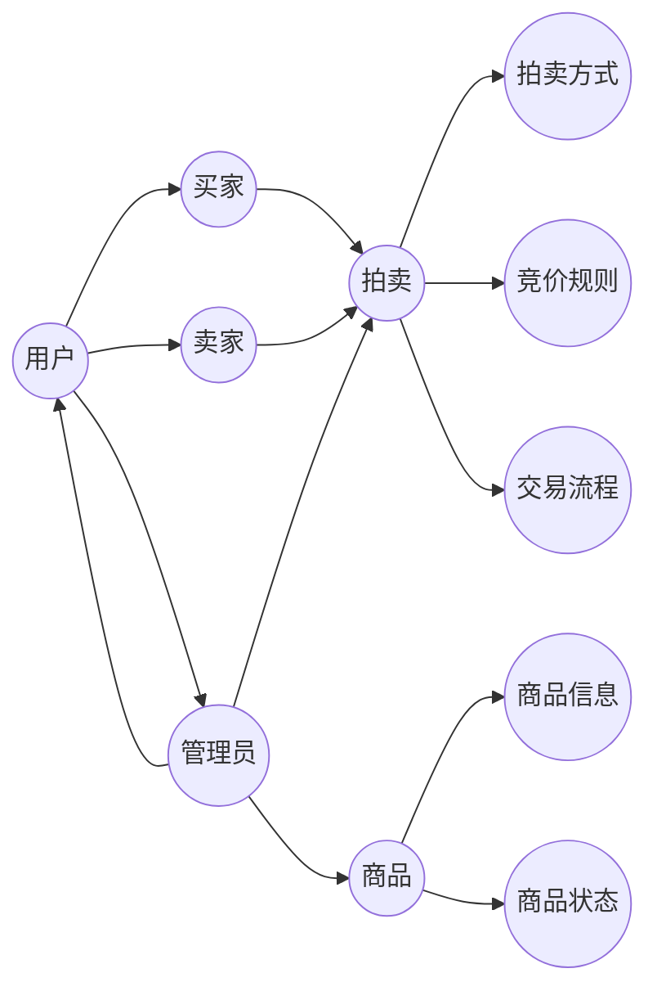

## 网上拍卖系统详细设计与具体代码实现

作者：禅与计算机程序设计艺术

## 1. 背景介绍

### 1.1. 电子商务的兴起与发展

随着互联网技术的飞速发展，电子商务逐渐成为人们生活中不可或缺的一部分。从最初的线上购物到如今的移动支付、社交电商等，电子商务模式不断创新，极大地改变了人们的消费习惯和生活方式。

### 1.2. 网上拍卖的优势与挑战

作为电子商务的重要组成部分，网上拍卖以其公开、透明、公平等特点，吸引了越来越多的用户参与。相比传统的线下拍卖，网上拍卖具有以下优势：

* **打破地域限制，扩大交易范围**: 用户可以随时随地参与全球范围内的拍卖活动。
* **降低交易成本，提高交易效率**:  无需租赁场地、雇佣拍卖师等，交易流程更加便捷高效。
* **信息透明公开，保证交易公平**:  所有竞拍者的出价和交易记录都公开透明，有效防止暗箱操作。

然而，网上拍卖也面临着一些挑战：

* **安全性问题**: 如何保障用户的账户安全、交易安全以及拍卖物品的真实性。
* **用户体验问题**: 如何设计简洁易用的界面，提供流畅的竞拍体验。
* **系统性能问题**:  如何应对高并发访问，保证系统的稳定性和可靠性。

### 1.3. 本文目标

本文旨在设计并实现一个功能完善、安全可靠、易于使用的网上拍卖系统，为用户提供优质的拍卖服务。

## 2. 核心概念与联系

### 2.1. 用户

* **买家**:  参与竞拍，出价购买商品的用户。
* **卖家**:  发布待拍卖商品，设置起拍价、拍卖时间等信息的用户。
* **管理员**:  负责管理系统用户、商品、交易记录等信息。

### 2.2. 商品

* **商品信息**:  包括商品名称、描述、图片、起拍价、拍卖时间等。
* **商品状态**:  包括待拍卖、拍卖中、已成交、已流拍等。

### 2.3. 拍卖

* **拍卖方式**:  包括英式拍卖、荷兰式拍卖等。
* **竞价规则**:  包括加价幅度、延时规则等。
* **交易流程**:  包括出价、成交、支付、发货、评价等环节。

### 2.4. 核心概念联系



## 3. 核心算法原理具体操作步骤

### 3.1. 英式拍卖算法

#### 3.1.1. 算法描述

英式拍卖，也称为增价拍卖，是最常见的拍卖方式之一。其基本规则是：

* 拍卖师宣布一个起拍价。
* 竞拍者轮流出价，每次加价必须高于当前最高价。
* 当无人再出价时，拍卖结束，出价最高者获得拍卖品。

#### 3.1.2. 算法步骤

1. 设置起拍价、加价幅度。
2. 接收竞拍者的出价。
3. 判断出价是否有效（是否高于当前最高价）。
4. 更新当前最高价和最高出价者。
5. 重复步骤2-4，直到无人再出价。
6. 宣布拍卖结果。

### 3.2. 荷兰式拍卖算法

#### 3.2.1. 算法描述

荷兰式拍卖，也称为减价拍卖，其基本规则是：

* 拍卖师宣布一个较高的起始价。
* 起始价会随着时间推移逐渐降低。
* 当有竞拍者愿意接受当前价格时，拍卖结束，该竞拍者获得拍卖品。

#### 3.2.2. 算法步骤

1. 设置起始价、降价幅度、降价时间间隔。
2. 循环执行以下步骤，直到有竞拍者出价：
    * 降低当前价格。
    * 等待一段时间间隔。
3. 宣布拍卖结果。

## 4. 数学模型和公式详细讲解举例说明

### 4.1. 延迟满足函数

在拍卖过程中，为了防止恶意抬价，通常会设置延迟满足函数。延迟满足函数是指，当有竞拍者出价时，拍卖结束时间会自动延长一段时间。

延迟满足函数可以使用如下公式表示：

$$
T_{delay} = k \times \log(P_{bid} - P_{current})
$$

其中：

* $T_{delay}$ 表示延迟时间。
* $k$ 为常数，用于调整延迟时间。
* $P_{bid}$ 表示当前出价。
* $P_{current}$ 表示当前最高价。

### 4.2. 举例说明

假设当前最高价为 100 元，延迟满足函数的常数 $k$ 为 10，则：

* 当有竞拍者出价 110 元时，延迟时间为 $10 \times \log(110 - 100) = 10$ 秒。
* 当有竞拍者出价 150 元时，延迟时间为 $10 \times \log(150 - 100) = 17.6$ 秒。

## 5. 项目实践：代码实例和详细解释说明

### 5.1. 技术选型

* **编程语言**:  Java
* **数据库**: MySQL
* **Web 框架**: Spring Boot
* **前端框架**: Vue.js

### 5.2. 代码实例

#### 5.2.1. 用户实体类

```java
public class User {

    private Long id;
    private String username;
    private String password;
    private String email;
    private String phone;
    // ...
}
```

#### 5.2.2. 商品实体类

```java
public class Product {

    private Long id;
    private String name;
    private String description;
    private String imageUrl;
    private BigDecimal startingPrice;
    private Date startTime;
    private Date endTime;
    // ...
}
```

#### 5.2.3. 拍卖记录实体类

```java
public class BidRecord {

    private Long id;
    private Long productId;
    private Long userId;
    private BigDecimal bidPrice;
    private Date bidTime;
    // ...
}
```

### 5.3. 详细解释说明

* **用户实体类**:  存储用户信息，包括用户名、密码、邮箱、电话等。
* **商品实体类**:  存储商品信息，包括商品名称、描述、图片、起拍价、拍卖时间等。
* **拍卖记录实体类**:  存储每次竞拍的记录，包括商品ID、用户ID、出价、出价时间等。

## 6. 实际应用场景

* **电商平台**:  淘宝、京东等电商平台的拍卖功能。
* **二手交易平台**:  闲鱼、转转等二手交易平台的拍卖功能。
* **收藏品拍卖**:  艺术品、古董等收藏品的在线拍卖。

## 7. 总结：未来发展趋势与挑战

### 7.1. 未来发展趋势

* **移动化**:  随着移动互联网的普及，移动端拍卖将成为主流趋势。
* **社交化**:  将拍卖与社交网络结合，增强用户互动和参与度。
* **智能化**:  利用人工智能技术，实现自动推荐、智能客服等功能。

### 7.2. 面临的挑战

* **安全问题**:  如何保障用户的信息安全和交易安全。
* **用户体验问题**:  如何提供更便捷、更流畅的拍卖体验。
* **市场竞争**:  如何应对来自其他平台的竞争。

## 8. 附录：常见问题与解答

### 8.1. 如何注册成为用户？

用户可以通过网站或 APP 进行注册，填写相关信息并完成验证即可。

### 8.2. 如何发布拍卖商品？

卖家需要先注册成为用户，然后登录系统，点击“发布商品”按钮，填写商品信息并上传图片，设置起拍价、拍卖时间等信息即可。

### 8.3. 如何参与竞拍？

买家需要先登录系统，找到想要竞拍的商品，点击“出价”按钮，输入出价金额即可。