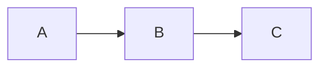

## 1. 背景介绍

### 1.1 教育信息化趋势

随着信息技术的飞速发展，教育领域也迎来了信息化浪潮。传统的线下教学模式逐渐向线上线下混合式教学模式转变，网络教学平台应运而生。网上选课系统作为网络教学平台的核心组成部分，为学生提供了便捷、高效的选课体验，同时也为学校教学管理带来了极大的便利。

### 1.2 网上选课系统概述

网上选课系统是指利用计算机网络技术，实现学生在线选课、退课、查询课程信息等功能的系统。它通常包括学生端、教师端和管理员端，分别面向学生、教师和管理员提供不同的功能和服务。

### 1.3 本文目的

本文旨在详细介绍网上选课系统的架构设计、功能模块、数据库设计、核心算法以及代码实现，为读者提供一个完整的网上选课系统开发指南。

## 2. 核心概念与联系

### 2.1 用户角色

网上选课系统涉及三种主要用户角色：

- **学生：**选课系统的主要用户，可以浏览课程信息、选择课程、退课、查询选课结果等。
- **教师：**可以查看自己教授的课程信息、学生选课情况、成绩录入等。
- **管理员：**负责系统的维护和管理，包括用户管理、课程管理、权限管理等。

### 2.2 课程信息

课程信息是选课系统的核心数据，包括课程编号、课程名称、授课教师、上课时间、学分、课程简介等。

### 2.3 选课规则

选课规则是保证选课公平、有序进行的重要保障，包括选课时间、选课人数限制、先修课程要求等。

### 2.4 选课结果

选课结果是指学生最终选定的课程列表，包括课程编号、课程名称、授课教师、上课时间等信息。

## 3. 核心算法原理具体操作步骤

### 3.1 用户登录认证

用户登录认证是保证系统安全性的重要环节。常见的登录认证方式包括用户名密码登录、手机验证码登录、第三方平台登录等。

**具体操作步骤：**

1. 用户输入用户名和密码。
2. 系统验证用户名和密码是否匹配。
3. 如果匹配，则生成 token 并返回给用户，用户可以使用 token 访问系统资源。
4. 如果不匹配，则提示用户用户名或密码错误。

### 3.2 课程信息展示

课程信息展示是学生选课的基础。系统需要提供清晰、完整的课程信息，方便学生进行选择。

**具体操作步骤：**

1. 学生进入选课系统。
2. 系统根据学生的专业、年级等信息，筛选出符合条件的课程列表。
3. 每个课程信息包括课程编号、课程名称、授课教师、上课时间、学分、课程简介等。
4. 学生可以根据自己的需求，浏览、筛选课程信息。

### 3.3 选课操作

选课操作是学生选择课程的关键步骤。系统需要提供便捷、安全的选课方式，并保证选课结果的准确性。

**具体操作步骤：**

1. 学生选择想要学习的课程。
2. 系统检查学生是否符合选课规则，例如选课时间、选课人数限制、先修课程要求等。
3. 如果符合规则，则将学生加入课程名单，并将课程添加到学生的选课结果中。
4. 如果不符合规则，则提示学生选课失败的原因。

### 3.4 退课操作

退课操作是学生放弃已选课程的步骤。系统需要提供便捷的退课方式，并保证退课操作的安全性。

**具体操作步骤：**

1. 学生选择想要退掉的课程。
2. 系统检查是否符合退课规则，例如退课截止时间等。
3. 如果符合规则，则将学生从课程名单中移除，并将课程从学生的选课结果中删除。
4. 如果不符合规则，则提示学生退课失败的原因。

## 4. 数学模型和公式详细讲解举例说明

### 4.1 选课人数限制模型

为了保证课程资源的合理分配，选课系统通常会设置选课人数限制。我们可以使用以下数学模型来描述选课人数限制：

$$
C_{max} = \alpha * C_{total}
$$

其中：

- $C_{max}$ 表示课程的最大选课人数。
- $C_{total}$ 表示课程的总人数。
- $\alpha$ 表示选课人数比例，通常设置为 0.8 或 0.9。

**举例说明：**

假设某门课程的总人数为 100 人，选课人数比例设置为 0.8，则该课程的最大选课人数为 80 人。

### 4.2 先修课程要求模型

有些课程需要学生先学习其他课程才能进行选择，这就是先修课程要求。我们可以使用图论中的有向图来描述先修课程关系：

- 图中的节点表示课程。
- 图中的边表示先修课程关系，例如 A -> B 表示学习课程 B 之前需要先学习课程 A。

**举例说明：**

假设课程 A 是课程 B 的先修课程，课程 B 是课程 C 的先修课程，则可以用以下有向图表示：



## 5. 项目实践：代码实例和详细解释说明

### 5.1 技术选型

本项目采用 Spring Boot 框架作为后端开发框架，使用 MySQL 数据库作为数据存储，前端使用 Vue.js 框架进行开发。

### 5.2 数据库设计

**用户表（user）：**

| 字段名 | 数据类型 | 说明 |
|---|---|---|
| id | int | 用户ID |
| username | varchar(255) | 用户名 |
| password | varchar(255) | 密码 |
| role | varchar(255) | 角色（学生、教师、管理员） |

**课程表（course）：**

| 字段名 | 数据类型 | 说明 |
|---|---|---|
| id | int | 课程ID |
| name | varchar(255) | 课程名称 |
| teacher_id | int | 授课教师ID |
| time | varchar(255) | 上课时间 |
| credit | int | 学分 |
| description | text | 课程简介 |

**选课表（enrollment）：**

| 字段名 | 数据类型 | 说明 |
|---|---|---|
| id | int | 选课ID |
| student_id | int | 学生ID |
| course_id | int | 课程ID |

### 5.3 代码实例

**学生选课接口：**

```java
@PostMapping("/enroll")
public Result enroll(@RequestBody EnrollRequest request) {
    // 获取学生ID和课程ID
    int studentId = request.getStudentId();
    int courseId = request.getCourseId();

    // 检查学生是否符合选课规则
    if (!courseService.checkEnrollRules(studentId, courseId)) {
        return Result.error("选课失败，不符合选课规则！");
    }

    // 将学生加入课程名单
    courseService.enroll(studentId, courseId);

    return Result.success("选课成功！");
}
```

**课程服务类：**

```java
@Service
public class CourseService {

    @Autowired
    private CourseRepository courseRepository;

    @Autowired
    private EnrollmentRepository enrollmentRepository;

    // 检查学生是否符合选课规则
    public boolean checkEnrollRules(int studentId, int courseId) {
        // TODO: 实现选课规则检查逻辑
        return true;
    }

    // 将学生加入课程名单
    public void enroll(int studentId, int courseId) {
        Enrollment enrollment = new Enrollment();
        enrollment.setStudentId(studentId);
        enrollment.setCourseId(courseId);
        enrollmentRepository.save(enrollment);
    }
}
```

## 6. 实际应用场景

### 6.1 高校教学

网上选课系统是高校教学管理的必备工具，可以有效提高选课效率、减轻教务管理负担。

### 6.2 在线教育平台

在线教育平台也需要使用网上选课系统，为学生提供在线选课、学习、考试等服务。

### 6.3 企业培训

企业内部培训也可以使用网上选课系统，方便员工进行培训课程的选择和学习。

## 7. 工具和资源推荐

### 7.1 Spring Boot

Spring Boot 是一个开源的 Java 开发框架，可以简化 Spring 应用的初始搭建以及开发过程。

### 7.2 MySQL

MySQL 是一个开源的关系型数据库管理系统，被广泛应用于 Web 应用开发。

### 7.3 Vue.js

Vue.js 是一个渐进式 JavaScript 框架，用于构建用户界面。

## 8. 总结：未来发展趋势与挑战

### 8.1 个性化推荐

随着人工智能技术的不断发展，未来的网上选课系统将会更加智能化，可以根据学生的兴趣爱好、学习能力等因素，推荐更加个性化的课程。

### 8.2 数据安全

网上选课系统存储了大量的学生信息和课程信息，数据安全问题不容忽视。未来需要加强系统安全防护，保障用户信息安全。

## 9. 附录：常见问题与解答

### 9.1 如何解决选课冲突问题？

选课冲突是指多个学生同时选择同一门课程，导致课程人数超过限制。解决选课冲突的常见方法包括：

- **先到先得：**按照学生提交选课申请的时间顺序进行处理，先提交的申请优先录取。
- **随机抽签：**将所有符合条件的申请进行随机抽签，抽中的学生可以获得选课资格。
- **优先级排序：**根据学生的学业成绩、综合素质等因素进行优先级排序，优先录取排名靠前的学生。

### 9.2 如何防止恶意刷课行为？

恶意刷课是指利用程序或脚本自动进行选课操作，抢占课程资源。防止恶意刷课的常见方法包括：

- **验证码机制：**在选课操作中加入验证码机制，防止程序自动提交选课申请。
- **IP 限制：**限制同一 IP 地址在短时间内的选课次数，防止恶意刷课行为。
- **账号锁定：**对于频繁进行恶意刷课操作的账号进行锁定，限制其选课权限。


希望这篇文章能够帮助你更好地理解网上选课系统的原理和实现，并为你的开发工作提供一些参考。
