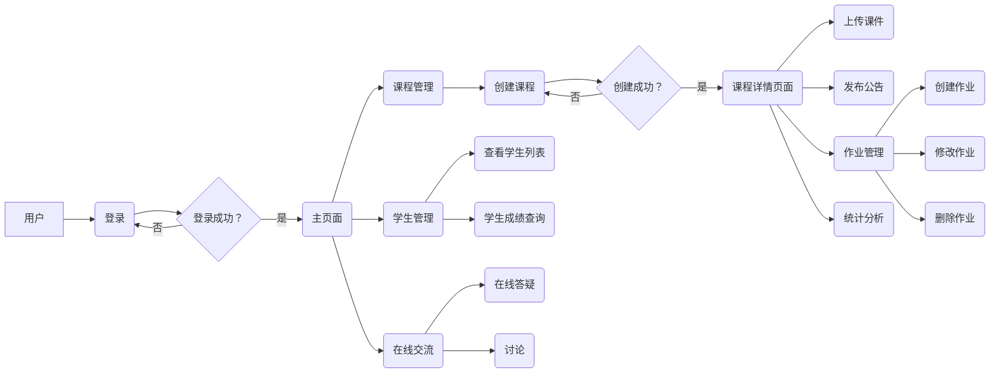

##  网络教学平台-教师子系统详细设计与具体代码实现

作者：禅与计算机程序设计艺术

## 1. 引言

### 1.1 背景介绍

随着互联网技术的飞速发展，在线教育已经成为一种重要的教育形式。网络教学平台作为在线教育的核心组成部分，为教师和学生提供了一个便捷、高效的教学和学习环境。教师子系统作为网络教学平台的重要组成部分，其设计和实现对于整个平台的性能和用户体验至关重要。

### 1.2 本文目的

本文旨在详细介绍网络教学平台中教师子系统的详细设计与具体代码实现，为广大开发者提供参考和借鉴。

### 1.3 文章结构

本文将从以下几个方面展开：

* 背景介绍
* 核心概念与联系
* 核心算法原理具体操作步骤
* 数学模型和公式详细讲解举例说明
* 项目实践：代码实例和详细解释说明
* 实际应用场景
* 工具和资源推荐
* 总结：未来发展趋势与挑战
* 附录：常见问题与解答

## 2. 核心概念与联系

### 2.1 教师子系统概述

教师子系统是网络教学平台的核心模块之一，主要为教师提供以下功能：

* 个人信息管理：包括个人资料修改、密码修改等。
* 课程管理：包括创建课程、上传课件、发布公告、管理作业、批改作业、统计分析等。
* 学生管理：包括查看学生列表、学生成绩查询等。
* 在线交流：包括与学生在线答疑、讨论等。

### 2.2  系统架构

教师子系统采用B/S架构，主要包括以下几个层次：

* **表示层**:  负责用户界面展示，与用户进行交互。
* **业务逻辑层**: 负责处理业务逻辑，例如用户登录、课程管理、作业批改等。
* **数据访问层**: 负责与数据库进行交互，进行数据的增删改查操作。

### 2.3  数据库设计

教师子系统数据库设计如下：

| 表名 | 字段名 | 数据类型 | 说明 |
|---|---|---|---|
| teacher | teacher_id | int | 教师ID，主键 |
|  | teacher_name | varchar(255) | 教师姓名 |
|  | password | varchar(255) | 密码 |
|  | email | varchar(255) | 邮箱 |
| course | course_id | int | 课程ID，主键 |
|  | course_name | varchar(255) | 课程名称 |
|  | teacher_id | int | 教师ID，外键 |
| student | student_id | int | 学生ID，主键 |
|  | student_name | varchar(255) | 学生姓名 |
|  | password | varchar(255) | 密码 |
|  | email | varchar(255) | 邮箱 |
|  | course_id | int | 课程ID，外键 |
| assignment | assignment_id | int | 作业ID，主键 |
|  | course_id | int | 课程ID，外键 |
|  | assignment_title | varchar(255) | 作业标题 |
|  | assignment_content | text | 作业内容 |
|  | deadline | datetime | 截止时间 |
| submission | submission_id | int | 提交记录ID，主键 |
|  | student_id | int | 学生ID，外键 |
|  | assignment_id | int | 作业ID，外键 |
|  | submission_content | text | 提交内容 |
|  | submission_time | datetime | 提交时间 |
|  | grade | float | 成绩 |

## 3. 核心算法原理具体操作步骤

### 3.1 用户登录

1. 用户在登录页面输入用户名和密码。
2. 系统验证用户名和密码是否正确。
3. 如果用户名和密码正确，则跳转到主页面；否则，提示用户重新输入。

### 3.2 课程管理

#### 3.2.1 创建课程

1. 教师在课程管理页面点击“创建课程”按钮。
2. 教师填写课程信息，例如课程名称、课程简介等。
3. 系统验证课程信息是否合法。
4. 如果课程信息合法，则创建课程并跳转到课程详情页面；否则，提示用户重新填写。

#### 3.2.2 上传课件

1. 教师在课程详情页面点击“上传课件”按钮。
2. 教师选择要上传的课件文件。
3. 系统验证课件文件是否合法。
4. 如果课件文件合法，则上传课件并更新课程信息；否则，提示用户重新上传。

#### 3.2.3 发布公告

1. 教师在课程详情页面点击“发布公告”按钮。
2. 教师填写公告内容。
3. 系统验证公告内容是否合法。
4. 如果公告内容合法，则发布公告并更新课程信息；否则，提示用户重新填写。

#### 3.2.4 管理作业

1. 教师在课程详情页面点击“作业管理”按钮。
2. 教师可以进行以下操作：
    * 创建作业：填写作业信息，例如作业标题、作业内容、截止时间等。
    * 修改作业：修改已创建的作业信息。
    * 删除作业：删除已创建的作业。

#### 3.2.5 批改作业

1. 教师在作业管理页面点击“批改”按钮。
2. 教师查看学生的作业提交记录。
3. 教师对学生的作业进行批改并打分。
4. 系统更新学生的作业成绩。

#### 3.2.6 统计分析

1. 教师在课程详情页面点击“统计分析”按钮。
2. 教师可以查看以下统计信息：
    * 学生成绩分布情况。
    * 作业完成情况。
    * 学生活跃度等。

### 3.3 学生管理

#### 3.3.1 查看学生列表

1. 教师在课程详情页面点击“学生管理”按钮。
2. 教师可以查看该课程的所有学生信息，例如学生姓名、学号、邮箱等。

#### 3.3.2 学生成绩查询

1. 教师在学生管理页面点击“成绩查询”按钮。
2. 教师可以选择要查询的学生和课程。
3. 系统显示该学生在该课程的成绩信息。

### 3.4 在线交流

#### 3.4.1 在线答疑

1. 学生在课程详情页面点击“在线答疑”按钮。
2. 学生输入要咨询的问题。
3. 教师在线查看学生的问题并进行解答。

#### 3.4.2 讨论

1. 教师或学生在课程详情页面点击“讨论”按钮。
2. 教师或学生可以发布话题、参与讨论等。

## 4. 数学模型和公式详细讲解举例说明

本节以学生成绩统计为例，介绍如何使用数学模型和公式进行数据分析。

### 4.1 数据准备

假设某门课程有n个学生，他们的成绩分别为 $x_1, x_2, ..., x_n$。

### 4.2 计算平均成绩

平均成绩 $\bar{x}$ 可以使用以下公式计算：

$$\bar{x} = \frac{\sum_{i=1}^{n} x_i}{n}$$

### 4.3 计算标准差

标准差 $\sigma$ 可以使用以下公式计算：

$$\sigma = \sqrt{\frac{\sum_{i=1}^{n} (x_i - \bar{x})^2}{n-1}}$$

### 4.4 计算成绩分布

可以使用直方图来展示成绩的分布情况。

### 4.5 举例说明

假设某门课程有10个学生的成绩分别为：

```
80, 85, 90, 75, 80, 95, 70, 85, 90, 80
```

则平均成绩为：

$$\bar{x} = \frac{80 + 85 + 90 + 75 + 80 + 95 + 70 + 85 + 90 + 80}{10} = 83$$

标准差为：

$$\sigma = \sqrt{\frac{(80-83)^2 + (85-83)^2 + ... + (80-83)^2}{10-1}} \approx 6.06$$

可以使用直方图来展示成绩的分布情况。

## 5. 项目实践：代码实例和详细解释说明

### 5.1 技术选型

本项目采用以下技术栈：

* 后端：Spring Boot
* 数据库：MySQL
* 前端：Vue.js

### 5.2 代码实例

#### 5.2.1 用户登录接口

```java
@RestController
@RequestMapping("/api/teacher")
public class TeacherController {

    @Autowired
    private TeacherService teacherService;

    @PostMapping("/login")
    public Result login(@RequestBody TeacherLoginDTO teacherLoginDTO) {
        Teacher teacher = teacherService.findByUsername(teacherLoginDTO.getUsername());
        if (teacher == null) {
            return Result.fail("用户名不存在");
        }
        if (!teacher.getPassword().equals(teacherLoginDTO.getPassword())) {
            return Result.fail("密码错误");
        }
        return Result.success(teacher);
    }
}
```

#### 5.2.2 创建课程接口

```java
@RestController
@RequestMapping("/api/teacher/course")
public class CourseController {

    @Autowired
    private CourseService courseService;

    @PostMapping
    public Result create(@RequestBody CourseDTO courseDTO) {
        Course course = new Course();
        BeanUtils.copyProperties(courseDTO, course);
        courseService.save(course);
        return Result.success(course);
    }
}
```

### 5.3 代码解释

以上代码示例展示了用户登录和创建课程的接口实现，代码中使用了Spring Boot框架提供的注解和工具类，例如`@RestController`、`@RequestMapping`、`@Autowired`、`@PostMapping`、`@RequestBody`、`Result`、`BeanUtils`等，使得代码更加简洁易懂。

## 6. 实际应用场景

网络教学平台教师子系统可以应用于以下场景：

* 学校：用于学校内部的在线教学，例如课程直播、录播、作业管理、考试管理等。
* 培训机构：用于培训机构的在线课程，例如职业技能培训、语言培训、学历教育等。
* 企业：用于企业内部的员工培训，例如新员工入职培训、技能提升培训等。

## 7. 工具和资源推荐

### 7.1 开发工具

* IntelliJ IDEA：一款功能强大的Java开发工具。
* Visual Studio Code：一款轻量级的代码编辑器，支持多种编程语言。
* Navicat：一款数据库管理工具，支持多种数据库。

### 7.2 学习资源

* Spring Boot官方文档：https://spring.io/projects/spring-boot
* Vue.js官方文档：https://vuejs.org/
* MySQL官方文档：https://dev.mysql.com/doc/

## 8. 总结：未来发展趋势与挑战

### 8.1 未来发展趋势

* 人工智能技术将更加深入地应用于在线教育领域，例如个性化学习推荐、智能批改等。
* 在线教育将更加注重学习体验和效果，例如虚拟现实技术、增强现实技术等将被应用于在线教育中。
* 在线教育将更加注重与线下教育的融合，例如线上线下混合式教学模式将成为未来发展趋势。

### 8.2 面临的挑战

* 如何保障在线教育的质量和效果。
* 如何保护学生隐私和数据安全。
* 如何应对在线教育带来的伦理问题。

## 9. 附录：常见问题与解答

### 9.1  如何解决用户登录失败的问题？

用户登录失败的原因有很多种，例如用户名不存在、密码错误、网络连接失败等。可以通过以下步骤排查问题：

* 检查用户名和密码是否正确。
* 检查网络连接是否正常。
* 查看系统日志，分析错误原因。

### 9.2  如何解决课程创建失败的问题？

课程创建失败的原因有很多种，例如课程名称重复、课程信息不完整等。可以通过以下步骤排查问题：

* 检查课程名称是否重复。
* 检查课程信息是否填写完整。
* 查看系统日志，分析错误原因。


## 10.  Mermaid 流程图


