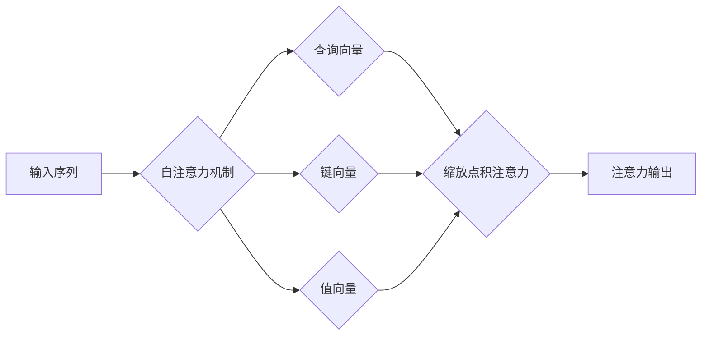

# 自注意力的奥秘:Transformer中的缩放点积注意力机制

作者：禅与计算机程序设计艺术

## 1. 背景介绍

### 1.1 注意力机制的起源与发展

注意力机制（Attention Mechanism）起源于人类的认知神经科学，模拟了人类在处理信息时选择性地关注某些重要部分而忽略其他部分的机制。在认知科学中，注意力是指一种集中精神力量或认知资源的能力，它可以被指向特定的信息源或任务，从而提高对这些信息或任务的处理效率。

在深度学习领域，注意力机制最早被应用于机器翻译任务中，用于解决传统编码器-解码器模型在处理长序列时遇到的信息丢失问题。随着深度学习的不断发展，注意力机制逐渐被应用于各种自然语言处理任务，例如文本分类、情感分析、问答系统等，并取得了显著的效果。

### 1.2 Transformer模型与自注意力机制

Transformer模型是近年来自然语言处理领域的一项重大突破，其核心是自注意力机制（Self-Attention Mechanism）。与传统的循环神经网络（RNN）相比，Transformer模型能够并行处理序列数据，从而大幅提高了训练效率。同时，自注意力机制能够捕捉序列中任意两个位置之间的依赖关系，从而更好地理解上下文信息。

### 1.3 本文目的与结构

本文旨在深入浅出地介绍Transformer模型中的缩放点积注意力机制，帮助读者理解其工作原理、数学模型以及实际应用。

本文结构如下：

- 第一章：背景介绍，介绍注意力机制的起源与发展、Transformer模型与自注意力机制，以及本文的目的与结构。
- 第二章：核心概念与联系，介绍自注意力机制、查询-键-值模型、缩放点积注意力等核心概念，并阐述它们之间的联系。
- 第三章：核心算法原理具体操作步骤，详细介绍缩放点积注意力机制的计算过程，并使用图示和示例进行说明。
- 第四章：数学模型和公式详细讲解举例说明，给出缩放点积注意力机制的数学模型，并结合实际例子进行讲解。
- 第五章：项目实践：代码实例和详细解释说明，使用Python和TensorFlow框架实现缩放点积注意力机制，并对代码进行详细解释。
- 第六章：实际应用场景，介绍缩放点积注意力机制在自然语言处理、计算机视觉等领域的应用场景。
- 第七章：工具和资源推荐，推荐一些学习Transformer模型和自注意力机制的工具和资源。
- 第八章：总结：未来发展趋势与挑战，总结缩放点积注意力机制的优势和局限性，并展望其未来发展趋势。
- 第九章：附录：常见问题与解答，解答一些读者在学习过程中可能遇到的常见问题。

## 2. 核心概念与联系

### 2.1 自注意力机制

自注意力机制是一种可以捕捉序列中任意两个位置之间依赖关系的机制，它可以学习到句子中单词之间的关系。与传统的循环神经网络（RNN）相比，自注意力机制不需要按照顺序处理序列数据，因此可以并行计算，从而提高效率。

### 2.2 查询-键-值模型

自注意力机制的核心是查询-键-值模型（Query-Key-Value Model）。在该模型中，每个单词都被表示成三个向量：查询向量（Query Vector）、键向量（Key Vector）和值向量（Value Vector）。

- 查询向量：用于表示当前单词正在寻找什么信息。
- 键向量：用于表示其他单词能够提供什么信息。
- 值向量：用于表示其他单词实际提供的信息。

### 2.3 缩放点积注意力

缩放点积注意力（Scaled Dot-Product Attention）是自注意力机制的一种具体实现方式。它通过计算查询向量和键向量之间的点积来衡量它们之间的相似度，然后使用softmax函数将相似度转换为概率分布，最后使用概率分布对值向量进行加权求和，得到最终的注意力输出。

### 2.4 核心概念之间的联系

下图展示了自注意力机制、查询-键-值模型和缩放点积注意力之间的联系：



## 3. 核心算法原理具体操作步骤

### 3.1 计算查询向量、键向量和值向量

假设输入序列为 $X = [x_1, x_2, ..., x_n]$，其中 $x_i$ 表示第 $i$ 个单词的词向量。首先，需要将每个单词的词向量分别乘以三个不同的矩阵 $W_Q$、$W_K$ 和 $W_V$，得到对应的查询向量、键向量和值向量：

$$
\begin{aligned}
Q &= X W_Q \\
K &= X W_K \\
V &= X W_V
\end{aligned}
$$

其中，$Q$、$K$ 和 $V$ 分别表示查询矩阵、键矩阵和值矩阵，它们的维度均为 $n \times d_k$，$d_k$ 表示查询向量、键向量和值向量的维度。

### 3.2 计算查询向量和键向量之间的点积

接下来，计算查询矩阵和键矩阵之间的点积，得到一个维度为 $n \times n$ 的相似度矩阵：

$$
S = Q K^T
$$

其中，$S_{ij}$ 表示第 $i$ 个查询向量和第 $j$ 个键向量之间的点积，用于衡量它们之间的相似度。

### 3.3 对相似度矩阵进行缩放

为了避免点积过大导致softmax函数梯度消失，需要对相似度矩阵进行缩放：

$$
\hat{S} = \frac{S}{\sqrt{d_k}}
$$

### 3.4 使用softmax函数计算注意力权重

使用softmax函数将缩放后的相似度矩阵转换为概率分布，得到注意力权重矩阵：

$$
A = \text{softmax}(\hat{S})
$$

其中，$A_{ij}$ 表示第 $i$ 个查询向量关注第 $j$ 个值向量的权重。

### 3.5 加权求和得到注意力输出

最后，使用注意力权重矩阵对值矩阵进行加权求和，得到注意力输出：

$$
Z = A V
$$

其中，$Z$ 表示注意力输出矩阵，其维度为 $n \times d_v$，$d_v$ 表示值向量的维度。

## 4. 数学模型和公式详细讲解举例说明

### 4.1 缩放点积注意力机制的数学模型

缩放点积注意力机制的数学模型可以表示为：

$$
\text{Attention}(Q, K, V) = \text{softmax}(\frac{Q K^T}{\sqrt{d_k}}) V
$$

其中：

- $Q$：查询矩阵，维度为 $n \times d_k$。
- $K$：键矩阵，维度为 $n \times d_k$。
- $V$：值矩阵，维度为 $n \times d_v$。
- $d_k$：查询向量、键向量和值向量的维度。

### 4.2 举例说明

假设输入序列为 "Thinking Machines"，其对应的词向量分别为：

$$
\begin{aligned}
x_{\text{Thinking}} &= [0.1, 0.2, 0.3] \\
x_{\text{Machines}} &= [0.4, 0.5, 0.6]
\end{aligned}
$$

假设查询矩阵、键矩阵和值矩阵分别为：

$$
W_Q = 
\begin{bmatrix}
1 & 0 & 0 \\
0 & 1 & 0 \\
0 & 0 & 1
\end{bmatrix},
\quad
W_K = 
\begin{bmatrix}
0 & 1 & 0 \\
1 & 0 & 0 \\
0 & 0 & 1
\end{bmatrix},
\quad
W_V = 
\begin{bmatrix}
1 & 0 \\
0 & 1 \\
1 & 1
\end{bmatrix}
$$

则可以计算得到：

$$
\begin{aligned}
Q &= 
\begin{bmatrix}
0.1 & 0.2 & 0.3 \\
0.4 & 0.5 & 0.6
\end{bmatrix}
\begin{bmatrix}
1 & 0 & 0 \\
0 & 1 & 0 \\
0 & 0 & 1
\end{bmatrix}
=
\begin{bmatrix}
0.1 & 0.2 & 0.3 \\
0.4 & 0.5 & 0.6
\end{bmatrix}
\\
K &= 
\begin{bmatrix}
0.1 & 0.2 & 0.3 \\
0.4 & 0.5 & 0.6
\end{bmatrix}
\begin{bmatrix}
0 & 1 & 0 \\
1 & 0 & 0 \\
0 & 0 & 1
\end{bmatrix}
=
\begin{bmatrix}
0.2 & 0.1 & 0.3 \\
0.5 & 0.4 & 0.6
\end{bmatrix}
\\
V &= 
\begin{bmatrix}
0.1 & 0.2 & 0.3 \\
0.4 & 0.5 & 0.6
\end{bmatrix}
\begin{bmatrix}
1 & 0 \\
0 & 1 \\
1 & 1
\end{bmatrix}
=
\begin{bmatrix}
0.4 & 0.5 \\
1.0 & 1.1
\end{bmatrix}
\end{aligned}
$$

相似度矩阵为：

$$
S = 
\begin{bmatrix}
0.1 & 0.2 & 0.3 \\
0.4 & 0.5 & 0.6
\end{bmatrix}
\begin{bmatrix}
0.2 & 0.5 \\
0.1 & 0.4 \\
0.3 & 0.6
\end{bmatrix}
=
\begin{bmatrix}
0.14 & 0.32 \\
0.32 & 0.77
\end{bmatrix}
$$

缩放后的相似度矩阵为：

$$
\hat{S} = \frac{1}{\sqrt{3}}
\begin{bmatrix}
0.14 & 0.32 \\
0.32 & 0.77
\end{bmatrix}
=
\begin{bmatrix}
0.08 & 0.18 \\
0.18 & 0.44
\end{bmatrix}
$$

注意力权重矩阵为：

$$
A = \text{softmax}
\begin{pmatrix}
\begin{bmatrix}
0.08 & 0.18 \\
0.18 & 0.44
\end{bmatrix}
\end{pmatrix}
=
\begin{bmatrix}
0.48 & 0.52 \\
0.39 & 0.61
\end{bmatrix}
$$

注意力输出为：

$$
Z = 
\begin{bmatrix}
0.48 & 0.52 \\
0.39 & 0.61
\end{bmatrix}
\begin{bmatrix}
0.4 & 0.5 \\
1.0 & 1.1
\end{bmatrix}
=
\begin{bmatrix}
0.71 & 0.81 \\
0.79 & 0.97
\end{bmatrix}
$$

## 5. 项目实践：代码实例和详细解释说明

### 5.1 使用Python和TensorFlow实现缩放点积注意力机制

```python
import tensorflow as tf

def scaled_dot_product_attention(q, k, v, mask):
  """计算缩放点积注意力。

  参数：
    q: 查询张量，形状为 [..., seq_len_q, depth_k]。
    k: 键张量，形状为 [..., seq_len_k, depth_k]。
    v: 值张量，形状为 [..., seq_len_k, depth_v]。
    mask: 用于屏蔽不相关位置的掩码张量，形状与 `q` 和 `k` 广播相容。

  返回值：
    注意力输出张量，形状为 [..., seq_len_q, depth_v]。
  """

  matmul_qk = tf.matmul(q, k, transpose_b=True)  # [..., seq_len_q, seq_len_k]

  # 缩放 matmul_qk
  dk = tf.cast(tf.shape(k)[-1], tf.float32)
  scaled_attention_logits = matmul_qk / tf.math.sqrt(dk)

  # 将掩码应用于缩放的张量。
  if mask is not None:
    scaled_attention_logits += (mask * -1e9)  

  # 使用 softmax 计算注意力权重。
  attention_weights = tf.nn.softmax(scaled_attention_logits, axis=-1)  # [..., seq_len_q, seq_len_k]

  output = tf.matmul(attention_weights, v)  # [..., seq_len_q, depth_v]

  return output, attention_weights
```

### 5.2 代码解释

- `scaled_dot_product_attention` 函数接受四个参数：
    - `q`：查询张量。
    - `k`：键张量。
    - `v`：值张量。
    - `mask`：掩码张量，用于屏蔽不相关位置。
- 函数首先计算查询张量和键张量之间的点积 `matmul_qk`。
- 然后，函数对 `matmul_qk` 进行缩放，得到 `scaled_attention_logits`。
- 如果传入了掩码张量，则函数将掩码应用于 `scaled_attention_logits`。
- 接下来，函数使用 softmax 函数计算注意力权重 `attention_weights`。
- 最后，函数使用注意力权重对值张量进行加权求和，得到注意力输出 `output`。

## 6. 实际应用场景

### 6.1 自然语言处理

- **机器翻译：** Transformer模型最初被提出用于机器翻译任务，并取得了比传统循环神经网络模型更好的效果。
- **文本摘要：** 自注意力机制可以捕捉文档中不同句子之间的关系，从而提取出重要的句子，生成摘要。
- **问答系统：** 自注意力机制可以帮助模型关注问题中的关键词，并在答案中找到相关的句子。
- **情感分析：** 自注意力机制可以捕捉句子中不同单词之间的情感联系，从而更准确地判断句子的情感倾向。

### 6.2 计算机视觉

- **图像分类：** 自注意力机制可以帮助模型关注图像中的重要区域，从而提高图像分类的准确率。
- **目标检测：** 自注意力机制可以捕捉目标与背景之间的关系，从而更准确地检测出目标。
- **图像生成：** 自注意力机制可以帮助模型生成更加逼真、自然的图像。

## 7. 工具和资源推荐

### 7.1 工具

- **TensorFlow：** Google开源的深度学习框架，提供了丰富的API用于实现Transformer模型和自注意力机制。
- **PyTorch：** Facebook开源的深度学习框架，同样提供了丰富的API用于实现Transformer模型和自注意力机制。

### 7.2 资源

- **"Attention Is All You Need"论文：** Transformer模型的开山之作，详细介绍了Transformer模型的结构和工作原理。
- **"The Illustrated Transformer"博客：** 一篇图文并茂地介绍Transformer模型的博客，通俗易懂。
- **Stanford CS224n课程：** 斯坦福大学的自然语言处理课程，其中包含Transformer模型和自注意力机制的讲解。

## 8. 总结：未来发展趋势与挑战

### 8.1 优势

- **并行计算：** 与传统的循环神经网络相比，自注意力机制能够并行处理序列数据，从而大幅提高了训练效率。
- **捕捉长距离依赖关系：** 自注意力机制能够捕捉序列中任意两个位置之间的依赖关系，从而更好地理解上下文信息。

### 8.2 局限性

- **计算复杂度高：** 自注意力机制的计算复杂度与序列长度的平方成正比，因此在处理长序列时效率较低。
- **可解释性差：** 自注意力机制的内部机制比较复杂，难以解释其工作原理。

### 8.3 未来发展趋势

- **提高效率：** 研究人员正在探索各种方法来提高自注意力机制的效率，例如使用稀疏注意力机制、轻量级Transformer模型等。
- **增强可解释性：** 研究人员也在努力提高自注意力机制的可解释性，例如使用注意力可视化技术等。
- **应用于更广泛的领域：** 自注意力机制已经被应用于自然语言处理、计算机视觉等领域，未来将会应用于更多领域，例如语音识别、机器人控制等。

## 9. 附录：常见问题与解答

### 9.1 为什么需要对相似度矩阵进行缩放？

对相似度矩阵进行缩放是为了避免点积过大导致softmax函数梯度消失。当点积过大时，softmax函数的输出会趋近于1，导致梯度接近于0，从而影响模型的训练效果。

### 9.2 掩码张量有什么作用？

掩码张量用于屏蔽不相关位置，例如在机器翻译任务中，解码器在生成目标语言句子时，应该只关注已经生成的单词，而忽略未生成的单词。掩码张量可以帮助模型