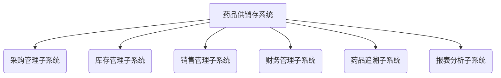
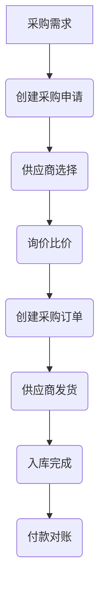
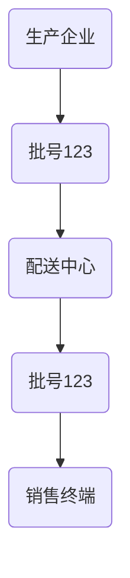

# 药品供销存系统详细设计与具体代码实现

## 1. 背景介绍

### 1.1 医疗行业的重要性与挑战

医疗行业关乎人们的健康与生命安全,是一个极其重要的领域。随着人口老龄化和医疗保健需求的不断增长,医疗系统面临着巨大的压力和挑战。其中,药品的供应、销售和存储管理是整个医疗体系中至关重要的一个环节。

### 1.2 药品供销存系统的作用

药品供销存系统的主要作用是确保药品的可追溯性、安全性和高效管理。它涵盖了从药品进货、库存管理到销售出库的全过程,对于维护医院正常运营、保证病患用药安全、控制成本等方面都起到了关键作用。

### 1.3 现有系统存在的问题

目前,许多医院和药房仍在使用传统的人工管理或较为简陋的计算机系统进行药品管理,这种做法存在着诸多弊端:

- 人工操作效率低下,容易出错
- 无法实现药品全程追溯
- 库存管理混乱,浪费资源
- 无法对药品进行实时监控
- 缺乏智能化决策支持

因此,构建一套先进的药品供销存管理系统刻不容缓,这将极大提高医疗服务质量和运营效率。

## 2. 核心概念与联系

### 2.1 系统架构概览

药品供销存系统是一个复杂的信息系统,它涉及多个子系统的紧密协作,包括:

- 采购管理子系统
- 库存管理子系统 
- 销售管理子系统
- 财务管理子系统
- 药品追溯子系统
- 报表分析子系统
- ...

这些子系统相互关联、数据共享,共同构建了一个完整的药品供应链管理平台。



### 2.2 系统用户角色

系统需要为不同的用户角色分配恰当的权限和功能:

- 采购员: 负责药品采购、询价、订单处理等
- 库管员: 管理药品入库、出库、盘点、调拨等
- 销售员: 处理药品销售出库等业务
- 财务员: 负责应收应付、往来账务等
- 质量员: 管理药品追溯、检验等
- 系统管理员: 系统权限、数据管理等

### 2.3 核心数据模型

系统中的核心数据实体包括:

- 药品信息: 药品编码、名称、规格、剂型、生产批号、有效期等
- 供应商信息: 供应商编码、名称、联系方式等
- 客户信息: 客户编码、名称、类型(医院、药房等)、信用等级等
- 库存信息: 批号、入库日期、有效期、库存数量、库位等
- 采购订单: 订单号、供应商、药品明细、金额、付款日期等
- 销售订单: 订单号、客户、药品明细、金额、付款日期等
- 财务voucher: 应收应付、收支明细、账户等

## 3. 核心算法原理具体操作步骤  

### 3.1 采购订单处理流程

1. 采购员根据库存情况、销售预测等信息创建采购申请
2. 系统自动匹配合格供应商,或采购员手动选择
3. 对供应商报价进行比较,确定最优供应商和采购数量
4. 创建采购订单,通知供应商备货
5. 供应商发货,入库后完成订单
6. 财务部门对账支付采购款项



### 3.2 库存管理策略

1. 建立严格的药品出入库流程
2. 采用先进先出(FEFO)策略,确保先使用临期药品 
3. 设置库存上下限,及时补货
4. ABC分类管理,对不同类别药品实施差异化策略
5. 定期盘点,及时处理库存差异
6. 根据过期日期自动生成报废单

### 3.3 药品追溯算法

追溯算法的目标是能够快速追查任一药品的全部流转路径,确保产品质量安全。

1. 将药品流转路径按批次记录在追溯子系统中
2. 每个节点记录操作人、操作时间、操作行为、批号等详细信息
3. 采用树状数据结构存储药品路径数据
4. 使用深度优先或广度优先算法遍历树节点
5. 通过批号等关键信息快速定位追溯路径
6. 可视化呈现药品流转过程



### 3.4 供需预测算法

为了实现精细化的库存管理,系统需要对未来的供需情况进行准确预测:

1. 收集历史销售和库存数据
2. 使用指数平滑、回归分析等时间序列分析模型进行预测
3. 结合节假日、促销活动等特殊因素调整预测值
4. 对不同药品类别使用差异化的预测策略
5. 将预测结果输入采购决策模块,自动生成采购建议

## 4. 数学模型和公式详细讲解举例说明

### 4.1 库存管理模型

$$
\begin{aligned}
\min \quad & C_T = \sum_{i=1}^{N}c_iQ_i + \sum_{i=1}^{N}h_i\overline{I}_i \\
\text{s.t.}\quad & \overline{I}_i \geq s_i, \quad i=1,2,...,N \\
& \overline{I}_i = \lambda_i + ks_i\sqrt{\frac{L_i}{Q_i}}, \quad i=1,2,...,N\\
& Q_i \leq Q_{\max}, \quad i=1,2,...,N
\end{aligned}
$$

其中:
- $C_T$为总成本
- $c_i$为第i种药品的采购成本
- $Q_i$为第i种药品的订货量
- $h_i$为第i种药品的库存持有成本
- $\overline{I}_i$为第i种药品的平均库存水平
- $s_i$为第i种药品的安全库存量
- $\lambda_i$为第i种药品的平均需求量
- $L_i$为第i种药品的交货延迟
- $k$为服务水平系数
- $Q_{\max}$为最大订货量

目标是最小化总成本,约束条件包括安全库存量、订货量上限等。

### 4.2 需求预测模型

$$
\hat{y}_{t+1} = \alpha y_t + (1-\alpha)\hat{y}_t
$$

其中:
- $\hat{y}_{t+1}$为下一期的预测需求量
- $y_t$为本期的实际需求量 
- $\hat{y}_t$为本期的预测需求量
- $\alpha$为平滑系数,介于0和1之间

指数平滑模型对最新数据赋予较高权重,对历史数据的影响逐渐衰减,适用于无明显趋势和季节性的需求序列预测。

## 5. 项目实践:代码实例和详细解释说明

本节将通过具体的代码示例,展示如何在Java语言中实现药品供销存系统的部分核心功能。

### 5.1 药品和库存实体类

```java
// 药品实体类
public class Drug {
    private String drugCode; // 药品编码
    private String name; // 名称
    private String specification; // 规格 
    private String dosageForm; // 剂型
    private String manufacturer; // 生产厂家
    // ...其他属性
}

// 库存实体类
public class Inventory {
    private String batchNo; // 批号
    private Drug drug; // 药品
    private int quantity; // 库存数量
    private Date expiryDate; // 有效期
    private Date inboundDate; // 入库日期
    private String location; // 库位
    // ...其他属性
}
```

### 5.2 库存管理示例

```java
// 入库操作
public void inboundStock(List<Inventory> inbounds) {
    for (Inventory inv : inbounds) {
        String batchNo = inv.getBatchNo();
        Drug drug = inv.getDrug();
        int quantity = inv.getQuantity();
        
        // 查找是否已有相同批次库存
        Inventory existing = findInventory(batchNo, drug);
        if (existing != null) {
            // 累加库存数量
            existing.setQuantity(existing.getQuantity() + quantity);
        } else {
            // 新增库存记录
            inventories.add(inv);
        }
    }
}

// 出库操作 
public void outboundStock(String batchNo, Drug drug, int quantity) {
    Inventory inv = findInventory(batchNo, drug);
    if (inv != null) {
        int remaining = inv.getQuantity() - quantity;
        if (remaining >= 0) {
            // 更新库存数量
            inv.setQuantity(remaining);
        } else {
            // 库存不足，无法出库
            throw new InsufficientStockException();
        }
    } else {
        // 找不到对应库存记录
        throw new StockNotFoundException();
    }
}
```

### 5.3 追溯系统示例

```java
// 药品流转节点
public class TraceNode {
    private String operation; // 操作类型(生产、配送、销售等)
    private String operator; // 操作人
    private Date operationTime; // 操作时间
    private Drug drug; // 药品
    private String batchNo; // 批号
    private int quantity; // 数量
    private TraceNode parentNode; // 父节点
    private List<TraceNode> childNodes; // 子节点列表
}

// 追溯算法
public List<TraceNode> traceProduct(String batchNo, Drug drug) {
    // 使用广度优先搜索遍历树
    Queue<TraceNode> queue = new LinkedList<>();
    List<TraceNode> result = new ArrayList<>();
    
    // 找到与batchNo和drug匹配的根节点
    TraceNode root = findRootNode(batchNo, drug);
    if (root != null) {
        queue.offer(root);
        while (!queue.isEmpty()) {
            TraceNode node = queue.poll();
            result.add(node);
            queue.addAll(node.getChildNodes());
        }
    }
    
    return result;
}
```

以上代码只是一个简单示例,在实际项目中还需要更加完善的设计和实现。

## 6. 实际应用场景

药品供销存系统在医疗卫生行业有着广泛的应用场景:

- 医院药房: 管理医院内部药品的采购、库存、配送等
- 药品批发企业: 负责向下游医院、零售药房供货
- 零售连锁药房: 实现门店间的调拨、补货等协同
- 药品冷链物流: 对冷藏药品的全程温度进行监控和管理
- 药品追溯平台: 为政府监管部门提供药品流向查询服务
- ...

无论是大型综合医院,还是社区诊所,无论是国内国外,药品供销存系统都是医疗机构的核心运营系统之一。

## 7. 工具和资源推荐  

实施药品供销存系统需要综合应用多种技术和工具:

- Java/Python/C#等编程语言
- Spring/Django/ASP.NET等Web框架
- Oracle/MySQL/PostgreSQL等数据库
- Redis/Memcached等缓存技术
- Kafka/RabbitMQ等消息队列
- Vue/React/Angular等前端框架
- Docker容器化部署
- Kubernetes集群管理
- Git/SVN版本控制
- JMeter/LoadRunner等压力测试工具
- ELK日志分析系统
- ...

此外,遵循规范的软件开发流程至关重要,如敏捷开发、DevOps、测试驱动开发等。同时,良好的项目管理、需求管理、风险管理等能力也是必不可少的。

## 8. 总结:未来发展趋势与挑战

未来,随着医疗大数据、人工智能、物联网等新兴技术的发展,药品供销存系统将呈现出以下发展趋势:

1. 智能化决策支持
    - 利用机器学习算法优化库存管理策