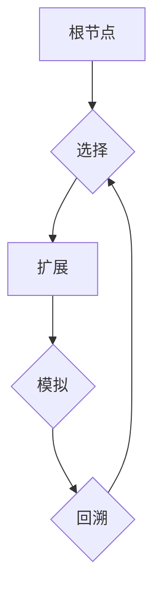

# 蒙特卡罗树搜索(MCTS)算法概述

作者：禅与计算机程序设计艺术

## 1. 背景介绍

### 1.1 什么是蒙特卡罗方法？

蒙特卡罗方法是一种计算方法，它依赖于重复的随机抽样来获得数值结果。它通常用于解决那些难以用确定性算法解决的问题。蒙特卡罗方法的核心思想是：**通过对随机事件的大量模拟，利用概率统计的规律来推断事件的结果**。

### 1.2  蒙特卡罗方法的应用领域

蒙特卡罗方法在很多领域都有广泛的应用，包括：

* **物理学**: 粒子输运、统计力学
* **金融工程**: 期权定价、风险管理
* **计算机科学**: 人工智能、机器学习
* **运筹学**: 排队论、库存管理

### 1.3 蒙特卡罗树搜索(MCTS)的由来

蒙特卡罗树搜索(Monte Carlo Tree Search, MCTS)是一种人工智能算法，它结合了蒙特卡罗方法和树搜索的思想。它最早在2006年被Rémi Coulom提出，用于设计围棋程序。MCTS算法在围棋领域取得了巨大的成功，AlphaGo和AlphaZero等顶级围棋程序都使用了MCTS算法。

### 1.4 MCTS算法的优势

MCTS算法相较于其他搜索算法，具有以下优势：

* **无需先验知识**: MCTS算法不需要任何关于游戏规则或评估函数的先验知识，它可以从零开始学习。
* **高效性**: MCTS算法可以有效地探索巨大的搜索空间，并找到接近最优的解。
* **灵活性**: MCTS算法可以应用于各种类型的游戏和决策问题。


## 2. 核心概念与联系

### 2.1  搜索树

MCTS算法使用搜索树来表示游戏的可能状态。

* **节点**: 每个节点代表游戏的一个状态。
* **边**: 每条边代表一个可能的行动。
* **根节点**: 搜索树的根节点代表游戏的初始状态。
* **叶节点**: 搜索树的叶节点代表游戏的结束状态，例如胜利、失败或平局。

### 2.2  选择、扩展、模拟和回溯

MCTS算法的核心是四个步骤：

* **选择(Selection)**: 从根节点开始，根据一定的策略选择一个最有希望的子节点进行扩展。
* **扩展(Expansion)**:  为选定的节点创建一个或多个子节点，表示执行一个或多个可能的行动。
* **模拟(Simulation)**: 从新扩展的节点开始，使用随机策略进行游戏模拟，直到游戏结束。
* **回溯(Backpropagation)**:  根据模拟的结果更新从根节点到新扩展节点路径上所有节点的统计信息。

### 2.3  UCT (Upper Confidence Bound 1 applied to Trees)

UCT是一种常用的选择策略，它平衡了探索和利用：

* **探索**: 选择那些访问次数较少，但可能存在更好解决方案的节点。
* **利用**: 选择那些访问次数较多，并且已经证明是较好解决方案的节点。

UCT公式如下：

$$
UCT(s, a) = Q(s, a) + C * \sqrt{\frac{\ln{N(s)}}{N(s, a)}}
$$

其中:

* $s$: 当前状态
* $a$:  一个可能的行动
* $Q(s, a)$:  状态-行动值，表示在状态$s$下执行行动$a$的平均奖励。
* $N(s)$: 状态$s$的访问次数。
* $N(s, a)$:  在状态$s$下执行行动$a$的次数。
* $C$:  探索常数，用于平衡探索和利用。


## 3. 核心算法原理具体操作步骤

### 3.1  算法流程

MCTS算法的流程如下：

1. **初始化**: 创建一个根节点，代表游戏的初始状态。
2. **迭代**: 重复以下步骤，直到达到预设的时间限制或迭代次数：
   * **选择**: 从根节点开始，使用UCT策略选择一个最有希望的子节点。
   * **扩展**: 为选定的节点创建一个或多个子节点。
   * **模拟**: 从新扩展的节点开始，使用随机策略进行游戏模拟，直到游戏结束。
   * **回溯**: 根据模拟的结果更新从根节点到新扩展节点路径上所有节点的统计信息。
3. **选择最佳行动**: 选择访问次数最多的子节点对应的行动作为最佳行动。


### 3.2  算法图解



## 4. 数学模型和公式详细讲解举例说明

### 4.1  状态-行动值函数($Q(s, a)$)

状态-行动值函数($Q(s, a)$) 用于评估在状态$s$下执行行动$a$的价值。在MCTS算法中，$Q(s, a)$ 通常表示为在状态$s$下执行行动$a$后获胜的次数与总模拟次数的比值。

### 4.2  UCT公式

UCT公式用于选择最有希望的节点进行扩展。它平衡了探索和利用：

$$
UCT(s, a) = Q(s, a) + C * \sqrt{\frac{\ln{N(s)}}{N(s, a)}}
$$

#### 4.2.1 例子

假设有两个子节点A和B，其状态-行动值和访问次数如下:

* 节点A:  $Q(s, a) = 0.5$, $N(s, a) = 10$
* 节点B:  $Q(s, a) = 0.2$, $N(s, a) = 1$

假设探索常数$C = 1.4$，则UCT值为:

* 节点A:  $UCT(s, a) = 0.5 + 1.4 * \sqrt{\frac{\ln{20}}{10}} \approx 0.96$
* 节点B:  $UCT(s, a) = 0.2 + 1.4 * \sqrt{\frac{\ln{20}}{1}} \approx 1.46$

因此，MCTS算法会选择节点B进行扩展，因为它具有更高的UCT值，这意味着它更有潜力获得更高的奖励。

## 5. 项目实践：代码实例和详细解释说明

### 5.1  Python代码实现

```python
import math
import random

class Node:
    """
    蒙特卡罗树搜索节点
    """

    def __init__(self, state, parent=None, action=None):
        self.state = state  # 游戏状态
        self.parent = parent  # 父节点
        self.action = action  # 从父节点到当前节点的行动
        self.children = []  # 子节点列表
        self.visits = 0  # 访问次数
        self.value = 0  # 价值

    def is_leaf(self):
        """
        判断是否为叶节点
        """
        return len(self.children) == 0

    def is_root(self):
        """
        判断是否为根节点
        """
        return self.parent is None

    def get_uct(self, exploration_constant):
        """
        计算UCT值
        """
        if self.visits == 0:
            return float('inf')
        return self.value / self.visits + exploration_constant * math.sqrt(
            math.log(self.parent.visits) / self.visits)

    def select_child(self, exploration_constant):
        """
        选择UCT值最大的子节点
        """
        return max(self.children, key=lambda child: child.get_uct(exploration_constant))

    def expand(self, actions):
        """
        扩展节点
        """
        for action in actions:
            new_state = self.state.take_action(action)
            self.children.append(Node(new_state, parent=self, action=action))

    def simulate(self):
        """
        模拟游戏
        """
        current_state = self.state.copy()
        while not current_state.is_terminal():
            actions = current_state.get_legal_actions()
            action = random.choice(actions)
            current_state = current_state.take_action(action)
        return current_state.get_reward()

    def backpropagate(self, reward):
        """
        回溯更新节点信息
        """
        self.visits += 1
        self.value += reward
        if self.parent:
            self.parent.backpropagate(reward)


def mcts(root, iterations, exploration_constant):
    """
    蒙特卡罗树搜索
    """
    for _ in range(iterations):
        node = root
        # 选择
        while not node.is_leaf():
            node = node.select_child(exploration_constant)
        # 扩展
        if not node.state.is_terminal():
            actions = node.state.get_legal_actions()
            node.expand(actions)
            node = random.choice(node.children)
        # 模拟
        reward = node.simulate()
        # 回溯
        node.backpropagate(reward)
    # 选择最佳行动
    best_child = max(root.children, key=lambda child: child.visits)
    return best_child.action
```

### 5.2  代码解释

* `Node`类表示一个MCTS节点，它包含了节点的状态、父节点、行动、子节点、访问次数和价值等信息。
* `mcts`函数是MCTS算法的主函数，它接受根节点、迭代次数和探索常数作为输入，并返回最佳行动。
* 在每次迭代中，MCTS算法会执行选择、扩展、模拟和回溯四个步骤。
* 选择步骤使用UCT策略选择最有希望的节点进行扩展。
* 扩展步骤为选定的节点创建一个或多个子节点。
* 模拟步骤从新扩展的节点开始，使用随机策略进行游戏模拟，直到游戏结束。
* 回溯步骤根据模拟的结果更新从根节点到新扩展节点路径上所有节点的统计信息。
* 最后，MCTS算法会选择访问次数最多的子节点对应的行动作为最佳行动。

## 6. 实际应用场景

### 6.1 游戏AI

MCTS算法在游戏AI领域取得了巨大的成功，例如：

* **围棋**: AlphaGo和AlphaZero等顶级围棋程序都使用了MCTS算法。
* **国际象棋**: Stockfish等顶级国际象棋程序也使用了MCTS算法。
* **游戏**: MCTS算法也被广泛应用于其他游戏，例如扑克、桥牌等。

### 6.2  推荐系统

MCTS算法可以用于构建推荐系统，例如：

* **商品推荐**: MCTS算法可以根据用户的历史行为和偏好，推荐用户可能感兴趣的商品。
* **新闻推荐**: MCTS算法可以根据用户的阅读历史和兴趣，推荐用户可能感兴趣的新闻。

### 6.3  路径规划

MCTS算法可以用于解决路径规划问题，例如：

* **机器人导航**: MCTS算法可以帮助机器人在复杂的环境中找到最佳路径。
* **物流配送**: MCTS算法可以帮助物流公司规划最佳配送路线。

## 7. 总结：未来发展趋势与挑战

### 7.1  未来发展趋势

* **与深度学习的结合**: 将MCTS算法与深度学习相结合，可以进一步提高算法的性能。
* **应用于更复杂的领域**:  MCTS算法可以应用于更复杂的领域，例如自动驾驶、医疗诊断等。
* **并行化和分布式计算**:  为了处理更大规模的问题，需要对MCTS算法进行并行化和分布式计算的改进。

### 7.2  挑战

* **计算复杂度**: MCTS算法的计算复杂度较高，尤其是在处理复杂问题时。
* **探索-利用困境**:  MCTS算法需要平衡探索和利用，这在某些情况下是一个挑战。

## 8. 附录：常见问题与解答

### 8.1  MCTS算法与其他搜索算法的区别？

MCTS算法与其他搜索算法的主要区别在于：

* MCTS算法不需要任何关于游戏规则或评估函数的先验知识，它可以从零开始学习。
* MCTS算法可以有效地探索巨大的搜索空间，并找到接近最优的解。
* MCTS算法可以应用于各种类型的游戏和决策问题。

### 8.2  如何选择MCTS算法的参数？

MCTS算法的参数包括迭代次数和探索常数。

* **迭代次数**:  迭代次数越多，算法的性能越好，但计算时间也会更长。
* **探索常数**:  探索常数控制着算法探索新节点的程度。探索常数越大，算法越倾向于探索新节点，反之亦然。

选择合适的参数需要根据具体问题进行实验和调整。

### 8.3  MCTS算法的优缺点？

**优点**:

* 无需先验知识。
* 高效性。
* 灵活性。

**缺点**:

* 计算复杂度高。
* 探索-利用困境。