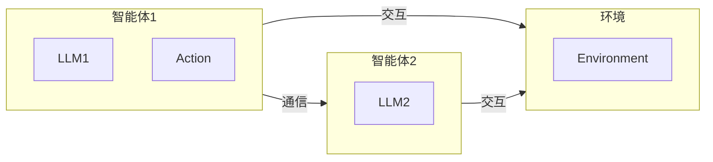

# 跨领域应用:LLM多智能体系统在不同行业的实践

作者：禅与计算机程序设计艺术

## 1. 背景介绍

### 1.1 人工智能与多智能体系统

人工智能 (AI) 的发展日新月异，正在深刻地改变着我们的生活。近年来，大型语言模型 (LLM) 的出现，例如 GPT-3、BERT 等，极大地推动了自然语言处理 (NLP) 领域的发展。LLM 能够理解和生成人类语言，为构建更加智能的应用提供了强大的工具。

多智能体系统 (MAS) 则是人工智能的另一个重要分支，它研究的是多个智能体之间如何进行交互和协作，以完成共同的目标。MAS 的研究历史悠久，涵盖了分布式人工智能、博弈论、控制理论等多个领域。

### 1.2  LLM与多智能体系统的结合

将 LLM 引入多智能体系统，为解决复杂问题提供了新的思路。LLM 可以作为智能体的核心“大脑”，赋予智能体强大的语言理解和生成能力，使其能够更好地与其他智能体进行沟通和协作。

### 1.3 跨领域应用的兴起

LLM 多智能体系统在各个行业都展现出巨大的应用潜力，例如：

* **游戏**:  构建更加智能的 NPC，提升游戏体验。
* **金融**:  开发自动交易系统，预测市场趋势。
* **医疗**:  辅助医生进行诊断，提供个性化治疗方案。
* **教育**:  打造智能化的学习平台，提供个性化教育服务。

## 2. 核心概念与联系

### 2.1  LLM：赋能智能体的语言能力

LLM 是深度学习技术的集大成者，它通过学习海量的文本数据，能够理解和生成自然语言。在 LLM 多智能体系统中，LLM 扮演着至关重要的角色，它赋予了智能体以下能力：

* **自然语言理解**:  理解其他智能体发送的指令、信息和请求。
* **自然语言生成**:  生成自然流畅的语言，与其他智能体进行沟通。
* **知识表示与推理**:  从文本数据中学习知识，并进行简单的推理。

### 2.2 多智能体系统：协作完成复杂任务

多智能体系统由多个智能体组成，每个智能体都拥有自己的目标和行为策略。智能体之间通过相互通信、协作和竞争，来完成共同的目标。

### 2.3 LLM 多智能体系统架构

一个典型的 LLM 多智能体系统架构如下：



* **环境**:  智能体所处的环境，例如游戏世界、金融市场等。
* **智能体**:  由 LLM 驱动的智能体，能够理解和生成自然语言，并根据环境和自身目标做出决策。
* **通信**:  智能体之间通过消息传递进行通信，例如发送指令、请求信息等。
* **交互**:  智能体通过执行动作与环境进行交互，例如移动、交易等。

## 3. 核心算法原理具体操作步骤

### 3.1 基于规则的方法

早期 LLM 多智能体系统主要采用基于规则的方法，即预先定义好智能体的行为规则，智能体根据规则进行决策。例如，在一个简单的交易系统中，可以定义以下规则：

* 如果价格低于某个阈值，则买入。
* 如果价格高于某个阈值，则卖出。

### 3.2 基于学习的方法

随着深度学习技术的发展，基于学习的方法逐渐成为主流。在这种方法中，智能体的行为策略是通过学习得到的，而不是预先定义好的。

#### 3.2.1 强化学习

强化学习 (RL) 是一种常用的机器学习方法，它可以让智能体通过与环境交互来学习最佳的行为策略。在 LLM 多智能体系统中，可以使用 RL 来训练智能体，使其能够在复杂的环境中完成目标。

#### 3.2.2 模仿学习

模仿学习 (IL) 则是另一种常用的机器学习方法，它可以让智能体通过模仿专家的行为来学习最佳的行为策略。例如，可以收集人类玩家玩游戏的记录，然后使用 IL 来训练智能体，使其能够模仿人类玩家的行为。

## 4. 数学模型和公式详细讲解举例说明

### 4.1 马尔可夫决策过程

马尔可夫决策过程 (MDP) 是描述强化学习问题的一种常用数学框架。一个 MDP 可以用一个五元组 $(S, A, P, R, \gamma)$ 来表示，其中：

* $S$ 是状态空间，表示所有可能的环境状态。
* $A$ 是动作空间，表示智能体可以采取的所有动作。
* $P$ 是状态转移概率，表示在当前状态 $s$ 下采取动作 $a$ 后，转移到下一个状态 $s'$ 的概率。
* $R$ 是奖励函数，表示在状态 $s$ 下采取动作 $a$ 后，智能体获得的奖励。
* $\gamma$ 是折扣因子，表示未来奖励的价值。

### 4.2  Q-learning 算法

Q-learning 是一种常用的强化学习算法，它可以让智能体学习一个 Q 函数，该函数表示在状态 $s$ 下采取动作 $a$ 的长期累积奖励。Q-learning 算法的更新规则如下：

$$
Q(s, a) \leftarrow Q(s, a) + \alpha [r + \gamma \max_{a'} Q(s', a') - Q(s, a)]
$$

其中：

* $\alpha$ 是学习率，控制着每次更新的幅度。
* $r$ 是在状态 $s$ 下采取动作 $a$ 后获得的奖励。
* $s'$ 是下一个状态。
* $\max_{a'} Q(s', a')$ 表示在下一个状态 $s'$ 下，采取所有可能动作 $a'$ 中，Q 值最大的那个动作的 Q 值。

## 5. 项目实践：代码实例和详细解释说明

```python
import random

class Agent:
    def __init__(self, name, learning_rate=0.1, discount_factor=0.9):
        self.name = name
        self.q_table = {}  # 状态-动作值函数
        self.learning_rate = learning_rate
        self.discount_factor = discount_factor

    def choose_action(self, state, actions):
        # 使用 ε-greedy 策略选择动作
        if random.uniform(0, 1) < 0.1:
            return random.choice(actions)
        else:
            return max(actions, key=lambda a: self.get_q_value(state, a))

    def get_q_value(self, state, action):
        # 获取状态-动作值函数的值
        if (state, action) not in self.q_table:
            self.q_table[(state, action)] = 0
        return self.q_table[(state, action)]

    def update_q_value(self, state, action, reward, next_state, next_actions):
        # 更新状态-动作值函数的值
        best_next_action = max(next_actions, key=lambda a: self.get_q_value(next_state, a))
        td_target = reward + self.discount_factor * self.get_q_value(next_state, best_next_action)
        td_error = td_target - self.get_q_value(state, action)
        self.q_table[(state, action)] += self.learning_rate * td_error
```

**代码解释:**

* 定义了一个 Agent 类，表示一个智能体。
* 在 choose_action 方法中，使用 ε-greedy 策略选择动作，即以 ε 的概率随机选择一个动作，以 1-ε 的概率选择 Q 值最大的动作。
* 在 get_q_value 方法中，获取状态-动作值函数的值。
* 在 update_q_value 方法中，使用 Q-learning 算法更新状态-动作值函数的值。

## 6. 实际应用场景

### 6.1  游戏领域

LLM 多智能体系统可以用于构建更加智能的 NPC，提升游戏体验。例如，可以使用 LLM 为 NPC 生成更加自然流畅的对话，使其能够与玩家进行更加真实的互动。

### 6.2 金融领域

LLM 多智能体系统可以用于开发自动交易系统，预测市场趋势。例如，可以使用 LLM 分析新闻报道、社交媒体情绪等信息，来预测股票价格的走势。

### 6.3 医疗领域

LLM 多智能体系统可以辅助医生进行诊断，提供个性化治疗方案。例如，可以使用 LLM 分析患者的病历、基因信息等数据，为医生提供辅助诊断的建议。

## 7. 总结：未来发展趋势与挑战

### 7.1 未来发展趋势

* **更加强大的 LLM**:  随着模型规模的不断增大和训练数据的不断丰富，LLM 的能力将会越来越强。
* **更加复杂的 MAS**:  未来的 MAS 将会更加复杂，涉及到更多的智能体和更加复杂的交互关系。
* **更加广泛的应用**:  LLM 多智能体系统将会应用到更多的领域，例如智能交通、智慧城市等。

### 7.2 面临的挑战

* **可解释性**:  LLM 的决策过程通常是一个黑盒，难以解释。
* **安全性**:  LLM 多智能体系统可能会被恶意攻击者利用，造成安全风险。
* **伦理问题**:  LLM 多智能体系统的应用可能会引发一些伦理问题，例如隐私问题、责任问题等。

## 8. 附录：常见问题与解答

### 8.1 什么是 LLM？

LLM 是一种深度学习模型，它可以理解和生成人类语言。

### 8.2 什么是多智能体系统？

多智能体系统是由多个智能体组成的系统，智能体之间通过相互通信、协作和竞争，来完成共同的目标。

### 8.3 LLM 多智能体系统有哪些应用场景？

LLM 多智能体系统可以应用于游戏、金融、医疗等多个领域。
