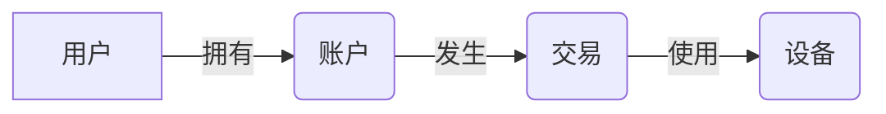

##  金融领域的GhostNet: 防范隐形欺诈的对策

## 1. 背景介绍

### 1.1 金融欺诈的挑战

金融行业一直是欺诈活动的重灾区。近年来，随着互联网和移动支付的普及，金融欺诈手段层出不穷，欺诈金额和案件数量都呈现出快速增长的趋势。传统的反欺诈手段，例如基于规则的专家系统和基于统计的机器学习模型，在应对新型、隐蔽的欺诈行为时显得力不从心。

### 1.2 隐形欺诈的兴起

“隐形欺诈”（Ghost Fraud）是指利用复杂、隐蔽的手段进行的欺诈行为，其特点包括：

* **跨平台、跨时间、跨地域作案：** 欺诈者往往会利用多个平台、多个账户，在不同的时间和地点进行操作，以掩盖其真实身份和目的。
* **团伙作案、分工明确：** 隐形欺诈通常由多个犯罪分子组成团伙，他们之间分工明确，协同作案，难以追踪和打击。
* **技术手段高超：** 欺诈者会利用各种先进的技术手段，例如人工智能、大数据分析等，来进行欺诈活动，使得传统的反欺诈手段难以识别。

### 1.3 GhostNet的提出

为了应对隐形欺诈带来的挑战，研究人员提出了“GhostNet”的概念。GhostNet是一种基于图神经网络的新型反欺诈技术，它可以有效地识别和防范隐形欺诈行为。

## 2. 核心概念与联系

### 2.1 图神经网络 (GNN)

图神经网络 (GNN) 是一种专门用于处理图结构数据的深度学习模型。它可以学习节点之间的关系和信息传递，从而对图中的节点进行分类、预测等任务。

### 2.2 异构信息网络 (HIN)

异构信息网络 (HIN) 是一种特殊的图结构，它包含多种类型的节点和边，可以用来表示现实世界中复杂的关系网络。例如，在金融领域，一个HIN可以包含用户、账户、交易、设备等多种类型的节点，以及用户与账户之间的关系、账户与交易之间的关系等多种类型的边。

### 2.3 GhostNet的架构

GhostNet是一个基于GNN和HIN的反欺诈系统。它主要由以下几个模块组成：

* **数据预处理模块：** 将原始的金融数据转换成HIN的格式，并进行数据清洗、特征工程等操作。
* **图嵌入模块：** 利用GNN将HIN中的节点映射到低维向量空间，保留节点之间的结构信息和语义信息。
* **欺诈检测模块：** 利用图嵌入向量，构建分类模型，对用户或交易进行欺诈风险评估。
* **可视化模块：** 将欺诈检测结果可视化，帮助分析人员识别和分析欺诈团伙。

## 3. 核心算法原理具体操作步骤

### 3.1 图构建

GhostNet的第一步是将原始的金融数据转换成HIN的格式。例如，可以将用户、账户、交易、设备等实体作为节点，将用户与账户之间的关系、账户与交易之间的关系等关联作为边。

### 3.2 节点嵌入

GhostNet利用GNN将HIN中的节点映射到低维向量空间。常用的GNN模型包括GraphSAGE、GAT等。这些模型可以学习节点之间的关系和信息传递，从而得到更准确的节点表示。



### 3.3 欺诈检测

得到节点的嵌入向量后，GhostNet可以使用各种分类模型来进行欺诈检测。例如，可以使用逻辑回归、支持向量机、随机森林等模型来训练分类器，对用户或交易进行欺诈风险评估。

### 3.4 模型评估

可以使用AUC、KS等指标来评估GhostNet的性能。

## 4. 数学模型和公式详细讲解举例说明

### 4.1 GraphSAGE模型

GraphSAGE是一种常用的GNN模型，它可以学习节点的邻居信息来生成节点的嵌入向量。其数学模型如下：

$$
h_v^{(k)} = \sigma(W^{(k)} \cdot \text{AGGREGATE}(\{h_u^{(k-1)}, \forall u \in N(v)\}) + B^{(k)})
$$

其中：

* $h_v^{(k)}$ 表示节点 $v$ 在第 $k$ 层的嵌入向量。
* $W^{(k)}$ 和 $B^{(k)}$ 分别表示第 $k$ 层的权重矩阵和偏置向量。
* $\sigma(\cdot)$ 表示激活函数。
* $\text{AGGREGATE}(\cdot)$ 表示聚合函数，用于聚合邻居节点的信息。
* $N(v)$ 表示节点 $v$ 的邻居节点集合。

### 4.2 损失函数

GhostNet可以使用交叉熵损失函数来训练分类模型：

$$
L = -\frac{1}{N} \sum_{i=1}^N [y_i \log(p_i) + (1-y_i) \log(1-p_i)]
$$

其中：

* $N$ 表示样本数量。
* $y_i$ 表示第 $i$ 个样本的真实标签（0表示正常，1表示欺诈）。
* $p_i$ 表示第 $i$ 个样本预测为欺诈的概率。


## 5. 项目实践：代码实例和详细解释说明

```python
import dgl
import torch
import torch.nn as nn

# 定义GraphSAGE模型
class GraphSAGE(nn.Module):
    def __init__(self, in_feats, hid_feats, out_feats):
        super(GraphSAGE, self).__init__()
        self.conv1 = dgl.nn.SAGEConv(in_feats, hid_feats, 'mean')
        self.conv2 = dgl.nn.SAGEConv(hid_feats, out_feats, 'mean')

    def forward(self, g, in_feat):
        h = self.conv1(g, in_feat)
        h = torch.relu(h)
        h = self.conv2(g, h)
        return h

# 构建HIN
g = dgl.heterograph({
    ('user', 'owns', 'account'): [(0, 0), (1, 1)],
    ('account', 'has', 'transaction'): [(0, 0), (1, 1)],
    ('transaction', 'uses', 'device'): [(0, 0), (1, 1)],
})

# 初始化节点特征
user_feat = torch.randn(2, 16)
account_feat = torch.randn(2, 32)
transaction_feat = torch.randn(2, 64)
device_feat = torch.randn(2, 128)

# 创建GraphSAGE模型
model = GraphSAGE(in_feats=16, hid_feats=32, out_feats=2)

# 进行节点嵌入
user_emb = model(g, user_feat)
account_emb = model(g, account_feat)
transaction_emb = model(g, transaction_feat)
device_emb = model(g, device_feat)

# ...
```

## 6. 实际应用场景

GhostNet可以应用于各种金融场景，例如：

* **信用卡欺诈检测：** 检测信用卡申请、交易等环节的欺诈行为。
* **贷款欺诈检测：** 检测贷款申请资料的真实性，识别虚假贷款行为。
* **洗钱犯罪检测：** 分析资金流动路径，识别可疑交易，打击洗钱犯罪。
* **保险欺诈检测：** 检测保险理赔过程中的虚假信息和欺诈行为。

## 7. 工具和资源推荐

* **DGL:**  一个用于图神经网络的开源框架，提供了丰富的GNN模型和工具。
* **PyTorch Geometric:**  另一个用于图神经网络的开源框架，也提供了丰富的GNN模型和工具。
* **Neo4j:**  一个高性能的图数据库，可以用于存储和查询HIN数据。

## 8. 总结：未来发展趋势与挑战

GhostNet作为一种新兴的反欺诈技术，未来发展趋势包括：

* **更强大的GNN模型：** 研究更强大的GNN模型，提升GhostNet的性能。
* **更丰富的HIN信息：** 融合更多的数据源，构建更丰富的HIN，提升GhostNet的准确率。
* **实时欺诈检测：** 将GhostNet应用于实时欺诈检测场景，及时发现和阻止欺诈行为。

## 9. 附录：常见问题与解答

### 9.1 GhostNet如何处理冷启动问题？

冷启动问题是指新用户或新交易缺乏历史数据，难以进行准确的欺诈风险评估。GhostNet可以通过以下方法来缓解冷启动问题：

* **利用规则引擎：** 对于新用户或新交易，可以先使用规则引擎进行初步的风险评估。
* **迁移学习：** 可以使用其他领域的数据来训练GhostNet，然后将模型迁移到金融领域。
* **半监督学习：** 可以利用少量标注数据和大量未标注数据来训练GhostNet。

### 9.2 GhostNet如何解释欺诈检测结果？

GhostNet可以使用图结构信息来解释欺诈检测结果。例如，可以展示与欺诈用户相关的可疑交易路径、可疑账户等信息，帮助分析人员理解欺诈行为。
