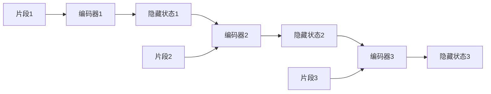

# 长文本建模的Transformer新思路:分层与分段建模

作者：禅与计算机程序设计艺术

## 1. 背景介绍

### 1.1 Transformer模型的局限性

Transformer模型在自然语言处理领域取得了巨大的成功，但其在处理长文本时面临着巨大的挑战。其主要局限性在于：

* **计算复杂度高:**  Transformer 的自注意力机制计算复杂度与序列长度呈平方关系，难以处理长文本。
* **内存占用大:**  长文本的表示向量维度高，存储和计算都需要大量的内存资源。
* **信息丢失:**  长距离的信息传递容易丢失，影响模型对长文本的理解能力。

### 1.2 长文本建模的必要性

长文本建模在许多领域都有着广泛的应用：

* **文档摘要**:  从长文档中提取关键信息，生成简洁的摘要。
* **问答系统**:  理解长篇问题和文档，准确地回答用户的问题。
* **机器翻译**:  翻译长篇文章时，需要模型能够理解上下文信息。
* **文本生成**:  生成流畅、连贯的长篇文本，例如小说、新闻报道等。

### 1.3 分层与分段建模的提出

为了解决Transformer模型在长文本建模上的局限性，研究人员提出了分层和分段建模的新思路。其核心思想是将长文本分解成多个层次或片段，分别进行建模，最后再将各个部分的信息融合起来，从而降低计算复杂度，提高模型对长文本的理解能力。

## 2. 核心概念与联系

### 2.1 分层建模

#### 2.1.1 概念

分层建模将长文本视为一个层次结构，例如：

* **词语层**:  对文本中的每个词语进行编码。
* **句子层**:  将词语序列组合成句子，并对句子进行编码。
* **段落层**:  将句子序列组合成段落，并对段落进行编码。
* **文档层**:  将所有段落的信息融合起来，得到整个文档的表示。

#### 2.1.2 优点

* **降低计算复杂度**:  每层模型只需要处理较短的文本片段，降低了计算复杂度。
* **捕捉不同粒度的信息**:  不同层次的模型可以捕捉不同粒度的语义信息。

#### 2.1.3 模型

* **层次循环神经网络 (HRNN)**:  使用多层循环神经网络，逐层处理不同粒度的文本信息。
* **层次Transformer**:  使用多层Transformer编码器，逐层捕捉不同粒度的语义信息。

### 2.2 分段建模

#### 2.2.1 概念

分段建模将长文本分成多个片段，每个片段长度固定或动态调整。对每个片段分别进行编码，最后再将所有片段的信息融合起来。

#### 2.2.2 优点

* **降低计算复杂度**:  每个片段长度较短，降低了计算复杂度。
* **并行计算**:  各个片段可以并行编码，提高了计算效率。

#### 2.2.3 模型

* **Transformer-XL**:  使用递归机制和相对位置编码，扩展了Transformer模型的上下文窗口大小。
* **Reformer**:  使用局部敏感哈希 (LSH) 降低自注意力机制的计算复杂度。
* **Longformer**:  使用滑动窗口注意力机制，限制了自注意力机制的计算范围。

### 2.3 分层与分段建模的联系

分层建模和分段建模可以结合使用，例如：

* **先分段再分层**:  先将长文本分成多个片段，然后对每个片段进行分层建模。
* **先分层再分段**:  先将长文本进行分层建模，然后对每层的表示进行分段处理。

## 3. 核心算法原理具体操作步骤

### 3.1 分层Transformer模型

#### 3.1.1 词语层编码

使用预训练的词向量或词嵌入模型，将每个词语转换成向量表示。

#### 3.1.2 句子层编码

将词语序列输入到Transformer编码器中，得到句子的向量表示。

#### 3.1.3 段落层编码

将句子序列输入到Transformer编码器中，得到段落的向量表示。

#### 3.1.4 文档层编码

将所有段落的向量表示输入到另一个Transformer编码器中，得到整个文档的表示。

#### 3.1.5 流程图


### 3.2 Transformer-XL模型

#### 3.2.1 片段编码

将长文本分成多个片段，每个片段长度固定。

#### 3.2.2 递归机制

每个片段的编码不仅依赖于当前片段的信息，还依赖于前一个片段的编码结果。

#### 3.2.3 相对位置编码

使用相对位置编码，而不是绝对位置编码，来表示词语在片段中的位置信息。

#### 3.2.4 流程图



## 4. 数学模型和公式详细讲解举例说明

### 4.1 Transformer模型

#### 4.1.1 自注意力机制

$$
\text{Attention}(Q, K, V) = \text{softmax}(\frac{QK^T}{\sqrt{d_k}})V
$$

其中：

* $Q$ 是查询矩阵
* $K$ 是键矩阵
* $V$ 是值矩阵
* $d_k$ 是键的维度

#### 4.1.2 多头注意力机制

$$
\text{MultiHead}(Q, K, V) = \text{Concat}(\text{head}_1, ..., \text{head}_h)W^O
$$

其中：

* $\text{head}_i = \text{Attention}(QW_i^Q, KW_i^K, VW_i^V)$
* $W_i^Q$, $W_i^K$, $W_i^V$ 是线性变换矩阵
* $W^O$ 是输出线性变换矩阵

### 4.2 Transformer-XL模型

#### 4.2.1 递归机制

$$
h_t = f(h_{t-1}, x_t)
$$

其中：

* $h_t$ 是当前片段的隐藏状态
* $h_{t-1}$ 是前一个片段的隐藏状态
* $x_t$ 是当前片段的输入

#### 4.2.2 相对位置编码

$$
\text{PE}(pos, 2i) = \sin(pos / 10000^{2i/d_{model}})
$$

$$
\text{PE}(pos, 2i+1) = \cos(pos / 10000^{2i/d_{model}})
$$

其中：

* $pos$ 是词语在片段中的位置
* $i$ 是维度索引
* $d_{model}$ 是模型的维度

## 5. 项目实践：代码实例和详细解释说明

### 5.1 使用Hugging Face Transformers库实现分层Transformer模型

```python
from transformers import AutoModel, AutoTokenizer

# 加载预训练模型和分词器
model_name = "bert-base-uncased"
tokenizer = AutoTokenizer.from_pretrained(model_name)
model = AutoModel.from_pretrained(model_name)

# 定义输入文本
text = """
This is the first sentence.
This is the second sentence.
This is the third sentence.
"""

# 对文本进行分词和编码
inputs = tokenizer(text, return_tensors="pt")

# 获取词语层编码
word_embeddings = model(**inputs).last_hidden_state

# 将词语层编码输入到句子层编码器
sentence_embeddings = model(**inputs, output_hidden_states=True).hidden_states[1]

# 将句子层编码输入到段落层编码器
paragraph_embeddings = model(**inputs, output_hidden_states=True).hidden_states[2]

# 将段落层编码输入到文档层编码器
document_embedding = model(**inputs, output_hidden_states=True).hidden_states[-1]
```

### 5.2 使用Hugging Face Transformers库实现Transformer-XL模型

```python
from transformers import TransfoXLModel, TransfoXLTokenizer

# 加载预训练模型和分词器
model_name = "transfo-xl-wt103"
tokenizer = TransfoXLTokenizer.from_pretrained(model_name)
model = TransfoXLModel.from_pretrained(model_name)

# 定义输入文本
text = """
This is a very long text.
It contains multiple sentences.
And it spans across multiple lines.
"""

# 对文本进行分词和编码
inputs = tokenizer(text, return_tensors="pt")

# 获取模型输出
outputs = model(**inputs)

# 获取最后一个片段的隐藏状态
last_hidden_state = outputs.last_hidden_state
```

## 6. 实际应用场景

### 6.1 文档摘要

* **抽取式摘要**:  使用分层Transformer模型，对文档的每个句子进行编码，并根据句子的重要性得分，选择最重要的句子组成摘要。
* **生成式摘要**:  使用Transformer-XL模型，编码整个文档，并使用解码器生成简洁的摘要。

### 6.2 问答系统

* **基于检索的问答系统**:  使用分层Transformer模型，对问题和文档分别进行编码，并计算它们之间的相似度，选择最相关的文档片段作为答案。
* **基于阅读理解的问答系统**:  使用Transformer-XL模型，编码问题和文档，并使用指针网络从文档中提取答案片段。

### 6.3 机器翻译

* **神经机器翻译**:  使用分层Transformer模型，将源语言和目标语言的句子分别进行编码，并使用解码器生成目标语言的翻译结果。

### 6.4  文本生成

* **故事生成**:  使用Transformer-XL模型，根据给定的开头生成完整的故事。
* **对话生成**:  使用分层Transformer模型，编码对话历史，并使用解码器生成下一个对话回合。

## 7. 总结：未来发展趋势与挑战

### 7.1 未来发展趋势

* **更有效的长文本建模方法**:  研究人员将继续探索更有效的长文本建模方法，例如稀疏注意力机制、动态片段长度等。
* **多模态长文本建模**:  将文本信息与其他模态的信息（例如图像、音频）结合起来，进行多模态长文本建模。
* **长文本建模的应用**:  随着长文本建模技术的不断发展，其应用领域将会越来越广泛。

### 7.2 挑战

* **计算效率**:  长文本建模需要大量的计算资源，如何提高计算效率是一个挑战。
* **模型可解释性**:  长文本建模模型通常比较复杂，如何解释模型的预测结果是一个挑战。
* **数据稀缺**:  长文本数据通常比较稀缺，如何利用有限的数据训练出有效的模型是一个挑战。


## 8. 附录：常见问题与解答

### 8.1  分层Transformer模型和Transformer-XL模型有什么区别？

分层Transformer模型和Transformer-XL模型都是为了解决Transformer模型在长文本建模上的局限性而提出的。它们的主要区别在于：

* **处理方式**:  分层Transformer模型将长文本视为一个层次结构，逐层进行编码；而Transformer-XL模型将长文本分成多个片段，分别进行编码，并使用递归机制和相对位置编码来扩展上下文窗口大小。
* **计算效率**:  Transformer-XL模型的计算效率通常比分层Transformer模型更高。

### 8.2 如何选择合适的长文本建模模型？

选择合适的长文本建模模型需要考虑以下因素：

* **文本长度**:  对于较短的文本，可以使用传统的Transformer模型；对于较长的文本，需要使用分层Transformer模型或Transformer-XL模型。
* **计算资源**:  Transformer-XL模型的计算效率更高，但需要更多的计算资源。
* **应用场景**:  不同的应用场景对模型的要求不同，例如文档摘要需要模型能够捕捉文档的关键信息，而问答系统需要模型能够理解问题和文档之间的语义关系。
