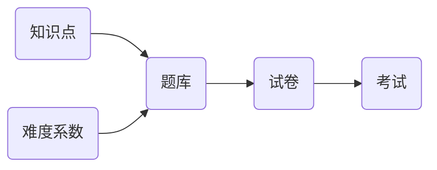

# 题库（及试卷）管理系统设计与实现

作者：禅与计算机程序设计艺术

## 1. 背景介绍

### 1.1. 教育信息化的必然趋势

随着信息技术的飞速发展和教育理念的不断更新，教育信息化已经成为当前教育改革和发展的重要方向。传统的纸质试卷和人工阅卷方式存在着诸多弊端，如：效率低下、易出错、成本高昂、资源浪费等。为了解决这些问题，越来越多的学校和教育机构开始采用题库管理系统来实现考试的电子化、自动化和智能化。

### 1.2. 题库管理系统的优势

题库管理系统可以将大量的试题进行电子化存储、管理和组卷，并提供在线考试、自动阅卷、成绩分析等功能，具有以下优势：

* **提高效率：**  自动化组卷和阅卷，节省教师时间和精力。
* **降低成本：**  减少纸张和印刷成本，降低考试成本。
* **提高质量：**  保证试题的质量和覆盖面，提高考试的公平性和有效性。
* **方便快捷：**  随时随地进行考试和阅卷，方便灵活。
* **数据分析：**  提供考试数据分析，帮助教师了解学生学习情况，改进教学方法。

### 1.3. 本文目标

本文旨在探讨如何设计和实现一个功能完善、性能优越、易于维护的题库（及试卷）管理系统，并提供相应的代码实例和详细解释说明。

## 2. 核心概念与联系

### 2.1. 题库

题库是指存储和管理大量试题的数据库，是题库管理系统的核心组成部分。题库中的试题应该按照一定的分类体系进行组织，以便于用户查找和使用。

#### 2.1.1. 试题类型

常见的试题类型包括：单选题、多选题、判断题、填空题、简答题、编程题等。不同的试题类型需要采用不同的数据结构进行存储和处理。

#### 2.1.2. 知识点

知识点是指试题所考察的具体知识内容，是试题分类和组卷的重要依据。一个试题可以对应多个知识点，一个知识点也可以对应多个试题。

#### 2.1.3. 难度系数

难度系数是指试题的难易程度，通常用百分比表示。难度系数可以根据试题的答题情况进行动态调整。

### 2.2. 试卷

试卷是指由多道试题组成的考试试题集，是考试的基本单位。试卷的生成可以根据考试目的、考试范围、考试时间等因素进行灵活设置。

#### 2.2.1. 试卷结构

试卷结构是指试卷中各个部分的组成和排列方式，通常包括：选择题部分、填空题部分、简答题部分等。

#### 2.2.2. 组卷规则

组卷规则是指生成试卷时需要遵循的规则，例如：每种题型的数量、知识点的覆盖率、难度系数的分布等。

### 2.3. 考试

考试是指利用试卷对学生进行知识和能力的测试，是教育教学的重要环节。

#### 2.3.1. 考试方式

常见的考试方式包括：在线考试、纸质考试等。

#### 2.3.2. 阅卷方式

常见的阅卷方式包括：人工阅卷、机器阅卷等。

### 2.4. 核心概念关系图



## 3. 核心算法原理具体操作步骤

### 3.1. 试题录入与管理

#### 3.1.1. 试题录入

* **手动录入：** 教师可以通过系统提供的界面手动录入试题信息，包括：题干、选项、答案、知识点、难度系数等。
* **批量导入：** 系统支持从Excel、Word等格式的文件中批量导入试题信息。

#### 3.1.2. 试题管理

* **试题查询：** 教师可以通过关键词、知识点、难度系数等条件查询试题。
* **试题修改：** 教师可以对已录入的试题信息进行修改。
* **试题删除：** 教师可以删除不再使用的试题。

### 3.2. 试卷生成

#### 3.2.1. 手动组卷

教师可以根据需要手动选择试题，组成试卷。

#### 3.2.2. 自动组卷

系统可以根据教师设置的组卷规则，自动从题库中抽取试题，生成试卷。

##### 3.2.2.1. 随机抽题算法

随机抽题算法是最简单的自动组卷算法，它从题库中随机抽取指定数量的试题组成试卷。

##### 3.2.2.2. 基于知识点的组卷算法

基于知识点的组卷算法首先根据考试范围确定需要考察的知识点，然后从题库中选择与这些知识点相关的试题组成试卷。

##### 3.2.2.3. 基于难度系数的组卷算法

基于难度系数的组卷算法首先根据考试难度确定试卷的难度系数，然后从题库中选择与该难度系数相符的试题组成试卷。

### 3.3. 考试管理

#### 3.3.1. 创建考试

教师可以创建新的考试，设置考试名称、考试时间、考试时长、考试科目、考试范围等信息。

#### 3.3.2. 发布考试

教师可以将创建的考试发布给学生，学生可以通过系统参加考试。

#### 3.3.3. 监控考试

教师可以实时监控学生的考试情况，例如：考试进度、答题情况等。

### 3.4. 阅卷与成绩分析

#### 3.4.1. 人工阅卷

对于主观题，教师需要进行人工阅卷。

#### 3.4.2. 机器阅卷

对于客观题，系统可以自动进行阅卷。

#### 3.4.3. 成绩分析

系统可以对学生的考试成绩进行统计分析，例如：平均分、最高分、最低分、及格率、优秀率等，并生成相应的图表和报告。

## 4. 数学模型和公式详细讲解举例说明

### 4.1. 难度系数计算公式

$$
难度系数 = \frac{答对人数}{总人数} \times 100\%
$$

**举例说明：**

假设一道试题有100人作答，其中有60人答对，则该试题的难度系数为：

$$
难度系数 = \frac{60}{100} \times 100\% = 60\%
$$

### 4.2. 试卷区分度计算公式

$$
区分度 = \frac{高分组平均分 - 低分组平均分}{总分}
$$

**举例说明：**

假设一份试卷的总分为100分，将参加考试的学生按照成绩从高到低排序，取前27%的学生为高分组，后27%的学生为低分组。高分组的平均分为80分，低分组的平均分为60分，则该试卷的区分度为：

$$
区分度 = \frac{80 - 60}{100} = 0.2
$$

## 5. 项目实践：代码实例和详细解释说明

### 5.1. 技术选型

* **后端：** Spring Boot
* **数据库：** MySQL
* **前端：** Vue.js

### 5.2. 数据库设计

```sql
-- 题库表
CREATE TABLE question (
  id INT PRIMARY KEY AUTO_INCREMENT,
  type VARCHAR(20) NOT NULL, -- 题型
  stem TEXT NOT NULL, -- 题干
  options TEXT, -- 选项
  answer VARCHAR(255) NOT NULL, -- 答案
  knowledge_points VARCHAR(255) NOT NULL, -- 知识点
  difficulty DECIMAL(3,2) NOT NULL -- 难度系数
);

-- 试卷表
CREATE TABLE paper (
  id INT PRIMARY KEY AUTO_INCREMENT,
  name VARCHAR(255) NOT NULL, -- 试卷名称
  total_score INT NOT NULL, -- 总分
  duration INT NOT NULL, -- 考试时长（分钟）
  create_time TIMESTAMP DEFAULT CURRENT_TIMESTAMP -- 创建时间
);

-- 试卷题目表
CREATE TABLE paper_question (
  id INT PRIMARY KEY AUTO_INCREMENT,
  paper_id INT NOT NULL,
  question_id INT NOT NULL,
  score INT NOT NULL, -- 分值
  FOREIGN KEY (paper_id) REFERENCES paper(id),
  FOREIGN KEY (question_id) REFERENCES question(id)
);

-- 考试表
CREATE TABLE exam (
  id INT PRIMARY KEY AUTO_INCREMENT,
  name VARCHAR(255) NOT NULL, -- 考试名称
  paper_id INT NOT NULL,
  start_time TIMESTAMP NOT NULL, -- 开始时间
  end_time TIMESTAMP NOT NULL, -- 结束时间
  FOREIGN KEY (paper_id) REFERENCES paper(id)
);
```

### 5.3. 代码示例

#### 5.3.1. 试题录入接口

```java
@PostMapping("/questions")
public Question createQuestion(@RequestBody Question question) {
  return questionService.createQuestion(question);
}
```

#### 5.3.2. 自动组卷接口

```java
@PostMapping("/papers/generate")
public Paper generatePaper(@RequestBody GeneratePaperRequest request) {
  return paperService.generatePaper(request);
}
```

### 5.4. 部署与运行

将项目打包成jar包，使用命令行启动：

```
java -jar exam-management-system.jar
```

## 6. 实际应用场景

### 6.1. 学校教育

* **期中期末考试：**  使用题库管理系统可以方便地进行期中期末考试的组卷、阅卷和成绩分析。
* **课堂练习：**  教师可以使用题库管理系统发布课堂练习，并对学生的答题情况进行实时反馈。
* **模拟考试：**  学生可以使用题库管理系统进行模拟考试，提前熟悉考试环境和考试内容。

### 6.2. 企业招聘

* **笔试环节：**  企业可以使用题库管理系统进行笔试环节的考试，提高招聘效率和公平性。
* **技能测评：**  企业可以使用题库管理系统对员工进行技能测评，了解员工的技能水平，制定相应的培训计划。

### 6.3. 在线教育

* **在线课程测试：**  在线教育平台可以使用题库管理系统对学生的学习情况进行测试，并根据测试结果调整教学内容和教学方法。
* **资格认证考试：**  一些在线教育平台提供资格认证考试服务，可以使用题库管理系统进行考试的组织和管理。

## 7. 总结：未来发展趋势与挑战

### 7.1. 未来发展趋势

* **智能化：**  随着人工智能技术的不断发展，题库管理系统将会更加智能化，例如：自动生成试题、智能组卷、个性化推荐等。
* **移动化：**  移动互联网的普及使得移动学习成为趋势，题库管理系统将会更加注重移动端的体验，方便学生随时随地进行学习和测试。
* **数据化：**  题库管理系统将会更加注重数据的收集和分析，利用大数据技术为教育教学提供决策支持。

### 7.2. 面临的挑战

* **试题质量：**  题库管理系统的核心是试题，如何保证试题的质量和覆盖面是题库管理系统面临的重要挑战。
* **系统安全：**  题库管理系统存储着大量的考试信息，如何保证系统的安全性和稳定性也是一个重要的挑战。
* **用户体验：**  题库管理系统需要满足不同用户的需求，如何提升用户体验也是一个需要不断探索的问题。

## 8. 附录：常见问题与解答

### 8.1. 如何保证试题的质量？

* 建立完善的试题审核机制，对新录入的试题进行严格审核。
* 定期对题库中的试题进行评估和更新，淘汰过时或质量不高的试题。
* 鼓励教师参与到试题的编写和审核过程中来。

### 8.2. 如何保证系统的安全？

* 对系统进行定期的安全测试和漏洞扫描。
* 对用户的访问权限进行严格控制。
* 对敏感数据进行加密存储。

### 8.3. 如何提升用户体验？

* 设计简洁易用的系统界面。
* 提供详细的帮助文档和操作指南。
* 及时解决用户反馈的问题。


