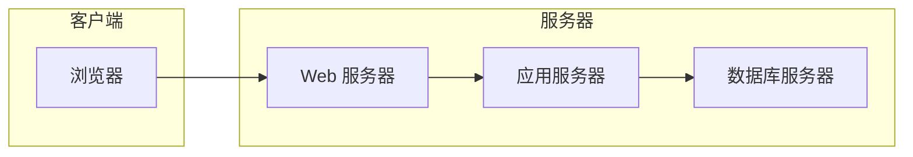

## 1. 背景介绍

### 1.1 驾考行业现状与挑战

随着我国经济的快速发展和人民生活水平的不断提高，汽车保有量持续增长，驾驶培训行业也随之蓬勃发展。然而，传统的驾考训练模式存在着诸多问题，例如：

* **信息化程度低:** 许多驾校仍然采用纸质化管理，效率低下且容易出错。
* **训练过程不透明:** 学员难以实时了解自己的学习进度和考试情况，容易产生焦虑情绪。
* **资源利用率低:** 教练车、场地等资源分配不合理，造成资源浪费。
* **安全隐患:** 缺乏有效的安全监管机制，存在安全事故隐患。

### 1.2 驾考训练管理信息系统的意义

为了解决上述问题，驾考训练管理信息系统应运而生。该系统旨在利用现代信息技术手段，实现驾考训练过程的信息化、自动化和智能化管理，提高驾考训练效率和质量，保障学员安全。

## 2. 核心概念与联系

### 2.1 系统用户角色

驾考训练管理信息系统涉及多个用户角色，主要包括：

* **管理员:** 负责系统整体的管理和维护，包括用户管理、权限管理、数据备份等。
* **驾校:** 负责驾校信息的管理，包括教练车管理、场地管理、课程安排等。
* **教练:** 负责学员的培训，包括理论教学、实操训练、考试安排等。
* **学员:** 参加驾考培训，学习驾驶技能，并参加考试。

### 2.2 系统功能模块

驾考训练管理信息系统主要包含以下功能模块：

* **学员管理:**  包括学员信息登记、学习进度跟踪、考试成绩查询等功能。
* **教练管理:** 包括教练信息管理、教练车管理、教练排班等功能。
* **车辆管理:** 包括车辆信息管理、车辆维修保养记录、车辆调度等功能。
* **场地管理:** 包括场地信息管理、场地预约、场地使用情况统计等功能。
* **课程管理:** 包括课程信息管理、课程安排、课程评价等功能。
* **考试管理:** 包括考试报名、考试安排、考试成绩发布等功能。
* **财务管理:** 包括收费管理、支出管理、财务报表生成等功能。
* **系统管理:** 包括用户管理、权限管理、数据备份等功能。

### 2.3 系统架构

驾考训练管理信息系统采用 B/S 架构，即浏览器/服务器架构。系统架构图如下所示：



## 3. 核心算法原理具体操作步骤

### 3.1 学员学习进度跟踪算法

学员学习进度跟踪算法用于实时跟踪学员的学习进度，并及时向学员和教练反馈学习情况。该算法主要包括以下步骤：

1. **记录学员学习数据:** 记录学员的理论学习时间、实操训练时间、考试成绩等数据。
2. **计算学习进度:** 根据学员的学习数据，计算学员的理论学习进度、实操训练进度和 overall 进度。
3. **生成学习报告:** 生成学员的学习报告，包括学习进度、学习情况分析、学习建议等。
4. **反馈学习情况:** 将学员的学习报告反馈给学员和教练，以便及时调整学习计划。

### 3.2 教练排班算法

教练排班算法用于自动生成教练的排班表，以确保教练资源的合理利用。该算法主要包括以下步骤：

1. **收集教练信息:** 收集教练的可用时间、擅长科目、学员数量等信息。
2. **收集学员信息:** 收集学员的学习时间、学习科目等信息。
3. **生成排班方案:** 根据教练和学员的信息，生成多个排班方案。
4. **评估排班方案:** 评估每个排班方案的合理性和效率，并选择最优方案。
5. **发布排班表:** 将最终的排班表发布给教练和学员。

## 4. 数学模型和公式详细讲解举例说明

### 4.1 学员学习进度计算公式

学员的学习进度可以用以下公式计算：

$$
\text{学习进度} = \frac{\text{已完成学习内容}}{\text{总学习内容}} \times 100\%
$$

例如，某学员的理论学习总时长为 20 小时，他已经完成了 15 小时的学习，则他的理论学习进度为：

$$
\text{理论学习进度} = \frac{15}{20} \times 100\% = 75\%
$$

### 4.2 教练排班优化模型

教练排班优化模型可以使用线性规划模型来描述。该模型的目标是最大化教练资源利用率，同时满足学员的学习需求。

**模型变量:**

* $x_{ij}$: 教练 $i$ 在时间段 $j$ 是否安排课程，取值为 0 或 1。

**模型约束:**

* 教练时间约束: 每个教练在每个时间段只能安排一节课程。
* 学员需求约束: 每个学员需要在规定的时间段内完成所有课程。

**模型目标函数:**

* 最大化教练资源利用率: 最大化 $\sum_{i=1}^{m} \sum_{j=1}^{n} x_{ij}$，其中 $m$ 为教练数量，$n$ 为时间段数量。

## 5. 项目实践：代码实例和详细解释说明

### 5.1 学员信息管理模块

**代码示例:**

```python
class Student:
    def __init__(self, name, id_number, phone_number):
        self.name = name
        self.id_number = id_number
        self.phone_number = phone_number

    def get_info(self):
        return f"姓名: {self.name}, 身份证号: {self.id_number}, 电话号码: {self.phone_number}"

# 创建学员对象
student1 = Student("张三", "123456789012345678", "13800000000")

# 打印学员信息
print(student1.get_info())
```

**代码解释:**

* `Student` 类表示学员信息，包含姓名、身份证号、电话号码等属性。
* `get_info()` 方法用于获取学员信息。

### 5.2 教练排班模块

**代码示例:**

```python
import pulp

# 教练信息
coaches = ["张教练", "李教练", "王教练"]

# 时间段
time_slots = ["上午", "下午"]

# 学员需求
student_demand = {
    "张三": ["上午"],
    "李四": ["下午"],
    "王五": ["上午", "下午"],
}

# 创建线性规划模型
model = pulp.LpProblem("教练排班", pulp.LpMaximize)

# 定义变量
x = pulp.LpVariable.dicts("x", (coaches, time_slots), cat="Binary")

# 添加约束
for coach in coaches:
    for time_slot in time_slots:
        model += x[coach][time_slot] <= 1  # 教练时间约束

for student, demand in student_demand.items():
    for time_slot in demand:
        model += pulp.lpSum([x[coach][time_slot] for coach in coaches]) >= 1  # 学员需求约束

# 设置目标函数
model += pulp.lpSum([x[coach][time_slot] for coach in coaches for time_slot in time_slots])

# 求解模型
model.solve()

# 打印排班结果
print("排班结果:")
for coach in coaches:
    for time_slot in time_slots:
        if x[coach][time_slot].varValue == 1:
            print(f"{coach} 在 {time_slot} 安排课程")
```

**代码解释:**

* 使用 `pulp` 库创建线性规划模型。
* 定义变量 `x` 表示教练在某个时间段是否安排课程。
* 添加教练时间约束和学员需求约束。
* 设置目标函数为最大化教练资源利用率。
* 求解模型并打印排班结果。

## 6. 实际应用场景

驾考训练管理信息系统可以应用于各种驾考培训机构，例如：

* **驾校:** 提高驾校管理效率，优化资源利用，提升学员满意度。
* **交通运输部门:** 加强驾考行业监管，保障学员安全，促进驾培行业健康发展。
* **科研机构:**  为驾考理论研究和技术创新提供数据支持。

## 7. 总结：未来发展趋势与挑战

### 7.1 未来发展趋势

* **人工智能化:**  利用人工智能技术，实现智能排课、智能评价、智能客服等功能。
* **大数据分析:**  收集和分析驾考数据，为驾考管理提供决策支持。
* **移动互联网化:**  开发移动端应用，方便学员随时随地学习和查询信息。
* **虚拟现实技术:**  利用虚拟现实技术，模拟真实驾驶环境，提高学员的驾驶技能。

### 7.2 面临的挑战

* **数据安全:**  保护学员和教练的个人信息安全。
* **系统稳定性:**  确保系统稳定运行，避免系统故障影响驾考训练。
* **用户体验:**  提供良好的用户体验，方便用户操作和使用系统。
* **成本控制:**  控制系统开发和维护成本，提高系统性价比。

## 8. 附录：常见问题与解答

### 8.1 忘记密码怎么办？

您可以点击登录页面上的“忘记密码”链接，通过手机号码或邮箱重置密码。

### 8.2 如何联系客服？

您可以在系统中找到客服联系方式，或者拨打客服热线进行咨询。

### 8.3 如何报名参加考试？

您可以登录系统，进入“考试管理”模块，选择相应的考试项目进行报名。
