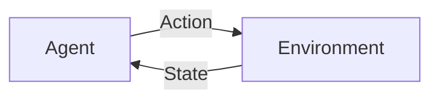

## AI Agent 智能体

作者：禅与计算机程序设计艺术

## 1. 背景介绍

### 1.1 人工智能的演进与发展

人工智能(AI)作为计算机科学的一个重要分支，其目标是使机器能够像人类一样思考、学习和行动。自20世纪50年代诞生以来，人工智能经历了符号主义、连接主义、深度学习等多个发展阶段，并在自然语言处理、计算机视觉、机器人等领域取得了突破性进展。

### 1.2  从 AI 算法到 AI Agent 的转变

近年来，随着人工智能技术的不断发展，人们对人工智能系统的期望也越来越高，希望其能够在更复杂、更动态的环境中自主地完成任务。传统的 AI 算法通常只能解决特定领域的问题，缺乏灵活性和适应性。为了克服这些局限性，AI Agent 应运而生。

### 1.3 AI Agent 的定义与意义

AI Agent (智能体) 是指能够感知环境、进行决策并执行动作以实现特定目标的自主实体。与传统的 AI 算法不同，AI Agent 更加注重与环境的交互，并能够根据环境的变化动态调整自身的行为。AI Agent 的出现标志着人工智能从感知智能向认知智能的转变，为构建更加智能、灵活、自主的人工智能系统提供了新的思路。

## 2. 核心概念与联系

### 2.1 Agent 与 Environment 的交互模型

AI Agent 的核心在于其与环境的交互。Agent 通过传感器感知环境状态，并根据自身的目标和策略选择合适的动作作用于环境。环境状态的改变会再次被 Agent 感知，形成一个循环的交互过程。



### 2.2 Agent 的基本组成要素

一个典型的 AI Agent 通常包含以下几个基本要素：

- **传感器 (Sensors):** 用于感知环境状态，例如摄像头、麦克风、传感器等。
- **执行器 (Actuators):** 用于执行动作，例如机械臂、电机、显示器等。
- **策略 (Policy):**  根据当前环境状态选择执行的动作，可以是预先定义的规则，也可以是通过学习得到的模型。
- **学习模块 (Learning Module):**  根据环境反馈更新 Agent 的策略，使其能够适应不断变化的环境。

### 2.3  常见的 Agent 类型

根据学习方式和策略的不同，AI Agent 可以分为以下几种类型：

- **反应式 Agent (Reactive Agents):**  根据预先定义的规则对环境刺激做出反应，没有记忆能力，只能对当前环境做出反应。
- **基于模型的 Agent (Model-Based Agents):**  构建环境模型，并根据模型预测未来状态，选择最优动作。
- **目标导向型 Agent (Goal-Based Agents):**  设定明确的目标，并根据目标选择能够最大化目标实现概率的动作。
- **效用导向型 Agent (Utility-Based Agents):**  不仅关注目标的实现，还考虑实现目标过程中产生的成本和收益，选择能够最大化效用的动作。

## 3. 核心算法原理具体操作步骤

### 3.1  强化学习 (Reinforcement Learning)

强化学习是一种重要的机器学习方法，它可以让 Agent 通过与环境交互学习到最优策略。在强化学习中，Agent 在与环境交互的过程中会得到奖励或惩罚，Agent 的目标是学习到一个策略，使得其在与环境交互过程中能够获得最大的累积奖励。

### 3.2 强化学习的基本要素

强化学习主要包含以下几个要素：

- **Agent:**  学习者，通过与环境交互学习最优策略。
- **Environment:**  Agent 所处的环境，Agent 的行为会对环境产生影响。
- **State:**  环境的状态，Agent 可以感知到的环境信息。
- **Action:**  Agent 可以采取的动作，Agent 的动作会影响环境状态。
- **Reward:**  Agent 在执行某个动作后，环境给予的奖励或惩罚。
- **Policy:**  Agent 根据当前状态选择动作的策略。
- **Value Function:**  评估当前状态的价值，即从当前状态出发，未来能够获得的累积奖励的期望值。

### 3.3 强化学习的算法流程

强化学习的算法流程通常如下：

1.  Agent 观察当前环境状态 $s_t$。
2.  根据策略 $\pi$ 选择一个动作 $a_t$。
3.  执行动作 $a_t$，环境状态转移到 $s_{t+1}$，并获得奖励 $r_{t+1}$。
4.  根据奖励 $r_{t+1}$ 更新策略 $\pi$ 和价值函数 $V$。
5.  重复步骤 1-4，直到策略收敛。

## 4. 数学模型和公式详细讲解举例说明

### 4.1 马尔可夫决策过程 (Markov Decision Process, MDP)

马尔可夫决策过程是强化学习的数学基础，它可以用来描述 Agent 与环境交互的过程。一个 MDP 通常由以下几个元素组成：

- **状态空间 $S$:**  所有可能的环境状态的集合。
- **动作空间 $A$:**  Agent 可以采取的所有动作的集合。
- **状态转移概率 $P$:**  在状态 $s$ 下执行动作 $a$ 后，转移到状态 $s'$ 的概率，记作 $P(s'|s,a)$。
- **奖励函数 $R$:**  在状态 $s$ 下执行动作 $a$ 后获得的奖励，记作 $R(s,a)$。
- **折扣因子 $\gamma$:**  用于衡量未来奖励的价值，取值范围为 $[0,1]$。

### 4.2  价值函数 (Value Function)

价值函数用于评估状态或状态-动作对的价值。常用的价值函数有两种：

- **状态价值函数 $V^\pi(s)$:**  在状态 $s$ 下，按照策略 $\pi$ 行动，未来能够获得的累积奖励的期望值，可以表示为：

$$V^\pi(s) = \mathbb{E}_\pi \left[ \sum_{t=0}^\infty \gamma^t R(s_t, a_t) | s_0 = s \right]$$

- **动作价值函数 $Q^\pi(s,a)$:**  在状态 $s$ 下，执行动作 $a$，然后按照策略 $\pi$ 行动，未来能够获得的累积奖励的期望值，可以表示为：

$$Q^\pi(s,a) = \mathbb{E}_\pi \left[ \sum_{t=0}^\infty \gamma^t R(s_t, a_t) | s_0 = s, a_0 = a \right]$$

### 4.3  Bellman 方程

Bellman 方程是价值函数的递归表达式，它描述了当前状态的价值与未来状态的价值之间的关系。

- **状态价值函数的 Bellman 方程:**

$$V^\pi(s) = \sum_{a \in A} \pi(a|s) \sum_{s' \in S} P(s'|s,a) [R(s,a) + \gamma V^\pi(s')]$$

- **动作价值函数的 Bellman 方程:**

$$Q^\pi(s,a) = \sum_{s' \in S} P(s'|s,a) [R(s,a) + \gamma \sum_{a' \in A} \pi(a'|s') Q^\pi(s',a')]$$

## 5. 项目实践：代码实例和详细解释说明

### 5.1  使用 Q-Learning 算法训练一个玩迷宫游戏的 Agent

```python
import numpy as np

# 定义迷宫环境
class Maze:
    def __init__(self):
        self.height = 4
        self.width = 4
        self.start = (0, 0)
        self.goal = (3, 3)
        self.obstacles = [(1, 1), (2, 1)]
        self.actions = ['up', 'down', 'left', 'right']

    def reset(self):
        self.state = self.start
        return self.state

    def step(self, action):
        x, y = self.state
        if action == 'up':
            y = max(0, y - 1)
        elif action == 'down':
            y = min(self.height - 1, y + 1)
        elif action == 'left':
            x = max(0, x - 1)
        elif action == 'right':
            x = min(self.width - 1, x + 1)
        next_state = (x, y)
        reward = -1
        if next_state == self.goal:
            reward = 100
        elif next_state in self.obstacles:
            next_state = self.state
        self.state = next_state
        return next_state, reward, next_state == self.goal

# 定义 Q-Learning Agent
class QLearningAgent:
    def __init__(self, actions, learning_rate=0.1, discount_factor=0.9, epsilon=0.1):
        self.actions = actions
        self.learning_rate = learning_rate
        self.discount_factor = discount_factor
        self.epsilon = epsilon
        self.q_table = {}

    def get_action(self, state):
        if np.random.rand() < self.epsilon:
            return np.random.choice(self.actions)
        else:
            return self.actions[np.argmax(self.q_table.get(state, [0] * len(self.actions)))]

    def learn(self, state, action, reward, next_state):
        if state not in self.q_table:
            self.q_table[state] = [0] * len(self.actions)
        if next_state not in self.q_table:
            self.q_table[next_state] = [0] * len(self.actions)
        self.q_table[state][self.actions.index(action)] += self.learning_rate * (
                reward + self.discount_factor * np.max(self.q_table[next_state]) - self.q_table[state][
            self.actions.index(action)])

# 训练 Agent
env = Maze()
agent = QLearningAgent(env.actions)
for episode in range(1000):
    state = env.reset()
    total_reward = 0
    while True:
        action = agent.get_action(state)
        next_state, reward, done = env.step(action)
        agent.learn(state, action, reward, next_state)
        total_reward += reward
        state = next_state
        if done:
            break
    print('Episode {}: Total Reward = {}'.format(episode, total_reward))

# 测试 Agent
state = env.reset()
total_reward = 0
while True:
    action = agent.get_action(state)
    next_state, reward, done = env.step(action)
    total_reward += reward
    state = next_state
    print('State: {}, Action: {}, Reward: {}'.format(state, action, reward))
    if done:
        break
print('Total Reward = {}'.format(total_reward))
```

### 5.2  代码解释

- 首先，我们定义了迷宫环境，包括迷宫的大小、起点、终点、障碍物以及 Agent 可以采取的动作。
- 然后，我们定义了 Q-Learning Agent，包括学习率、折扣因子、epsilon-greedy 策略的参数以及 Q 表。
- 在训练过程中，Agent 不断与环境交互，根据获得的奖励更新 Q 表，最终学习到一个最优策略。
- 在测试过程中，Agent 使用学习到的策略在迷宫中行走，并输出每一步的状态、动作和奖励。

## 6. 实际应用场景

### 6.1 游戏 AI

AI Agent 在游戏领域有着广泛的应用，例如：

- **游戏角色控制:**  控制游戏角色的行为，使其能够更加智能地与玩家交互，例如 OpenAI Five 在 Dota 2 中战胜了职业选手。
- **游戏关卡生成:**  根据玩家的水平自动生成游戏关卡，增加游戏的趣味性和挑战性。
- **游戏 NPC 设计:**  设计更加智能的游戏 NPC，使其能够更加真实地与玩家互动。

### 6.2  机器人控制

AI Agent 可以用于控制机器人的行为，使其能够在复杂的环境中完成各种任务，例如：

- **自动驾驶:**  控制车辆自动行驶，实现无人驾驶。
- **工业机器人:**  控制机器人在工厂中完成各种操作，例如搬运、装配、焊接等。
- **服务机器人:**  控制机器人在家庭、医院等场所提供各种服务，例如清洁、护理、陪伴等。

### 6.3  推荐系统

AI Agent 可以用于构建个性化的推荐系统，例如：

- **电商推荐:**  根据用户的浏览历史、购买记录等信息，推荐用户可能感兴趣的商品。
- **新闻推荐:**  根据用户的阅读兴趣，推荐用户可能感兴趣的新闻。
- **音乐推荐:**  根据用户的音乐品味，推荐用户可能喜欢的音乐。

## 7. 工具和资源推荐

### 7.1  强化学习框架

- **TensorFlow Agents:**  Google 推出的用于构建和训练 AI Agent 的框架。
- **Dopamine:**  Google 推出的用于强化学习研究的框架。
- **Ray RLlib:**  用于构建可扩展强化学习应用的框架。

### 7.2  强化学习资源

- **OpenAI Gym:**  用于开发和比较强化学习算法的工具包。
- **Spinning Up in Deep RL:**  OpenAI 提供的强化学习入门教程。
- **Reinforcement Learning: An Introduction:**  Sutton 和 Barto 编写的强化学习经典教材。

## 8. 总结：未来发展趋势与挑战

### 8.1 未来发展趋势

- **更加智能的 Agent:**  随着深度学习、强化学习等技术的不断发展，AI Agent 将变得更加智能，能够处理更加复杂的任务。
- **更加广泛的应用:**  AI Agent 将被应用到更多的领域，例如医疗、金融、教育等。
- **更加人性化的交互:**  AI Agent 将更加注重与人类的交互，提供更加人性化的服务。

### 8.2  挑战

- **数据效率:**  强化学习通常需要大量的训练数据，如何提高数据效率是一个重要的挑战。
- **泛化能力:**  AI Agent 在训练环境中学习到的策略，如何泛化到新的环境中是一个挑战。
- **安全性:**  如何确保 AI Agent 的行为是安全可靠的，是一个重要的挑战。

## 9. 附录：常见问题与解答

### 9.1  什么是 AI Agent？

AI Agent (智能体) 是指能够感知环境、进行决策并执行动作以实现特定目标的自主实体。

### 9.2  AI Agent 与传统 AI 算法有什么区别？

与传统的 AI 算法不同，AI Agent 更加注重与环境的交互，并能够根据环境的变化动态调整自身的行为。

### 9.3  AI Agent 有哪些应用场景？

AI Agent 在游戏 AI、机器人控制、推荐系统等领域都有着广泛的应用。
