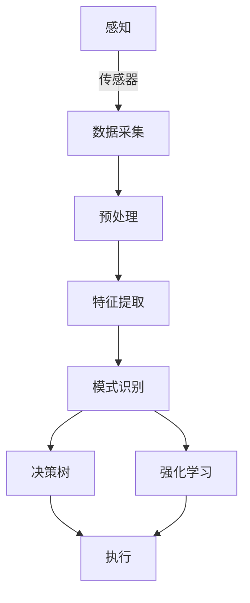

# AI Agent: AI的下一个风口 感知和解析环境的技术

作者：禅与计算机程序设计艺术

## 1. 背景介绍

### 1.1 人工智能的发展历程

人工智能（AI）的发展经历了多个阶段。从最初的规则驱动系统到如今的深度学习模型，AI技术已经在各个领域取得了显著的进步。早期的AI系统依赖于手工编写的规则和逻辑推理，而现代AI则更多地依赖于数据驱动的学习算法。

### 1.2 AI Agent的定义与重要性

AI Agent是指能够自主感知环境、做出决策并执行行动的智能体。在当今的技术环境中，AI Agent的应用越来越广泛，从自动驾驶汽车到智能家居设备，AI Agent正在改变我们的生活方式。AI Agent的核心在于其感知和解析环境的能力，这使得它们能够在复杂的环境中自主运行。

### 1.3 感知和解析环境的重要性

感知和解析环境是AI Agent能够成功执行任务的关键能力。通过感知环境，AI Agent可以获取外部世界的信息，而解析环境则是将这些信息转化为可操作的知识和决策。这两者的结合使得AI Agent能够在动态和不确定的环境中表现出色。

## 2. 核心概念与联系

### 2.1 感知（Perception）

感知是AI Agent获取外部环境信息的过程。感知系统通常包括传感器和数据处理单元。传感器用于捕捉环境中的各种信号，如图像、声音、温度等，而数据处理单元则负责将这些信号转换为有意义的数据。

### 2.2 解析（Interpretation）

解析是将感知到的数据转化为可操作信息的过程。这通常涉及到数据的预处理、特征提取和模式识别等步骤。解析的结果是AI Agent可以理解当前环境的状态，并基于此做出决策。

### 2.3 感知与解析的联系

感知和解析是相辅相成的两个过程。没有感知，AI Agent无法获取环境信息；没有解析，感知到的信息无法转化为有用的知识。因此，这两者的紧密结合是AI Agent成功运行的基础。

## 3. 核心算法原理具体操作步骤

### 3.1 感知系统的构建

#### 3.1.1 传感器选择

传感器是感知系统的核心组件。选择合适的传感器取决于应用场景。例如，自动驾驶汽车需要摄像头、激光雷达和超声波传感器，而智能家居设备可能只需要温度和湿度传感器。

#### 3.1.2 数据采集与预处理

传感器采集到的数据通常是原始的，需要进行预处理以去除噪声和冗余信息。常见的预处理技术包括滤波、归一化和数据增强等。

### 3.2 解析系统的实现

#### 3.2.1 特征提取

特征提取是解析系统的重要步骤。通过特征提取，原始数据可以转化为有意义的特征向量。常见的特征提取方法包括SIFT、HOG和深度学习特征提取等。

#### 3.2.2 模式识别

模式识别是将特征向量映射到具体的类别或状态的过程。常见的模式识别算法包括支持向量机（SVM）、随机森林和神经网络等。

### 3.3 决策与执行

#### 3.3.1 决策树

决策树是一种常见的决策方法，通过树状结构来表示决策过程。每个节点代表一个决策点，每个分支代表一个可能的选择。

#### 3.3.2 强化学习

强化学习是一种基于奖励机制的决策方法。通过与环境的交互，AI Agent可以学习到最优的策略以最大化累计奖励。



## 4. 数学模型和公式详细讲解举例说明

### 4.1 感知模型

感知模型通常可以表示为一个函数 $P$，该函数将传感器数据 $S$ 转换为特征向量 $F$：

$$
F = P(S)
$$

例如，对于图像数据，$P$ 可以是一个卷积神经网络（CNN），其输出是图像的特征向量。

### 4.2 解析模型

解析模型可以表示为一个函数 $I$，该函数将特征向量 $F$ 转换为环境状态 $E$：

$$
E = I(F)
$$

例如，对于图像分类任务，$I$ 可以是一个全连接神经网络，其输出是图像的类别。

### 4.3 决策模型

决策模型可以表示为一个策略函数 $\pi$，该函数根据环境状态 $E$ 生成执行动作 $A$：

$$
A = \pi(E)
$$

例如，在强化学习中，$\pi$ 可以是一个Q函数，表示在状态 $E$ 下采取动作 $A$ 的期望奖励。

## 5. 项目实践：代码实例和详细解释说明

### 5.1 项目概述

我们将构建一个简单的AI Agent，用于识别并分类图像中的物体。该项目包括感知、解析和决策三个部分。

### 5.2 感知系统实现

#### 5.2.1 数据采集与预处理

```python
import cv2
import numpy as np

def preprocess_image(image_path):
    image = cv2.imread(image_path)
    image = cv2.resize(image, (224, 224))
    image = image / 255.0
    return image
```

### 5.3 解析系统实现

#### 5.3.1 特征提取

```python
from tensorflow.keras.applications.vgg16 import VGG16, preprocess_input
from tensorflow.keras.models import Model

def extract_features(image):
    base_model = VGG16(weights='imagenet', include_top=False)
    model = Model(inputs=base_model.input, outputs=base_model.get_layer('block5_pool').output)
    image = np.expand_dims(image, axis=0)
    image = preprocess_input(image)
    features = model.predict(image)
    return features
```

#### 5.3.2 模式识别

```python
from tensorflow.keras.models import load_model

def classify_image(features):
    model = load_model('path_to_trained_model.h5')
    predictions = model.predict(features)
    return np.argmax(predictions)
```

### 5.4 决策系统实现

```python
def make_decision(class_id):
    if class_id == 0:
        return "Cat"
    elif class_id == 1:
        return "Dog"
    else:
        return "Unknown"
```

### 5.5 综合实现

```python
def ai_agent(image_path):
    image = preprocess_image(image_path)
    features = extract_features(image)
    class_id = classify_image(features)
    decision = make_decision(class_id)
    return decision

result = ai_agent('path_to_image.jpg')
print(f'The image contains: {result}')
```

## 6. 实际应用场景

### 6.1 自动驾驶

自动驾驶汽车需要实时感知和解析周围环境，以做出驾驶决策。感知系统包括摄像头、激光雷达和超声波传感器，解析系统则使用深度学习模型进行物体识别和路径规划。

### 6.2 智能家居

智能家居设备通过传感器感知环境，如温度、湿度和光照等，并通过解析系统做出相应的调整，如调节空调温度或开关灯光。

### 6.3 工业自动化

在工业自动化中，AI Agent可以用于监控生产线，检测产品质量，并在发现异常时做出相应的处理措施。

## 7. 工具和资源推荐

### 7.1 开源框架

- TensorFlow: 一个广泛使用的深度学习框架，支持多种神经网络模型的训练和部署。
- PyTorch: 另一个流行的深度学习框架，以其灵活性和易用性著称。

### 7.2 数据集

- ImageNet: 一个大型图像数据集，常用于训练图像分类模型。
- COCO: 一个常用于物体检测和分割任务的数据集。

### 7.3 开发工具

- Jupyter Notebook: 一个交互式开发环境，适用于数据分析和模型训练。
- VSCode: