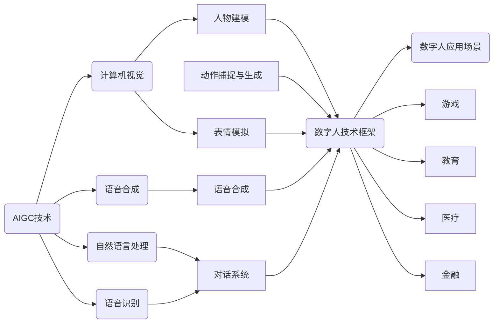

# AIGC从入门到实战：天工人巧日争新：生成你的数字人分身

作者：禅与计算机程序设计艺术

## 1. 背景介绍

### 1.1 数字人：从科幻到现实

数字人，曾经只存在于科幻电影中的概念，如今正随着人工智能（AI）技术的飞速发展逐渐走进现实。从电影《阿凡达》中栩栩如生的纳美人，到游戏《底特律：变人》中拥有自我意识的仿生人，数字人技术不断突破，其应用场景也日益广泛，涵盖娱乐、游戏、教育、医疗、金融等众多领域。

### 1.2 AIGC浪潮：数字人创作的新引擎

近年来，人工智能生成内容（AIGC，AI Generated Content）技术取得了突破性进展，为数字人创作注入了新的活力。AIGC是指利用人工智能技术自动生成各种形式的内容，例如文本、图像、音频、视频等。借助AIGC技术，我们可以更加高效、便捷地生成数字人的外观、声音、动作、表情等，赋予数字人更加逼真的形象和个性化的特征。

### 1.3 本文目标：手把手教你打造专属数字人

本文旨在为广大读者提供一份AIGC数字人创作的入门指南，从基础概念、核心算法、项目实践到应用场景，全面介绍数字人创作的流程和关键技术。无论你是对数字人充满好奇的技术爱好者，还是希望将数字人应用于实际项目的开发者，都能从本文中找到有价值的内容。

## 2. 核心概念与联系

### 2.1 AIGC技术概览

AIGC技术主要涵盖以下几个方面：

* **自然语言处理（NLP）：**  理解和生成人类语言的技术，例如机器翻译、文本摘要、问答系统等。在数字人创作中，NLP技术可以用于生成数字人的对话内容、语音合成等。
* **计算机视觉（CV）：** 使计算机能够“看到”和理解图像和视频的技术，例如图像识别、目标检测、图像生成等。在数字人创作中，CV技术可以用于生成数字人的外观、表情、动作等。
* **语音合成（TTS）：** 将文本转换为语音的技术。在数字人创作中，TTS技术可以用于生成数字人的语音。
* **语音识别（ASR）：** 将语音转换为文本的技术。在数字人创作中，ASR技术可以用于实现数字人与用户的语音交互。

### 2.2 数字人技术框架

数字人技术框架主要包括以下几个模块：

* **人物建模：** 创建数字人三维模型，包括外观、服饰、配饰等。
* **动作捕捉与生成：**  捕捉或生成数字人的动作，例如行走、跑步、跳舞等。
* **表情模拟：** 模拟数字人的面部表情，例如微笑、悲伤、愤怒等。
* **语音合成：** 生成数字人的语音。
* **对话系统：**  构建数字人的对话能力，使其能够与用户进行自然流畅的交流。

### 2.3 核心概念联系

下图展示了AIGC技术、数字人技术框架以及数字人应用场景之间的联系：



## 3. 核心算法原理具体操作步骤

### 3.1  人物建模

#### 3.1.1 基于三维扫描的人物建模

* 使用三维扫描仪扫描真人或物体，获取其三维点云数据。
* 对点云数据进行处理，例如去噪、简化、网格化等。
* 生成三维模型，并进行纹理贴图、材质设置等。

#### 3.1.2 基于照片的人物建模

* 收集人物的多张照片，涵盖不同角度和表情。
* 使用照片建模软件，例如RealityCapture、Agisoft Metashape等，生成三维模型。
* 对三维模型进行细节调整和优化。

### 3.2  动作捕捉与生成

#### 3.2.1 光学动作捕捉

* 在演员身上佩戴反光标记点。
* 使用多个高速摄像机捕捉标记点的运动轨迹。
* 通过软件计算标记点的三维坐标，并将其映射到数字人模型上。

#### 3.2.2  惯性动作捕捉

* 在演员身上佩戴惯性传感器，例如陀螺仪、加速度计等。
* 传感器记录演员的运动数据。
* 通过软件将运动数据转换为数字人的动作。

#### 3.2.3  基于深度学习的动作生成

* 使用大量的动作捕捉数据训练深度学习模型。
* 输入文本或语音等信息，模型可以自动生成相应的动作序列。

### 3.3  表情模拟

#### 3.3.1  基于骨骼动画的表情模拟

* 在数字人模型的面部设置骨骼控制点。
* 通过调整骨骼控制点的位移和旋转，模拟不同的面部表情。

#### 3.3.2  基于 blendshape 的表情模拟

* 创建多个预定义的面部表情模型，称为 blendshape。
* 通过线性插值的方式，将不同的 blendshape 混合在一起，生成更加细腻的表情变化。

#### 3.3.3  基于深度学习的表情模拟

* 使用大量的表情数据训练深度学习模型。
* 输入文本、语音或图像等信息，模型可以自动生成相应的面部表情。

## 4. 数学模型和公式详细讲解举例说明

### 4.1  线性插值

线性插值是一种常用的数学方法，用于根据已知数据点估计未知数据点的值。在数字人创作中，线性插值可以用于 blendshape 表情模拟、动作过渡等方面。

假设有两个已知数据点 $(x_1, y_1)$ 和 $(x_2, y_2)$，要估计 $x$ 对应的 $y$ 值，可以使用以下公式进行线性插值：

$$y = y_1 + \frac{(x - x_1)}{(x_2 - x_1)}(y_2 - y_1)$$

**举例说明：**

假设有两个 blendshape，分别表示“微笑”和“悲伤”，对应的权重分别为 0 和 1。要生成“微笑”和“悲伤”之间的过渡表情，可以使用线性插值方法。例如，当权重为 0.5 时，表示表情介于“微笑”和“悲伤”之间，可以使用以下公式计算该表情对应的 blendshape 权重：

$$weight_{微笑} = 1 - 0.5 = 0.5$$

$$weight_{悲伤} = 0 + 0.5 = 0.5$$

### 4.2  旋转矩阵

旋转矩阵用于描述三维空间中的旋转变换。在数字人创作中，旋转矩阵可以用于动作捕捉、骨骼动画等方面。

三维空间中的旋转矩阵可以用以下公式表示：

$$
R = 
\begin{bmatrix}
cos\theta & -sin\theta & 0 \\
sin\theta & cos\theta & 0 \\
0 & 0 & 1
\end{bmatrix}
$$

其中，$\theta$ 表示绕 z 轴旋转的角度。

**举例说明：**

假设要将数字人的头部绕 y 轴旋转 30 度，可以使用以下旋转矩阵：

$$
R_y(30°) = 
\begin{bmatrix}
cos30° & 0 & sin30° \\
0 & 1 & 0 \\
-sin30° & 0 & cos30°
\end{bmatrix}
=
\begin{bmatrix}
\frac{\sqrt{3}}{2} & 0 & \frac{1}{2} \\
0 & 1 & 0 \\
-\frac{1}{2} & 0 & \frac{\sqrt{3}}{2}
\end{bmatrix}
$$

将该旋转矩阵应用于数字人头部的坐标，即可实现头部绕 y 轴旋转 30 度的效果。

## 5. 项目实践：代码实例和详细解释说明

### 5.1  使用 Python 和 Blender 创建简单的数字人动画

以下代码演示了如何使用 Python 和 Blender 创建一个简单的数字人动画：

```python
import bpy

# 创建一个新的场景
bpy.ops.scene.new(type='NEW')

# 导入数字人模型
bpy.ops.import_scene.fbx(filepath="path/to/your/model.fbx")

# 获取数字人模型的对象
armature = bpy.data.objects["Armature"]

# 设置关键帧，让数字人挥手
armature.pose.bones["RightArm"].rotation_quaternion[2] = 1.5708  # 旋转 90 度
armature.keyframe_insert(data_path="pose.bones[\"RightArm\"].rotation_quaternion", frame=1)
armature.pose.bones["RightArm"].rotation_quaternion[2] = 0  # 旋转回初始位置
armature.keyframe_insert(data_path="pose.bones[\"RightArm\"].rotation_quaternion", frame=24)

# 渲染动画
bpy.ops.render.render(animation=True)
```

**代码解释：**

* 首先，我们使用 `bpy.ops.scene.new()` 创建一个新的 Blender 场景。
* 然后，使用 `bpy.ops.import_scene.fbx()` 导入数字人模型。
* 获取数字人模型的骨骼对象 `armature`，并通过设置 `rotation_quaternion` 属性来旋转数字人的右臂。
* 使用 `keyframe_insert()` 方法设置关键帧，使数字人在不同的帧之间进行动作过渡。
* 最后，使用 `bpy.ops.render.render()` 渲染动画。

### 5.2  使用 TensorFlow 和 Keras 训练简单的表情识别模型

以下代码演示了如何使用 TensorFlow 和 Keras 训练一个简单的人脸表情识别模型：

```python
import tensorflow as tf
from tensorflow.keras.models import Sequential
from tensorflow.keras.layers import Conv2D, MaxPooling2D, Flatten, Dense

# 加载数据集
(x_train, y_train), (x_test, y_test) = tf.keras.datasets.fer2013.load_data()

# 数据预处理
x_train = x_train.astype('float32') / 255
x_test = x_test.astype('float32') / 255

# 创建模型
model = Sequential()
model.add(Conv2D(32, (3, 3), activation='relu', input_shape=(48, 48, 1)))
model.add(MaxPooling2D((2, 2)))
model.add(Conv2D(64, (3, 3), activation='relu'))
model.add(MaxPooling2D((2, 2)))
model.add(Flatten())
model.add(Dense(10, activation='softmax'))

# 编译模型
model.compile(optimizer='adam',
              loss='sparse_categorical_crossentropy',
              metrics=['accuracy'])

# 训练模型
model.fit(x_train, y_train, epochs=10)

# 评估模型
loss, accuracy = model.evaluate(x_test, y_test, verbose=0)
print('Test loss:', loss)
print('Test accuracy:', accuracy)
```

**代码解释：**

* 首先，我们加载 FER2013 数据集，该数据集包含了 7 种不同表情的人脸图像。
* 对数据进行预处理，将像素值缩放到 0 到 1 之间。
* 创建一个简单的卷积神经网络模型，该模型包含两个卷积层、两个最大池化层、一个扁平化层和一个全连接层。
* 使用 `compile()` 方法编译模型，指定优化器、损失函数和评估指标。
* 使用 `fit()` 方法训练模型，指定训练数据、训练轮数等参数。
* 使用 `evaluate()` 方法评估模型在测试集上的性能。

## 6. 实际应用场景

### 6.1 虚拟主播

数字人可以作为虚拟主播，用于新闻播报、节目主持、直播带货等场景。虚拟主播可以 24 小时不间断工作，并且不受时间、地点和人员的限制，可以有效降低成本、提高效率。

### 6.2  游戏角色

数字人可以作为游戏角色，为玩家提供更加逼真、沉浸式的游戏体验。数字人可以拥有更加丰富的表情、动作和语言，并且可以与玩家进行更加自然、智能的交互。

### 6.3  在线教育

数字人可以作为在线教育的老师或助教，为学生提供个性化的教学服务。数字人可以根据学生的学习进度和水平，调整教学内容和节奏，并且可以 24 小时在线答疑解惑。

### 6.4  客服机器人

数字人可以作为客服机器人，为用户提供更加智能、高效的客服服务。数字人可以理解用户的自然语言，并根据用户的需求提供相应的解决方案。

## 7. 工具和资源推荐

### 7.1  人物建模软件

* **Blender:** 免费、开源、跨平台的三维建模软件，功能强大，易于上手。
* **Maya:**  Autodesk 公司开发的三维动画软件，功能强大，广泛应用于电影、游戏等领域。
* **ZBrush:**  数字雕刻软件，擅长创建高精度模型，常用于游戏角色、电影特效等领域。

### 7.2  动作捕捉软件

* **OptiTrack:**  光学动作捕捉系统，精度高、价格昂贵。
* **Xsens:** 惯性动作捕捉系统，价格相对便宜、精度略低。
* **Rokoko:**  无线动作捕捉系统，使用方便、价格适中。

### 7.3  深度学习框架

* **TensorFlow:**  Google 开发的深度学习框架，应用广泛、生态成熟。
* **PyTorch:**  Facebook 开发的深度学习框架，灵活易用、研究领域应用广泛。
* **Keras:**  基于 TensorFlow 和 Theano 的高级神经网络 API，易于使用、快速 prototyping。

## 8. 总结：未来发展趋势与挑战

### 8.1 未来发展趋势

* **更加逼真、自然的数字人：** 随着 AIGC 技术的不断发展，数字人的外观、动作、表情、语音等方面将更加逼真、自然，更接近真人。
* **更加个性化、智能化的数字人：**  数字人将拥有更加个性化的特征和更加智能化的行为，能够根据用户的需求和场景进行自适应调整。
* **更加广泛的应用场景：** 数字人将应用于更加广泛的领域，例如元宇宙、虚拟现实、增强现实等。

### 8.2 面临的挑战

* **技术瓶颈：**  数字人创作涉及的技术复杂，例如高精度的人物建模、自然流畅的动作生成、逼真的表情模拟等，仍然存在技术瓶颈。
* **伦理问题：**  随着数字人技术的不断发展，将会出现一些伦理问题，例如数字人的肖像权、隐私权等。
* **数据安全问题：**  数字人创作需要大量的训练数据，如何保证数据的安全性和隐私性也是一个挑战。

## 9. 附录：常见问题与解答

### 9.1  如何学习 AIGC 数字人创作？

学习 AIGC 数字人创作需要掌握以下技能：

* **编程基础：** Python 是 AIGC 领域最常用的编程语言，需要掌握 Python 的基本语法和常用库。
* **数学基础：**  AIGC 涉及大量的数学知识，例如线性代数、概率论、微积分等。
* **深度学习基础：**  深度学习是 AIGC 的核心技术，需要了解深度学习的基本原理和常用模型。

### 9.2  有哪些 AIGC 数字人创作的开源项目？

* **MetaHuman Creator:**  Epic Games 推出的免费数字人创建工具，可以创建高品质的数字人模型。
* **NVIDIA Omniverse Avatar Cloud Engine (ACE):**  NVIDIA 推出的云端数字人平台，可以创建和部署交互式数字人。
* **Microsoft Azure Digital Humans:** Microsoft 推出的云端数字人平台，可以创建和部署具有认知能力的数字人。

### 9.3  数字人创作的成本高吗？

数字人创作的成本取决于多个因素，例如数字人的复杂程度、所需的精度、开发周期等。一般来说，数字人创作的成本较高，需要专业的团队和设备。