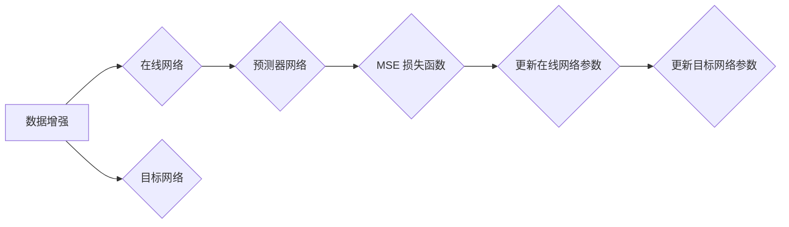
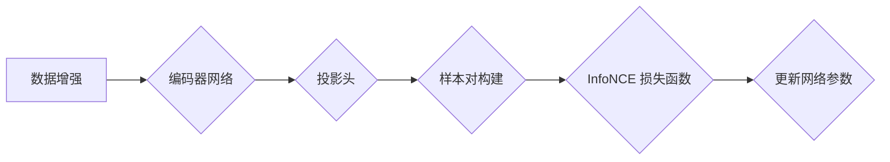

# BYOL与对比散布:融合优势

作者：禅与计算机程序设计艺术

## 1. 背景介绍

### 1.1 自监督学习的兴起

近年来，深度学习在计算机视觉、自然语言处理等领域取得了巨大成功。然而，深度学习模型的训练往往需要大量的标注数据，这限制了其在许多实际场景中的应用。为了解决这个问题，自监督学习应运而生，其目标是在没有人工标注的情况下学习数据的有效表示。

### 1.2 对比学习的成功

对比学习是自监督学习的一种有效方法，其核心思想是通过拉近正样本对之间的距离，推远负样本对之间的距离来学习数据的特征表示。近年来，基于对比学习的方法在图像、文本、语音等领域都取得了显著的成果，例如SimCLR、MoCo、SimCSE等。

### 1.3 BYOL和对比散布的提出

BYOL（Bootstrap Your Own Latent）和对比散布（Contrastive Multiview Coding，CMC）是两种最新的自监督学习方法，它们都取得了与对比学习相当甚至更好的性能。BYOL提出了一种无需负样本的对比学习方法，而对比散布则利用多视角数据增强来提高模型的泛化能力。

## 2. 核心概念与联系

### 2.1 对比学习

#### 2.1.1 基本思想

对比学习的基本思想是通过构造正负样本对，并最小化正样本对之间的距离，最大化负样本对之间的距离来学习数据的特征表示。

#### 2.1.2 关键组件

* **数据增强:** 对比学习通常使用数据增强来生成正样本对，例如对同一张图片进行随机裁剪、颜色变换等操作。
* **编码器:** 用于将输入数据映射到特征空间。
* **损失函数:** 用于衡量正负样本对之间距离的差异，常用的损失函数包括InfoNCE、NT-Xent等。

### 2.2 BYOL

#### 2.2.1 无负样本对比学习

BYOL的核心思想是利用模型自身的输出来构建正样本对，从而避免了对负样本的需求。具体来说，BYOL使用两个网络分支：在线网络和目标网络。在线网络的参数不断更新，而目标网络的参数则通过在线网络参数的移动平均来更新。

#### 2.2.2 预测目标网络输出

在线网络的输出经过一个预测器网络后，用于预测目标网络的输出。通过最小化在线网络预测输出与目标网络实际输出之间的差异，BYOL可以学习到数据的有效表示。

### 2.3 对比散布

#### 2.3.1 多视角数据增强

对比散布利用多视角数据增强来提高模型的泛化能力。具体来说，对比散布对同一数据样本进行多种不同的数据增强操作，例如随机裁剪、颜色变换、高斯模糊等，生成多个视角的数据样本。

#### 2.3.2 跨视角对比学习

对比散布将不同视角的数据样本输入到同一个编码器中，并使用对比学习的思想来学习数据的特征表示。具体来说，对比散布将同一数据样本的不同视角视为正样本对，将不同数据样本的不同视角视为负样本对。

### 2.4 BYOL与对比散布的联系

BYOL和对比散布都是自监督学习方法，它们都利用对比学习的思想来学习数据的特征表示。BYOL的创新之处在于无需负样本，而对比散布的创新之处在于利用多视角数据增强。

## 3. 核心算法原理具体操作步骤

### 3.1 BYOL

#### 3.1.1 网络结构

BYOL使用两个网络分支：在线网络和目标网络。在线网络和目标网络的结构相同，都包含一个编码器和一个投影头。

#### 3.1.2 训练流程

1. 从数据集中随机选择一个样本，并对其进行两次不同的数据增强操作，得到两个视角的数据样本。
2. 将两个视角的数据样本分别输入到在线网络和目标网络中，得到两个特征向量。
3. 将在线网络的特征向量输入到预测器网络中，得到预测向量。
4. 计算预测向量与目标网络特征向量之间的 cosine 相似度，并使用 MSE 损失函数计算损失值。
5. 更新在线网络的参数，并使用移动平均的方式更新目标网络的参数。

#### 3.1.3 算法流程图



### 3.2 对比散布

#### 3.2.1 网络结构

对比散布使用一个编码器网络和一个投影头。

#### 3.2.2 训练流程

1. 从数据集中随机选择一个样本，并对其进行 N 种不同的数据增强操作，得到 N 个视角的数据样本。
2. 将 N 个视角的数据样本输入到编码器网络中，得到 N 个特征向量。
3. 对 N 个特征向量进行两两组合，得到 N*(N-1)/2 个样本对。
4. 根据样本对是否来自同一数据样本，将样本对分为正样本对和负样本对。
5. 计算正样本对之间的 cosine 相似度和负样本对之间的 cosine 相似度，并使用 InfoNCE 损失函数计算损失值。
6. 更新编码器网络和投影头的参数。

#### 3.2.3 算法流程图



## 4. 数学模型和公式详细讲解举例说明

### 4.1 BYOL

#### 4.1.1 损失函数

BYOL 使用 MSE 损失函数来最小化在线网络预测输出与目标网络实际输出之间的差异：

$$
\mathcal{L}_{\text{BYOL}} = \frac{1}{2} \mathbb{E}_{x} \left[ \| f_{\theta}(x) - g_{\xi}(\tilde{x}) \|^2 \right]
$$

其中，$f_{\theta}(x)$ 表示在线网络的输出，$g_{\xi}(\tilde{x})$ 表示目标网络的输出，$\theta$ 和 $\xi$ 分别表示在线网络和目标网络的参数。

#### 4.1.2 参数更新

在线网络的参数使用梯度下降法进行更新：

$$
\theta \leftarrow \theta - \alpha \nabla_{\theta} \mathcal{L}_{\text{BYOL}}
$$

目标网络的参数使用移动平均的方式进行更新：

$$
\xi \leftarrow m \xi + (1-m) \theta
$$

其中，$\alpha$ 表示学习率，$m$ 表示动量系数。

### 4.2 对比散布

#### 4.2.1 损失函数

对比散布使用 InfoNCE 损失函数来最大化正样本对之间的相似度，最小化负样本对之间的相似度：

$$
\mathcal{L}_{\text{CMC}} = -\frac{1}{N} \sum_{i=1}^N \log \frac{\exp(s(z_i, z_i^+)/\tau)}{\sum_{j=1}^N \exp(s(z_i, z_j)/\tau)}
$$

其中，$z_i$ 和 $z_i^+$ 表示同一数据样本的不同视角的特征向量，$z_j$ 表示不同数据样本的不同视角的特征向量，$s(\cdot, \cdot)$ 表示 cosine 相似度函数，$\tau$ 表示温度参数。

#### 4.2.2 参数更新

编码器网络和投影头的参数使用梯度下降法进行更新：

$$
\theta \leftarrow \theta - \alpha \nabla_{\theta} \mathcal{L}_{\text{CMC}}
$$

## 5. 项目实践：代码实例和详细解释说明

### 5.1 BYOL

```python
import torch
import torch.nn as nn

class BYOL(nn.Module):
    def __init__(self, encoder, projector, predictor, momentum=0.999):
        super(BYOL, self).__init__()
        self.encoder = encoder
        self.projector = projector
        self.predictor = predictor
        self.momentum = momentum

        # 初始化目标网络参数
        for param_q, param_k in zip(self.encoder.parameters(), self.target_encoder.parameters()):
            param_k.data.copy_(param_q.data)
            param_k.requires_grad = False

    @torch.no_grad()
    def _update_target_encoder(self):
        """
        使用移动平均的方式更新目标网络参数
        """
        for param_q, param_k in zip(self.encoder.parameters(), self.target_encoder.parameters()):
            param_k.data = param_k.data * self.momentum + param_q.data * (1. - self.momentum)

    def forward(self, x1, x2):
        """
        计算 BYOL 损失函数值
        """
        # 计算在线网络输出
        z1 = self.projector(self.encoder(x1))
        z2 = self.projector(self.encoder(x2))

        # 计算目标网络输出
        with torch.no_grad():
            target_z1 = self.target_encoder(x1)
            target_z2 = self.target_encoder(x2)

        # 计算预测向量
        p1 = self.predictor(z1)
        p2 = self.predictor(z2)

        # 计算损失值
        loss = nn.MSELoss()(p1, target_z2.detach()) + nn.MSELoss()(p2, target_z1.detach())

        # 更新目标网络参数
        self._update_target_encoder()

        return loss
```

### 5.2 对比散布

```python
import torch
import torch.nn as nn

class CMC(nn.Module):
    def __init__(self, encoder, projector, temperature=0.07):
        super(CMC, self).__init__()
        self.encoder = encoder
        self.projector = projector
        self.temperature = temperature

    def forward(self, x):
        """
        计算对比散布损失函数值
        """
        # 计算特征向量
        z = self.projector(self.encoder(x))

        # 计算相似度矩阵
        sim_matrix = torch.matmul(z, z.t()) / self.temperature

        # 构建掩码矩阵
        mask = torch.eye(z.size(0), dtype=torch.bool)

        # 计算损失值
        loss = nn.CrossEntropyLoss()(sim_matrix, mask)

        return loss
```

## 6. 实际应用场景

### 6.1 图像分类

BYOL 和对比散布可以用于图像分类任务的自监督预训练。通过自监督预训练，模型可以学习到图像的有效表示，从而提高在下游图像分类任务上的性能。

### 6.2 目标检测

BYOL 和对比散布也可以用于目标检测任务的自监督预训练。通过自监督预训练，模型可以学习到图像的有效表示，从而提高在下游目标检测任务上的性能。

### 6.3 语义分割

BYOL 和对比散布还可以用于语义分割任务的自监督预训练。通过自监督预训练，模型可以学习到图像的有效表示，从而提高在下游语义分割任务上的性能。

## 7. 工具和资源推荐

### 7.1 PyTorch Lightning

PyTorch Lightning 是一个轻量级的 PyTorch 训练框架，可以简化模型训练和代码结构。BYOL 和对比散布的代码实现可以使用 PyTorch Lightning 进行简化。

### 7.2 lightly

lightly 是一个用于自监督学习的 Python 库，提供了一些常用的自监督学习方法的实现，包括 BYOL 和对比散布。

### 7.3 Papers With Code

Papers With Code 是一个收集了机器学习论文和代码的网站，可以方便地查找 BYOL 和对比散布的相关论文和代码实现。

## 8. 总结：未来发展趋势与挑战

### 8.1 未来发展趋势

* **更强大的自监督学习方法:** 随着研究的深入，将会出现更强大的自监督学习方法，进一步提高模型的性能和泛化能力。
* **与其他技术的结合:** 自监督学习可以与其他技术相结合，例如半监督学习、强化学习等，以解决更复杂的任务。
* **在更多领域的应用:** 自监督学习将会应用于更多领域，例如自然语言处理、语音识别等。

### 8.2 挑战

* **理论基础:** 自监督学习的理论基础还不够完善，需要进一步研究。
* **评估指标:** 目前还没有统一的评估指标来衡量自监督学习方法的性能，需要开发更有效的评估指标。
* **计算资源:** 自监督学习方法通常需要大量的计算资源进行训练，这限制了其在一些资源受限场景中的应用。

## 9. 附录：常见问题与解答

### 9.1 BYOL 为什么不需要负样本？

BYOL 通过利用模型自身的输出来构建正样本对，从而避免了对负样本的需求。具体来说，BYOL 使用两个网络分支：在线网络和目标网络。在线网络的参数不断更新，而目标网络的参数则通过在线网络参数的移动平均来更新。在线网络的输出经过一个预测器网络后，用于预测目标网络的输出。通过最小化在线网络预测输出与目标网络实际输出之间的差异，BYOL 可以学习到数据的有效表示。

### 9.2 对比散布如何提高模型的泛化能力？

对比散布利用多视角数据增强来提高模型的泛化能力。具体来说，对比散布对同一数据样本进行多种不同的数据增强操作，例如随机裁剪、颜色变换、高斯模糊等，生成多个视角的数据样本。对比散布将不同视角的数据样本输入到同一个编码器中，并使用对比学习的思想来学习数据的特征表示。具体来说，对比散布将同一数据样本的不同视角视为正样本对，将不同数据样本的不同视角视为负样本对。通过这种方式，对比散布可以学习到更鲁棒、更泛化的特征表示。