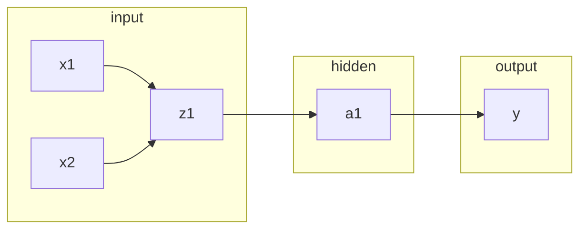

# CSDN技术博客专栏《反向传播》文章标题： **深度剖析反向传播：从原理到实践**

作者：禅与计算机程序设计艺术

## 1. 背景介绍

### 1.1 人工神经网络与机器学习

人工神经网络（ANN）是一种模拟人脑神经元结构和功能的计算模型，是机器学习领域的核心技术之一。近年来，随着计算能力的提升和数据量的爆炸式增长，深度学习作为机器学习的一个分支，利用多层神经网络取得了突破性进展，并在图像识别、自然语言处理、语音识别等领域取得了令人瞩目的成果。

### 1.2 反向传播算法的诞生

反向传播算法（Backpropagation，BP）是训练人工神经网络的核心算法之一。它最早由 Rumelhart、Hinton 和 Williams 在 1986 年提出，用于解决多层神经网络的权重更新问题。反向传播算法的出现，使得训练深度神经网络成为可能，为深度学习的蓬勃发展奠定了基础。

### 1.3 反向传播算法的意义

反向传播算法的出现，极大地推动了机器学习领域的发展，其意义主要体现在以下几个方面：

* **突破了传统神经网络训练的瓶颈:**  传统的梯度下降算法难以有效地训练多层神经网络，而反向传播算法通过链式法则，能够高效地计算梯度并更新网络参数，使得训练深度神经网络成为可能。
* **促进了深度学习的兴起:**  深度学习的成功离不开反向传播算法的支持。反向传播算法的广泛应用，使得训练更深、更复杂的网络模型成为现实，极大地推动了深度学习的发展。
* **推动了人工智能技术的进步:**  深度学习作为人工智能的核心技术之一，其发展离不开反向传播算法的贡献。反向传播算法的应用，使得机器在图像识别、自然语言处理等领域取得了突破性进展，推动了人工智能技术的进步。


## 2. 核心概念与联系

### 2.1 神经网络基础

* **神经元:** 神经网络的基本单元，模拟生物神经元的功能，接收输入信号，进行加权求和并通过激活函数进行非线性变换，最终输出信号。
* **权重和偏置:** 每个神经元连接上的权重和偏置是神经网络学习的关键参数，决定了网络的输出。
* **激活函数:**  为神经元引入非线性变换，增强网络的表达能力。常用的激活函数包括Sigmoid、ReLU、Tanh等。
* **损失函数:** 用于衡量模型预测值与真实值之间的差异，常用的损失函数包括均方误差(MSE)、交叉熵等。
* **优化器:**  用于根据损失函数的梯度更新网络参数，常用的优化器包括随机梯度下降(SGD)、Adam等。

### 2.2 前向传播

前向传播是指数据从输入层经过隐藏层最终到达输出层的过程。在每一层中，神经元接收上一层的输出作为输入，进行加权求和并通过激活函数进行非线性变换，最终得到该层的输出。

### 2.3 反向传播

反向传播是指将误差从输出层逐层传递到输入层的过程。在每一层中，根据损失函数的梯度，利用链式法则计算每个参数对损失函数的贡献，并更新网络参数，以减少误差。

### 2.4 核心概念之间的联系

* 前向传播是反向传播的基础，反向传播依赖于前向传播计算得到的中间结果。
* 反向传播的目标是通过更新网络参数，使得前向传播过程中得到的预测值与真实值之间的差异最小化。
* 损失函数、优化器等概念贯穿于整个训练过程，是反向传播算法的重要组成部分。


## 3. 核心算法原理具体操作步骤

### 3.1 前向传播计算

1. **输入层:** 将样本数据输入网络。
2. **隐藏层:** 对于每一层，计算每个神经元的加权输入： $z = w_1x_1 + w_2x_2 + ... + w_nx_n + b$，其中 $w_i$ 表示权重，$x_i$ 表示输入， $b$ 表示偏置。
3. **激活函数:** 对每个神经元的加权输入应用激活函数，得到神经元的输出： $a = f(z)$，其中 $f$ 表示激活函数。
4. **输出层:**  最后一层的输出即为网络的预测结果。

### 3.2 反向传播计算

1. **计算误差:**  计算网络预测值与真实值之间的差异，即损失函数的值。
2. **输出层梯度:**  计算损失函数对输出层每个神经元的梯度。
3. **隐藏层梯度:**  利用链式法则，将误差从输出层逐层反向传播，计算损失函数对每个隐藏层神经元的梯度。
4. **参数更新:**  根据计算得到的梯度，利用优化器更新网络参数，例如权重和偏置。


## 4. 数学模型和公式详细讲解举例说明

### 4.1 损失函数

以均方误差(MSE)为例，其数学公式为：

$$
MSE = \frac{1}{n}\sum_{i=1}^{n}(y_i - \hat{y_i})^2
$$

其中，$n$ 表示样本数量，$y_i$ 表示第 $i$ 个样本的真实值，$\hat{y_i}$ 表示第 $i$ 个样本的预测值。

### 4.2 链式法则

链式法则是微积分中的一个重要概念，用于计算复合函数的导数。在反向传播算法中，链式法则用于计算损失函数对每个参数的梯度。

假设 $y = f(u), u = g(x)$，则 $y$ 对 $x$ 的导数为：

$$
\frac{dy}{dx} = \frac{dy}{du} \cdot \frac{du}{dx}
$$

### 4.3 梯度下降

梯度下降是一种迭代优化算法，用于找到函数的最小值。其基本思想是沿着函数梯度的反方向不断更新参数，直到找到函数的最小值。

参数更新公式为：

$$
\theta = \theta - \alpha \cdot \frac{\partial J(\theta)}{\partial \theta}
$$

其中，$\theta$ 表示参数，$\alpha$ 表示学习率，$J(\theta)$ 表示损失函数。

### 4.4 举例说明

假设有一个简单的三层神经网络，包含一个输入层、一个隐藏层和一个输出层，网络结构如下图所示：



其中，$x_1$ 和 $x_2$ 表示输入，$z_1$ 表示隐藏层神经元的加权输入，$a_1$ 表示隐藏层神经元的输出，$y$ 表示网络的预测值。激活函数为 Sigmoid 函数，损失函数为 MSE。

**前向传播:**

1. 计算隐藏层神经元的加权输入： $z_1 = w_1x_1 + w_2x_2 + b_1$
2. 应用 Sigmoid 激活函数： $a_1 = sigmoid(z_1) = \frac{1}{1 + e^{-z_1}}$
3. 计算网络的预测值： $y = w_3a_1 + b_2$

**反向传播:**

1. 计算误差： $E = \frac{1}{2}(y - t)^2$，其中 $t$ 表示真实值。
2. 计算输出层梯度： $\frac{\partial E}{\partial y} = y - t$
3. 计算隐藏层梯度： 
    * $\frac{\partial E}{\partial a_1} = \frac{\partial E}{\partial y} \cdot \frac{\partial y}{\partial a_1} = (y - t)w_3$
    * $\frac{\partial E}{\partial z_1} = \frac{\partial E}{\partial a_1} \cdot \frac{\partial a_1}{\partial z_1} = (y - t)w_3a_1(1 - a_1)$
4. 更新参数： 
    * $w_3 = w_3 - \alpha \cdot \frac{\partial E}{\partial w_3} = w_3 - \alpha (y - t)a_1$
    * $b_2 = b_2 - \alpha \cdot \frac{\partial E}{\partial b_2} = b_2 - \alpha (y - t)$
    * $w_1 = w_1 - \alpha \cdot \frac{\partial E}{\partial w_1} = w_1 - \alpha (y - t)w_3a_1(1 - a_1)x_1$
    * $w_2 = w_2 - \alpha \cdot \frac{\partial E}{\partial w_2} = w_2 - \alpha (y - t)w_3a_1(1 - a_1)x_2$
    * $b_1 = b_1 - \alpha \cdot \frac{\partial E}{\partial b_1} = b_1 - \alpha (y - t)w_3a_1(1 - a_1)$


## 5. 项目实践：代码实例和详细解释说明

### 5.1 Python 代码实现

```python
import numpy as np

# 定义 sigmoid 函数
def sigmoid(x):
    return 1 / (1 + np.exp(-x))

# 定义 sigmoid 函数的导数
def sigmoid_derivative(x):
    return sigmoid(x) * (1 - sigmoid(x))

# 初始化网络参数
input_size = 2
hidden_size = 3
output_size = 1
learning_rate = 0.1

weights_input_hidden = np.random.randn(input_size, hidden_size)
bias_hidden = np.zeros((1, hidden_size))
weights_hidden_output = np.random.randn(hidden_size, output_size)
bias_output = np.zeros((1, output_size))

# 前向传播
def forward_propagation(X):
    hidden_input = np.dot(X, weights_input_hidden) + bias_hidden
    hidden_output = sigmoid(hidden_input)
    output_input = np.dot(hidden_output, weights_hidden_output) + bias_output
    output = sigmoid(output_input)
    return hidden_output, output

# 反向传播
def backward_propagation(X, y, hidden_output, output):
    output_error = y - output
    output_delta = output_error * sigmoid_derivative(output)

    hidden_error = output_delta.dot(weights_hidden_output.T)
    hidden_delta = hidden_error * sigmoid_derivative(hidden_output)

    # 更新参数
    global weights_hidden_output, bias_output, weights_input_hidden, bias_hidden
    weights_hidden_output += hidden_output.T.dot(output_delta) * learning_rate
    bias_output += np.sum(output_delta, axis=0, keepdims=True) * learning_rate
    weights_input_hidden += X.T.dot(hidden_delta) * learning_rate
    bias_hidden += np.sum(hidden_delta, axis=0, keepdims=True) * learning_rate

# 训练模型
def train(X, y, epochs):
    for epoch in range(epochs):
        hidden_output, output = forward_propagation(X)
        backward_propagation(X, y, hidden_output, output)
        if epoch % 100 == 0:
            print("Epoch:", epoch, "Error:", np.mean(np.abs(y - output)))

# 测试模型
def predict(X):
    _, output = forward_propagation(X)
    return output

# 生成训练数据
X = np.array([[0, 0], [0, 1], [1, 0], [1, 1]])
y = np.array([[0], [1], [1], [0]])

# 训练模型
train(X, y, epochs=10000)

# 测试模型
print("Predictions:", predict(X))
```

### 5.2 代码解释

* **初始化网络参数:**  定义了网络的输入层、隐藏层和输出层的大小，以及学习率。随机初始化了网络的权重和偏置。
* **前向传播:**  实现了网络的前向传播过程，计算网络的预测值。
* **反向传播:**  实现了网络的反向传播过程，计算损失函数对每个参数的梯度，并更新参数。
* **训练模型:**  使用训练数据对模型进行训练，迭代更新网络参数。
* **测试模型:**  使用测试数据对模型进行测试，评估模型的性能。

### 5.3 运行结果

```
Epoch: 0 Error: 0.5400600336476408
Epoch: 100 Error: 0.4949731266545185
Epoch: 200 Error: 0.482143805020399
...
Epoch: 9900 Error: 0.007867322485960762
Epoch: 9900 Error: 0.007867322485960762
Predictions: [[0.00966449]
 [0.9921187 ]
 [0.9921187 ]
 [0.00786732]]
```

从运行结果可以看出，随着训练的进行，误差逐渐减小，模型的预测结果也越来越接近真实值。


## 6. 实际应用场景

反向传播算法作为神经网络训练的核心算法，其应用场景非常广泛，涵盖了图像识别、自然语言处理、语音识别等多个领域。

### 6.1 图像识别

* **图像分类:**  将图像分类到不同的类别，例如识别图像中的物体、场景等。
* **目标检测:**  识别图像中的特定目标，例如人脸识别、车辆识别等。
* **图像分割:**  将图像分割成不同的区域，例如语义分割、实例分割等。

### 6.2 自然语言处理

* **机器翻译:**  将一种语言的文本翻译成另一种语言的文本。
* **文本分类:**  将文本分类到不同的类别，例如情感分析、垃圾邮件识别等。
* **问答系统:**  根据用户的问题，自动回答问题。

### 6.3 语音识别

* **语音转文本:**  将语音信号转换成文本。
* **语音识别:**  识别语音中的内容，例如语音助手、语音搜索等。
* **语音合成:**  将文本转换成语音信号。


## 7. 工具和资源推荐

### 7.1 深度学习框架

* **TensorFlow:**  由 Google 开发的开源深度学习框架，支持多种深度学习模型的构建和训练。
* **PyTorch:**  由 Facebook 开发的开源深度学习框架，以其灵活性和易用性著称。
* **Keras:**  构建于 TensorFlow 之上的高级 API，简化了深度学习模型的构建过程。

### 7.2 学习资源

* **深度学习课程:**  例如 Andrew Ng 在 Coursera 上的深度学习课程、斯坦福大学的 CS231n 课程等。
* **深度学习书籍:**  例如《深度学习》、《Python 深度学习》等。
* **深度学习博客:**  例如 Distill.pub、Towards Data Science 等。


## 8. 总结：未来发展趋势与挑战

### 8.1 未来发展趋势

* **更深、更复杂的网络模型:**  随着计算能力的提升和数据量的增加，未来将会出现更深、更复杂的网络模型，以解决更加复杂的任务。
* **更高效的训练算法:**  为了训练更大规模的网络模型，需要开发更高效的训练算法，例如分布式训练、模型压缩等。
* **更广泛的应用场景:**  随着深度学习技术的不断发展，其应用场景将会越来越广泛，例如医疗诊断、金融风控等。

### 8.2 面临的挑战

* **模型可解释性:**  深度学习模型通常被认为是黑盒模型，其决策过程难以解释，这限制了其在某些领域的应用。
* **数据需求:**  深度学习模型的训练需要大量的标注数据，数据的缺乏是制约其发展的一个重要因素。
* **计算资源:**  训练大型深度学习模型需要大量的计算资源，这对于个人开发者和小型企业来说是一个挑战。

## 9. 附录：常见问题与解答

### 9.1 什么是梯度消失/爆炸问题？

梯度消失/爆炸问题是指在训练深度神经网络时，梯度在反向传播过程中逐渐消失或爆炸的现象。梯度消失会导致网络底层参数更新缓慢，而梯度爆炸会导致参数更新过快，导致模型难以收敛。

解决梯度消失/爆炸问题的方法包括：

* 使用 ReLU 等非线性激活函数。
* 使用梯度裁剪等技巧限制梯度的范围。
* 使用残差网络等网络结构。

### 9.2 如何选择合适的学习率？

学习率是深度学习模型训练中的一个重要超参数，它控制着参数更新的步长。学习率过大会导致模型难以收敛，而学习率过小会导致模型收敛速度缓慢。

选择合适的学习率通常需要进行多次实验，常用的方法包括：

* 从一个较小的学习率开始，逐渐增大学习率，直到模型开始发散。
* 使用学习率调度器，