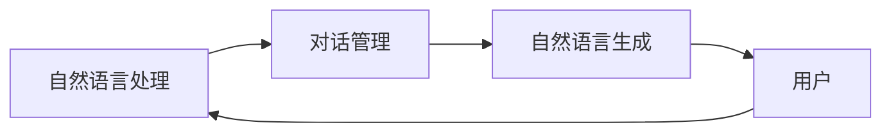

## 1. 背景介绍

### 1.1  聊天机器人的进化历程

聊天机器人（Chatbot）的起源可以追溯到上世纪60年代的 ELIZA 程序，它通过简单的模式匹配来模拟心理治疗师的对话。随着人工智能技术的进步，聊天机器人经历了从基于规则的系统到基于统计模型的系统，再到如今基于深度学习的系统的演变。

- **第一代：基于规则的聊天机器人**  这类聊天机器人依赖于预先定义的规则和脚本，只能处理有限的对话场景。
- **第二代：基于统计模型的聊天机器人**  这类聊天机器人利用机器学习算法，从大量的对话数据中学习语言模式和规则，能够处理更加复杂的对话场景。
- **第三代：基于深度学习的聊天机器人**  这类聊天机器人利用深度神经网络，能够理解更加复杂的语义和上下文信息，提供更加自然流畅的对话体验。

### 1.2  聊天机器人的应用领域

如今，聊天机器人已经渗透到我们生活的方方面面，应用领域涵盖：

- **客户服务**:  自动回复常见问题，提供24小时在线服务，提升客户满意度。
- **电子商务**:  提供商品推荐，引导用户完成购物流程，提升转化率。
- **教育**: 提供个性化学习体验，解答学生疑问，辅助教师教学。
- **娱乐**:  提供游戏互动，陪伴聊天，丰富娱乐体验。
- **医疗**:  提供在线问诊，预约挂号，辅助医生诊断。

### 1.3 本文研究内容概述

本文将深入探讨聊天机器人的核心原理，并结合代码实例，详细讲解如何构建一个简单的聊天机器人。

## 2. 核心概念与联系

### 2.1 自然语言处理 (NLP)

自然语言处理（Natural Language Processing, NLP）是聊天机器人的基础，它致力于让计算机能够理解和处理人类语言。NLP 包括以下几个关键任务：

- **分词**: 将文本分割成单个词语。
- **词性标注**:  识别每个词语的词性，例如名词、动词、形容词等。
- **句法分析**: 分析句子结构，识别主语、谓语、宾语等成分。
- **语义分析**:  理解句子的含义，例如识别实体、关系、情感等。

### 2.2  对话管理 (DM)

对话管理（Dialogue Management, DM）负责控制聊天机器人的对话流程，包括：

- **对话状态跟踪**:  跟踪对话历史，维护当前对话状态。
- **对话策略学习**:  根据当前对话状态，选择合适的对话策略，例如提问、回答、澄清等。
- **对话动作生成**:  根据对话策略，生成相应的对话动作，例如发送文本消息、展示图片、播放音频等。

### 2.3  自然语言生成 (NLG)

自然语言生成（Natural Language Generation, NLG）负责将聊天机器人的内部表示转换成自然语言文本，使聊天机器人的回复更加流畅自然。

### 2.4  核心概念联系图解



## 3. 核心算法原理具体操作步骤

### 3.1  基于检索的聊天机器人

基于检索的聊天机器人通过在预先定义的知识库中搜索与用户输入最匹配的答案来进行回复。

#### 3.1.1  知识库构建

知识库可以是结构化的数据库，也可以是非结构化的文本文件。

#### 3.1.2  文本相似度计算

可以使用余弦相似度、Jaccard 相似度等算法计算用户输入与知识库中每个答案的相似度。

#### 3.1.3  答案排序与选择

选择相似度最高的答案作为回复。

### 3.2  基于生成的聊天机器人

基于生成的聊天机器人使用深度学习模型，根据用户输入自动生成回复。

#### 3.2.1  Seq2Seq 模型

Seq2Seq 模型是一种常用的文本生成模型，它由编码器和解码器两部分组成。编码器将输入序列编码成一个固定长度的向量，解码器根据该向量生成输出序列。

#### 3.2.2  注意力机制

注意力机制可以让解码器在生成每个词语时，更加关注输入序列中相关的词语，从而提高生成文本的质量。

#### 3.2.3  Beam Search 算法

Beam Search 算法是一种贪心搜索算法，它可以在生成文本时，保留多个候选结果，从而避免陷入局部最优解。

## 4. 数学模型和公式详细讲解举例说明

### 4.1  余弦相似度

余弦相似度是一种常用的文本相似度计算方法，它计算两个向量夹角的余弦值。

$$
similarity(A, B) = \frac{A \cdot B}{||A|| \cdot ||B||} 
$$

其中，$A$ 和 $B$ 分别表示两个文本向量，$||A||$ 和 $||B||$ 分别表示向量 $A$ 和 $B$ 的模长。

**举例说明:**

假设有两个文本：

- 文本 A: "我喜欢看电影"
- 文本 B: "我喜欢看电视剧"

首先将文本转换成词向量：

- 文本 A: [1, 1, 1, 0]
- 文本 B: [1, 1, 0, 1]

然后计算两个向量的余弦相似度：

$$
similarity(A, B) = \frac{1 \times 1 + 1 \times 1 + 1 \times 0 + 0 \times 1}{\sqrt{1^2 + 1^2 + 1^2 + 0^2} \times \sqrt{1^2 + 1^2 + 0^2 + 1^2}} = 0.866
$$

### 4.2  交叉熵损失函数

交叉熵损失函数是一种常用的文本生成模型的损失函数，它衡量模型预测的概率分布与真实概率分布之间的差异。

$$
loss = -\frac{1}{N} \sum_{i=1}^{N} \sum_{j=1}^{V} y_{ij} \log(p_{ij})
$$

其中，$N$ 表示样本数量，$V$ 表示词汇表大小，$y_{ij}$ 表示第 $i$ 个样本的第 $j$ 个词语的真实标签，$p_{ij}$ 表示模型预测的第 $i$ 个样本的第 $j$ 个词语的概率。

**举例说明:**

假设有一个样本，真实标签为 "我喜欢看电影"，模型预测的概率分布为：

| 词语 | 概率 |
|---|---|
| 我 | 0.8 |
| 喜欢 | 0.7 |
| 看 | 0.6 |
| 电影 | 0.5 |
| 电视剧 | 0.1 |

则交叉熵损失函数的值为：

$$
loss = -\frac{1}{1} \times [(1 \times \log(0.8) + 1 \times \log(0.7) + 1 \times \log(0.6) + 1 \times \log(0.5) + 0 \times \log(0.1))] = 0.83
$$

## 5. 项目实践：代码实例和详细解释说明

### 5.1  使用 Python 构建一个简单的聊天机器人

```python
import random

# 定义知识库
greetings = ["你好！", "您好！", "很高兴认识你！"]
farewells = ["再见！", "下次再聊！", "祝您生活愉快！"]

# 定义回复函数
def respond(user_input):
    # 将用户输入转换为小写
    user_input = user_input.lower()

    # 检查用户输入是否包含问候语
    for greeting in greetings:
        if greeting in user_input:
            return random.choice(greetings)

    # 检查用户输入是否包含告别语
    for farewell in farewells:
        if farewell in user_input:
            return random.choice(farewells)

    # 如果用户输入不包含问候语或告别语，则返回默认回复
    return "你说什么？"

# 启动聊天机器人
print("你好！我是聊天机器人，请问有什么可以帮您？")

while True:
    # 获取用户输入
    user_input = input("> ")

    # 生成回复
    response = respond(user_input)

    # 打印回复
    print(response)

    # 检查用户是否想要退出
    if user_input in farewells:
        break
```

**代码解释:**

- 首先，我们定义了两个列表 `greetings` 和 `farewells`，分别存储问候语和告别语。
- 然后，我们定义了一个函数 `respond()`，该函数接收用户输入作为参数，并返回聊天机器人的回复。
- 在 `respond()` 函数中，我们首先将用户输入转换为小写，然后检查用户输入是否包含问候语或告别语。如果包含，则随机选择一个相应的回复。
- 如果用户输入不包含问候语或告别语，则返回默认回复 "你说什么？"。
- 最后，我们启动聊天机器人，并进入一个无限循环，不断获取用户输入并生成回复，直到用户输入告别语为止。

### 5.2  使用 Rasa 框架构建一个更加复杂的聊天机器人

Rasa 是一个开源的聊天机器人框架，它提供了更加丰富的功能，例如：

- 意图识别
- 实体提取
- 对话管理
- 多轮对话

**安装 Rasa:**

```
pip install rasa
```

**创建 Rasa 项目:**

```
rasa init
```

**定义意图:**

在 `domain.yml` 文件中定义聊天机器人的意图，例如：

```yaml
intents:
  - greet
  - goodbye
  - order_pizza
```

**定义实体:**

在 `domain.yml` 文件中定义聊天机器人的实体，例如：

```yaml
entities:
  - pizza_type
  - pizza_size
```

**编写故事:**

在 `data/stories.yml` 文件中编写用户故事，例如：

```yaml
- story: order a pizza
  steps:
  - intent: greet
  - action: utter_greet
  - intent: order_pizza
  - action: utter_ask_pizza_type
  - intent: inform
  - entities:
    - pizza_type: pepperoni
  - action: utter_ask_pizza_size
  - intent: inform
  - entities:
    - pizza_size: large
  - action: utter_confirm_order
  - intent: affirm
  - action: utter_goodbye
```

**训练模型:**

```
rasa train
```

**启动聊天机器人:**

```
rasa shell
```

## 6. 实际应用场景

### 6.1  客户服务

- 自动回复常见问题，提供 24 小时在线服务，提升客户满意度。
- 例如，电商平台可以使用聊天机器人自动回复用户的物流查询、退换货等问题。

### 6.2  电子商务

- 提供商品推荐，引导用户完成购物流程，提升转化率。
- 例如，服装电商平台可以使用聊天机器人根据用户的喜好推荐服装，并引导用户完成下单流程。

### 6.3  教育

- 提供个性化学习体验，解答学生疑问，辅助教师教学。
- 例如，在线教育平台可以使用聊天机器人为学生提供个性化的学习建议，并解答学生在学习过程中遇到的问题。

### 6.4  娱乐

- 提供游戏互动，陪伴聊天，丰富娱乐体验。
- 例如，游戏公司可以使用聊天机器人与玩家进行互动，增加游戏的趣味性。

### 6.5  医疗

- 提供在线问诊，预约挂号，辅助医生诊断。
- 例如，医院可以使用聊天机器人为患者提供在线问诊服务，并帮助患者预约挂号。

## 7. 工具和资源推荐

### 7.1  Rasa

Rasa 是一个开源的聊天机器人框架，它提供了丰富的功能，例如意图识别、实体提取、对话管理、多轮对话等。

### 7.2  DialogFlow

DialogFlow 是 Google 推出的一款聊天机器人开发平台，它提供了可视化的界面，方便开发者快速构建聊天机器人。

### 7.3  Botpress

Botpress 是一个开源的聊天机器人平台，它提供了模块化的架构，方便开发者扩展聊天机器人的功能。

## 8. 总结：未来发展趋势与挑战

### 8.1  未来发展趋势

- **更加智能化**: 随着人工智能技术的不断发展，聊天机器人将会变得更加智能化，能够理解更加复杂的语义和上下文信息，提供更加自然流畅的对话体验。
- **更加个性化**: 聊天机器人将会更加注重用户的个性化需求，根据用户的历史行为和偏好，提供更加精准的服务。
- **更加场景化**: 聊天机器人将会更加融入到具体的应用场景中，例如电商、医疗、教育等，为用户提供更加便捷的服务。

### 8.2  挑战

- **自然语言理解**: 自然语言理解仍然是聊天机器人面临的最大挑战，如何让聊天机器人真正理解人类语言，并做出正确的回应，是未来研究的重点。
- **数据安全与隐私**: 聊天机器人需要收集用户的个人信息，如何保护用户的数
据安全和隐私，是一个非常重要的问题。
- **伦理问题**: 随着聊天机器人越来越智能化，如何防止聊天机器人被滥用，例如传播虚假信息、进行网络攻击等，是一个需要认真思考的问题。

## 9. 附录：常见问题与解答

### 9.1  什么是聊天机器人？

聊天机器人是一种能够模拟人类对话的计算机程序。

### 9.2  聊天机器人的类型有哪些？

聊天机器人可以分为基于检索的聊天机器人和基于生成的聊天机器人。

### 9.3  如何构建一个聊天机器人？

可以使用 Rasa、DialogFlow、Botpress 等框架快速构建一个聊天机器人。

### 9.4  聊天机器人的应用场景有哪些？

聊天机器人的应用场景非常广泛，例如客户服务、电子商务、教育、娱乐、医疗等。

### 9.5  聊天机器人的未来发展趋势是什么？

聊天机器人的未来发展趋势是更加智能化、更加个性化、更加场景化。