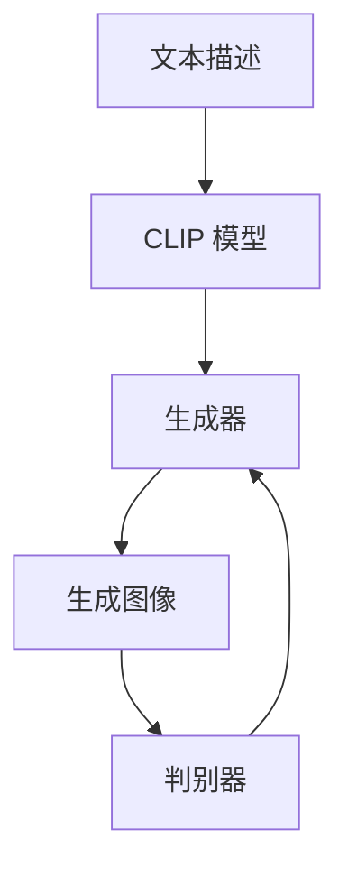

# DALL-E 2原理与代码实例讲解

作者：禅与计算机程序设计艺术

## 1.背景介绍

### 1.1 人工智能与图像生成

人工智能（AI）近年来在多个领域取得了显著进展，特别是在图像生成方面。图像生成技术的进步不仅改变了艺术创作的方式，还在广告、设计、娱乐等多个行业带来了新的可能性。DALL-E 2 作为 OpenAI 推出的新一代图像生成模型，展示了 AI 在图像生成领域的巨大潜力。

### 1.2 DALL-E 2 的诞生

DALL-E 2 是 OpenAI 在 2021 年发布的图像生成模型 DALL-E 的升级版。DALL-E 2 通过结合自然语言处理（NLP）和生成对抗网络（GAN）技术，实现了从文本描述生成高质量图像的能力。相比于第一代，DALL-E 2 在图像质量、生成速度和多样性方面都有了显著提升。

### 1.3 文章目标

本文旨在详细介绍 DALL-E 2 的核心原理、算法、数学模型，并通过代码实例展示其实际应用。我们将深入探讨 DALL-E 2 的技术细节，帮助读者理解其工作机制，并提供实用的代码示例以便在实际项目中应用。

## 2.核心概念与联系

### 2.1 自然语言处理（NLP）

自然语言处理是人工智能的一个重要分支，旨在使计算机能够理解、解释和生成人类语言。DALL-E 2 利用 NLP 技术将文本描述转化为图像生成的输入条件。

### 2.2 生成对抗网络（GAN）

生成对抗网络是一种深度学习模型，由生成器和判别器两个部分组成。生成器负责生成图像，而判别器则用于评估生成图像的质量。DALL-E 2 利用 GAN 技术来生成高质量的图像。

### 2.3 CLIP 模型

CLIP（Contrastive Language-Image Pre-Training）是 OpenAI 提出的一个模型，能够将图像和文本映射到同一个向量空间。DALL-E 2 利用 CLIP 模型来理解文本描述和图像之间的关系，从而生成符合文本描述的图像。

### 2.4 DALL-E 2 的整体架构

DALL-E 2 的整体架构可以用以下 Mermaid 流程图表示：



## 3.核心算法原理具体操作步骤

### 3.1 文本描述的处理

DALL-E 2 首先通过 CLIP 模型对输入的文本描述进行编码，生成一个文本向量。这个文本向量将作为生成器的输入条件。

### 3.2 图像生成器

生成器是 DALL-E 2 的核心部分，其任务是根据输入的文本向量生成相应的图像。生成器通过多层神经网络对文本向量进行处理，逐步生成高分辨率的图像。

### 3.3 判别器的作用

判别器用于评估生成图像的质量，并将评估结果反馈给生成器。通过这种对抗训练，生成器不断改进其生成图像的能力，使生成的图像更加逼真。

### 3.4 训练过程

DALL-E 2 的训练过程包括以下步骤：

1. **文本编码**：将文本描述通过 CLIP 模型编码为文本向量。
2. **图像生成**：生成器根据文本向量生成图像。
3. **质量评估**：判别器评估生成图像的质量。
4. **反馈调整**：根据判别器的反馈，调整生成器的参数。
5. **重复训练**：重复上述步骤，直到生成器能够生成高质量的图像。

## 4.数学模型和公式详细讲解举例说明

### 4.1 CLIP 模型的数学基础

CLIP 模型的核心思想是将图像和文本映射到同一个向量空间。具体来说，CLIP 模型通过以下公式进行训练：

$$
L = -\frac{1}{N} \sum_{i=1}^N \log \frac{\exp(\text{sim}(\mathbf{t}_i, \mathbf{i}_i) / \tau)}{\sum_{j=1}^N \exp(\text{sim}(\mathbf{t}_i, \mathbf{i}_j) / \tau)}
$$

其中，$\mathbf{t}_i$ 和 $\mathbf{i}_i$ 分别表示第 $i$ 个文本和图像的向量表示，$\text{sim}$ 表示相似度函数，$\tau$ 是温度参数。

### 4.2 生成对抗网络的数学基础

生成对抗网络的目标是通过对抗训练，使生成器生成的图像尽可能逼真。其损失函数可以表示为：

$$
\min_G \max_D V(D, G) = \mathbb{E}_{\mathbf{x} \sim p_{\text{data}}(\mathbf{x})} [\log D(\mathbf{x})] + \mathbb{E}_{\mathbf{z} \sim p_{\mathbf{z}}(\mathbf{z})} [\log (1 - D(G(\mathbf{z})))]
$$

其中，$G$ 表示生成器，$D$ 表示判别器，$\mathbf{x}$ 表示真实图像，$\mathbf{z}$ 表示随机噪声。

### 4.3 DALL-E 2 的损失函数

DALL-E 2 的损失函数结合了 CLIP 模型和生成对抗网络的损失函数，其具体形式为：

$$
L_{\text{DALL-E 2}} = L_{\text{CLIP}} + L_{\text{GAN}}
$$

其中，$L_{\text{CLIP}}$ 表示 CLIP 模型的损失函数，$L_{\text{GAN}}$ 表示生成对抗网络的损失函数。

## 5.项目实践：代码实例和详细解释说明

### 5.1 环境配置

在开始代码实现之前，我们需要配置好开发环境。以下是所需的库和工具：

- Python 3.8+
- PyTorch
- Transformers
- OpenCV

安装所需库：

```bash
pip install torch transformers opencv-python
```

### 5.2 文本编码

首先，我们使用 CLIP 模型对文本描述进行编码：

```python
import torch
from transformers import CLIPProcessor, CLIPModel

# 加载 CLIP 模型
model = CLIPModel.from_pretrained("openai/clip-vit-base-patch32")
processor = CLIPProcessor.from_pretrained("openai/clip-vit-base-patch32")

# 文本描述
text = "A painting of a futuristic cityscape"

# 编码文本
inputs = processor(text=[text], return_tensors="pt", padding=True)
text_features = model.get_text_features(**inputs)
```

### 5.3 图像生成

接下来，我们定义生成器并生成图像：

```python
import torch.nn as nn

class Generator(nn.Module):
    def __init__(self):
        super(Generator, self).__init__()
        self.main = nn.Sequential(
            nn.Linear(512, 1024),
            nn.ReLU(True),
            nn.Linear(1024, 2048),
            nn.ReLU(True),
            nn.Linear(2048, 4096),
            nn.ReLU(True),
            nn.Linear(4096, 3*64*64),
            nn.Tanh()
        )
    
    def forward(self, input):
        return self.main(input).view(-1, 3, 64, 64)

# 实例化生成器
generator = Generator()

# 生成图像
with torch.no_grad():
    generated_image = generator(text_features).cpu().numpy()
```

### 5.4 图像显示

使用 OpenCV 显示生成的图像：

```python
import cv2
import numpy as np

# 转换图像格式
generated_image = (generated_image.squeeze() * 255).astype(np.uint8)
generated_image = np.transpose(generated_image, (1, 2, 0))

# 显示图像
cv2.imshow("Generated Image", generated_image)
cv2.waitKey(0)
cv2.destroyAllWindows()
```

## 6.实际应用场景

### 6.1 艺术创作

DALL-E 2 可以用于艺术创作，通过简单的文本描述生成独特的艺术作品。这为艺术家提供了新的创作工具，激发了无限的创作灵感。

### 6.2 广告设计

在广告设计中，DALL-E 2 可以根据广告文案生成符合主题的图像，大大提高了设计效率和创意效果。

### 6.3 游戏开发

游戏开发者可以利用 DALL-E 2 生成游戏场