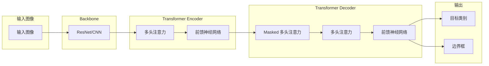

# DETR原理与代码实例讲解

作者：禅与计算机程序设计艺术

## 1. 背景介绍

近年来，目标检测领域取得了显著的进展，其中基于深度学习的方法尤为突出。传统的目标检测方法通常依赖于手工设计的特征和复杂的流程，例如滑动窗口、区域提议和非极大值抑制等。这些方法存在着效率低下、泛化能力不足等问题。

近年来，随着深度学习技术的快速发展，基于深度学习的目标检测方法逐渐占据主导地位。这些方法通常采用端到端的训练方式，可以直接从原始图像中学习目标的特征表示和位置信息，取得了比传统方法更高的精度和效率。

在众多目标检测算法中，DETR (**DE**tection **TR**ansformer) 作为一种新兴的目标检测方法，自2020年被Facebook AI Research提出以来，便受到了学术界和工业界的广泛关注。DETR 将 Transformer 架构应用于目标检测任务，通过全局建模和注意力机制，实现了端到端的目標检测，无需非极大值抑制等后处理步骤，极大地简化了目标检测流程。

### 1.1  目标检测发展历程

在 DETR 出现之前，目标检测领域的主流方法可以分为两大类：

* **基于区域提议的目标检测方法 (Two-stage)**:  这类方法首先通过区域提议网络 (RPN) 生成候选区域，然后对每个候选区域进行分类和回归，例如 R-CNN、Fast R-CNN、Faster R-CNN 等。
* **基于回归的目标检测方法 (One-stage)**:  这类方法直接预测目标的类别和位置信息，无需生成候选区域，例如 YOLO、SSD、RetinaNet 等。

然而，无论是 Two-stage 还是 One-stage 的目标检测方法，都存在着一些共同的缺陷：

* **需要手工设计的 Anchor**:  Anchor 是预定义的框，用于确定目标的尺度和比例。然而，Anchor 的选择需要大量的先验知识，并且难以适应不同数据集和应用场景。
* **需要非极大值抑制 (NMS)**:  NMS 用于去除重叠的检测框，但它是一个启发式的后处理步骤，容易导致目标的漏检和误检。
* **难以建模目标之间的关系**:  传统的目标检测方法通常将每个目标视为独立的个体，难以建模目标之间的关系，例如遮挡、重叠等。

### 1.2 DETR的优势

DETR 的出现为目标检测领域带来了新的思路，它具有以下优势：

* **端到端的训练**:  DETR 不需要 Anchor 和 NMS，可以直接从原始图像中学习目标的类别和位置信息，实现了端到端的训练。
* **全局建模**:  DETR 使用 Transformer 架构对整张图像进行全局建模，可以更好地捕捉目标之间的关系。
* **简单高效**:  DETR 的结构简单，易于实现，并且在训练和推理速度上都具有优势。

## 2. 核心概念与联系

### 2.1 Transformer

DETR 的核心是 Transformer 架构，它最初被提出用于自然语言处理领域，在机器翻译、文本摘要等任务上取得了显著的成果。Transformer 架构的核心是自注意力机制 (Self-Attention)，它可以对输入序列中的任意两个元素进行关联，从而捕捉元素之间的长距离依赖关系。

#### 2.1.1  自注意力机制 (Self-Attention)

自注意力机制是 Transformer 架构的核心，它可以对输入序列中的任意两个元素进行关联，从而捕捉元素之间的长距离依赖关系。自注意力机制的计算过程可以分为以下三个步骤：

1. **计算 Query、Key 和 Value**:  对于输入序列中的每个元素 $x_i$，分别计算其对应的 Query 向量 $q_i$、Key 向量 $k_i$ 和 Value 向量 $v_i$。
2. **计算注意力权重**:  计算 Query 向量 $q_i$ 与所有 Key 向量 $k_j$ 的点积，然后使用 Softmax 函数进行归一化，得到注意力权重 $a_{ij}$。
3. **加权求和**:  将所有 Value 向量 $v_j$ 按照注意力权重 $a_{ij}$ 进行加权求和，得到最终的输出向量 $y_i$。

自注意力机制的计算公式如下：

$$
\begin{aligned}
q_i &= W_q x_i \\
k_i &= W_k x_i \\
v_i &= W_v x_i \\
a_{ij} &= \frac{\exp(q_i^T k_j)}{\sum_{k=1}^n \exp(q_i^T k_k)} \\
y_i &= \sum_{j=1}^n a_{ij} v_j
\end{aligned}
$$

其中，$W_q$、$W_k$ 和 $W_v$ 是可学习的参数矩阵。

#### 2.1.2  多头注意力机制 (Multi-Head Attention)

为了捕捉输入序列中不同位置的特征，Transformer 架构中通常使用多头注意力机制。多头注意力机制将输入序列分成多个头，每个头使用不同的参数矩阵计算自注意力，然后将所有头的输出拼接在一起，最后通过一个线性变换得到最终的输出。

多头注意力机制的计算公式如下：

$$
\begin{aligned}
\text{MultiHead}(Q, K, V) &= \text{Concat}(\text{head}_1, ..., \text{head}_h) W^O \\
\text{head}_i &= \text{Attention}(Q W_i^Q, K W_i^K, V W_i^V)
\end{aligned}
$$

其中，$h$ 是头的数量，$W_i^Q$、$W_i^K$、$W_i^V$ 和 $W^O$ 是可学习的参数矩阵。

#### 2.1.3  Transformer Encoder

Transformer Encoder 由多个相同的 Encoder 层堆叠而成，每个 Encoder 层包含两个子层：

1. **多头注意力层 (Multi-Head Attention Layer)**:  用于捕捉输入序列中不同位置的特征。
2. **前馈神经网络层 (Feed Forward Network Layer)**:  用于对每个位置的特征进行非线性变换。

#### 2.1.4  Transformer Decoder

Transformer Decoder 与 Encoder 类似，也由多个相同的 Decoder 层堆叠而成，每个 Decoder 层包含三个子层：

1. **Masked Multi-Head Attention Layer**:  用于捕捉解码器输入序列中不同位置的特征。
2. **Multi-Head Attention Layer**:  用于捕捉编码器输出序列中不同位置的特征。
3. **前馈神经网络层 (Feed Forward Network Layer)**:  用于对每个位置的特征进行非线性变换。

### 2.2  DETR 架构

DETR 的架构可以分为三个部分：

1. **Backbone**:  用于提取图像的特征。
2. **Transformer Encoder**:  用于对图像特征进行全局建模。
3. **Transformer Decoder**:  用于预测目标的类别和位置信息。


**DETR 架构图:**



**工作流程：**

1. 输入图像首先被送入 Backbone 网络中，例如 ResNet，以提取图像特征。
2. 提取的特征图随后被送入 Transformer Encoder 中。Encoder 使用多头注意力机制对图像特征进行全局建模，捕捉不同位置特征之间的关系。
3. Encoder 的输出被送入 Transformer Decoder 中。Decoder 使用 Masked 多头注意力机制对 Encoder 的输出进行解码，并预测目标的类别和边界框。
4. 最后，Decoder 的输出通过一个前馈神经网络，预测目标的类别和边界框。

## 3. 核心算法原理具体操作步骤

### 3.1 DETR 训练流程

DETR 的训练流程可以概括为以下几个步骤：

1. **数据预处理**:  对输入图像进行预处理，例如缩放、归一化等。
2. **特征提取**:  使用 Backbone 网络提取图像特征。
3. **Transformer 编码**:  将图像特征送入 Transformer Encoder 进行编码。
4. **Transformer 解码**:  将编码后的特征送入 Transformer Decoder 进行解码，预测目标的类别和边界框。
5. **损失计算**:  计算预测结果与真实标签之间的损失。
6. **反向传播**:  根据损失函数计算梯度，并更新模型参数。

### 3.2  Bipartite Matching Loss

DETR 使用二分图匹配损失函数 (Bipartite Matching Loss) 来训练模型。该损失函数的目标是找到预测目标与真实目标之间的最佳匹配关系，并最小化匹配目标之间的类别和边界框的差异。

二分图匹配损失函数的计算过程如下：

1. **计算预测目标与真实目标之间的代价矩阵**:  代价矩阵的每个元素表示将一个预测目标与一个真实目标进行匹配的代价。代价可以定义为类别差异和边界框差异的加权和。
2. **使用匈牙利算法找到最佳匹配**:  匈牙利算法是一种用于解决分配问题的经典算法，它可以找到代价矩阵中的最小代价匹配。
3. **计算匹配目标之间的损失**:  对于每个匹配的目标对，计算其类别差异和边界框差异的损失。

### 3.3 推理过程

DETR 的推理过程相对简单，可以概括为以下几个步骤：

1. **数据预处理**:  对输入图像进行预处理。
2. **特征提取**:  使用 Backbone 网络提取图像特征。
3. **Transformer 编码**:  将图像特征送入 Transformer Encoder 进行编码。
4. **Transformer 解码**:  将编码后的特征送入 Transformer Decoder 进行解码，预测目标的类别和边界框。
5. **输出结果**:  输出预测的目标类别和边界框。

## 4. 数学模型和公式详细讲解举例说明

### 4.1  二分图匹配损失函数

二分图匹配损失函数的公式如下：

$$
\mathcal{L}(\hat{\sigma}, \hat{y}, y) = \sum_{i=1}^N [\text{L}_\text{cls}(\hat{y}_i, y_{\sigma(i)}) + \mathbb{1}_{c_i \neq \varnothing} \text{L}_\text{box}(\hat{b}_i, b_{\sigma(i)})]
$$

其中：

* $N$ 是预测目标的数量。
* $\hat{\sigma}$ 是预测目标与真实目标之间的最佳匹配关系。
* $\hat{y}_i$ 是第 $i$ 个预测目标的类别预测结果。
* $y_{\sigma(i)}$ 是与第 $i$ 个预测目标匹配的真实目标的类别。
* $\text{L}_\text{cls}$ 是类别损失函数，例如交叉熵损失函数。
* $\mathbb{1}_{c_i \neq \varnothing}$ 表示如果第 $i$ 个预测目标匹配到一个真实目标，则为 1，否则为 0。
* $\hat{b}_i$ 是第 $i$ 个预测目标的边界框预测结果。
* $b_{\sigma(i)}$ 是与第 $i$ 个预测目标匹配的真实目标的边界框。
* $\text{L}_\text{box}$ 是边界框损失函数，例如 L1 损失函数或 GIoU 损失函数。

### 4.2  匈牙利算法

匈牙利算法是一种用于解决分配问题的经典算法，它可以找到代价矩阵中的最小代价匹配。在 DETR 中，匈牙利算法用于找到预测目标与真实目标之间的最佳匹配关系。

匈牙利算法的详细步骤可以参考相关资料，这里不再赘述。

## 5. 项目实践：代码实例和详细解释说明

### 5.1  环境配置

在运行 DETR 代码之前，需要先配置好相应的环境。 DETR 可以使用 PyTorch 或 TensorFlow 等深度学习框架来实现。以下是以 PyTorch 为例的环境配置步骤：

1. **安装 PyTorch**:  可以参考 PyTorch 官网的安装指南进行安装。
2. **安装 torchvision**:  可以使用以下命令安装 torchvision:

```
pip install torchvision
```

3. **安装其他依赖库**:  可以使用以下命令安装其他依赖库:

```
pip install -r requirements.txt
```

### 5.2  数据准备

DETR 可以使用 COCO 数据集进行训练和评估。COCO 数据集是一个大型的图像识别、分割和目标检测数据集。可以从 COCO 官网下载数据集。

### 5.3  模型训练

以下是一个使用 PyTorch 训练 DETR 模型的示例代码：

```python
import torch
from torch.utils.data import DataLoader
from torchvision.models import resnet50
from detr import DETR
from detr.datasets import CocoDetection
from detr.losses import SetCriterion
from detr.optimizers import AdamW

# 设置训练参数
batch_size = 2
lr = 1e-4
num_epochs = 100

# 加载 COCO 数据集
train_dataset = CocoDetection(root='./data/coco', annFile='./data/coco/annotations/instances_train2017.json')
train_dataloader = DataLoader(train_dataset, batch_size=batch_size, shuffle=True)

# 创建 DETR 模型
model = DETR(resnet50(pretrained=True))

# 创建损失函数和优化器
criterion = SetCriterion()
optimizer = AdamW(model.parameters(), lr=lr)

# 训练模型
for epoch in range(num_epochs):
    for images, targets in train_dataloader:
        # 将数据移动到设备上
        images = images.cuda()
        targets = [{k: v.cuda() for k, v in t.items()} for t in targets]

        # 前向传播
        outputs = model(images)

        # 计算损失
        loss_dict = criterion(outputs, targets)
        loss = sum(loss_dict.values())

        # 反向传播和更新参数
        optimizer.zero_grad()
        loss.backward()
        optimizer.step()

    # 打印训练信息
    print(f'Epoch: {epoch+1}, Loss: {loss.item()}')

# 保存模型
torch.save(model.state_dict(), 'detr_model.pth')
```

### 5.4  模型评估

以下是一个使用 PyTorch 评估 DETR 模型的示例代码：

```python
import torch
from torch.utils.data import DataLoader
from torchvision.models import resnet50
from detr import DETR
from detr.datasets import CocoDetection
from detr.engine import evaluate

# 加载 COCO 数据集
val_dataset = CocoDetection(root='./data/coco', annFile='./data/coco/annotations/instances_val2017.json')
val_dataloader = DataLoader(val_dataset, batch_size=1)

# 创建 DETR 模型
model = DETR(resnet50(pretrained=True))

# 加载训练好的模型参数
model.load_state_dict(torch.load('detr_model.pth'))

# 评估模型
evaluate(model, val_dataloader)
```

## 6. 实际应用场景

DETR 作为一种新兴的目标检测方法，已经在多个领域展现出巨大的应用潜力，例如：

* **自动驾驶**:  DETR 可以用于自动驾驶中的目标检测任务，例如车辆检测、行人检测、交通标志识别等。
* **机器人**:  DETR 可以用于机器人视觉中的目标检测任务，例如物体抓取、场景理解等。
* **医学影像分析**:  DETR 可以用于医学影像分析中的目标检测任务，例如肿瘤检测、病灶分割等。
* **安防监控**:  DETR 可以用于安防监控中的目标检测任务，例如人脸识别、入侵检测等。


## 7. 工具和资源推荐

* **DETR 官方代码库**:  https://github.com/facebookresearch/detr
* **PyTorch**:  https://pytorch.org/
* **TensorFlow**:  https://www.tensorflow.org/
* **COCO 数据集**:  http://cocodataset.org/


## 8. 总结：未来发展趋势与挑战

DETR 作为一种新兴的目标检测方法，其未来发展趋势和挑战主要体现在以下几个方面：

* **模型效率**:  DETR 的计算复杂度相对较高，未来需要进一步研究如何提高模型的效率，例如使用轻量级 Backbone 网络、模型压缩等技术。
* **小目标检测**:  DETR 在小目标检测方面还有提升空间，未来需要研究如何改进模型结构或损失函数，以提高对小目标的检测精度。
* **遮挡处理**:  DETR 在处理目标遮挡方面还有待改进，未来需要研究如何更好地建模目标之间的关系，以提高对遮挡目标的检测精度。

## 9. 附录：常见问题与解答

### 9.1  DETR 与其他目标检测方法相比有哪些优势？

DETR 与其他目标检测方法相比，主要有以下几个优势：

* **端到端的训练**:  DETR 不需要 Anchor 和 NMS，可以直接从原始图像中学习目标的类别和位置信息，实现了端到端的训练。
* **全局建模**:  DETR 使用 Transformer 架构对整张图像进行全局建模，可以更好地捕捉目标之间的关系。
* **简单高效**:  DETR 的结构简单，易于实现，并且在训练和推理速度上都具有优势。

### 9.2  DETR 的训练时间长