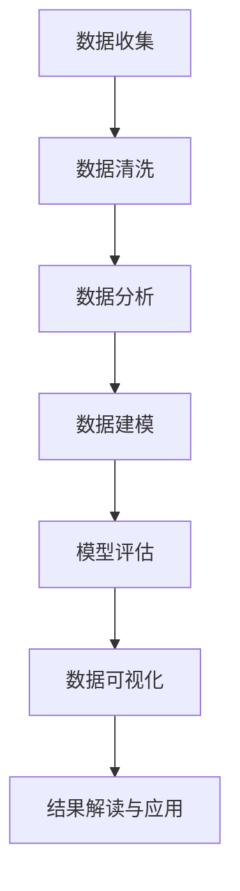

# Data Science 原理与代码实战案例讲解

作者：禅与计算机程序设计艺术

## 1. 背景介绍

### 1.1 数据科学的兴起

数据科学（Data Science）是一个跨学科的领域，它使用科学方法、算法、过程和系统从结构化和非结构化数据中提取知识和见解。随着大数据时代的到来，数据科学的重要性日益增加。各行各业都在利用数据科学来驱动决策、优化运营、提升用户体验等。

### 1.2 数据科学的定义

数据科学结合了统计学、计算机科学和领域知识，通过数据分析、机器学习和数据可视化等技术，从数据中提取有价值的信息。数据科学家需要具备编程技能、统计分析能力以及对业务问题的深刻理解。

### 1.3 数据科学的应用领域

数据科学的应用领域非常广泛，包括但不限于：

- **金融**：风险管理、欺诈检测、投资策略优化
- **医疗健康**：疾病预测、个性化治疗、药物研发
- **零售**：客户行为分析、库存管理、销售预测
- **制造业**：预测性维护、生产优化、质量控制

## 2. 核心概念与联系

### 2.1 数据科学的核心组成部分

数据科学涉及多个核心组成部分：

- **数据收集**：从各种来源获取数据
- **数据清洗**：处理缺失值、异常值，确保数据质量
- **数据分析**：使用统计方法和算法分析数据
- **数据建模**：构建预测模型和分类模型
- **数据可视化**：将分析结果以图形方式展示

### 2.2 数据科学与相关领域的关系

数据科学与其他相关领域有紧密联系：

- **统计学**：提供了数据分析的基础理论和方法
- **机器学习**：数据科学的重要工具，用于构建预测模型
- **大数据技术**：处理和存储海量数据的技术
- **人工智能**：高级数据分析和自动化决策的实现

### 2.3 数据科学的工作流程

数据科学的典型工作流程如下：



## 3. 核心算法原理具体操作步骤

### 3.1 数据预处理

数据预处理是数据科学的基础步骤，包括数据清洗、数据变换和数据归一化等。

#### 3.1.1 数据清洗

数据清洗主要包括处理缺失值、异常值和重复值。常用的方法有：

- **删除缺失值**：适用于少量缺失值的情况
- **填补缺失值**：使用均值、中位数或预测值填补
- **处理异常值**：使用统计方法检测并处理异常值

#### 3.1.2 数据变换

数据变换包括数据标准化、归一化和编码转换等。常用的方法有：

- **标准化**：将数据转换为标准正态分布
- **归一化**：将数据缩放到[0, 1]范围
- **编码转换**：将类别变量转换为数值变量

### 3.2 特征工程

特征工程是从原始数据中提取有用特征的过程。常用的方法有：

- **特征选择**：选择对模型有用的特征
- **特征提取**：从原始数据中提取新的特征
- **特征组合**：组合多个特征生成新的特征

### 3.3 模型选择与训练

模型选择与训练是数据科学的核心步骤。常用的模型有：

- **回归模型**：线性回归、岭回归、Lasso回归
- **分类模型**：逻辑回归、决策树、支持向量机
- **聚类模型**：K-means、层次聚类、DBSCAN

### 3.4 模型评估与优化

模型评估与优化是确保模型性能的重要步骤。常用的方法有：

- **交叉验证**：评估模型的泛化能力
- **超参数调优**：优化模型参数
- **模型集成**：提升模型性能的方法，如Bagging和Boosting

## 4. 数学模型和公式详细讲解举例说明

### 4.1 线性回归

线性回归是最基本的回归模型，用于预测连续变量。其数学模型为：

$$
y = \beta_0 + \beta_1 x_1 + \beta_2 x_2 + \cdots + \beta_n x_n + \epsilon
$$

其中，$y$ 是目标变量，$x_i$ 是特征变量，$\beta_i$ 是回归系数，$\epsilon$ 是误差项。

#### 4.1.1 最小二乘法

线性回归模型的参数估计通常采用最小二乘法，其目标是最小化以下损失函数：

$$
J(\beta) = \sum_{i=1}^{m} (y_i - \hat{y}_i)^2 = \sum_{i=1}^{m} (y_i - (\beta_0 + \beta_1 x_{i1} + \beta_2 x_{i2} + \cdots + \beta_n x_{in}))^2
$$

通过求解损失函数的偏导数，可以得到参数的估计值。

### 4.2 逻辑回归

逻辑回归用于二分类问题，其数学模型为：

$$
P(y=1|x) = \frac{1}{1 + e^{-(\beta_0 + \beta_1 x_1 + \beta_2 x_2 + \cdots + \beta_n x_n)}}
$$

其中，$P(y=1|x)$ 是事件 $y=1$ 发生的概率。

#### 4.2.1 最大似然估计

逻辑回归模型的参数估计通常采用最大似然估计，其目标是最大化以下对数似然函数：

$$
L(\beta) = \sum_{i=1}^{m} [y_i \log P(y_i|x_i) + (1 - y_i) \log (1 - P(y_i|x_i))]
$$

通过求解对数似然函数的偏导数，可以得到参数的估计值。

### 4.3 支持向量机

支持向量机（SVM）用于分类问题，其基本思想是找到一个最优超平面，使得分类间隔最大。其数学模型为：

$$
f(x) = \text{sign}(\sum_{i=1}^{n} \alpha_i y_i K(x_i, x) + b)
$$

其中，$\alpha_i$ 是拉格朗日乘子，$y_i$ 是类别标签，$K(x_i, x)$ 是核函数。

## 4. 项目实践：代码实例和详细解释说明

### 4.1 数据预处理

```python
import pandas as pd
from sklearn.preprocessing import StandardScaler

# 读取数据
data = pd.read_csv('data.csv')

# 数据清洗
data.dropna(inplace=True)

# 数据标准化
scaler = StandardScaler()
data_scaled = scaler.fit_transform(data)
```

### 4.2 特征工程

```python
from sklearn.feature_selection import SelectKBest, f_classif

# 特征选择
X = data_scaled[:, :-1]
y = data_scaled[:, -1]
selector = SelectKBest(f_classif, k=10)
X_new = selector.fit_transform(X, y)
```

### 4.3 模型训练与评估

```python
from sklearn.model_selection import train_test_split
from sklearn.linear_model import LogisticRegression
from sklearn.metrics import accuracy_score

# 数据划分
X_train, X_test, y_train, y_test = train_test_split(X_new, y, test_size=0.3, random_state=42)

# 模型训练
model = LogisticRegression()
model.fit(X_train, y_train)

# 模型评估
y_pred = model.predict(X_test)
accuracy = accuracy_score(y_test, y_pred)
print(f'Accuracy: {accuracy}')
```

### 4.4 模型优化

```python
from sklearn.model_selection import GridSearchCV

# 超参数调优
param_grid = {'C': [0.1, 1, 10, 100]}
grid_search = GridSearchCV(LogisticRegression(), param_grid, cv=5)
grid_search.fit(X_train, y_train)

# 最优模型
best_model = grid_search.best_estimator_
```

## 5. 实际应用场景

### 5.1 金融领域

在金融领域，数据科学可以用于信用评分、风险管理和欺诈检测等。通过分析客户的交易数据，构建预测模型，可以有效地评