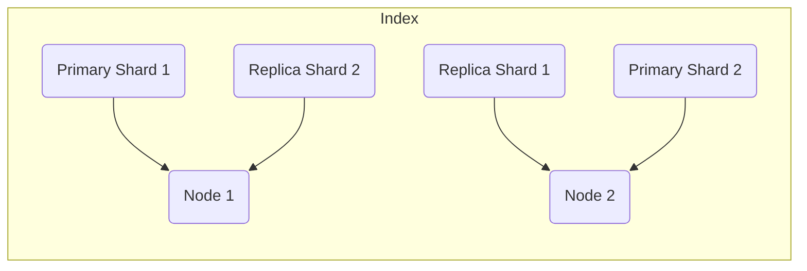

# ElasticSearch Shard原理与代码实例讲解

作者：禅与计算机程序设计艺术

## 1. 背景介绍

### 1.1 Elasticsearch 简介

Elasticsearch 是一款开源的分布式搜索和分析引擎，以其强大的全文搜索、高性能、可扩展性和易用性而闻名。它基于 Apache Lucene 库构建，并提供 RESTful API 以进行交互。Elasticsearch 被广泛应用于各种场景，例如日志分析、实时数据分析、电子商务搜索、安全信息和事件管理 (SIEM) 等。

### 1.2 数据量与性能挑战

随着数据量的不断增长，传统的单机数据库已经无法满足海量数据的存储和查询需求。为了解决这个问题，分布式系统应运而生。Elasticsearch 作为一款分布式搜索引擎，通过将数据分布到多个节点上，实现了数据的水平扩展，从而提升了系统的性能和容量。

### 1.3 Shard 的引入

Shard 是 Elasticsearch 中数据分片的最小单位。将数据分割成多个 shard 并分布到不同的节点上，可以有效地提高 Elasticsearch 集群的性能和可扩展性。

## 2. 核心概念与联系

### 2.1 Shard 类型

Elasticsearch 中有两种类型的 shard：

* **主分片 (Primary Shard):** 每个文档都属于且仅属于一个主分片。主分片负责文档的索引和搜索。
* **副本分片 (Replica Shard):** 副本分片是主分片的副本，用于提供数据冗余和高可用性。当主分片不可用时，副本分片可以接管主分片的职责。

### 2.2 Index、Shard 与 Node 的关系

* **索引 (Index):** 索引是文档的逻辑集合，类似于关系数据库中的数据库。
* **节点 (Node):** 节点是 Elasticsearch 集群中的单个服务器。
* **分片 (Shard):** 分片是索引的物理分片，分布在不同的节点上。

一个索引可以拥有多个主分片和副本分片，这些分片可以分布在不同的节点上。如下图所示：



### 2.3 数据路由

当索引一个文档时，Elasticsearch 会根据文档 ID 的哈希值将其路由到特定的主分片。路由算法如下：

```
shard_num = hash(_id) % num_primary_shards
```

其中：

* `_id` 是文档的 ID。
* `num_primary_shards` 是索引的主分片数量。

## 3. 核心算法原理具体操作步骤

### 3.1 创建索引

创建索引时，需要指定主分片和副本分片的数量。例如，要创建一个名为 "my_index" 的索引，包含 3 个主分片和 2 个副本分片，可以使用以下命令：

```
PUT /my_index
{
  "settings": {
    "number_of_shards": 3,
    "number_of_replicas": 2
  }
}
```

### 3.2 索引文档

索引文档时，Elasticsearch 会根据文档 ID 的哈希值将其路由到特定的主分片。例如，要索引一个 ID 为 "1" 的文档到 "my_index" 索引，可以使用以下命令：

```
PUT /my_index/_doc/1
{
  "name": "John Doe",
  "age": 30
}
```

### 3.3 搜索文档

搜索文档时，Elasticsearch 会将搜索请求广播到索引的所有分片，并将每个分片的搜索结果汇总起来返回给客户端。例如，要搜索 "my_index" 索引中所有名字为 "John" 的文档，可以使用以下命令：

```
GET /my_index/_search
{
  "query": {
    "match": {
      "name": "John"
    }
  }
}
```

## 4. 数学模型和公式详细讲解举例说明

### 4.1 数据分布

假设一个索引有 $N$ 个文档，主分片数量为 $P$，则每个主分片平均存储 $N/P$ 个文档。

### 4.2 搜索性能

假设每个分片的搜索延迟为 $T$，则搜索所有分片的总延迟为 $T * P$。

## 5. 项目实践：代码实例和详细解释说明

### 5.1 Java API 示例

```java
import org.elasticsearch.action.index.IndexRequest;
import org.elasticsearch.action.index.IndexResponse;
import org.elasticsearch.client.RequestOptions;
import org.elasticsearch.client.RestHighLevelClient;
import org.elasticsearch.common.xcontent.XContentType;

// 创建 RestHighLevelClient 实例

// 创建索引请求
IndexRequest request = new IndexRequest("my_index");
request.id("1");
request.source("{\"name\": \"John Doe\", \"age\": 30}", XContentType.JSON);

// 发送索引请求
IndexResponse response = client.index(request, RequestOptions.DEFAULT);

// 打印响应
System.out.println(response.toString());
```

### 5.2 Python API 示例

```python
from elasticsearch import Elasticsearch

# 创建 Elasticsearch 实例
es = Elasticsearch()

# 索引文档
es.index(index="my_index", id=1, body={"name": "John Doe", "age": 30})

# 搜索文档
res = es.search(index="my_index", body={"query": {"match": {"name": "John"}}})

# 打印搜索结果
print(res)
```

## 6. 实际应用场景

### 6.1 日志分析

将应用程序日志存储到 Elasticsearch 中，并使用 Kibana 进行可视化分析。

### 6.2 电子商务搜索

构建电子商务网站的搜索功能，允许用户搜索产品。

### 6.3 实时数据分析

分析实时数据流，例如社交媒体数据、传感器数据等。

## 7. 总结：未来发展趋势与挑战

### 7.1 趋势

* **云原生 Elasticsearch:** Elasticsearch 在云平台上的部署和管理越来越便捷。
* **机器学习:** Elasticsearch 集成了机器学习功能，可以用于异常检测、预测分析等。
* **向量搜索:** Elasticsearch 支持向量搜索，可以用于语义搜索、图像搜索等。

### 7.2 挑战

* **数据一致性:** 由于数据分布在多个节点上，因此需要保证数据的一致性。
* **性能优化:** 随着数据量的增长，需要不断优化 Elasticsearch 集群的性能。
* **安全性:** 保护 Elasticsearch 集群的数据安全。

## 8. 附录：常见问题与解答

### 8.1 如何选择合适的 shard 数量？

选择合适的 shard 数量取决于多个因素，例如数据量、查询频率、硬件资源等。

### 8.2 如何监控 shard 的状态？

可以使用 Elasticsearch 的监控工具来监控 shard 的状态，例如 Kibana、cerebro 等。

### 8.3 如何处理 shard 故障？

Elasticsearch 提供了副本分片机制来处理 shard 故障。当主分片不可用时，副本分片可以接管主分片的职责。
