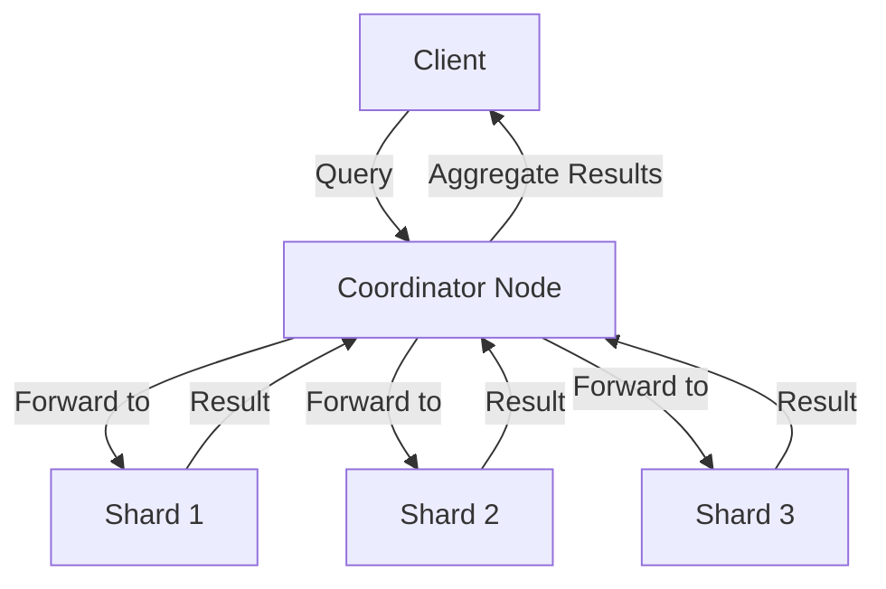

# ElasticSearch倒排索引原理与代码实例讲解

作者：禅与计算机程序设计艺术

## 1. 背景介绍

### 1.1 什么是ElasticSearch

ElasticSearch是一款基于Lucene的开源搜索引擎，提供了一个分布式多用户能力的全文搜索引擎。ElasticSearch的核心是其倒排索引（Inverted Index）机制，这种机制使得它能够快速、高效地处理大量的文本数据，并提供近实时的搜索能力。

### 1.2 倒排索引的历史与发展

倒排索引的概念起源于信息检索领域，是一种用于快速全文搜索的技术。最早的倒排索引可以追溯到20世纪50年代的信息检索系统。随着计算机技术的发展，倒排索引逐渐成为搜索引擎的核心技术，并在现代搜索引擎如Google、Bing以及ElasticSearch中得到了广泛应用。

### 1.3 为什么选择ElasticSearch

ElasticSearch不仅仅是一个搜索引擎，它还是一个强大的分析引擎。它能够处理结构化和非结构化数据，提供复杂的搜索和分析功能。ElasticSearch的分布式架构使得它能够轻松扩展，处理海量数据。其RESTful API和丰富的生态系统使得开发者能够方便地集成和使用。

## 2. 核心概念与联系

### 2.1 倒排索引的基本概念

倒排索引是一种将文档中的词汇映射到包含这些词汇的文档列表的数据结构。与传统的正排索引（Forward Index）不同，倒排索引的查询效率更高，特别适用于全文搜索。

### 2.2 倒排索引在ElasticSearch中的应用

在ElasticSearch中，每个文档都会被分词处理，生成词项（Term）。这些词项会被存储在倒排索引中，形成词项到文档的映射。通过这种映射，ElasticSearch能够快速定位包含特定词项的文档，实现高效的全文搜索。

### 2.3 ElasticSearch的分布式架构

ElasticSearch的分布式架构使得它能够处理大规模数据。它将数据分片（Shard），每个分片可以独立索引和搜索。分片可以分布在多个节点上，实现数据的水平扩展和高可用性。



## 3. 核心算法原理具体操作步骤

### 3.1 文档的索引过程

文档的索引过程包括以下几个步骤：

1. **文档解析**：将文档解析为字段和对应的值。
2. **分词处理**：对字段值进行分词，生成词项。
3. **倒排索引构建**：将词项和文档ID映射，构建倒排索引。

### 3.2 查询处理过程

查询处理过程包括以下几个步骤：

1. **查询解析**：将查询解析为词项。
2. **倒排索引查找**：在倒排索引中查找词项对应的文档ID。
3. **文档评分**：根据相关性算法对文档进行评分。
4. **结果排序和返回**：根据评分排序并返回结果。

### 3.3 倒排索引的优化

倒排索引的优化包括以下几个方面：

1. **压缩技术**：使用压缩技术减少索引的存储空间。
2. **跳跃表**：使用跳跃表加速索引查找。
3. **缓存机制**：使用缓存机制加速常用查询。

## 4. 数学模型和公式详细讲解举例说明

### 4.1 倒排索引的数学模型

倒排索引可以用一个二维矩阵来表示，其中行表示词项，列表示文档。矩阵中的值表示词项在文档中出现的次数。

$$
\mathbf{A} = \begin{bmatrix}
a_{11} & a_{12} & \cdots & a_{1n} \\
a_{21} & a_{22} & \cdots & a_{2n} \\
\vdots & \vdots & \ddots & \vdots \\
a_{m1} & a_{m2} & \cdots & a_{mn}
\end{bmatrix}
$$

其中，$a_{ij}$表示词项$i$在文档$j$中的出现次数。

### 4.2 相关性算法

ElasticSearch使用TF-IDF（Term Frequency-Inverse Document Frequency）和BM25等算法计算文档的相关性。

TF-IDF的公式如下：

$$
\text{TF-IDF}(t, d) = \text{tf}(t, d) \times \text{idf}(t)
$$

其中，$\text{tf}(t, d)$表示词项$t$在文档$d$中的频率，$\text{idf}(t)$表示词项$t$的逆文档频率。

逆文档频率的公式如下：

$$
\text{idf}(t) = \log \frac{N}{1 + \text{df}(t)}
$$

其中，$N$表示文档总数，$\text{df}(t)$表示包含词项$t$的文档数。

BM25的公式如下：

$$
\text{BM25}(t, d) = \sum_{t \in d} \left[ \text{idf}(t) \cdot \frac{\text{tf}(t, d) \cdot (k_1 + 1)}{\text{tf}(t, d) + k_1 \cdot (1 - b + b \cdot \frac{|d|}{\text{avgdl}})} \right]
$$

其中，$k_1$和$b$是调节参数，$|d|$表示文档$d$的长度，$\text{avgdl}$表示平均文档长度。

## 5. 项目实践：代码实例和详细解释说明

### 5.1 环境准备

在开始实践之前，我们需要准备好ElasticSearch环境。可以通过以下命令安装ElasticSearch：

```bash
# 下载并安装ElasticSearch
wget https://artifacts.elastic.co/downloads/elasticsearch/elasticsearch-7.10.2-linux-x86_64.tar.gz
tar -xzf elasticsearch-7.10.2-linux-x86_64.tar.gz
cd elasticsearch-7.10.2

# 启动ElasticSearch
./bin/elasticsearch
```

### 5.2 创建索引

创建索引是使用ElasticSearch的第一步。可以通过以下命令创建一个名为`my_index`的索引：

```bash
curl -X PUT "localhost:9200/my_index?pretty"
```

### 5.3 索引文档

将文档索引到ElasticSearch中，可以使用以下命令：

```bash
curl -X POST "localhost:9200/my_index/_doc/1?pretty" -H 'Content-Type: application/json' -d'
{
  "title": "ElasticSearch入门",
  "content": "ElasticSearch是一个分布式搜索引擎。"
}
'
```

### 5.4 查询文档

查询文档可以使用以下命令：

```bash
curl -X GET "localhost:9200/my_index/_search?pretty" -H 'Content-Type: application/json' -d'
{
  "query": {
    "match": {
      "content": "搜索引擎"
    }
  }
}
'
```

### 5.5 代码实例详解

以下是一个完整的Python代码示例，展示如何使用ElasticSearch的Python客户端进行索引和查询操作：

```python
from elasticsearch import Elasticsearch

# 连接到ElasticSearch
es = Elasticsearch([{'host': 'localhost', 'port': 9200}])

# 创建索引
es.indices.create(index='my_index', ignore=400)

# 索引文档
es.index(index='my_index', id=1, body={
    'title': 'ElasticSearch入门',
    'content': 'ElasticSearch是一个分布式搜索引擎。'
})

# 查询文档
res = es.search(index='my_index', body={
    'query': {
        'match': {
            'content': '搜索引擎'
        }
    }
})

# 打印查询结果
for hit in res['hits']['hits']:
    print(hit['_source'])
```

## 6. 实际应用场景

### 6.1 网站搜索引擎

ElasticSearch常用于网站搜索引擎，通过倒排索引快速检索网页内容，提高用户搜索体验。

### 6.2 日志分析

ElasticSearch