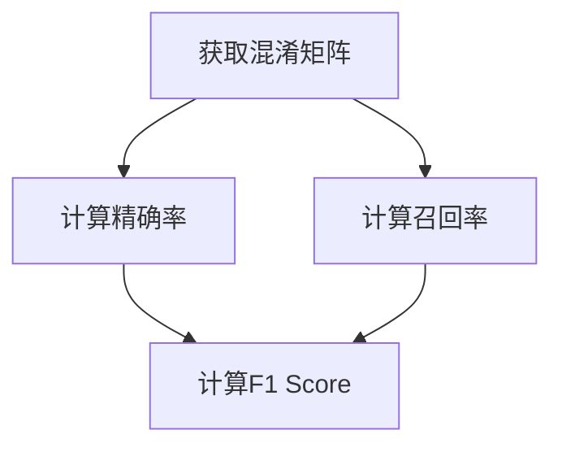

# F1 Score原理与代码实例讲解

作者：禅与计算机程序设计艺术

## 1.背景介绍

在机器学习和数据挖掘领域，模型的评估是一个至关重要的环节。评估指标的选择直接关系到模型的实际效果和应用场景的适配性。常见的评估指标有准确率（Accuracy）、精确率（Precision）、召回率（Recall）等。然而，在许多实际应用中，这些单一的评估指标并不能全面反映模型的性能。F1 Score作为一种综合评估指标，结合了精确率和召回率，能够更全面地反映模型的性能。

F1 Score在分类问题中尤为重要，尤其是在类别不均衡的情况下。本文将详细介绍F1 Score的原理、计算方法、具体操作步骤，并通过实际代码实例进行讲解，帮助读者更好地理解和应用这一重要指标。

## 2.核心概念与联系

### 2.1 精确率（Precision）

精确率是指在所有被预测为正类的样本中，实际为正类的比例。公式如下：

$$
\text{Precision} = \frac{TP}{TP + FP}
$$

其中，TP表示真正例（True Positive），FP表示假正例（False Positive）。

### 2.2 召回率（Recall）

召回率是指在所有实际为正类的样本中，被正确预测为正类的比例。公式如下：

$$
\text{Recall} = \frac{TP}{TP + FN}
$$

其中，FN表示假负例（False Negative）。

### 2.3 F1 Score

F1 Score是精确率和召回率的调和平均数，综合了两者的优点。公式如下：

$$
F1 = 2 \times \frac{\text{Precision} \times \text{Recall}}{\text{Precision} + \text{Recall}}
$$

F1 Score的取值范围是0到1，值越大表示模型的性能越好。

### 2.4 精确率、召回率与F1 Score的联系

精确率和召回率之间存在一定的权衡关系。提高精确率可能会导致召回率下降，反之亦然。F1 Score通过调和平均数的方式，将两者进行综合，提供了一个平衡的评估指标。

## 3.核心算法原理具体操作步骤

### 3.1 数据准备

在计算F1 Score之前，首先需要准备好分类模型的预测结果和实际标签。假设我们有以下混淆矩阵：

|                | 预测正类 | 预测负类 |
|----------------|----------|----------|
| 实际正类 (P)   | TP       | FN       |
| 实际负类 (N)   | FP       | TN       |

### 3.2 计算精确率和召回率

根据混淆矩阵计算精确率和召回率：

$$
\text{Precision} = \frac{TP}{TP + FP}
$$

$$
\text{Recall} = \frac{TP}{TP + FN}
$$

### 3.3 计算F1 Score

将精确率和召回率代入F1 Score公式：

$$
F1 = 2 \times \frac{\text{Precision} \times \text{Recall}}{\text{Precision} + \text{Recall}}
$$

### 3.4 具体操作步骤

1. **获取混淆矩阵**：从模型预测结果和实际标签中生成混淆矩阵。
2. **计算精确率和召回率**：根据混淆矩阵计算精确率和召回率。
3. **计算F1 Score**：将精确率和召回率代入F1 Score公式，得到最终的F1 Score。

## 4.数学模型和公式详细讲解举例说明

### 4.1 示例数据

假设我们有以下分类结果：

| 实际标签 | 预测标签 |
|----------|----------|
| 1        | 1        |
| 1        | 0        |
| 0        | 1        |
| 0        | 0        |
| 1        | 1        |

根据上述数据，我们可以构建混淆矩阵：

|                | 预测正类 | 预测负类 |
|----------------|----------|----------|
| 实际正类 (P)   | 2        | 1        |
| 实际负类 (N)   | 1        | 1        |

### 4.2 计算精确率和召回率

根据混淆矩阵计算精确率和召回率：

$$
\text{Precision} = \frac{2}{2 + 1} = \frac{2}{3} \approx 0.67
$$

$$
\text{Recall} = \frac{2}{2 + 1} = \frac{2}{3} \approx 0.67
$$

### 4.3 计算F1 Score

将精确率和召回率代入F1 Score公式：

$$
F1 = 2 \times \frac{0.67 \times 0.67}{0.67 + 0.67} = 2 \times \frac{0.4489}{1.34} \approx 0.67
$$

### 4.4 Mermaid流程图



## 5.项目实践：代码实例和详细解释说明

### 5.1 Python代码实现

以下是一个使用Python计算F1 Score的示例代码：

```python
from sklearn.metrics import confusion_matrix, precision_score, recall_score, f1_score

# 实际标签和预测标签
y_true = [1, 1, 0, 0, 1]
y_pred = [1, 0, 1, 0, 1]

# 计算混淆矩阵
cm = confusion_matrix(y_true, y_pred)
print("Confusion Matrix:")
print(cm)

# 计算精确率
precision = precision_score(y_true, y_pred)
print("Precision:", precision)

# 计算召回率
recall = recall_score(y_true, y_pred)
print("Recall:", recall)

# 计算F1 Score
f1 = f1_score(y_true, y_pred)
print("F1 Score:", f1)
```

### 5.2 代码详解

1. **导入库**：首先导入`sklearn.metrics`模块中的`confusion_matrix`、`precision_score`、`recall_score`和`f1_score`函数。
2. **定义标签**：定义实际标签`y_true`和预测标签`y_pred`。
3. **计算混淆矩阵**：使用`confusion_matrix`函数计算混淆矩阵。
4. **计算精确率**：使用`precision_score`函数计算精确率。
5. **计算召回率**：使用`recall_score`函数计算召回率。
6. **计算F1 Score**：使用`f1_score`函数计算F1 Score。

## 6.实际应用场景

### 6.1 医疗诊断

在医疗诊断中，F1 Score可以用于评估疾病分类模型的性能。例如，某种疾病的阳性样本较少，使用F1 Score可以更好地衡量模型在检测该疾病时的综合表现。

### 6.2 垃圾邮件过滤

在垃圾邮件过滤中，F1 Score可以用于评估邮件分类模型的性能。垃圾邮件通常占比较少，使用F1 Score可以平衡精确率和召回率，避免误判和漏判。

### 6.3 图像分类

在图像分类中，F1 Score可以用于评估多分类模型的性能。对于不均衡的类别分布，F1 Score可以提供更全面的评估结果。

## 7.工具和资源推荐

### 7.1 工具推荐

1. **Scikit-learn**：一个强大的Python机器学习库，提供了丰富的评估指标计算函数。
2. **TensorFlow**：一个开源的机器学习框架，支持多种模型评估指标的计算。
3. **Keras**：一个高级神经网络API，支持多种评估指标的计算。

### 7.2 资源推荐

1. **Scikit-learn官方文档**：详细介绍了各种评估指标的计算方法和使用案例。
2. **TensorFlow官方文档**：提供了丰富的机器学习模型和评估指标的使用指南。
3. **Keras官方文档**：详细介绍了神经网络模型的评估方法和使用案例。

## 8.总结：未来发展趋势与挑战

### 8.1 发展趋势

随着机器学习和人工智能技术的不断发展，评估指标的研究也在不断深入。未来，可能会出现更多综合性的评估