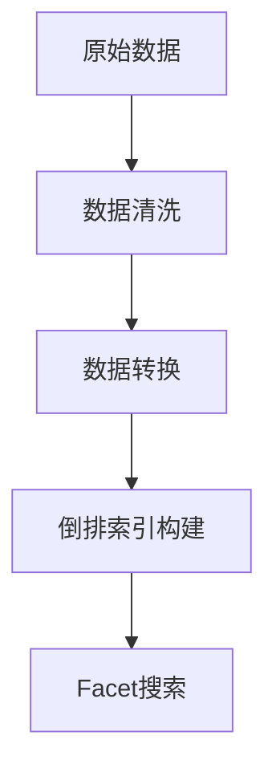
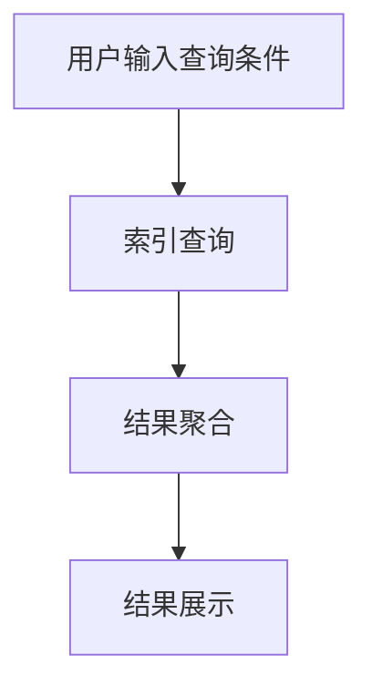

# Facet搜索：多维度数据分析

作者：禅与计算机程序设计艺术

## 1.背景介绍

### 1.1 多维度数据分析的背景

在当今数据驱动的世界中，数据分析已成为各行各业的重要组成部分。随着数据量的不断增长，传统的单维度数据分析方法已经无法满足复杂业务需求。多维度数据分析（也称为多维分析）应运而生，它通过在不同维度上分析数据，揭示隐藏在数据中的深层次信息，为决策提供强有力的支持。

### 1.2 Facet搜索的起源与发展

Facet搜索是一种强大的多维度数据分析技术，最早应用于信息检索和电子商务领域。它通过将数据分为不同的facet（面），使用户能够在各个维度上进行过滤和探索，从而轻松找到所需的信息。随着技术的发展，Facet搜索逐渐被引入到更多领域，如大数据分析、商业智能和科学研究等。

### 1.3 研究意义与文章结构

本篇文章旨在深入探讨Facet搜索的核心概念、算法原理、实际应用以及未来发展趋势。文章将通过以下八个部分展开：

1. 背景介绍
2. 核心概念与联系
3. 核心算法原理具体操作步骤
4. 数学模型和公式详细讲解举例说明
5. 项目实践：代码实例和详细解释说明
6. 实际应用场景
7. 工具和资源推荐
8. 总结：未来发展趋势与挑战
9. 附录：常见问题与解答

## 2.核心概念与联系

### 2.1 Facet的定义与分类

Facet是指数据的一个维度或属性，它可以是任何可用于分类的数据特征。常见的Facet包括时间、地理位置、产品类别、客户属性等。根据不同的应用场景，Facet可以分为以下几类：

- **分类Facet**：用于对数据进行类别划分，如产品类别、用户类型等。
- **数值Facet**：用于对数据进行数值范围划分，如价格区间、年龄段等。
- **层级Facet**：用于对数据进行层级结构划分，如地理位置（国家-省份-城市）、产品分类（大类-小类）等。

### 2.2 Facet搜索的基本原理

Facet搜索的基本原理是通过将数据分为不同的Facet，并在每个Facet上提供过滤选项，用户可以逐步缩小搜索范围，从而快速找到所需的信息。其核心在于构建一个多维度的索引结构，使得在多个维度上进行过滤和聚合计算变得高效。

### 2.3 Facet搜索与传统搜索的区别

与传统的关键字搜索相比，Facet搜索具有以下几个显著特点：

- **多维度过滤**：传统搜索通常只支持单一维度的关键字匹配，而Facet搜索支持在多个维度上进行过滤。
- **动态导航**：Facet搜索提供动态的导航选项，用户可以根据需要灵活调整过滤条件。
- **聚合分析**：Facet搜索可以对搜索结果进行聚合分析，展示各个Facet的统计信息，帮助用户更好地理解数据分布。

### 2.4 Facet搜索的优势

Facet搜索的优势主要体现在以下几个方面：

- **高效性**：通过多维度索引结构，Facet搜索能够在大数据集上高效地进行过滤和聚合计算。
- **用户友好性**：Facet搜索提供直观的过滤选项，使用户能够轻松找到所需的信息。
- **灵活性**：Facet搜索支持多种类型的Facet，能够适应不同的应用场景和数据类型。

## 3.核心算法原理具体操作步骤

### 3.1 数据预处理

在进行Facet搜索之前，需要对原始数据进行预处理，包括数据清洗、数据转换和数据索引构建等步骤。

#### 3.1.1 数据清洗

数据清洗是指对原始数据进行清理和规范化处理，去除噪声数据和错误数据，确保数据的质量和一致性。

#### 3.1.2 数据转换

数据转换是指将原始数据转换为适合进行Facet搜索的格式，包括对数据进行分类、分层和数值范围划分等处理。

#### 3.1.3 数据索引构建

数据索引构建是Facet搜索的核心步骤，通过构建多维度的索引结构，使得在多个维度上进行过滤和聚合计算变得高效。常见的索引结构包括倒排索引、B树和R树等。

### 3.2 Facet索引结构

Facet索引结构是Facet搜索的基础，通过构建多维度的索引，使得在多个维度上进行过滤和聚合计算变得高效。

#### 3.2.1 倒排索引

倒排索引是一种常见的索引结构，通过将数据的每个Facet的值映射到包含该值的文档列表，实现高效的搜索和过滤。

#### 3.2.2 B树和R树

B树和R树是两种常见的树形索引结构，适用于数值Facet和层级Facet的索引构建。B树适用于数值范围查询，而R树适用于空间数据的范围查询。

### 3.3 Facet搜索流程

Facet搜索的流程包括以下几个步骤：

1. **用户输入查询条件**：用户在各个Facet上选择过滤条件。
2. **索引查询**：根据用户的查询条件，在索引结构中进行查询，找到符合条件的文档列表。
3. **结果聚合**：对查询结果进行聚合计算，生成各个Facet的统计信息。
4. **结果展示**：将查询结果和聚合统计信息展示给用户。

## 4.数学模型和公式详细讲解举例说明

### 4.1 倒排索引的数学模型

倒排索引的数学模型可以表示为一个二元组 $(t, D(t))$，其中 $t$ 是Facet的值，$D(t)$ 是包含该值的文档集合。

$$
I = \{(t_1, D(t_1)), (t_2, D(t_2)), \ldots, (t_n, D(t_n))\}
$$

对于给定的查询条件 $Q = \{t_1, t_2, \ldots, t_k\}$，Facet搜索的结果可以表示为：

$$
R(Q) = \bigcap_{t \in Q} D(t)
$$

### 4.2 B树的数学模型

B树是一种平衡树结构，其数学模型可以表示为一个有序的节点集合，每个节点包含若干个键值和子节点指针。

$$
B = \{N_1, N_2, \ldots, N_m\}
$$

其中，每个节点 $N_i$ 满足以下性质：

1. 节点 $N_i$ 包含 $k$ 个键值和 $k+1$ 个子节点指针。
2. 所有键值按升序排列。
3. 每个子节点指针指向一个子树，子树中的所有键值均在父节点的键值范围内。

### 4.3 R树的数学模型

R树是一种用于空间数据索引的树形结构，其数学模型可以表示为一个节点集合，每个节点包含若干个最小边界矩形（MBR）和子节点指针。

$$
R = \{N_1, N_2, \ldots, N_m\}
$$

其中，每个节点 $N_i$ 满足以下性质：

1. 节点 $N_i$ 包含 $k$ 个MBR和 $k+1$ 个子节点指针。
2. 每个MBR表示一个数据对象或子树的边界。
3. 每个子节点指针指向一个子树，子树中的所有MBR均在父节点的MBR范围内。

### 4.4 实例讲解

假设我们有一个包含产品信息的数据集，每个产品包含以下Facet：类别、品牌、价格和评分。我们需要构建一个Facet搜索系统，使用户能够在这些Facet上进行过滤和搜索。

#### 4.4.1 数据预处理

首先，我们对原始数据进行清洗和转换，将每个产品的类别、品牌、价格和评分分别作为分类Facet、分类Facet、数值Facet和数值Facet。

#### 4.4.2 索引构建

接下来