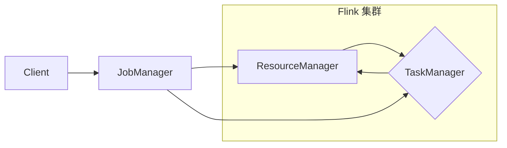

## 1. 背景介绍

### 1.1 分布式计算与资源管理的挑战

随着大数据时代的到来，海量数据的处理需求越来越迫切。传统的单机计算模式已经无法满足日益增长的数据规模和计算需求，分布式计算应运而生。在分布式计算环境中，如何高效地管理和调度计算资源成为了一个至关重要的挑战。

### 1.2 Flink：新一代流式计算引擎

Apache Flink 是一个开源的分布式流处理和批处理框架，它能够高效地处理高吞吐量、低延迟的数据流。Flink 具有高可用性、容错性、可扩展性等优点，被广泛应用于实时数据分析、机器学习、事件驱动应用等领域。

### 1.3  ResourceManager：Flink资源管理的核心

在 Flink 中，ResourceManager（资源管理器）是负责管理和调度集群资源的核心组件。它负责接收来自 JobManager 的资源请求，并根据集群资源状况分配相应的 TaskManager 资源。ResourceManager 的高效运行直接关系到整个 Flink 集群的性能和稳定性。

## 2. 核心概念与联系

### 2.1  Flink 资源管理架构

Flink 的资源管理架构主要包含以下几个核心组件：

- **Client（客户端）：** 提交 Flink 作业的客户端程序。
- **JobManager（作业管理器）：** 负责管理和调度单个 Flink 作业的执行。
- **ResourceManager（资源管理器）：** 负责管理和调度整个 Flink 集群的资源。
- **TaskManager（任务管理器）：** 负责执行具体的计算任务。

下图展示了 Flink 的资源管理架构：



### 2.2 资源管理核心概念

- **Slot（插槽）：** TaskManager 提供的最小资源分配单位，一个 TaskManager 可以拥有多个 Slot。
- **Task（任务）：** Flink 作业执行的基本单元，一个 Task 运行在一个 Slot 上。
- **Resource Profile（资源配置文件）：** 描述 TaskManager 资源配置信息的配置文件，包括 CPU 核数、内存大小、网络带宽等。

### 2.3 组件间交互关系

1. Client 提交 Flink 作业到 JobManager。
2. JobManager 向 ResourceManager 请求资源。
3. ResourceManager 根据资源配置和当前集群状态，选择合适的 TaskManager 为 JobManager 分配 Slot。
4. JobManager 将 Task 调度到分配的 Slot 上执行。
5. TaskManager 定期向 ResourceManager 汇报心跳信息和资源使用情况。

## 3. 核心算法原理具体操作步骤

### 3.1 Slot 资源分配算法

Flink ResourceManager 采用基于 Slot 的资源分配策略，其核心算法原理如下：

1. **资源请求阶段：** JobManager 向 ResourceManager 发送资源请求，指定所需的 Slot 数量和资源配置。
2. **资源筛选阶段：** ResourceManager 根据资源配置信息筛选出符合条件的 TaskManager。
3. **Slot 分配阶段：** ResourceManager 采用贪婪算法，优先选择空闲 Slot 较多的 TaskManager 进行分配。
4. **资源确认阶段：** ResourceManager 向 JobManager 返回分配的 Slot 信息，JobManager 确认资源分配结果。

### 3.2 Slot 资源释放机制

当 Flink 作业执行完成或出现异常时，ResourceManager 需要及时释放占用的 Slot 资源，以便其他作业可以使用。Flink 提供了以下几种 Slot 资源释放机制：

- **主动释放：** JobManager 主动向 ResourceManager 发送释放 Slot 的请求。
- **被动释放：** TaskManager 与 ResourceManager 之间的心跳超时，ResourceManager 自动释放该 TaskManager 上的 Slot。
- **预留释放：** ResourceManager 可以预留一部分 Slot 资源，用于紧急情况下的资源调度。

## 4. 数学模型和公式详细讲解举例说明

### 4.1 Slot 资源分配模型

假设一个 Flink 集群中有 $m$ 个 TaskManager，每个 TaskManager 有 $n$ 个 Slot，则该集群总共拥有 $m \times n$ 个 Slot。

当一个 JobManager 提交一个需要 $k$ 个 Slot 的作业时，ResourceManager 需要从集群中选择 $k$ 个空闲的 Slot 进行分配。

### 4.2 资源分配算法复杂度分析

Flink ResourceManager 的 Slot 资源分配算法复杂度为 $O(m \times n)$，其中 $m$ 为 TaskManager 数量，$n$ 为每个 TaskManager 的 Slot 数量。

## 5. 项目实践：代码实例和详细解释说明

### 5.1 获取 ResourceManager 实例

```java
Configuration config = new Configuration();
ResourceManagerGateway rmGateway = ResourceManagerUtils.findResourceManagerGateway(config);
```

### 5.2  请求 Slot 资源

```java
SlotRequest slotRequest = SlotRequest.newBuilder()
        .setResourceProfile(ResourceProfile.newBuilder().setCpuCores(1).setMemoryInMB(1024).build())
        .setNumRequests(1)
        .build();

CompletableFuture<Acknowledge> requestFuture = rmGateway.requestSlots(
        jobId,
        Collections.singleton(slotRequest),
        true,
        Time.seconds(60));
```

### 5.3 释放 Slot 资源

```java
rmGateway.releaseSlots(jobId, Collections.singleton(slotId), Time.seconds(60));
```

## 6. 实际应用场景

### 6.1  实时数据分析

Flink 被广泛应用于实时数据分析领域，例如实时监控、风险控制、推荐系统等。在这些场景中，ResourceManager 负责为实时计算任务分配足够的资源，保证任务的低延迟和高吞吐。

### 6.2  机器学习

Flink 可以用于构建大规模机器学习模型，例如训练深度神经网络。在机器学习场景中，ResourceManager 负责为模型训练任务分配 GPU 资源，加速模型训练过程。

### 6.3  事件驱动应用

Flink 可以用于构建事件驱动的应用程序，例如实时风控、实时营销等。在事件驱动应用场景中，ResourceManager 负责为事件处理任务分配资源，保证任务的实时性和可靠性。

## 7. 工具和资源推荐

### 7.1 Flink 官方文档

Flink 官方文档提供了详细的 Flink 资源管理机制介绍和代码示例。

### 7.2 Flink 源码

阅读 Flink 源码可以更深入地理解 Flink ResourceManager 的实现原理。

### 7.3  Flink 社区

Flink 社区是一个活跃的技术社区，可以在这里与其他 Flink 开发者交流经验和解决问题。

## 8. 总结：未来发展趋势与挑战

### 8.1 云原生 Flink

随着云计算技术的不断发展，云原生 Flink 逐渐成为趋势。云原生 Flink 可以更加灵活地利用云计算资源，提高资源利用率和弹性伸缩能力。

### 8.2  AI 驱动的资源管理

人工智能技术可以用于优化 Flink 资源管理策略，例如预测资源需求、自动调整资源配置等。

### 8.3  更细粒度的资源管理

未来 Flink 资源管理将会更加细粒度化，例如支持 GPU、FPGA 等异构计算资源的调度和管理。

## 9. 附录：常见问题与解答

### 9.1  如何调整 TaskManager 的 Slot 数量？

可以通过修改 `flink-conf.yaml` 文件中的 `taskmanager.numberOfTaskSlots` 参数来调整 TaskManager 的 Slot 数量。

### 9.2 如何监控 Flink 集群的资源使用情况？

可以通过 Flink Web UI 或 Flink Metrics 系统监控 Flink 集群的资源使用情况。
