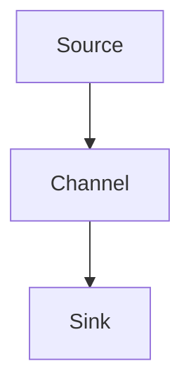

# Flume：大数据时代高效日志收集利器

作者：禅与计算机程序设计艺术

## 1. 背景介绍

### 1.1 大数据时代的挑战
在大数据时代，数据的收集、处理和分析变得至关重要。随着互联网和物联网的发展，数据源的多样性和数据量呈现爆炸式增长。如何高效地收集和传输这些海量数据，成为了企业和研究机构面临的重大挑战。

### 1.2 日志数据的重要性
日志数据是系统运行过程中自动生成的记录文件，包含了系统操作、用户行为、错误信息等重要内容。通过对日志数据的分析，可以发现系统问题、优化性能、提升用户体验。然而，日志数据的生成速度快、数据量大，如何高效地收集和处理这些数据是一大难题。

### 1.3 Flume的诞生
Apache Flume应运而生，作为一个分布式、可靠且高效的日志收集、聚合和传输系统，Flume能够从各种数据源中收集数据，并将其传输到集中存储系统中。Flume的设计目标是处理大规模的日志数据，确保数据传输的可靠性和实时性。

## 2. 核心概念与联系

### 2.1 Flume架构
Flume的架构主要由以下几个核心组件组成：

- **Source（源）**：负责从数据源中收集数据。
- **Channel（通道）**：暂存数据，起到缓冲作用。
- **Sink（汇）**：将数据传输到目标存储系统。

这些组件通过事件流进行数据传输，确保了数据的可靠性和高效性。



### 2.2 事件流
Flume的数据传输是基于事件流的，每个事件包含了数据和元数据。在Source收集到数据后，会将其封装成事件，通过Channel传输到Sink，最终存储在目标系统中。

### 2.3 拓扑结构
Flume支持复杂的拓扑结构，可以通过多级Source、Channel和Sink的组合，实现灵活的数据收集和传输策略。例如，可以将多个Source的数据汇聚到一个Channel，再通过多个Sink将数据分发到不同的存储系统。

## 3. 核心算法原理具体操作步骤

### 3.1 数据收集
Flume的Source负责从各种数据源中收集数据，支持多种数据源类型，如日志文件、网络流、系统日志等。常见的Source类型包括：

- **ExecSource**：通过执行系统命令收集数据。
- **Spooling Directory Source**：监控目录中的新文件并收集数据。
- **Netcat Source**：通过网络端口接收数据。

### 3.2 数据传输
Channel是Flume中用于暂存数据的组件，支持多种类型，如内存通道、文件通道等。Channel的选择取决于数据传输的可靠性和性能要求：

- **Memory Channel**：速度快，但数据可能会丢失。
- **File Channel**：速度较慢，但数据可靠性高。

### 3.3 数据存储
Sink负责将数据传输到目标存储系统，Flume支持多种Sink类型，如HDFS Sink、Kafka Sink、ElasticSearch Sink等。常见的Sink类型包括：

- **HDFS Sink**：将数据存储到HDFS中。
- **Kafka Sink**：将数据传输到Kafka中。
- **ElasticSearch Sink**：将数据存储到ElasticSearch中。

## 4. 数学模型和公式详细讲解举例说明

### 4.1 数据传输模型
Flume的数据传输可以用数学模型来描述。假设数据源的生成速率为 $\lambda$，Channel的处理速率为 $\mu$，Sink的传输速率为 $\nu$，则系统的稳定性和性能可以通过以下公式进行分析：

$$
\text{系统负载} = \frac{\lambda}{\min(\mu, \nu)}
$$

当系统负载接近1时，说明系统处于高负载状态，可能会出现数据丢失或延迟。

### 4.2 数据可靠性分析
Flume的可靠性可以通过事件的传输成功率来衡量。假设事件在Source、Channel和Sink中的传输成功率分别为 $P_s$、$P_c$ 和 $P_k$，则事件的总体传输成功率为：

$$
P_{\text{total}} = P_s \times P_c \times P_k
$$

通过提高各组件的传输成功率，可以提升系统的整体可靠性。

### 4.3 数据传输延迟
数据传输延迟是衡量Flume性能的重要指标。假设Source、Channel和Sink的处理时间分别为 $T_s$、$T_c$ 和 $T_k$，则事件的总传输延迟为：

$$
T_{\text{total}} = T_s + T_c + T_k
$$

通过优化各组件的处理时间，可以降低数据传输的总延迟。

## 5. 项目实践：代码实例和详细解释说明

### 5.1 环境搭建
在进行Flume项目实践之前，需要搭建Flume的运行环境。以下是搭建步骤：

1. 下载并安装Apache Flume。
2. 配置Flume的环境变量。
3. 创建Flume的配置文件。

### 5.2 配置文件示例
以下是一个简单的Flume配置文件示例，配置了一个ExecSource、Memory Channel和HDFS Sink：

```properties
# Define the agent
agent.sources = source1
agent.channels = channel1
agent.sinks = sink1

# Configure the source
agent.sources.source1.type = exec
agent.sources.source1.command = tail -F /var/log/syslog

# Configure the channel
agent.channels.channel1.type = memory
agent.channels.channel1.capacity = 1000
agent.channels.channel1.transactionCapacity = 100

# Configure the sink
agent.sinks.sink1.type = hdfs
agent.sinks.sink1.hdfs.path = hdfs://localhost:9000/flume/logs
agent.sinks.sink1.hdfs.fileType = DataStream
agent.sinks.sink1.hdfs.writeFormat = Text
agent.sinks.sink1.hdfs.batchSize = 1000
agent.sinks.sink1.hdfs.rollSize = 0
agent.sinks.sink1.hdfs.rollCount = 10000

# Bind the source and sink to the channel
agent.sources.source1.channels = channel1
agent.sinks.sink1.channel = channel1
```

### 5.3 启动Flume
使用以下命令启动Flume：

```bash
flume-ng agent --conf conf --conf-file example.conf --name agent -Dflume.root.logger=INFO,console
```

### 5.4 实时日志收集
通过上述配置，Flume将实时收集系统日志并存储到HDFS中。可以通过HDFS命令查看收集到的日志数据：

```bash
hdfs dfs -ls /flume/logs
```

## 6. 实际应用场景

### 6.1 网站日志分析
在大型网站中，用户访问行为会产生大量的日志数据。通过Flume，可以高效地收集这些日志数据，并将其存储到HDFS中，供后续的分析和处理。

### 6.2 物联网数据收集
物联网设备会产生大量的传感器数据，这些数据需要实时收集和处理。Flume可以从多个物联网设备中收集数据，并将其传输到集中存储系统中，确保数据的实时性和可靠性。

### 6.3 系统监控与故障排除
通过Flume收集系统日志，可以实时监控系统运行状态，及时发现和排除故障。Flume的高可靠性和高性能，确保了系统监控数据的准确性和及时性。

## 7. 工具和资源推荐

### 7.1 Flume官方文档
Flume的官方文档提供了详细的使用指南和配置说明，是学习和使用Flume的重要资源。

### 7.2 HDFS
HDFS是Flume常用的目标存储系统，提供了高可靠性和高可扩展性的分布式存储服务。

### 7.3 Kafka
Kafka是一种高吞吐量的分布式消息系统，可以与Flume结合使用，实现高效的数据传输和处理。

### 7.4 ElasticSearch
ElasticSearch是一个分布式搜索和分析引擎，可以与Flume结合使用，实现日志数据的实时搜索和分析。

## 8. 总结：未来发展趋势与挑战

### 8.1 未来发展趋势
随着大数据技术的发展，Flume将继续在日志数据收集和传输领域发挥重要作用。未来，Flume可能会进一步优化性能、提升可靠性，并支持更多的数据源和目标存储系统。

### 8.