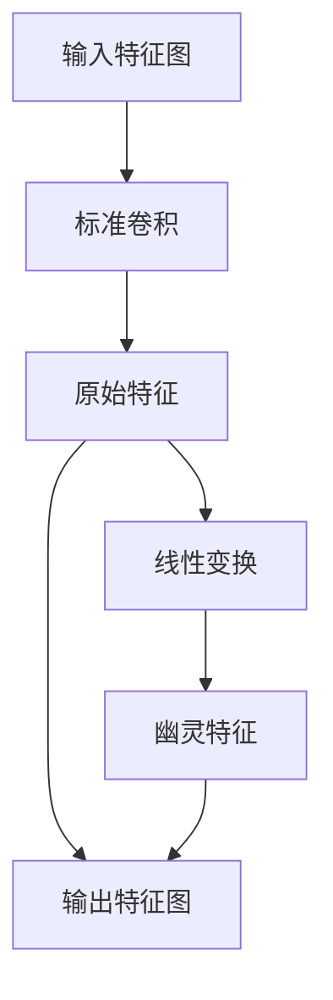
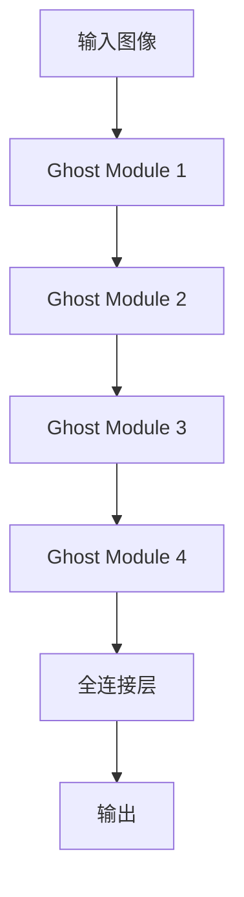

# GhostNet原理与代码实例讲解

作者：禅与计算机程序设计艺术

## 1. 背景介绍

### 1.1 深度学习与神经网络发展

在过去的十年中，深度学习和神经网络取得了突飞猛进的发展。尤其是在计算机视觉领域，深度卷积神经网络（CNN）已经成为主流方法。自从AlexNet在2012年ImageNet竞赛中取得突破以来，各种改进的网络架构如VGG、ResNet、Inception等相继问世。这些网络在提高图像分类、目标检测和语义分割等任务的准确性方面发挥了重要作用。

### 1.2 轻量级网络的需求

虽然深度学习模型的性能不断提升，但其计算和存储成本也随之增加。尤其是在移动设备和嵌入式系统中，资源受限的环境对模型的轻量化提出了更高的要求。因此，研究者们开始关注如何在保证模型性能的前提下，减少模型参数和计算量。这催生了一系列轻量级网络，如MobileNet、ShuffleNet和EfficientNet等。

### 1.3 GhostNet的诞生

GhostNet是由华为诺亚方舟实验室提出的一种新型轻量级神经网络。其核心思想是通过生成“幽灵特征”（Ghost Feature）来减少冗余计算，从而在保证模型性能的同时，大幅度降低计算成本和参数量。本文将深入探讨GhostNet的原理、核心算法、数学模型，并通过代码实例讲解其实现细节。

## 2. 核心概念与联系

### 2.1 特征冗余与特征生成

在传统的卷积神经网络中，卷积操作会生成大量的特征图（Feature Map），其中很多特征图之间存在高度的冗余。GhostNet通过引入“特征生成”（Feature Generation）机制，减少了冗余计算。具体来说，GhostNet将卷积操作生成的部分特征图视为“原始特征”（Intrinsic Feature），然后通过一系列线性变换生成“幽灵特征”（Ghost Feature），以此替代部分卷积操作。

### 2.2 Ghost Module

GhostNet的基本构建单元是Ghost Module。一个Ghost Module由两个部分组成：第一部分是普通的卷积操作，用于生成原始特征；第二部分是线性变换操作，用于生成幽灵特征。这种设计使得GhostNet能够在减少计算量的同时，保持较高的表示能力。

### 2.3 GhostNet与其他轻量级网络的对比

与其他轻量级网络如MobileNet和ShuffleNet相比，GhostNet的创新之处在于其特征生成机制。MobileNet通过深度可分离卷积（Depthwise Separable Convolution）减少计算量，而ShuffleNet则通过通道混洗（Channel Shuffle）优化计算效率。GhostNet则通过直接生成特征图，进一步减少了冗余计算。

## 3. 核心算法原理具体操作步骤

### 3.1 Ghost Module的结构

Ghost Module的结构可以用以下Mermaid流程图来表示：



### 3.2 Ghost Module的操作步骤

1. **输入特征图**：输入特征图经过标准卷积操作，生成原始特征。
2. **生成幽灵特征**：原始特征通过一系列线性变换（如逐点卷积、逐点加权等）生成幽灵特征。
3. **输出特征图**：将原始特征和幽灵特征合并，得到最终的输出特征图。

### 3.3 GhostNet的网络架构

GhostNet的网络架构由多个Ghost Module堆叠而成。具体的网络配置可以根据任务需求进行调整。以下是一个典型的GhostNet网络架构示例：



## 4. 数学模型和公式详细讲解举例说明

### 4.1 卷积操作

卷积操作是卷积神经网络中的核心计算步骤。对于一个输入特征图 $X$ 和卷积核 $W$，卷积操作可以表示为：

$$
Y = X * W
$$

其中，$Y$ 是输出特征图，$*$ 表示卷积操作。

### 4.2 线性变换

在GhostNet中，线性变换用于生成幽灵特征。对于一个原始特征 $F$，线性变换可以表示为：

$$
G_i = F \cdot \alpha_i + \beta_i
$$

其中，$G_i$ 表示第 $i$ 个幽灵特征，$\alpha_i$ 和 $\beta_i$ 是线性变换的参数。

### 4.3 幽灵特征的生成

假设原始特征的数量为 $m$，每个原始特征生成 $s$ 个幽灵特征，则最终的输出特征图数量为 $m \times s$。通过这种方式，GhostNet能够在减少卷积操作的同时，生成更多的特征图，从而提高模型的表示能力。

## 5. 项目实践：代码实例和详细解释说明

### 5.1 环境配置

在开始代码实现之前，我们需要配置好开发环境。本文将使用Python和PyTorch框架进行实现。

```bash
# 安装PyTorch
pip install torch torchvision

# 安装其他依赖
pip install numpy matplotlib
```

### 5.2 Ghost Module的实现

以下是Ghost Module的代码实现：

```python
import torch
import torch.nn as nn

class GhostModule(nn.Module):
    def __init__(self, in_channels, out_channels, kernel_size=1, ratio=2):
        super(GhostModule, self).__init__()
        self.out_channels = out_channels
        self.ratio = ratio
        self.primary_conv = nn.Conv2d(in_channels, out_channels // ratio, kernel_size, bias=False)
        self.cheap_operation = nn.Conv2d(out_channels // ratio, out_channels - out_channels // ratio, kernel_size, bias=False)
    
    def forward(self, x):
        primary_features = self.primary_conv(x)
        ghost_features = self.cheap_operation(primary_features)
        return torch.cat([primary_features, ghost_features], dim=1)

# 测试Ghost Module
input_tensor = torch.randn(1, 3, 224, 224)
ghost_module = GhostModule(3, 16)
output_tensor = ghost_module(input_tensor)
print(output_tensor.shape)
```

### 5.3 GhostNet的实现

以下是GhostNet的代码实现：

```python
class GhostNet(nn.Module):
    def __init__(self, num_classes=1000):
        super(GhostNet, self).__init__()
        self.layer1 = GhostModule(3, 16)
        self.layer2 = GhostModule(16, 32)
        self.layer3 = GhostModule(32, 64)
        self.layer4 = GhostModule(64, 128)
        self.fc = nn.Linear(128, num_classes)
    
    def forward(self, x):
        x = self.layer1(x)
        x = self.layer2(x)
        x = self.layer3(x)
        x = self.layer4(x)
        x = nn.functional.adaptive_avg_pool2d(x, (1, 1))
        x = x.view(x.size(0), -1)
        x = self.fc(x)
        return x

# 测试GhostNet
input_tensor = torch.randn(1, 3, 224, 224)
model = GhostNet(num_classes=1000)
output_tensor = model(input_tensor)
print(output_tensor.shape)
```

## 6. 实际应用场景

### 6.1 移动设备与嵌入式系统

由于GhostNet具有较低的计算成本和参数量，非常适合在移动设备和嵌入式系统中部署。例如，智能手机中的图像识别应用、智能家居设备中的视觉感知模块等，都可以受益于GhostNet的轻量化设计。

### 6.2 云端服务与边缘计算

在云端服务和边缘计算中，计算资源和带宽通常是有限的。GhostNet的高效计算特性使其非常适合在这些环境中应用。例如，在视频监控系统中，使用GhostNet可以提高目标检测和行为分析的实时性和准确性。

### 6.3 自动驾驶与无人机

自动驾驶和无人机等领域对计算性能和能耗有着严格的要求。GhostNet的高