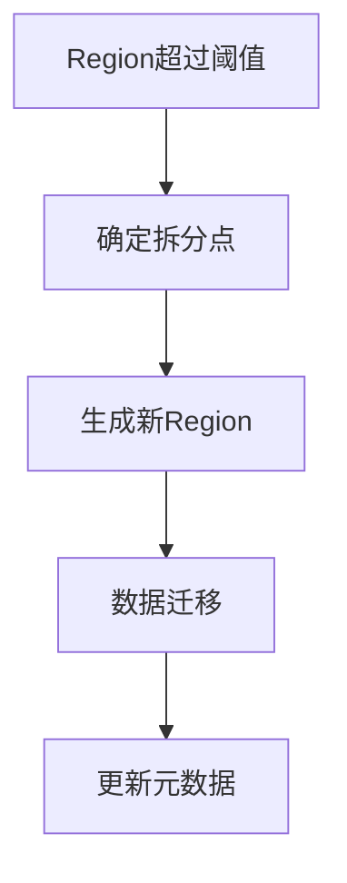
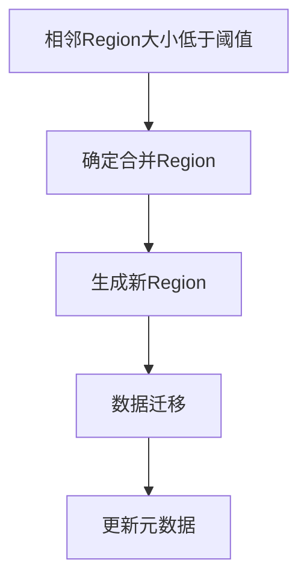

# HBase最佳实践:Region拆分与合并策略

## 1. 背景介绍

### 1.1 HBase简介

HBase是一个分布式、面向列的开源数据库，基于Google的Bigtable模型构建，运行在Hadoop HDFS之上。它能够处理大规模的数据存储和处理需求，特别适用于随机读写和高吞吐量的操作。HBase的设计目标是解决海量数据存储和快速访问的问题，为大数据应用提供高效的解决方案。

### 1.2 Region的概念

在HBase中，数据被分割成多个表格，每个表格又被分成多个Region。每个Region是表中一个连续的键范围，Region是HBase的最小分布单元。随着数据的增长，Region会自动分裂以均衡负载，但也需要适时地进行合并以优化性能。

### 1.3 Region拆分与合并的必要性

Region的拆分与合并是HBase性能优化的关键操作。合理的拆分和合并策略能够有效地均衡负载，避免单个Region过大或过小的问题，从而提升系统的整体性能和稳定性。

## 2. 核心概念与联系

### 2.1 Region拆分

Region拆分是指将一个较大的Region分成两个较小的Region。拆分通常在Region的大小超过预设阈值时自动触发。拆分后的两个Region会重新分配到不同的RegionServer，以实现负载均衡。

### 2.2 Region合并

Region合并是指将两个相邻的、较小的Region合并成一个较大的Region。合并通常在Region的大小低于预设阈值时触发。合并可以减少Region的数量，降低管理开销和系统复杂性。

### 2.3 拆分与合并的策略

拆分和合并策略主要包括自动策略和手动策略。自动策略由HBase内部机制根据预设阈值和规则自动执行，而手动策略则需要管理员根据具体情况进行干预和调整。

### 2.4 核心联系

拆分和合并是互补的操作，合理的策略需要在两者之间找到平衡点。过度拆分会导致Region数量过多，增加管理开销；而过度合并则会导致单个Region过大，影响性能。因此，制定合理的拆分与合并策略是HBase性能优化的关键。

## 3. 核心算法原理具体操作步骤

### 3.1 Region拆分算法

#### 3.1.1 拆分触发条件

HBase通过监控Region的大小来决定是否触发拆分。当Region的大小超过预设阈值（例如10GB）时，拆分操作会被触发。

#### 3.1.2 拆分点选择

拆分点的选择至关重要，通常拆分点会选择在Region的中间位置，以保证两个新Region的大小相对均衡。

#### 3.1.3 拆分过程

1. **确定拆分点**：计算Region的中间点作为拆分点。
2. **生成新Region**：根据拆分点生成两个新Region。
3. **数据迁移**：将原Region的数据迁移到两个新Region。
4. **更新元数据**：更新HBase的元数据，记录新的Region信息。



### 3.2 Region合并算法

#### 3.2.1 合并触发条件

HBase通过监控Region的大小来决定是否触发合并。当两个相邻Region的大小都低于预设阈值（例如1GB）时，合并操作会被触发。

#### 3.2.2 合并过程

1. **确定合并Region**：选择两个相邻且大小低于阈值的Region。
2. **生成新Region**：将两个Region合并成一个新Region。
3. **数据迁移**：将两个旧Region的数据迁移到新Region。
4. **更新元数据**：更新HBase的元数据，记录新的Region信息。



## 4. 数学模型和公式详细讲解举例说明

### 4.1 Region拆分模型

假设一个Region的大小为 $S$，预设的拆分阈值为 $T$。当 $S > T$ 时，拆分操作会被触发。拆分点 $P$ 通常选择在中间位置，即 $P = S / 2$。拆分后的两个Region大小分别为 $S_1 = P$ 和 $S_2 = S - P$。

$$
S_1 = \frac{S}{2}
$$

$$
S_2 = S - \frac{S}{2} = \frac{S}{2}
$$

### 4.2 Region合并模型

假设两个相邻Region的大小分别为 $S_1$ 和 $S_2$，预设的合并阈值为 $T$。当 $S_1 < T$ 且 $S_2 < T$ 时，合并操作会被触发。合并后的Region大小为 $S = S_1 + S_2$。

$$
S = S_1 + S_2
$$

### 4.3 举例说明

#### 4.3.1 拆分示例

假设一个Region的大小为20GB，预设的拆分阈值为10GB。由于20GB > 10GB，因此触发拆分操作。拆分点选择在10GB处，拆分后的两个Region大小分别为10GB。

#### 4.3.2 合并示例

假设两个相邻Region的大小分别为0.5GB和0.8GB，预设的合并阈值为1GB。由于0.5GB < 1GB且0.8GB < 1GB，因此触发合并操作。合并后的Region大小为1.3GB。

## 5. 项目实践：代码实例和详细解释说明

### 5.1 自动拆分配置

在HBase中，可以通过配置文件来设置自动拆分的阈值。以下是一个配置示例：

```xml
<property>
  <name>hbase.hregion.max.filesize</name>
  <value>10737418240</value> <!-- 10GB -->
</property>
```

### 5.2 手动拆分操作

手动拆分可以通过HBase Shell或者Java API来实现。以下是通过HBase Shell进行手动拆分的示例：

```shell
split 'my_table', 'split_point'
```

通过Java API进行手动拆分的示例：

```java
HBaseAdmin admin = new HBaseAdmin(conf);
admin.split("my_table", "split_point");
```

### 5.3 自动合并配置

在HBase中，可以通过配置文件来设置自动合并的阈值。以下是一个配置示例：

```xml
<property>
  <name>hbase.hregion.merge.size.threshold</name>
  <value>1073741824</value> <!-- 1GB -->
</property>
```

### 5.4 手动合并操作

手动合并可以通过HBase Shell或者Java API来实现。以下是通过HBase Shell进行手动合并的示例：

```shell
merge_region 'region_name1', 'region_name2'
```

通过Java API进行手动合并的示例：

```java
HBaseAdmin admin = new HBaseAdmin(conf);
admin.mergeRegions(regionName1, regionName2, false);
```

## 6. 实际应用场景

### 6.1 大数据分析

在大数据分析场景中，数据量巨大且增长迅速。合理的Region拆分策略能够确保数据均衡分布，提高查询和写入性能。

### 6.2 实时数据处理

在实时数据处理场景中，数据的读写频率高且要求低延迟。合理的Region合并策略能够减少Region数量，降低管理开销，提高系统响应速度。

### 6.3 日志存储与分析

在日志存储与分析场景中，数据量大且写入频繁。合理的Region拆分与合并策略能够确保数据的高效存储和快速访问。

## 7. 工具和资源推荐

### 7.1 HBase Shell

HBase Shell是HBase自带的命令行工具，支持大部分HBase操作，包括表管理、数据操作、Region拆分与合并等。

### 7.2 HBase Java API

HBase Java