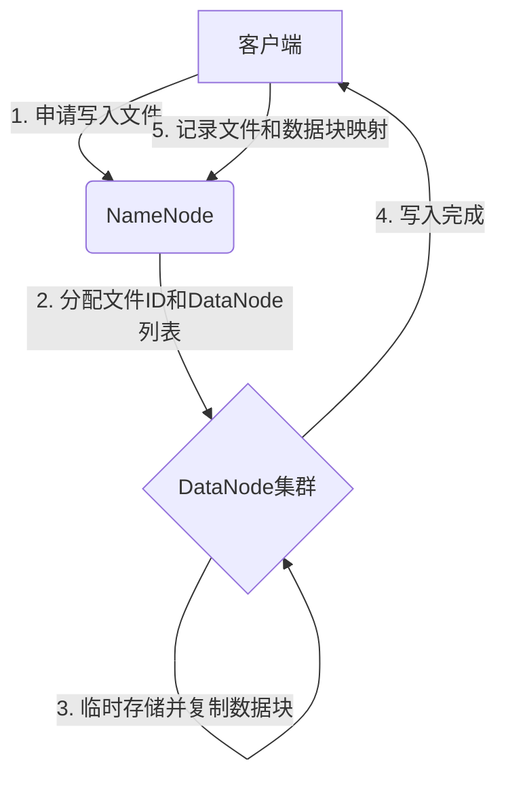
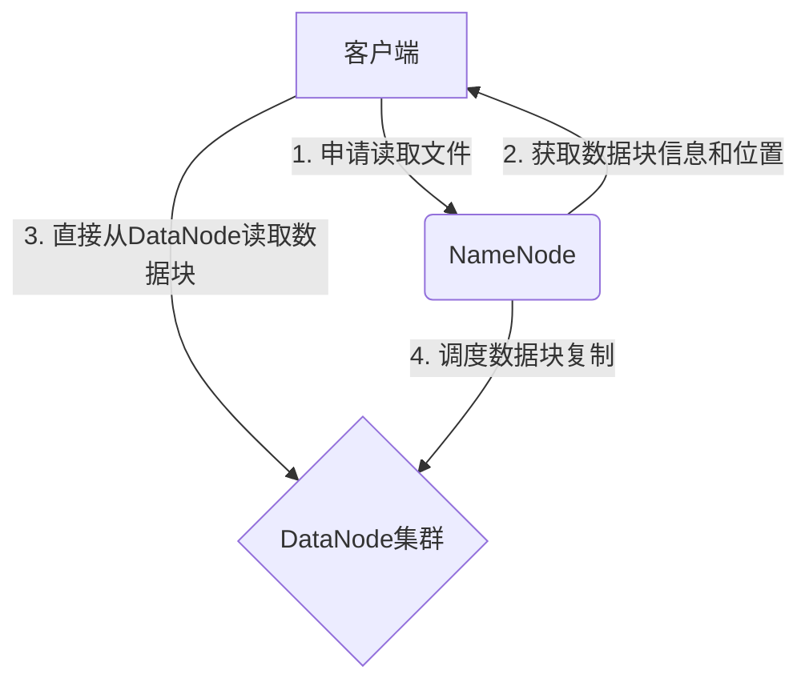

# HDFS原理与代码实例讲解

## 1.背景介绍

### 1.1 大数据时代的到来

随着互联网、物联网和移动互联网的快速发展,数据量呈现出爆炸式增长。传统的存储和计算系统已经无法满足大数据时代对海量数据存储和处理的需求。因此,一种全新的大数据处理架构应运而生。

### 1.2 大数据处理的挑战

大数据处理面临着诸多挑战:

- 海量数据存储
- 数据处理能力
- 数据可靠性
- 系统扩展性
- 成本效益

### 1.3 Hadoop的诞生

为了应对大数据带来的挑战,Google发布了两篇论文:《The Google File System》和《MapReduce:Simplified Data Processing on Large Clusters》,阐述了GFS和MapReduce分布式存储和计算框架。Apache Hadoop正是借鉴了GFS和MapReduce的设计思想,成为了大数据处理的开源解决方案。

### 1.4 HDFS概述

HDFS(Hadoop Distributed File System)是Hadoop的核心组件之一,是一种高度容错的分布式文件系统,设计用于存储大规模数据集,并为MapReduce等计算框架提供高吞吐量的数据访问。

## 2.核心概念与联系  

### 2.1 HDFS架构

HDFS遵循主从架构模式,包括以下三个重要组件:

1. **NameNode(NN)**:集群的主节点,管理文件系统的命名空间和客户端对文件的访问。
2. **DataNode(DN)**: 工作节点,负责存储实际数据块。
3. **SecondaryNameNode(2NN)**: 周期性合并NameNode的编辑日志,防止编辑日志过大。


### 2.2 文件块

HDFS将文件分割成一个个**块(Block)**,默认块大小为128MB。块复制到集群中的多个DataNode上,提供数据冗余存储,增强容错性。

### 2.3 命名空间

HDFS支持传统的层次化文件组织方式,NameNode维护整个文件系统的命名空间(namespace),记录文件到块的映射关系。

## 3.核心算法原理具体操作步骤

### 3.1 文件写入流程

1. 客户端向NameNode申请写入文件,NameNode进行文件创建检查。
2. NameNode为文件分配一个唯一的文件ID,并确定存储文件块的DataNode列表。
3. DataNode在本地临时存储数据块,并复制到其他DataNode。
4. 当数据块复制完成,客户端完成文件写入并关闭文件。
5. NameNode记录文件到数据块的映射关系。



### 3.2 文件读取流程

1. 客户端向NameNode申请读取文件。
2. NameNode获取文件的数据块信息和DataNode位置。
3. 客户端直接从DataNode读取数据块。
4. 如果数据块副本丢失,NameNode负责调度数据块复制。



### 3.3 心跳机制和副本放置策略

- **心跳机制**:每个DataNode周期性地向NameNode发送心跳信号,汇报自身状态。NameNode根据心跳信号监控集群健康状况。
- **副本放置策略**:HDFS采用机架感知副本放置策略,首选将副本存储在不同的机架上,提高容错能力和网络带宽利用率。

### 3.4 数据完整性

HDFS通过以下机制确保数据完整性:

- **检验和(Checksum)**:在写入数据块时计算并存储检验和,用于检测数据损坏。
- **副本复制**:多副本存储提高了数据可靠性。

## 4.数学模型和公式详细讲解举例说明

HDFS中采用了一些数学模型和公式来优化系统性能和数据可靠性,下面将对其进行详细讲解和举例说明。

### 4.1 数据块大小选择

HDFS默认的数据块大小为128MB,这是一个经过优化的值。数据块大小的选择需要权衡以下几个因素:

- 磁盘传输开销:较大的数据块可以减少磁盘寻址开销,提高磁盘传输效率。
- 复制开销:较小的数据块可以减少复制开销,提高复制效率。
- 内存占用:较大的数据块会占用更多内存。

假设磁盘传输速率为100MB/s,寻址时间为10ms,复制带宽为1Gb/s,内存大小为64GB。我们可以建立如下数学模型:

$$
T_{total} = T_{disk} + T_{network} + T_{mem}
$$

其中:

- $T_{disk}$是磁盘传输时间,等于$\frac{block\_size}{bandwidth} + seek\_time \times \frac{block\_size}{disk\_chunk\_size}$
- $T_{network}$是网络传输时间,等于$\frac{block\_size \times replication}{network\_bandwidth}$
- $T_{mem}$是内存占用时间,等于$\frac{block\_size \times replication}{mem\_size} \times mem\_delay$

通过对上述模型求解,可以得到一个最优的数据块大小,平衡磁盘、网络和内存之间的开销。

### 4.2 数据可靠性计算

HDFS通过存储多个副本来提高数据可靠性。假设每个数据块有N个副本,DataNode出现故障的概率为p,那么数据丢失的概率为:

$$
P_{data\_loss} = p^N
$$

例如,如果p=0.01,N=3,那么数据丢失的概率为0.000001,可靠性为99.9999%。

我们可以根据可靠性要求计算所需的副本数N:

$$
N = \log_{(1-p)}(P_{data\_loss})
$$

如果要求数据可靠性为99.9999%,p=0.01,那么需要至少3个副本。

## 4.项目实践:代码实例和详细解释说明

下面我们将通过一个实际的Java代码示例,演示如何使用HDFS客户端API进行文件的上传和下载操作。

### 4.1 Maven依赖

首先,我们需要在项目中添加Hadoop的Maven依赖:

```xml
<dependency>
    <groupId>org.apache.hadoop</groupId>
    <artifactId>hadoop-common</artifactId>
    <version>3.3.1</version>
</dependency>
<dependency>
    <groupId>org.apache.hadoop</groupId>
    <artifactId>hadoop-hdfs</artifactId>
    <version>3.3.1</version>
</dependency>
```

### 4.2 上传文件到HDFS

```java
import org.apache.hadoop.conf.Configuration;
import org.apache.hadoop.fs.FileSystem;
import org.apache.hadoop.fs.Path;

public class HDFSExample {
    public static void main(String[] args) throws Exception {
        // 配置HDFS文件系统
        Configuration conf = new Configuration();
        conf.set("fs.defaultFS", "hdfs://namenode:9000");
        FileSystem fs = FileSystem.get(conf);

        // 上传本地文件到HDFS
        Path localPath = new Path("/path/to/local/file.txt");
        Path hdfsPath = new Path("/path/in/hdfs/file.txt");
        fs.copyFromLocalFile(localPath, hdfsPath);

        // 关闭文件系统
        fs.close();
    }
}
```

代码解释:

1. 首先创建一个`Configuration`对象,设置HDFS的NameNode地址。
2. 通过`FileSystem.get(conf)`获取一个HDFS文件系统实例。
3. 使用`copyFromLocalFile`方法将本地文件上传到HDFS指定路径。
4. 最后关闭文件系统实例。

### 4.3 从HDFS下载文件

```java
import org.apache.hadoop.conf.Configuration;
import org.apache.hadoop.fs.FileSystem;
import org.apache.hadoop.fs.Path;
import org.apache.hadoop.io.IOUtils;

import java.io.FileOutputStream;

public class HDFSExample {
    public static void main(String[] args) throws Exception {
        // 配置HDFS文件系统
        Configuration conf = new Configuration();
        conf.set("fs.defaultFS", "hdfs://namenode:9000");
        FileSystem fs = FileSystem.get(conf);

        // 从HDFS下载文件到本地
        Path hdfsPath = new Path("/path/in/hdfs/file.txt");
        Path localPath = new Path("/path/to/local/file.txt");
        fs.copyToLocalFile(hdfsPath, localPath);

        // 关闭文件系统
        fs.close();
    }
}
```

代码解释:

1. 配置HDFS文件系统,获取文件系统实例。
2. 使用`copyToLocalFile`方法将HDFS上的文件下载到本地指定路径。
3. 最后关闭文件系统实例。

通过上面的代码示例,我们可以看到HDFS客户端API的使用非常简单,只需几行代码就可以完成文件的上传和下载操作。

## 5.实际应用场景

HDFS作为Apache Hadoop生态系统的核心组件,在许多大数据应用场景中发挥着重要作用:

1. **大数据分析**:HDFS为Hadoop生态系统中的大数据分析工具(如Hive、Spark)提供了可靠的数据存储和访问功能。
2. **网络爬虫**:HDFS可以存储互联网上海量的网页数据,为搜索引擎提供数据支持。
3. **日志分析**:HDFS可以存储和处理大量的日志数据,用于网站用户行为分析、系统监控等。
4. **科学计算**:HDFS可以存储和处理大规模的科学数据,如基因组数据、气象数据等。
5. **物联网**:HDFS可以存储和处理来自各种传感器的海量数据,为物联网应用提供支持。

## 6.工具和资源推荐

为了更好地学习和使用HDFS,以下是一些推荐的工具和资源:

1. **Apache Hadoop官网**:https://hadoop.apache.org/
2. **HDFS权威指南**:《Hadoop: The Definitive Guide》,由HDFS创始人之一Doug Cutting撰写。
3. **HDFS操作手册**:https://hadoop.apache.org/docs/stable/hadoop-project-dist/hadoop-hdfs/HdfsUserGuide.html
4. **HDFS命令行工具**:HDFS提供了丰富的命令行工具,如`hadoop fs`、`hdfs dfs`等。
5. **HDFS Web UI**:通过Web UI可以查看HDFS的状态和配置信息。
6. **HDFS监控工具**:如Hadoop自带的Ganglia、第三方工具Ambari等。

## 7.总结:未来发展趋势与挑战

HDFS作为大数据时代的分布式文件系统,已经得到了广泛的应用和发展。未来,HDFS将面临以下一些趋势和挑战:

1. **异构存储支持**:未来HDFS需要支持多种异构存储介质,如SSD、Intel Optane等,以提高性能和降低成本。
2. **安全性和隐私保护**:随着大数据应用的深入,HDFS需要提供更强大的安全性和隐私保护机制。
3. **云原生支持**:HDFS需要更好地支持云原生环境,实现与Kubernetes等容器编排系统的无缝集成。
4. **人工智能优化**:利用人工智能技术优化HDFS的数据存储、调度和管理,提高系统效率。
5. **元数据管理**:随着数据规模的不断增长,HDFS需要优化元数据管理机制,提高系统可扩展性。

## 8.附录:常见问题与解答

### 8.1 HDFS与传统文件系统的区别?

HDFS与传统文件系统的主要区别在于:

- **设计目标不同**:HDFS旨在存储大规模数据集,传统文件系统则侧重于通用文件存储。
- **数据复制机制**:HDFS通过复制多个副本提高数据可靠性,传统文件系统通常只有一个副本。
- **数据一致性**:HDFS针对大文件设计,采用了延迟写入数据一致性模