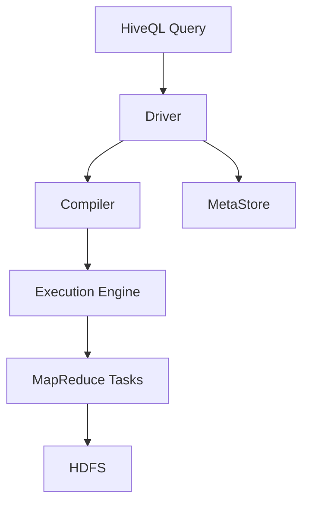
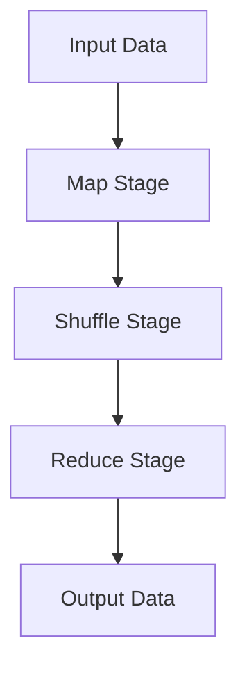

# HiveQL入门指南：从基础到实践

作者：禅与计算机程序设计艺术

## 1. 背景介绍

### 1.1 大数据时代的挑战与机遇

在大数据时代，数据的规模和复杂性日益增加，传统的关系型数据库在处理大规模数据时显得力不从心。为了应对这些挑战，Hadoop生态系统应运而生，其中Hive作为一个基于Hadoop的数仓工具，极大地简化了大数据的处理和分析过程。

### 1.2 Hive的诞生与发展

Apache Hive最初由Facebook开发，用于解决其海量数据的存储和处理问题。随着时间的推移，Hive逐渐被开源并成为Apache项目的一部分。Hive的核心是HiveQL，一种类似于SQL的查询语言，使得用户可以使用熟悉的SQL语法在Hadoop上进行数据查询。

### 1.3 文章目标与结构

本文旨在为读者提供一份全面的HiveQL入门指南，从基础概念到实际操作，再到项目实践，帮助读者全面掌握HiveQL的使用。文章结构如下：

1. 背景介绍
2. 核心概念与联系
3. 核心算法原理具体操作步骤
4. 数学模型和公式详细讲解举例说明
5. 项目实践：代码实例和详细解释说明
6. 实际应用场景
7. 工具和资源推荐
8. 总结：未来发展趋势与挑战
9. 附录：常见问题与解答

## 2. 核心概念与联系

### 2.1 HiveQL与SQL的关系

HiveQL（Hive Query Language）是Hive的查询语言，其语法与SQL（Structured Query Language）非常相似，旨在让熟悉SQL的用户能够快速上手。然而，HiveQL并不是SQL的完全替代品，两者在功能和性能上有一些重要的区别。

### 2.2 Hive架构概述

Hive的架构主要包括以下几个核心组件：

- **MetaStore**：存储关于数据表、分区、列等元数据的信息。
- **Driver**：负责解析、优化和执行HiveQL查询。
- **Compiler**：将HiveQL查询编译成MapReduce任务。
- **Execution Engine**：负责执行编译后的任务。
- **HDFS**：作为底层存储系统，存储实际的数据。

以下是Hive架构的Mermaid流程图：



### 2.3 数据模型与表结构

在Hive中，数据以表的形式组织，类似于关系型数据库。每个表由行和列组成，可以有分区和桶（bucket）以提高查询效率。分区是对表数据的逻辑划分，而桶是对分区数据的物理划分。

### 2.4 HiveQL基本语法

HiveQL的基本语法包括数据定义语言（DDL）、数据操作语言（DML）和数据查询语言（DQL）。以下是一些常见的HiveQL语句：

- 创建表：`CREATE TABLE`
- 插入数据：`INSERT INTO`
- 查询数据：`SELECT`
- 删除表：`DROP TABLE`

## 3. 核心算法原理具体操作步骤

### 3.1 查询优化

HiveQL查询的执行过程包括解析、优化和执行三个阶段。优化阶段是提高查询性能的关键，主要包括以下几个步骤：

- **选择最佳执行计划**：通过代价模型选择最优的执行计划。
- **谓词下推**：将过滤条件尽可能早地应用，以减少数据处理量。
- **列裁剪**：只读取查询所需的列，减少I/O操作。

### 3.2 执行计划生成

Hive将HiveQL查询编译成MapReduce任务，执行计划生成的过程包括以下几个步骤：

1. **语法解析**：将HiveQL查询解析成抽象语法树（AST）。
2. **语义分析**：检查查询的语义正确性。
3. **逻辑计划生成**：将AST转换成逻辑执行计划。
4. **物理计划生成**：将逻辑计划转换成物理执行计划，即MapReduce任务。

### 3.3 MapReduce任务执行

Hive的查询执行依赖于Hadoop的MapReduce框架，具体步骤如下：

1. **Map阶段**：将输入数据分割成小块，并对每个小块执行映射操作。
2. **Shuffle阶段**：对Map阶段的输出进行排序和分组。
3. **Reduce阶段**：对分组后的数据执行归约操作，生成最终结果。

以下是MapReduce任务执行流程的Mermaid流程图：



## 4. 数学模型和公式详细讲解举例说明

### 4.1 数据分区与分桶

在Hive中，数据分区和分桶是提高查询效率的重要手段。假设我们有一个包含用户点击数据的表，表结构如下：

```sql
CREATE TABLE user_clicks (
    user_id STRING,
    click_time TIMESTAMP,
    page_id STRING
)
PARTITIONED BY (date STRING)
CLUSTERED BY (user_id) INTO 10 BUCKETS;
```

#### 4.1.1 分区

分区是对表数据的逻辑划分，每个分区对应一个目录。假设我们按日期分区，查询某一天的数据时，Hive只需扫描该分区目录下的数据，避免了全表扫描。

$$
\text{Partition Size} = \frac{Total Data Size}{Number of Partitions}
$$

#### 4.1.2 分桶

分桶是对分区数据的物理划分，每个桶对应一个文件。假设我们按用户ID分桶，查询某个用户的数据时，Hive只需扫描对应的桶文件，进一步减少了数据扫描量。

$$
\text{Bucket Size} = \frac{Partition Size}{Number of Buckets}
$$

### 4.2 查询优化的数学模型

查询优化的核心是代价模型，通过估算不同执行计划的代价，选择最优的执行计划。代价模型通常包括以下几个方面：

- **I/O代价**：读取和写入数据的代价。
- **计算代价**：执行计算操作的代价。
- **网络代价**：数据在网络上传输的代价。

假设我们有一个查询需要从两个表中进行连接操作，其代价模型可以表示为：

$$
\text{Total Cost} = \text{IO Cost} + \text{Compute Cost} + \text{Network Cost}
$$

其中：

$$
\text{IO Cost} = \text{Read Cost} + \text{Write Cost}
$$

$$
\text{Compute Cost} = \text{CPU Cycles} \times \text{Cycle Cost}
$$

$$
\text{Network Cost} = \text{Data Size} \times \text{Transfer Cost}
$$

## 5. 项目实践：代码实例和详细解释说明

### 5.1 创建数据库和表

首先，我们需要创建一个数据库和表来存储数据。以下是创建数据库和表的HiveQL语句：

```sql
CREATE DATABASE IF NOT EXISTS mydb;

USE mydb;

CREATE TABLE IF NOT EXISTS user_clicks (
    user_id STRING,
    click_time TIMESTAMP,
    page_id STRING
)
PARTITIONED BY (date STRING)
CLUSTERED BY (user_id) INTO 10 BUCKETS;
```

### 5.2 加载数据

接下来，我们需要将数据加载到表中。假设我们有一个CSV文件包含用户点击数据，可以使用以下语句加载数据：

```sql
LOAD DATA LOCAL INPATH '/path/to/user_clicks.csv' INTO TABLE user_clicks PARTITION (date='2024-05-23');
```

### 5.3 查询数据

我们可以使用HiveQL查询数据，例如查询某个用户在特定日期的点击记录：

```sql
SELECT * FROM user_clicks WHERE user_id = '12345' AND date = '2024-05-23';
```

### 5.4 聚合查询

Hive支持多种聚合函数，例如计算某天每个页面的点击次数：

```sql
SELECT page_id, COUNT(*) as click_count FROM user_clicks WHERE date = '2024-05-23' GROUP BY page_id;
```

### 5.5 连接查询

Hive支持多表连接查询，例如查询用户点击记录与用户信息表的连接：

```sql
CREATE TABLE IF NOT EXISTS user_info (
    user_id STRING,
    user_name STRING,
    user_age INT
);

SELECT a.user_id, a.click_time, a.page_id, b.user_name, b.user_age
FROM user_clicks a
JOIN user_info