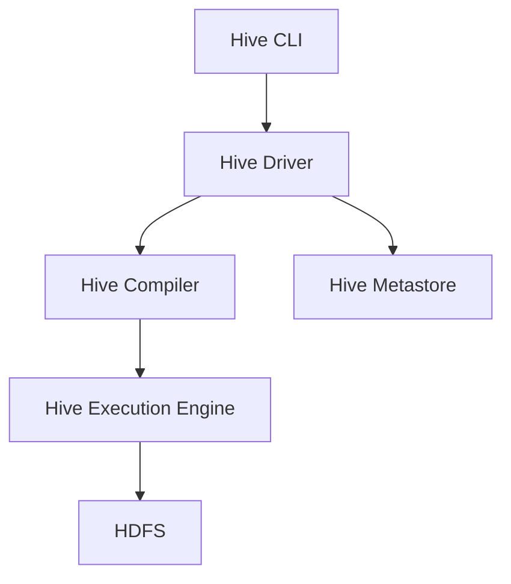

# Hive学习资源：开启Hive学习之旅

作者：禅与计算机程序设计艺术

## 1. 背景介绍

### 1.1 大数据时代的到来

在当今大数据时代，数据的爆炸性增长已经成为不可忽视的趋势。企业和组织每天都在生成和收集大量的数据，这些数据蕴含着巨大的商业价值。然而，如何有效地存储、处理和分析这些海量数据，成为了一个巨大的挑战。

### 1.2 Hive的诞生

为了应对这一挑战，Apache Hive应运而生。Hive是基于Hadoop的一个数据仓库工具，可以将结构化的数据文件映射为一张数据库表，并提供类SQL查询功能。它的设计目标是使得熟悉SQL的用户可以轻松地在Hadoop上进行大规模数据分析。

### 1.3 Hive的应用领域

Hive被广泛应用于各个行业，包括金融、电信、互联网、零售等。它的主要用途包括数据仓库、数据分析、数据挖掘等。通过Hive，用户可以轻松地在大规模数据集上执行复杂的查询和分析任务，从而挖掘出有价值的信息。

## 2. 核心概念与联系

### 2.1 Hive的基本架构

Hive的基本架构包括以下几个核心组件：

- **Hive CLI**：命令行接口，用户可以通过它提交Hive查询。
- **Hive Metastore**：元数据存储，保存表结构、分区信息等元数据。
- **Hive Driver**：驱动器，负责接收用户的查询，解析并生成执行计划。
- **Hive Compiler**：编译器，将HiveQL查询转换为MapReduce作业。
- **Hive Execution Engine**：执行引擎，负责执行编译后的MapReduce作业。



### 2.2 HiveQL与SQL的关系

HiveQL是Hive的查询语言，类似于SQL。它支持大部分SQL的语法和功能，但也有一些特定于Hive的扩展。例如，HiveQL支持表分区、桶、UDF（用户自定义函数）等功能，这些都是为了更好地处理大规模数据而设计的。

### 2.3 Hive与Hadoop的关系

Hive是基于Hadoop的一个数据仓库工具，依赖于Hadoop的分布式存储和计算能力。Hive的查询最终会被转换为MapReduce作业在Hadoop集群上运行，因此它可以处理海量数据并具有很高的扩展性。

## 3. 核心算法原理具体操作步骤

### 3.1 查询解析与优化

Hive的查询处理过程包括以下几个步骤：

1. **解析**：Hive Driver接收到用户的查询后，会调用解析器将HiveQL查询转换为抽象语法树（AST）。
2. **语义分析**：解析器会对AST进行语义分析，检查查询的合法性，并生成逻辑查询计划。
3. **优化**：优化器会对逻辑查询计划进行优化，例如谓词下推、列裁剪等。
4. **编译**：编译器会将优化后的逻辑查询计划转换为物理执行计划。
5. **执行**：执行引擎会根据物理执行计划生成MapReduce作业，并在Hadoop集群上运行。

### 3.2 数据加载与存储

Hive支持多种数据加载和存储方式，包括：

- **本地文件**：用户可以将本地文件加载到Hive表中。
- **HDFS文件**：用户可以将HDFS上的文件加载到Hive表中。
- **数据库导入**：用户可以通过Sqoop等工具将关系型数据库中的数据导入到Hive表中。

### 3.3 分区与桶

分区和桶是Hive中的两种数据组织方式：

- **分区**：将表按照某个字段的值划分为多个子目录，每个子目录对应一个分区。分区可以显著提高查询效率。
- **桶**：将表按照某个字段的哈希值划分为多个文件，每个文件对应一个桶。桶可以提高数据的分布均匀性和查询效率。

## 4. 数学模型和公式详细讲解举例说明

### 4.1 MapReduce模型

Hive的查询最终会被转换为MapReduce作业在Hadoop集群上运行。MapReduce模型包含两个主要阶段：Map阶段和Reduce阶段。

- **Map阶段**：输入数据被分割成若干个数据块，每个数据块由一个Map任务处理。Map任务会对数据进行预处理并生成中间结果。
- **Reduce阶段**：中间结果被分发给Reduce任务，Reduce任务对中间结果进行汇总和处理，生成最终结果。

$$
y = f(x) = \sum_{i=1}^{n} g(h(x_i))
$$

其中，$x$ 是输入数据，$y$ 是输出结果，$h(x_i)$ 是Map任务的处理结果，$g(h(x_i))$ 是Reduce任务的处理结果。

### 4.2 分区与桶的数学模型

分区和桶的数学模型可以用哈希函数和分区函数来表示：

- **分区函数**：将数据按照某个字段的值划分为多个分区。

$$
P(x) = \left\lfloor \frac{x}{n} \right\rfloor
$$

其中，$x$ 是分区字段的值，$n$ 是分区数量，$P(x)$ 是分区号。

- **哈希函数**：将数据按照某个字段的哈希值划分为多个桶。

$$
H(x) = x \mod n
$$

其中，$x$ 是桶字段的值，$n$ 是桶数量，$H(x)$ 是桶号。

## 5. 项目实践：代码实例和详细解释说明

### 5.1 创建Hive表

以下是一个创建Hive表的例子：

```sql
CREATE TABLE IF NOT EXISTS employees (
  id INT,
  name STRING,
  age INT,
  department STRING
)
ROW FORMAT DELIMITED
FIELDS TERMINATED BY ','
STORED AS TEXTFILE;
```

这段代码创建了一个名为`employees`的表，包含四个字段：`id`、`name`、`age`和`department`。数据文件的字段以逗号分隔，存储格式为文本文件。

### 5.2 加载数据到Hive表

以下是一个加载数据到Hive表的例子：

```sql
LOAD DATA LOCAL INPATH '/path/to/employees.csv' INTO TABLE employees;
```

这段代码将本地文件`/path/to/employees.csv`加载到`employees`表中。

### 5.3 查询Hive表

以下是一个查询Hive表的例子：

```sql
SELECT department, AVG(age) AS avg_age
FROM employees
GROUP BY department;
```

这段代码查询`employees`表，计算每个部门的平均年龄。

### 5.4 使用分区和桶

以下是一个使用分区和桶的例子：

```sql
CREATE TABLE IF NOT EXISTS employees_partitioned (
  id INT,
  name STRING,
  age INT
)
PARTITIONED BY (department STRING)
CLUSTERED BY (id) INTO 4 BUCKETS
ROW FORMAT DELIMITED
FIELDS TERMINATED BY ','
STORED AS TEXTFILE;
```

这段代码创建了一个分区表`employees_partitioned`，按照`department`字段进行分区，并按照`id`字段进行哈希分桶，每个分区包含4个桶。

## 6. 实际应用场景

### 6.1 数据仓库

Hive常用于构建企业数据仓库，将结构化和半结构化数据存储在HDFS中，并提供类SQL查询功能，方便数据分析和报表生成。

### 6.2 数据分析

Hive支持复杂的查询和分析操作，适用于大规模数据集的统计分析、数据挖掘和机器学习等任务。例如，可以使用Hive对用户行为数据进行分析，挖掘用户兴趣和偏好。

### 6.3 日志处理

Hive可以用于处理和分析服务器日志、应用日志等大规模日志数据。例如，可以使用Hive对Web服务器日志进行分析，统计访问量、用户来源等信息。

## 7. 工具和资源推荐

### 7.1 Hive客户端工具

- **Beeline**：Hive的命令行客户端，支持JDBC连接。
- **Hue**：一个Web界面，提供Hive查询和管理功能。
- **DBeaver**：一个通用的数据库管理工具，支持Hive连接。

### 7.2 Hive学习资源

- **官方文档**：Apache Hive的官方文档，详细介绍了Hive的安装、配置和使用方法。
- **在线教程**：网上有很多免费的Hive教程，例如Coursera、Udemy等平台提供的