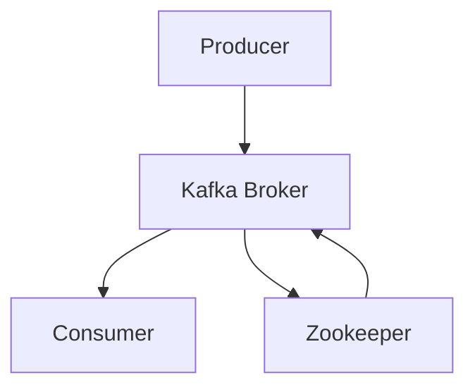

# Kafka原理与代码实例讲解

作者：禅与计算机程序设计艺术

## 1.背景介绍

在现代分布式系统中，数据流的处理和传输是至关重要的。Apache Kafka作为一个高吞吐量、低延迟、分布式的消息队列系统，已经成为大数据生态系统中的关键组件。Kafka最初由LinkedIn开发，并于2011年开源。其设计目标是为实时数据流提供一个高性能、容错的解决方案。

Kafka的核心理念是将数据流模型化为一个可持久化的日志，允许消费者以自己的速度读取数据。这种模型不仅适用于日志收集和监控系统，还适用于事件驱动的架构、数据流处理和数据集成等多种场景。

### 1.1 Kafka的历史与发展

Kafka最初由LinkedIn的Jay Kreps、Neha Narkhede和Jun Rao开发，旨在解决公司内部数据流处理的需求。随着Kafka的开源和不断发展，它逐渐成为大数据处理领域的标准工具。Kafka的成功离不开其社区的贡献和不断的迭代更新，从最早的0.7版本到如今的2.x版本，每一次更新都带来了性能和功能上的提升。

### 1.2 Kafka的基本架构

Kafka的架构主要由以下几个组件组成：

- **Producer**：生产者，负责将数据发布到Kafka的主题（Topic）。
- **Consumer**：消费者，负责从Kafka的主题中读取数据。
- **Broker**：Kafka服务器，负责数据的存储和传输。
- **Zookeeper**：用于管理Kafka集群的元数据和分布式协调。

这些组件共同协作，确保数据在集群中的可靠传输和持久化。



## 2.核心概念与联系

要深入理解Kafka的工作原理，需要掌握其核心概念及其相互关系。

### 2.1 主题（Topic）

主题是Kafka中数据的逻辑分类单元。每个主题可以有多个分区（Partition），每个分区是一个有序且不可变的消息序列。生产者将消息发布到特定的主题，而消费者从特定的主题中读取消息。

### 2.2 分区（Partition）

分区是Kafka实现水平扩展和高可用性的关键。每个分区是一个独立的日志文件，消息在分区中按顺序追加。分区的存在允许Kafka在多台服务器上分布存储数据，提高了系统的吞吐量和容错性。

### 2.3 偏移量（Offset）

偏移量是每个分区中消息的唯一标识符。消费者通过偏移量来跟踪自己读取到的位置。Kafka不会主动删除消息，消费者可以根据需要重新读取消息。

### 2.4 副本（Replica）

为了提高数据的可靠性，Kafka允许每个分区有多个副本。副本分布在不同的Broker上，确保即使某个Broker失效，数据仍然可用。

### 2.5 消费者组（Consumer Group）

消费者组是Kafka中实现消息广播和负载均衡的机制。每个消费者组中的消费者共同消费一个主题的消息，每条消息只会被一个组内的消费者处理。通过这种机制，Kafka实现了消息的并行处理和负载均衡。

## 3.核心算法原理具体操作步骤

Kafka的高性能和高可用性源于其独特的设计和核心算法。下面我们详细探讨Kafka的核心算法及其操作步骤。

### 3.1 数据写入流程

数据写入Kafka的流程如下：

1. **生产者选择分区**：生产者根据配置选择将消息写入哪个分区。可以是轮询、随机选择或基于某个键的哈希值。
2. **发送消息到Broker**：生产者将消息发送到对应分区的Leader Broker。
3. **消息持久化**：Leader Broker将消息追加到分区日志文件中，并将消息同步到Follower Broker。
4. **确认消息写入成功**：当消息被所有副本成功持久化后，Leader Broker向生产者发送确认。

### 3.2 数据读取流程

数据读取Kafka的流程如下：

1. **消费者组协调**：消费者组中的消费者通过Zookeeper协调，确保每个分区只被一个消费者读取。
2. **拉取消息**：消费者向对应分区的Leader Broker请求拉取消息。
3. **处理消息**：消费者处理拉取到的消息，并提交偏移量。
4. **提交偏移量**：消费者将处理完的消息偏移量提交到Zookeeper或Kafka内部存储。

### 3.3 副本同步机制

Kafka通过副本同步机制保证数据的高可用性：

1. **Leader选举**：每个分区有一个Leader Broker和多个Follower Broker。Leader负责处理读写请求。
2. **同步副本**：Follower定期从Leader拉取最新的消息，保持数据同步。
3. **ISR（同步副本集合）**：ISR包含所有与Leader保持同步的Follower。当Leader失效时，从ISR中选举新的Leader。

## 4.数学模型和公式详细讲解举例说明

Kafka的核心算法可以通过数学模型和公式来描述，帮助我们更好地理解其内部机制。

### 4.1 分区选择算法

分区选择是生产者将消息写入Kafka时的重要步骤。假设有 $N$ 个分区，消息的键为 $k$，则分区选择算法可以表示为：

$$
partition = hash(k) \% N
$$

其中，$hash(k)$ 是对键 $k$ 进行哈希计算的结果。

### 4.2 副本同步模型

副本同步模型可以用以下公式表示：

$$
L(t) = F(t) + R(t)
$$

其中，$L(t)$ 表示时间 $t$ 时刻Leader的日志，$F(t)$ 表示Follower的日志，$R(t)$ 表示副本间的延迟。

### 4.3 消费者偏移量管理

消费者偏移量管理可以用以下公式表示：

$$
O_c(t) = O_c(t-1) + \Delta O
$$

其中，$O_c(t)$ 表示时间 $t$ 时刻消费者 $c$ 的偏移量，$\Delta O$ 表示消费者在时间间隔内处理的消息数。

## 5.项目实践：代码实例和详细解释说明

为了更好地理解Kafka的工作原理，我们通过一个简单的项目实例来展示Kafka的使用。

### 5.1 环境准备

首先，我们需要安装Kafka和Zookeeper。可以通过以下命令下载和启动Kafka：

```sh
# 下载Kafka
wget https://downloads.apache.org/kafka/2.8.0/kafka_2.13-2.8.0.tgz
tar -xzf kafka_2.13-2.8.0.tgz
cd kafka_2.13-2.8.0

# 启动Zookeeper
bin/zookeeper-server-start.sh config/zookeeper.properties

# 启动Kafka
bin/kafka-server-start.sh config/server.properties
```

### 5.2 创建主题

创建一个名为`test-topic`的主题：

```sh
bin/kafka-topics.sh --create --topic test-topic --bootstrap-server localhost:9092 --partitions 3 --replication-factor 1
```

### 5.3 生产者代码示例

下面是一个简单的生产者代码示例，使用Python的`kafka-python`库：

```python
from kafka import KafkaProducer

producer = KafkaProducer(bootstrap_servers='localhost:9092')

for i in range(10):
    producer.send('test-topic', key=b'key', value=b'value %d' % i)

producer.flush()
```

### 5.4 消费者代码示例

下面是一个简单的消费者代码示例，使用Python的`kafka-python`库：

```python
from kafka import KafkaConsumer

consumer = KafkaConsumer('test-topic', bootstrap_servers='localhost:9092', auto_offset_reset='earliest')

for message in consumer:
    print(f"Key: {message.key}, Value: {message.value}, Offset: {message.offset}")
```

### 5.5 代码解释

在生产者代码中，我们创建了一个`KafkaProducer`实例，并使用`send`方法将消息发送到`test-topic`。在消费者代码中，我们创建了一个`KafkaConsumer`实例，并使用`for`循环读取消息。

## 6.实际应用场景

Kafka在实际应用中有着广泛的应用场景，下面列举几个典型案例。

### 6.1 日志收集和监控

Kafka可以用来收集和传输分布式系统中的日志数据。通过Kafka，日志数据可以实时传输到集中式存储系统，如Elasticsearch或Hadoop，进行后续分析和监控。

### 6.2 实时