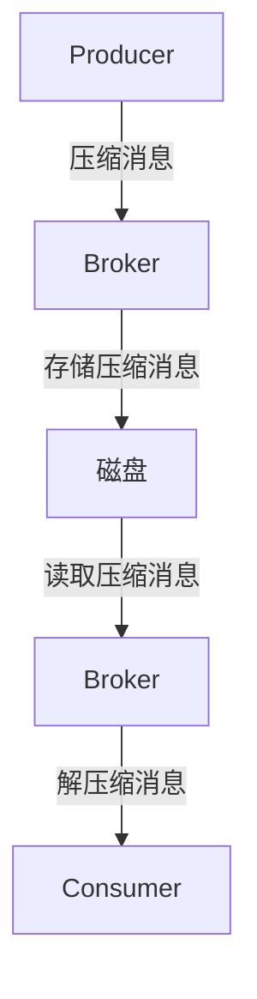

# Kafka消息压缩:提升传输效率与存储容量

作者：禅与计算机程序设计艺术

## 1. 背景介绍

### 1.1 Kafka的诞生与发展

Apache Kafka是由LinkedIn开发并于2011年开源的分布式流处理平台。其设计初衷是为了处理LinkedIn内部庞大的数据流，并在数据传输和处理方面表现出了卓越的性能和可靠性。如今，Kafka已成为大数据处理和实时数据流传输的核心工具，被广泛应用于各种行业和应用场景。

### 1.2 消息压缩的重要性

随着数据量的爆炸式增长，如何高效地传输和存储数据成为了一个关键问题。消息压缩技术通过减少数据的体积，提高了传输效率和存储容量，进而降低了带宽和存储成本。对于Kafka这样一个高吞吐量的数据流平台，消息压缩显得尤为重要。

### 1.3 目标与意义

本文旨在深入探讨Kafka消息压缩的核心概念、算法原理、数学模型、项目实践以及实际应用场景。通过对这些内容的详细解析，帮助读者更好地理解和应用Kafka消息压缩技术，从而提升系统的整体性能。

## 2. 核心概念与联系

### 2.1 Kafka的基本架构

Kafka的架构主要包括Producer、Broker、Consumer和Zookeeper四个核心组件。Producer负责生成消息并发送到Kafka集群，Broker是Kafka的服务器端，负责接收并存储消息，Consumer从Broker中消费消息，Zookeeper则负责管理Kafka集群的元数据和协调工作。

### 2.2 消息压缩的基本概念

消息压缩是指通过特定的算法，将原始数据转换为更小体积的数据，以减少传输和存储的开销。常见的压缩算法包括Gzip、Snappy、LZ4等。Kafka支持在Producer端进行消息压缩，并在Consumer端进行解压缩。

### 2.3 Kafka消息压缩的工作流程

Kafka消息压缩的工作流程如下：

1. **Producer端压缩**：Producer在发送消息前，先对消息进行压缩。
2. **Broker端存储**：Broker接收到压缩后的消息，并将其存储在磁盘中。
3. **Consumer端解压**：Consumer从Broker中消费消息，并在消费前对消息进行解压缩。

以下是Kafka消息压缩的Mermaid流程图：



## 3. 核心算法原理具体操作步骤

### 3.1 压缩算法介绍

Kafka支持多种压缩算法，以下是几种常用的压缩算法及其特点：

- **Gzip**：基于DEFLATE算法，压缩率高，但压缩和解压缩速度较慢。
- **Snappy**：由Google开发，压缩和解压缩速度快，但压缩率较低。
- **LZ4**：压缩和解压缩速度极快，压缩率介于Gzip和Snappy之间。

### 3.2 压缩与解压缩操作步骤

#### 3.2.1 Producer端压缩

1. **选择压缩算法**：在Producer配置中选择合适的压缩算法，如Gzip、Snappy或LZ4。
2. **压缩消息**：在发送消息前，调用对应的压缩算法对消息进行压缩。
3. **发送压缩消息**：将压缩后的消息发送到Kafka Broker。

#### 3.2.2 Broker端存储

1. **接收消息**：Broker接收到Producer发送的压缩消息。
2. **存储消息**：将压缩后的消息存储在磁盘中。

#### 3.2.3 Consumer端解压缩

1. **读取消息**：Consumer从Broker中读取压缩消息。
2. **解压消息**：调用对应的解压缩算法对消息进行解压缩。
3. **处理消息**：对解压缩后的消息进行处理。

## 4. 数学模型和公式详细讲解举例说明

### 4.1 压缩率计算

压缩率是衡量压缩算法性能的一个重要指标，定义为压缩后数据大小与压缩前数据大小的比值。公式如下：

$$
R = \frac{S_{compressed}}{S_{original}}
$$

其中，$R$为压缩率，$S_{compressed}$为压缩后数据大小，$S_{original}$为压缩前数据大小。

### 4.2 压缩时间与解压缩时间

压缩时间和解压缩时间是另一个重要指标，分别表示数据压缩和解压缩所需的时间。假设压缩时间为$T_{compress}$，解压缩时间为$T_{decompress}$，数据大小为$S$，则可以用以下公式表示：

$$
T_{compress} = f_{compress}(S)
$$

$$
T_{decompress} = f_{decompress}(S)
$$

其中，$f_{compress}$和$f_{decompress}$分别为压缩和解压缩时间的函数。

### 4.3 实例说明

假设有一条原始消息，其大小为10MB，使用Gzip算法进行压缩后，大小为2MB。则压缩率$R$为：

$$
R = \frac{2MB}{10MB} = 0.2
$$

假设压缩时间为0.5秒，解压缩时间为0.2秒，则：

$$
T_{compress} = 0.5 \text{秒}
$$

$$
T_{decompress} = 0.2 \text{秒}
$$

通过以上计算，可以看出Gzip算法在该实例中的压缩率为0.2，压缩时间为0.5秒，解压缩时间为0.2秒。

## 4. 项目实践：代码实例和详细解释说明

### 4.1 环境准备

在进行Kafka消息压缩的项目实践前，需要准备以下环境：

1. **Kafka集群**：安装并配置Kafka集群。
2. **Java开发环境**：安装JDK和相关开发工具。
3. **Kafka客户端**：使用Kafka提供的Java客户端库。

### 4.2 Producer端代码示例

以下是一个使用Java编写的Kafka Producer端代码示例，演示如何进行消息压缩：

```java
import org.apache.kafka.clients.producer.KafkaProducer;
import org.apache.kafka.clients.producer.ProducerConfig;
import org.apache.kafka.clients.producer.ProducerRecord;
import org.apache.kafka.common.serialization.StringSerializer;

import java.util.Properties;

public class KafkaProducerExample {
    public static void main(String[] args) {
        Properties props = new Properties();
        props.put(ProducerConfig.BOOTSTRAP_SERVERS_CONFIG, "localhost:9092");
        props.put(ProducerConfig.KEY_SERIALIZER_CLASS_CONFIG, StringSerializer.class.getName());
        props.put(ProducerConfig.VALUE_SERIALIZER_CLASS_CONFIG, StringSerializer.class.getName());
        props.put(ProducerConfig.COMPRESSION_TYPE_CONFIG, "gzip"); // 设置压缩算法为Gzip

        KafkaProducer<String, String> producer = new KafkaProducer<>(props);

        for (int i = 0; i < 100; i++) {
            ProducerRecord<String, String> record = new ProducerRecord<>("my-topic", "key-" + i, "value-" + i);
            producer.send(record);
        }

        producer.close();
    }
}
```

### 4.3 Consumer端代码示例

以下是一个使用Java编写的Kafka Consumer端代码示例，演示如何消费压缩消息：

```java
import org.apache.kafka.clients.consumer.ConsumerConfig;
import org.apache.kafka.clients.consumer.ConsumerRecords;
import org.apache.kafka.clients.consumer.KafkaConsumer;
import org.apache.kafka.clients.consumer.KafkaConsumer;
import org.apache.kafka.clients.consumer.ConsumerRecords;
import org.apache.kafka.clients.consumer.ConsumerRecord;
import org.apache.kafka.common.serialization.StringDeserializer;
import java.util.Collections;
import java.util.Properties;

public class KafkaConsumerExample {
    public static void main(String[] args) {
        Properties props = new Properties();
        props.put(ConsumerConfig.BOOTSTRAP_SERVERS_CONFIG, "localhost:9092");
        props.put(ConsumerConfig.KEY_DESERIALIZER_CLASS_CONFIG, StringDeserializer.class.getName());
        props.put(ConsumerConfig.VALUE_DESERIALIZER_CLASS_CONFIG, StringDeserializer.class.getName());
        props.put(ConsumerConfig.GROUP_ID_CONFIG, "my-group");

        KafkaConsumer<String, String> consumer = new KafkaConsumer<>(props);
        consumer.subscribe(Collections.singletonList("my-topic"));

        while (true) {
            ConsumerRecords<String, String> records = consumer.poll(100);
            for (ConsumerRecord<String, String> record : records) {
                System.out.printf("offset = %d, key = %s, value = %s%n", record.offset(), record.key(), record.value());
           