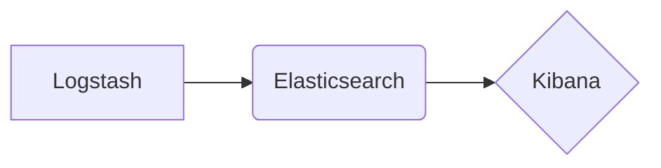

## Kibana原理与代码实例讲解

### 1. 背景介绍

#### 1.1 数据可视化的意义

在当今信息爆炸的时代，海量数据的产生和积累已经成为常态。如何从这些数据中提取有价值的信息，并以直观、易懂的方式呈现出来，成为了各个领域都面临的挑战。数据可视化技术应运而生，它能够将抽象的数据转化为图形、图表等可视化形式，帮助人们更好地理解数据、洞察数据背后的规律和趋势。

#### 1.2 Kibana的诞生背景

 Elasticsearch是一款开源的分布式搜索和分析引擎，以其高性能、可扩展性和实时性而闻名。然而，Elasticsearch本身并不提供数据可视化的功能。为了弥补这一不足，Elastic公司开发了Kibana，一个开源的数据可视化平台，与Elasticsearch无缝集成，为用户提供丰富的数据可视化功能。

#### 1.3 Kibana的优势和特点

- **易用性:** Kibana 提供了简单易用的图形界面，用户无需编写代码即可创建各种类型的图表和仪表盘。
- **灵活性:** Kibana 支持多种数据源，包括 Elasticsearch、Logstash、Beats 等，用户可以根据自己的需求选择合适的数据源。
- **可扩展性:** Kibana 提供了丰富的插件机制，用户可以根据自己的需求扩展 Kibana 的功能。
- **实时性:** Kibana 可以实时地展示 Elasticsearch 中的数据，用户可以及时地了解数据的变化趋势。

### 2. 核心概念与联系

#### 2.1 Elasticsearch、Logstash、Kibana (ELK) 架构

ELK是Elasticsearch、Logstash、Kibana三个开源软件的缩写，它们共同构成了一个强大的数据分析平台。

- **Elasticsearch:** 负责存储和索引数据，并提供快速的数据搜索和分析能力。
- **Logstash:** 负责收集、解析和转换各种格式的数据，并将数据发送到 Elasticsearch 中。
- **Kibana:** 负责将 Elasticsearch 中的数据以可视化的方式展示出来。

##### 2.1.1  ELK 架构图



##### 2.1.2 数据流转过程

1. Logstash 从各种数据源收集数据，例如日志文件、数据库、消息队列等。
2. Logstash 对收集到的数据进行解析、转换和过滤，并将数据转换为 Elasticsearch 能够识别的格式。
3. Logstash 将处理后的数据发送到 Elasticsearch 中进行索引和存储。
4. 用户可以使用 Kibana 连接到 Elasticsearch，并创建各种类型的图表和仪表盘来可视化数据。

#### 2.2 Kibana中的关键概念

- **索引 (Index):** Elasticsearch 中存储数据的逻辑单元，类似于关系型数据库中的表。
- **文档 (Document):** 索引中的最小数据单元，类似于关系型数据库中的行。
- **字段 (Field):** 文档中的一个属性，类似于关系型数据库中的列。
- **可视化 (Visualization):** Kibana 中用于展示数据的图形组件，例如柱状图、折线图、饼图等。
- **仪表盘 (Dashboard):**  将多个可视化组件组合在一起，形成一个统一的视图，用于展示数据的整体情况。

### 3. 核心算法原理与操作步骤

#### 3.1 数据查询与过滤

Kibana 提供了强大的数据查询和过滤功能，用户可以使用 Lucene 查询语法来精确地查找所需的数据。

##### 3.1.1 Lucene 查询语法

Lucene 查询语法是一种用于在 Elasticsearch 中搜索数据的查询语言。它支持多种查询类型，例如：

- **词条查询 (Term Query):**  查找包含指定词条的文档。
- **短语查询 (Phrase Query):** 查找包含指定短语的文档。
- **通配符查询 (Wildcard Query):** 使用通配符 (*, ?) 来查找匹配特定模式的文档。
- **范围查询 (Range Query):** 查找指定范围内的数值或日期类型字段的文档。

##### 3.1.2  Kibana 查询界面

Kibana 提供了可视化的查询界面，用户可以使用下拉菜单、文本框和滑块等控件来构建复杂的查询条件，而无需编写 Lucene 查询语句。

#### 3.2 数据聚合与分析

Kibana 提供了丰富的聚合函数，用户可以对数据进行分组、统计和分析。

##### 3.2.1 常用聚合函数

- **计数 (Count):** 统计文档的数量。
- **求和 (Sum):** 计算数值类型字段的总和。
- **平均值 (Average):** 计算数值类型字段的平均值。
- **最大值 (Max):** 查找数值类型字段的最大值。
- **最小值 (Min):** 查找数值类型字段的最小值。

##### 3.2.2 聚合操作步骤

1. 选择要进行聚合的字段。
2. 选择要使用的聚合函数。
3. 设置聚合的条件，例如分组字段、时间范围等。
4. Kibana 会根据设置的条件对数据进行聚合，并将结果展示在图表中。

### 4. 数学模型和公式详细讲解举例说明

#### 4.1  时间序列分析

时间序列分析是 Kibana 中常用的数据分析方法之一，它可以用于分析数据随时间变化的趋势。

##### 4.1.1 移动平均模型

移动平均模型是一种简单的时间序列分析方法，它使用过去一段时间内的平均值来预测未来的值。

######  公式

$$
\hat{y}_{t} = \frac{y_{t-1} + y_{t-2} + ... + y_{t-n}}{n}
$$

其中:

- $\hat{y}_{t}$ 是时间点 $t$ 的预测值。
- $y_{t-1}, y_{t-2}, ..., y_{t-n}$ 是过去 $n$ 个时间点的实际值。
- $n$ 是移动平均的窗口大小。

######  例子

假设我们要预测未来 3 天的网站访问量，可以使用过去 7 天的访问量来计算移动平均值。

| 日期 | 访问量 |
|---|---|
| 2024-05-15 | 100 |
| 2024-05-16 | 120 |
| 2024-05-17 | 130 |
| 2024-05-18 | 110 |
| 2024-05-19 | 140 |
| 2024-05-20 | 150 |
| 2024-05-21 | 160 |

```
2024-05-22 的预测访问量 = (100 + 120 + 130 + 110 + 140 + 150 + 160) / 7 = 130
2024-05-23 的预测访问量 = (120 + 130 + 110 + 140 + 150 + 160 + 130) / 7 = 134.3
2024-05-24 的预测访问量 = (130 + 110 + 140 + 150 + 160 + 130 + 134.3) / 7 = 136.2
```

#### 4.2  机器学习模型可视化

Kibana 可以与 Elasticsearch 的机器学习功能集成，将机器学习模型的训练结果和预测结果可视化。

##### 4.2.1  异常检测

异常检测是一种常见的机器学习应用，它可以用于识别数据中的异常点。

######  例子

假设我们有一组服务器 CPU 使用率的数据，可以使用 Kibana 的机器学习功能来训练一个异常检测模型，并使用 Kibana 可视化模型的预测结果。

##### 4.2.2  预测分析

预测分析是另一种常见的机器学习应用，它可以用于预测未来的趋势。

######  例子

假设我们有一组网站访问量的数据，可以使用 Kibana 的机器学习功能来训练一个预测模型，并使用 Kibana 可视化模型的预测结果。

### 5. 项目实践：代码实例和详细解释说明

#### 5.1 安装和配置 Kibana

##### 5.1.1 下载 Kibana

从 Elastic 官方网站下载 Kibana 的最新版本。

##### 5.1.2  安装 Kibana

解压下载的 Kibana 安装包，并运行安装脚本。

##### 5.1.3  配置 Kibana

修改 Kibana 的配置文件 `kibana.yml`，配置 Elasticsearch 的连接信息和其他参数。

#### 5.2  创建可视化

##### 5.2.1  连接到 Elasticsearch

启动 Kibana，并使用浏览器访问 Kibana 的 Web 界面。在 Web 界面中，输入 Elasticsearch 的连接信息，并点击 "Connect" 按钮连接到 Elasticsearch。

##### 5.2.2  选择数据源

连接到 Elasticsearch 后，选择要用于创建可视化的索引和字段。

##### 5.2.3  选择图表类型

Kibana 提供了多种图表类型，例如柱状图、折线图、饼图等，选择最适合展示数据的图表类型。

##### 5.2.4  配置图表参数

根据选择的图表类型，配置图表的参数，例如标题、坐标轴、图例等。

##### 5.2.5  保存可视化

配置完成后，保存可视化，以便后续使用。

#### 5.3  创建仪表盘

##### 5.3.1  添加可视化

创建一个新的仪表盘，并将之前创建的可视化添加到仪表盘中。

##### 5.3.2  排列布局

调整可视化在仪表盘中的位置和大小，以便更好地展示数据。

##### 5.3.3  添加过滤器

添加过滤器，以便用户可以根据自己的需求筛选数据。

##### 5.3.4  保存仪表盘

配置完成后，保存仪表盘，以便后续使用。

### 6. 实际应用场景

#### 6.1  日志分析

Kibana 可以用于分析各种类型的日志数据，例如 Web 服务器日志、应用程序日志、安全日志等。通过对日志数据的可视化分析，可以帮助用户及时发现系统故障、安全威胁等问题。

#### 6.2  业务监控

Kibana 可以用于监控业务系统的运行状况，例如网站访问量、订单数量、用户行为等。通过对业务数据的可视化分析，可以帮助用户了解业务的运行趋势，及时发现业务问题并进行优化。

#### 6.3  安全分析

Kibana 可以用于分析安全事件数据，例如入侵检测系统 (IDS) 数据、安全信息和事件管理 (SIEM) 数据等。通过对安全数据的可视化分析，可以帮助用户及时发现安全威胁，并采取相应的措施进行防御。

### 7. 工具和资源推荐

#### 7.1  Elastic 官方文档

Elastic 官方文档提供了 Kibana 的详细文档，包括安装指南、用户手册、API 文档等。

#### 7.2  Kibana 社区

Kibana 社区是一个活跃的技术社区，用户可以在社区中交流 Kibana 的使用经验、分享 Kibana 的最佳实践、获取 Kibana 的技术支持等。

#### 7.3  第三方工具

除了 Elastic 官方提供的工具和资源外，还有一些第三方工具可以帮助用户更好地使用 Kibana，例如：

- **Kibana Lens:** Kibana Lens 是 Elastic 公司开发的一款可视化工具，它提供了一种更加直观、易用的方式来创建 Kibana 可视化。
- **Grafana:** Grafana 是一款开源的数据可视化平台，它支持多种数据源，包括 Elasticsearch、Prometheus、InfluxDB 等。

### 8. 总结：未来发展趋势与挑战

#### 8.1  未来发展趋势

- **更加智能化的可视化:** 随着人工智能技术的不断发展，Kibana 将会集成更多的机器学习算法，为用户提供更加智能化的可视化分析功能。
- **更加实时的数据分析:** 随着物联网、实时流处理等技术的不断发展，Kibana 将会更加注重实时数据的分析和展示。
- **更加丰富的可视化组件:** Kibana 将会提供更加丰富的可视化组件，以满足用户多样化的数据可视化需求。

#### 8.2  挑战

- **数据安全:** 随着数据量的不断增大和数据类型的不断丰富，Kibana 需要更加注重数据的安全性和隐私保护。
- **性能优化:** 随着数据量的不断增大，Kibana 需要不断优化其性能，以确保用户能够获得良好的使用体验。
- **易用性提升:** 虽然 Kibana 已经提供了简单易用的图形界面，但是对于一些复杂的分析任务，用户仍然需要具备一定的技术基础。因此，Kibana 需要不断提升其易用性，以降低用户的学习成本。

### 9. 附录：常见问题与解答

#### 9.1  如何连接到 Elasticsearch?

在 Kibana 的 Web 界面中，输入 Elasticsearch 的连接信息，并点击 "Connect" 按钮连接到 Elasticsearch。

#### 9.2  如何创建可视化?

在 Kibana 的 Web 界面中，选择 "Visualize" 菜单，然后选择要创建的可视化类型。

#### 9.3  如何创建仪表盘?

在 Kibana 的 Web 界面中，选择 "Dashboard" 菜单，然后点击 "Create new dashboard" 按钮创建新的仪表盘。