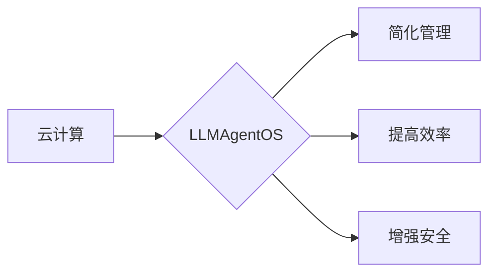

# LLMAgentOS与云计算的完美结合:无缝集成云服务

作者：禅与计算机程序设计艺术

## 1. 背景介绍

### 1.1 云计算的兴起与挑战

近年来，云计算作为一种革命性的计算模式，凭借其按需服务、弹性扩展、资源共享等优势，得到了越来越广泛的应用。然而，随着云计算应用的深入和复杂度的提高，也带来了新的挑战：

* **云服务管理复杂**: 不同的云服务提供商拥有不同的API和管理工具，用户需要花费大量时间和精力学习和管理不同的云平台。
* **应用程序迁移困难**: 将应用程序迁移到云平台需要进行大量的代码修改和配置调整，增加了迁移成本和风险。
* **云服务安全问题**: 云平台的安全问题一直是用户关注的焦点，如何保障用户数据的安全性和隐私性至关重要。

### 1.2 LLMAgentOS的诞生背景

为了应对上述挑战，LLMAgentOS应运而生。LLMAgentOS是一种基于人工智能（AI）技术的云操作系统，它旨在简化云服务的管理和使用，并提供更加安全可靠的云计算环境。

LLMAgentOS的核心是其强大的AI引擎，它可以学习和理解用户的需求，并自动完成云服务的部署、管理和优化。同时，LLMAgentOS还提供了丰富的工具和接口，方便用户进行云服务的开发、测试和运维。

### 1.3 本文目标

本文将深入探讨LLMAgentOS如何与云计算完美结合，实现云服务的无缝集成，并分析其带来的优势和挑战。

## 2. 核心概念与联系

### 2.1 LLMAgentOS架构

LLMAgentOS采用分层架构设计，主要包括以下几个层次：

* **基础设施层**: 包括物理服务器、网络设备、存储设备等硬件资源，以及虚拟化技术、容器技术等软件平台。
* **云服务层**: 提供各种类型的云服务，例如计算服务、存储服务、网络服务、数据库服务等。
* **LLMAgentOS核心层**: 包括AI引擎、服务管理、资源调度、安全管理等核心模块。
* **用户接口层**: 提供命令行工具、图形界面、API等多种方式，方便用户使用LLMAgentOS。

### 2.2 云服务集成

LLMAgentOS通过以下方式实现与云服务的无缝集成：

* **统一API**: LLMAgentOS提供统一的API接口，用户可以使用相同的API管理不同的云服务，无需学习和使用不同的API。
* **自动化部署**: LLMAgentOS可以根据用户的需求，自动完成云服务的部署和配置，无需手动操作。
* **智能优化**: LLMAgentOS的AI引擎可以根据应用程序的运行状态，动态调整云服务的资源配置，提高资源利用率，降低成本。

### 2.3  LLMAgentOS与云计算的关系

LLMAgentOS与云计算的关系可以用下图表示：



LLMAgentOS是构建在云计算基础设施之上的操作系统，它利用人工智能技术简化了云服务的管理，提高了云计算的效率，并增强了云计算的安全性。

## 3. 核心算法原理具体操作步骤

### 3.1  AI引擎

LLMAgentOS的AI引擎是其核心组件，它采用深度学习、强化学习等技术，可以学习和理解用户的需求，并自动完成云服务的管理和优化。

#### 3.1.1  深度学习

深度学习是一种强大的机器学习技术，它可以从海量数据中学习数据的特征表示，并用于预测和决策。LLMAgentOS的AI引擎利用深度学习技术，可以学习用户的历史操作记录、应用程序的运行日志等数据，预测用户的需求，并推荐合适的云服务。

#### 3.1.2  强化学习

强化学习是一种通过试错学习的机器学习方法，它可以让智能体在与环境交互的过程中，学习到最优的策略。LLMAgentOS的AI引擎利用强化学习技术，可以根据应用程序的运行状态，动态调整云服务的资源配置，提高资源利用率，降低成本。

### 3.2  服务管理

LLMAgentOS的服务管理模块负责管理云服务的生命周期，包括服务的创建、启动、停止、删除等操作。

#### 3.2.1  服务注册

用户需要将自己开发的云服务注册到LLMAgentOS中，以便LLMAgentOS可以管理和调度这些服务。

#### 3.2.2  服务发现

LLMAgentOS提供服务发现机制，允许应用程序动态地发现和调用其他服务。

### 3.3  资源调度

LLMAgentOS的资源调度模块负责为应用程序分配云计算资源，例如CPU、内存、存储等。

#### 3.3.1  资源抽象

LLMAgentOS将不同的云计算资源抽象成统一的资源模型，方便用户进行资源管理。

#### 3.3.2  资源分配

LLMAgentOS根据应用程序的需求和资源的可用情况，为应用程序分配资源。

## 4. 数学模型和公式详细讲解举例说明

### 4.1  资源分配模型

LLMAgentOS采用基于负载均衡的资源分配模型，该模型的目标是最小化应用程序的平均响应时间。

#### 4.1.1  数学公式

$$
\min \frac{1}{N}\sum_{i=1}^{N}T_i
$$

其中，$N$表示应用程序的数量，$T_i$表示第$i$个应用程序的响应时间。

#### 4.1.2  举例说明

假设有两个应用程序A和B，它们的资源需求分别为1个CPU和2个CPU。LLMAgentOS有两台服务器，每台服务器有2个CPU。根据负载均衡的资源分配模型，LLMAgentOS会将应用程序A部署到第一台服务器上，将应用程序B部署到第二台服务器上，这样可以保证两个应用程序的响应时间都比较短。

## 5. 项目实践：代码实例和详细解释说明

### 5.1  使用LLMAgentOS部署Web应用程序

以下代码演示了如何使用LLMAgentOS部署一个简单的Web应用程序：

```python
# 导入LLMAgentOS SDK
from llmagentos import llmagentos

# 创建LLMAgentOS客户端
client = llmagentos.Client()

# 定义Web应用程序
app = client.create_app(
    name='my-web-app',
    image='nginx:latest',
    ports=[80]
)

# 部署Web应用程序
app.deploy()

# 打印Web应用程序的访问地址
print(app.get_url())
```

### 5.2  代码解释

* `from llmagentos import llmagentos`: 导入LLMAgentOS SDK。
* `client = llmagentos.Client()`: 创建LLMAgentOS客户端。
* `app = client.create_app(...)`: 定义Web应用程序，包括应用程序名称、镜像名称、端口号等信息。
* `app.deploy()`: 部署Web应用程序。
* `print(app.get_url())`: 打印Web应用程序的访问地址。

## 6. 实际应用场景

### 6.1  人工智能应用

LLMAgentOS可以为人工智能应用提供强大的计算和存储资源，并简化人工智能应用的部署和管理。例如，可以使用LLMAgentOS部署 TensorFlow、PyTorch 等深度学习框架，并使用LLMAgentOS提供的GPU资源进行模型训练。

### 6.2  大数据分析

LLMAgentOS可以为大数据分析应用提供高性能的计算和存储资源，并简化大数据分析应用的部署和管理。例如，可以使用LLMAgentOS部署 Hadoop、Spark 等大数据分析框架，并使用LLMAgentOS提供的分布式存储资源存储海量数据。

### 6.3  企业级应用

LLMAgentOS可以为企业级应用提供安全可靠的运行环境，并简化企业级应用的部署和管理。例如，可以使用LLMAgentOS部署企业资源计划 (ERP) 系统、客户关系管理 (CRM) 系统等企业级应用。

## 7. 总结：未来发展趋势与挑战

### 7.1  未来发展趋势

* **更加智能化**: LLMAgentOS的AI引擎将更加智能化，可以更加准确地预测用户的需求，并提供更加个性化的服务。
* **更加自动化**: LLMAgentOS将更加自动化，可以自动完成更多的云服务管理任务，进一步减轻用户的负担。
* **更加安全可靠**: LLMAgentOS将更加安全可靠，可以为用户提供更加安全可靠的云计算环境。

### 7.2  挑战

* **AI技术发展**: LLMAgentOS的AI引擎需要不断学习和进化，才能适应不断变化的云计算环境。
* **安全问题**: 云平台的安全问题仍然是LLMAgentOS需要重点关注的问题。
* **生态建设**: LLMAgentOS需要构建完善的生态系统，吸引更多的开发者和用户。

## 8.  附录：常见问题与解答

### 8.1  如何安装LLMAgentOS？

### 8.2  如何创建LLMAgentOS集群？

### 8.3  如何使用LLMAgentOS部署应用程序？

### 8.4  如何监控LLMAgentOS集群的运行状态？

### 8.5  如何解决LLMAgentOS常见故障？
