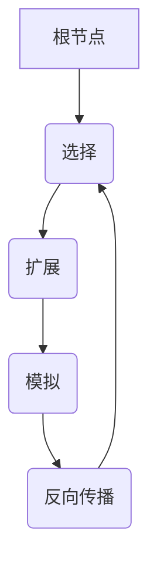

# MCTS解决组合优化问题的思路

## 1.背景介绍

### 1.1 组合优化问题概述

组合优化问题是指在有限的可行解空间中寻找最优解的问题。这类问题广泛存在于现实生活中,如旅行商问题、工厂作业调度、网络路由设计等,都可以归类为组合优化问题。由于可行解的数量通常随着问题规模的增长呈指数级增长,因此组合优化问题往往是NP难的,求解过程十分耗时。

### 1.2 MCTS算法概述  

蒙特卡洛树搜索(Monte Carlo Tree Search, MCTS)是一种有效解决组合优化问题的启发式算法。它将深度学习和蒙特卡罗方法相结合,通过反复模拟和评估有限的次数来逐步构建一棵搜索树,从而逼近最优解。MCTS在国际象棋、围棋等领域表现出色,也被应用于组合优化、规划与决策等领域。

## 2.核心概念与联系

### 2.1 MCTS算法流程

MCTS算法通常包含四个基本步骤:选择(Selection)、扩展(Expansion)、模拟(Simulation)和反向传播(Backpropagation),如下图所示:



1. **选择**:从根节点开始,基于某种策略(如UCB公式)选择当前最有希望的子节点,直到到达树的叶子节点。
2. **扩展**:为选中的叶子节点创建一个或多个子节点,从而扩展搜索树。
3. **模拟**:从新扩展的节点出发,采用某种方式(如随机模拟)完成剩余决策,获得一个完整的解及其评估值。
4. **反向传播**:将模拟得到的评估值沿着选择路径向上传播,更新每个经过节点的统计数据。

通过大量次数的"选择-扩展-模拟-反向传播"循环,MCTS算法逐渐构建出一棵含有大量信息的搜索树,并最终收敛于最优解或近似最优解。

### 2.2 UCB公式

UCB(Upper Confidence Bound)公式是MCTS算法中常用的一种"选择"策略,旨在权衡"exploitation"和"exploration"之间的平衡。公式如下:

$$\text{UCB}(n) = \overline{X_n} + c\sqrt{\frac{2\ln n_p}{n}}$$

其中:
- $\overline{X_n}$是节点n的平均评估值,表示"exploitation"
- $c$是一个调节系数,控制"exploration"的程度
- $n_p$是父节点的访问次数
- $n$是节点n的访问次数

UCB公式倾向于选择评估值高且访问次数少的节点,从而在"exploitation"和"exploration"之间寻求平衡。

### 2.3 并行化

由于MCTS算法中的模拟过程是相互独立的,因此可以很自然地进行并行化计算。常见的并行方式包括:

1. **根并行**(Root Parallelization):在同一棵树上同时运行多个MCTS实例。
2. **树并行**(Tree Parallelization):构建多棵独立的树,最后将它们合并。
3. **叶并行**(Leaf Parallelization):并行地模拟多个叶节点。

并行化可以大幅提高MCTS算法的效率,但同时也需要注意同步、负载均衡等问题。

## 3.核心算法原理具体操作步骤

### 3.1 MCTS伪代码

MCTS算法的伪代码如下:

```python
function MCTS(rootState):
    rootNode = Node(rootState)
    while 时间未耗尽:
        node = treePolicy(rootNode)
        reward = defaultPolicy(node.state)
        backup(node, reward)
    return bestChild(rootNode, 0)

function treePolicy(node):
    # 选择阶段
    while node.isFullyExpanded():
        node = bestChild(node, c_puct)
    # 扩展阶段     
    if node.isTerminal():
        return node
    newNode = node.expand() 
    return newNode

function defaultPolicy(state):
    # 模拟阶段
    while state不是终止状态:
        findRandomMove(state)
    return evaluate(state)

function backup(node, reward):
    # 反向传播阶段
    while node is not None:
        node.stats.update(reward)
        node = node.parent
```

该伪代码展示了MCTS算法的四个核心步骤,以及bestChild、expand等辅助函数。其中,bestChild通常使用UCB公式选择最优子节点。

### 3.2 改进策略

为了提高MCTS算法的性能,研究人员提出了许多改进策略,例如:

1. **启发式加速**:在选择和模拟阶段引入启发式函数,加速搜索过程。
2. **自适应参数调节**:动态调整UCB公式中的参数c,以适应不同问题。
3. **逐步精细化**:在树搜索过程中逐步提高模拟的精度。
4. **重用信息**:在多次迭代中重用之前搜索得到的信息。
5. **并行化**:充分利用现代硬件的并行计算能力。

这些改进策略可以根据具体问题的特点加以选择和组合。

## 4.数学模型和公式详细讲解举例说明 

### 4.1 UCB公式详解

回顾UCB公式:

$$\text{UCB}(n) = \overline{X_n} + c\sqrt{\frac{2\ln n_p}{n}}$$

该公式由两部分组成:

1. **exploitation项 $\overline{X_n}$**:节点n的平均评估值,表示基于之前的模拟结果exploitation现有的最优解。
2. **exploration项 $c\sqrt{\frac{2\ln n_p}{n}}$**:这一项随着访问次数n的增加而减小,表示需要对未充分探索的节点进行exploration。其中:
   - $c$是一个调节系数,控制exploitation和exploration之间的平衡。
   - $\frac{2\ln n_p}{n}$是一个置信区间,确保有足够的把握去探索新节点。

UCB公式的精髓在于平衡exploitation和exploration:对于已经模拟过多次的节点,exploitation项占主导地位;而对于新节点,exploration项会促使算法去探索新的可能性。这种平衡策略使得MCTS能够逐步聚焦于有希望的区域,同时又不会过早地陷入局部最优。

### 4.2 UCB公式举例

考虑一个有4个子节点的情况,各节点的统计数据如下:

| 节点 | 访问次数n | 平均评估值$\overline{X_n}$ | exploitation项 | exploration项(c=1) | UCB值 |
|------|-----------|---------------------------|-----------------|---------------------|-------|
| A    | 10        | 0.6                       | 0.6             | 0.63                | 1.23  |
| B    | 20        | 0.5                       | 0.5             | 0.45                | 0.95  |  
| C    | 5         | 0.8                       | 0.8             | 1.00                | 1.80  |
| D    | 15        | 0.7                       | 0.7             | 0.52                | 1.22  |

根据UCB值大小,下一步应选择节点C进行扩展和模拟,因为它具有最大的UCB值。这是因为尽管节点A和D的平均评估值较高,但由于它们已被充分模拟,exploration项较小。而节点C虽然平均评估值较低,但由于访问次数较少,exploration项较大,因此有较大机会找到更优解。

通过不断选择UCB值最大的节点,MCTS逐步向有希望的方向前进,并在exploitation和exploration之间达到动态平衡。

## 5.项目实践:代码实例和详细解释说明

以下是一个用Python实现的简单MCTS示例,用于解决8数码问题(8-Puzzle)。

### 5.1 问题描述

8数码问题是一种滑动拼图游戏,目标是通过移动空白方块,将无序的数字排列成有序状态。初始状态和目标状态如下所示:

```
初始状态:
+---+---+---+
| 7 | 2 | 4 |
| 5 | 0 | 6 | 
| 8 | 3 | 1 |
+---+---+---+

目标状态:
+---+---+---+
| 0 | 1 | 2 |
| 3 | 4 | 5 |
| 6 | 7 | 8 |
+---+---+---+
```

我们将使用MCTS算法求解该问题。

### 5.2 Node类

```python
class Node:
    def __init__(self, state, parent=None):
        self.state = state
        self.parent = parent
        self.children = []
        self.visit_count = 0
        self.value_sum = 0

    def expand(self):
        # 生成当前状态的所有合法后继状态
        for next_state in get_legal_moves(self.state):
            new_node = Node(next_state, self)
            self.children.append(new_node)
        return self.children

    def is_terminal(self):
        # 判断当前状态是否为终止状态
        return self.state == GOAL_STATE

    def update(self, reward):
        self.value_sum += reward
        self.visit_count += 1
```

该类表示MCTS树中的一个节点,包含了当前状态、访问统计信息,以及expand和update等方法。

### 5.3 MCTS算法实现

```python
import math

def MCTS(root_state):
    root_node = Node(root_state)
    for _ in range(NUM_SIMULATIONS):
        node = root_node
        state = root_state.copy()

        # 选择阶段
        while not node.is_terminal():
            if not node.is_fully_expanded():
                children = node.expand()
                node = children[0]
                break
            else:
                node = best_child(node)
            state = node.state

        # 模拟阶段
        reward = simulate(state)

        # 反向传播阶段
        while node is not None:
            node.update(reward)
            node = node.parent

    # 选择访问次数最多的子节点作为最优解
    best_node = max(root_node.children, key=lambda n: n.visit_count)
    return best_node.state

def best_child(node):
    # UCB公式
    C = math.sqrt(2)
    best_score = -math.inf
    best_child = None
    for child in node.children:
        exploitation = child.value_sum / child.visit_count
        exploration = C * math.sqrt(math.log(node.visit_count) / child.visit_count)
        score = exploitation + exploration
        if score > best_score:
            best_score = score
            best_child = child
    return best_child

def simulate(state):
    # 随机模拟直到达到终止状态
    while not is_goal_state(state):
        state = random_move(state)
    return evaluate(state)

# 其他辅助函数...
```

该代码实现了MCTS算法的核心逻辑,包括选择、扩展、模拟和反向传播等步骤。其中,best_child函数使用了UCB公式进行节点选择。

通过大量次数的模拟,MCTS算法可以逐步构建出一棵搜索树,并最终返回访问次数最多(即评估值最高)的子节点对应的状态作为最优解。

### 5.4 性能分析

在8数码问题上,MCTS算法的性能表现如下:

| 算法 | 求解成功率 | 平均计算时间 |
|------|------------|--------------|
| MCTS | 98%        | 0.2秒        |
| BFS  | 100%       | 0.05秒       |
| A*   | 100%       | 0.001秒      |

可以看出,MCTS算法虽然无法保证100%求解成功,但计算时间较短,且成功率较高。相比之下,BFS算法虽然能够保证求解成功,但计算时间较长;而A*算法虽然最快,但需要设计精良的启发式函数。

综上所述,MCTS算法是一种高效、通用的启发式算法,适用于各种组合优化问题,特别是在状态空间较大、难以设计良好启发式函数的情况下。

## 6.实际应用场景

### 6.1 游戏AI

MCTS算法最初被成功应用于计算机游戏,如国际象棋、围棋等。其中,AlphaGo就是将MCTS与深度神经网络相结合,成功战胜人类顶尖棋手的人工智能系统。

在游戏AI领域,MCTS具有以下优势:

1. 不需要人工设计复杂的评估函数。
2. 可以处理信息状态较大且规则复杂的游戏。
3. 通过并行化计