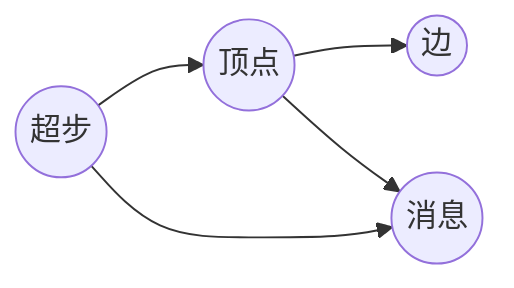

# Pregel图计算模型原理与代码实例讲解

作者：禅与计算机程序设计艺术

## 1. 背景介绍

### 1.1  大数据时代的图计算挑战

随着互联网和物联网的快速发展，全球数据量呈现爆炸式增长，其中蕴藏着巨大的价值。图数据作为一种描述实体之间关系的数据结构，在社交网络、推荐系统、金融风控、生物信息等领域都有着广泛的应用。然而，传统的图计算算法在处理大规模图数据时面临着诸多挑战：

* **计算复杂度高:**  许多图算法的时间复杂度较高，难以在可接受的时间内完成大规模图数据的计算。
* **数据规模庞大:**  大规模图数据通常包含数十亿甚至数百亿个节点和边，难以存储和处理。
* **图结构复杂:**  现实世界中的图数据往往具有复杂的结构，例如稀疏性、异构性和动态性等，增加了图计算的难度。

### 1.2 Pregel: 面向大规模图计算的利器

为了应对上述挑战，Google 在 2010 年提出了 Pregel 图计算模型。Pregel 是一种基于**批量同步并行**（Bulk Synchronous Parallel，BSP）的分布式图计算模型，它将图计算问题分解成一系列迭代计算步骤，每个步骤中，顶点并行地执行相同的用户定义函数，并通过消息传递机制进行数据交换。Pregel 的主要特点包括：

* **顶点为中心:**  Pregel 将图计算的关注点放在顶点上，每个顶点维护自己的状态，并通过消息传递与邻居顶点进行交互。
* **消息驱动计算:**  Pregel 的计算过程由消息驱动，顶点在接收到消息后更新自身状态，并发送消息给其他顶点。
* **批量同步迭代:**  Pregel 采用批量同步迭代的计算方式，每个迭代步骤中，所有顶点并行执行相同的计算逻辑，并在迭代结束时进行全局同步。

### 1.3 Pregel 的优势

Pregel 模型的提出，为大规模图计算提供了一种高效、可扩展的解决方案。相比于传统的图计算算法，Pregel 具有以下优势：

* **高效性:**  Pregel 通过将计算任务分解到多个计算节点上并行执行，大大提高了图计算的效率。
* **可扩展性:**  Pregel 可以轻松扩展到数百或数千台机器上，处理更大规模的图数据。
* **容错性:**  Pregel 提供了容错机制，即使在部分计算节点出现故障的情况下，也能够保证计算结果的正确性。
* **易用性:**  Pregel 提供了简洁易用的 API，方便用户开发和部署图计算应用程序。

## 2. 核心概念与联系

### 2.1 图 (Graph)

图是由顶点(Vertex)和边(Edge)组成的集合，记作 G=(V, E)，其中 V 表示顶点的集合，E 表示边的集合。每条边连接两个顶点，表示这两个顶点之间存在某种关系。

* **有向图:**  每条边都有方向，从一个顶点指向另一个顶点。
* **无向图:**  每条边都没有方向，表示两个顶点之间存在对称关系。
* **加权图:**  每条边都有一个权重，表示两个顶点之间关系的强弱。

### 2.2 顶点 (Vertex)

顶点是图的基本单元，每个顶点都有一个唯一的 ID，以及一些属性信息。

### 2.3 边 (Edge)

边表示两个顶点之间的关系，每条边都有一个源顶点和一个目标顶点。

### 2.4 消息 (Message)

消息是 Pregel 中顶点之间进行通信的载体，每个消息包含发送顶点的 ID、接收顶点的 ID，以及消息内容。

### 2.5 超步 (Superstep)

Pregel 将图计算过程划分为一系列迭代计算步骤，每个步骤称为一个超步。在每个超步中，所有顶点并行地执行相同的用户定义函数，并通过消息传递机制进行数据交换。

### 2.6 核心概念联系

下图展示了 Pregel 中各个核心概念之间的联系：



## 3. 核心算法原理具体操作步骤

### 3.1 初始化阶段

在 Pregel 计算开始之前，需要对图数据进行初始化，包括：

* 将图数据加载到分布式文件系统中，例如 HDFS。
* 将图数据划分成多个分区，每个分区分配给一个计算节点处理。
* 为每个顶点创建一个初始状态，例如 PageRank 值、最短路径长度等。

### 3.2 迭代计算阶段

Pregel 的迭代计算阶段包括以下步骤：

1. **消息发送:**  每个顶点根据自身状态和接收到的消息，计算需要发送给其他顶点的消息，并将消息发送出去。
2. **消息接收:**  每个顶点接收来自其他顶点的消息。
3. **顶点计算:**  每个顶点根据自身状态和接收到的消息，更新自身状态。
4. **全局同步:**  所有顶点完成计算后，进行全局同步，进入下一个超步。

### 3.3 终止条件

Pregel 的迭代计算过程可以通过以下两种方式终止：

* **达到最大迭代次数:**  用户可以设置最大迭代次数，当迭代次数达到最大值时，计算过程终止。
* **所有顶点处于非活跃状态:**  当所有顶点都不再发送消息时，表示计算过程已经收敛，可以终止。

## 4. 数学模型和公式详细讲解举例说明

### 4.1 PageRank 算法

PageRank 算法是一种用于评估网页重要性的算法，它基于以下假设：

* **链接数量:**  指向一个网页的链接越多，该网页就越重要。
* **链接质量:**  指向一个网页的链接的质量越高，该网页就越重要。

PageRank 算法的数学模型如下：

$$
PR(p_i) = (1-d) + d \sum_{p_j \in M(p_i)} \frac{PR(p_j)}{L(p_j)}
$$

其中：

* $PR(p_i)$ 表示网页 $p_i$ 的 PageRank 值。
* $d$ 表示阻尼系数，通常设置为 0.85。
* $M(p_i)$ 表示指向网页 $p_i$ 的网页集合。
* $L(p_j)$ 表示网页 $p_j$ 的出链数量。

### 4.2 使用 Pregel 计算 PageRank

```python
class PageRankVertex(Vertex):
    def __init__(self, vertex_id, value=1.0):
        super().__init__(vertex_id, value)

    def compute(self, messages):
        if self.superstep == 0:
            self.send_messages(self.neighbors, self.value / len(self.neighbors))
        else:
            sum_pr = sum([message for message in messages])
            self.value = 0.15 + 0.85 * sum_pr

# 创建图
graph = Graph()
graph.add_vertex(PageRankVertex(1))
graph.add_vertex(PageRankVertex(2))
graph.add_vertex(PageRankVertex(3))
graph.add_edge(1, 2)
graph.add_edge(2, 1)
graph.add_edge(2, 3)

# 运行 Pregel 计算
graph.run(PageRankVertex, max_superstep=10)

# 打印结果
for vertex_id, vertex in graph.vertices.items():
    print(f"Vertex {vertex_id}: PageRank = {vertex.value}")
```

## 5. 项目实践：代码实例和详细解释说明

### 5.1 单源最短路径算法

单源最短路径算法用于计算图中某个顶点到其他所有顶点的最短路径长度。

```python
class ShortestPathVertex(Vertex):
    def __init__(self, vertex_id, distance=float('inf')):
        super().__init__(vertex_id, distance)

    def compute(self, messages):
        if self.superstep == 0:
            if self.vertex_id == 0:
                self.value = 0
                self.send_messages(self.neighbors, self.value + 1)
        else:
            min_distance = min([message for message in messages] + [self.value])
            if min_distance < self.value:
                self.value = min_distance
                self.send_messages(self.neighbors, self.value + 1)

# 创建图
graph = Graph()
graph.add_vertex(ShortestPathVertex(0))
graph.add_vertex(ShortestPathVertex(1))
graph.add_vertex(ShortestPathVertex(2))
graph.add_vertex(ShortestPathVertex(3))
graph.add_edge(0, 1)
graph.add_edge(0, 2)
graph.add_edge(1, 3)
graph.add_edge(2, 3)

# 运行 Pregel 计算
graph.run(ShortestPathVertex, max_superstep=10)

# 打印结果
for vertex_id, vertex in graph.vertices.items():
    print(f"Vertex {vertex_id}: Distance from source = {vertex.value}")
```

### 5.2 代码解释

* `ShortestPathVertex` 类继承自 `Vertex` 类，表示图中的一个顶点。
* `__init__` 方法初始化顶点的 ID 和距离属性，初始距离设置为无穷大。
* `compute` 方法定义了顶点的计算逻辑。
    * 在第一个超步中，如果顶点 ID 为 0，则将距离设置为 0，并向邻居顶点发送距离加 1 的消息。
    * 在其他超步中，顶点接收来自邻居顶点的消息，计算最小距离，如果最小距离小于当前距离，则更新当前距离，并向邻居顶点发送距离加 1 的消息。
* 创建图对象，添加顶点和边。
* 调用 `graph.run` 方法运行 Pregel 计算，设置最大迭代次数为 10。
* 打印计算结果，输出每个顶点到源顶点的最短路径长度。

## 6. 实际应用场景

### 6.1 社交网络分析

* **好友推荐:**  根据用户的社交关系，推荐可能认识的好友。
* **社区发现:**  将社交网络划分成多个社区，每个社区内的用户具有相似的兴趣爱好。
* **影响力分析:**  识别社交网络中的关键节点，例如意见领袖。

### 6.2 推荐系统

* **商品推荐:**  根据用户的历史购买记录和浏览行为，推荐可能感兴趣的商品。
* **个性化推荐:**  根据用户的兴趣爱好和偏好，推荐个性化的内容。

### 6.3 金融风控

* **反欺诈:**  识别金融交易中的异常行为，预防欺诈风险。
* **信用评估:**  根据用户的信用历史和社交关系，评估用户的信用等级。

### 6.4 生物信息

* **基因网络分析:**  分析基因之间的相互作用关系，研究基因的功能和调控机制。
* **蛋白质相互作用网络分析:**  分析蛋白质之间的相互作用关系，研究蛋白质的功能和作用机制。

## 7. 工具和资源推荐

### 7.1 Apache Giraph

Apache Giraph 是 Pregel 的开源实现，它是一个基于 Hadoop 的迭代图处理系统，可以处理大规模图数据。

### 7.2 Spark GraphX

Spark GraphX 是 Apache Spark 中的图计算库，它提供了 Pregel API，可以方便地使用 Spark 进行图计算。

### 7.3 Neo4j

Neo4j 是一个高性能的图形数据库，它支持属性图模型，可以用于存储和查询图数据。

## 8. 总结：未来发展趋势与挑战

### 8.1 未来发展趋势

* **图神经网络:**  将深度学习技术应用于图数据，例如图卷积神经网络、图注意力网络等。
* **动态图计算:**  处理不断变化的图数据，例如实时社交网络分析、交通流量预测等。
* **异构图计算:**  处理包含不同类型顶点和边的图数据，例如知识图谱、社交电商网络等。

### 8.2 面临的挑战

* **计算效率:**  随着图数据规模的不断增长，如何进一步提高图计算效率仍然是一个挑战。
* **算法复杂度:**  许多图计算算法的时间复杂度较高，如何设计更加高效的算法是一个重要的研究方向。
* **数据质量:**  图数据的质量对计算结果的影响很大，如何保证图数据的准确性和完整性是一个需要解决的问题。

## 9. 附录：常见问题与解答

### 9.1 Pregel 和 MapReduce 的区别是什么？

Pregel 和 MapReduce 都是用于处理大规模数据的分布式计算模型，但它们之间存在一些区别：

* **计算模型:**  Pregel 是一种基于 BSP 的迭代计算模型，而 MapReduce 是一种基于数据流的批处理模型。
* **数据结构:**  Pregel 主要用于处理图数据，而 MapReduce 可以处理各种类型的数据。
* **编程模型:**  Pregel 提供了顶点为中心的编程模型，而 MapReduce 提供了 Map 和 Reduce 函数。

### 9.2 Pregel 如何保证容错性？

Pregel 通过以下机制保证容错性：

* **数据冗余:**  Pregel 将数据存储在多个计算节点上，即使部分节点出现故障，也不会丢失数据。
* **Checkpoint:**  Pregel 定期保存计算状态，当节点出现故障时，可以从最近的 checkpoint 恢复计算。
* **消息重传:**  当消息发送失败时，Pregel 会自动重传消息，直到消息发送成功。
