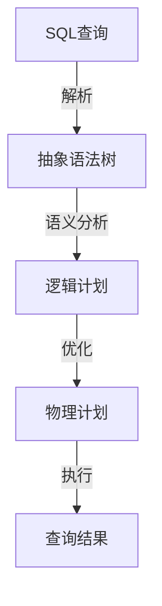

# Presto查询优化器：性能提升的魔法棒

作者：禅与计算机程序设计艺术

## 1. 背景介绍

### 1.1 什么是Presto？

Presto是一个开源的分布式SQL查询引擎，最初由Facebook开发，旨在处理大规模的数据分析。它能够针对各种数据源（如Hadoop、Cassandra、关系型数据库等）执行交互式查询，并且以其高性能和扩展性著称。

### 1.2 查询优化器的重要性

在大数据环境中，查询优化器是决定查询性能的关键因素。一个高效的查询优化器能够显著减少查询的执行时间和资源消耗，从而提升整体系统的性能和用户体验。

### 1.3 Presto查询优化器的独特之处

Presto查询优化器采用了一系列先进的技术和算法来优化查询执行计划，包括但不限于代价模型、规则重写、统计信息等。这些技术的结合使得Presto在处理复杂查询时能够保持卓越的性能。

## 2. 核心概念与联系

### 2.1 查询优化的基本原理

查询优化的核心是将用户提交的SQL查询转换为一个高效的执行计划。这个过程通常包括以下步骤：

- **解析**：将SQL查询解析为语法树。
- **逻辑优化**：通过规则重写和代价估算优化逻辑计划。
- **物理优化**：选择具体的执行策略和操作实现。

### 2.2 Presto查询优化器的架构

Presto查询优化器的架构可以概括为以下几个主要组件：

- **解析器（Parser）**：将SQL查询解析为抽象语法树（AST）。
- **分析器（Analyzer）**：对AST进行语义分析，生成逻辑计划。
- **优化器（Optimizer）**：对逻辑计划进行优化，生成物理计划。
- **执行器（Executor）**：执行物理计划，返回查询结果。



### 2.3 成本模型和统计信息

Presto查询优化器依赖于成本模型和统计信息来评估不同执行计划的代价。成本模型通常考虑以下因素：

- **CPU成本**：操作所需的计算资源。
- **I/O成本**：数据读取和写入的开销。
- **网络成本**：数据传输的开销。

统计信息则包括数据的基数、分布等，用于更准确地估算各个操作的成本。

## 3. 核心算法原理具体操作步骤

### 3.1 解析和语义分析

解析和语义分析是查询优化的第一步。Presto使用ANTLR解析器将SQL查询解析为AST，然后通过分析器进行语义分析，生成逻辑计划。

```java
// 示例代码：解析和语义分析
String sql = "SELECT * FROM orders WHERE order_date > '2023-01-01'";
SqlParser parser = new SqlParser();
Statement statement = parser.createStatement(sql);
Analyzer analyzer = new Analyzer();
LogicalPlan logicalPlan = analyzer.analyze(statement);
```

### 3.2 逻辑优化

逻辑优化通过一系列规则重写和代价估算来优化逻辑计划。这些规则包括谓词下推、子查询展开、投影下推等。

```java
// 示例代码：逻辑优化
Optimizer optimizer = new Optimizer();
LogicalPlan optimizedPlan = optimizer.optimize(logicalPlan);
```

### 3.3 物理优化

物理优化选择具体的执行策略和操作实现。Presto的物理优化器会评估不同的物理操作（如哈希连接、排序等）的代价，并选择代价最低的执行计划。

```java
// 示例代码：物理优化
PhysicalPlanner planner = new PhysicalPlanner();
PhysicalPlan physicalPlan = planner.plan(optimizedPlan);
```

### 3.4 执行计划生成

最终的物理计划被转换为可执行的操作序列，由执行器执行，返回查询结果。

```java
// 示例代码：执行计划生成
Executor executor = new Executor();
Result result = executor.execute(physicalPlan);
```

## 4. 数学模型和公式详细讲解举例说明

### 4.1 成本模型公式

Presto查询优化器使用成本模型来评估执行计划的代价。一个简单的成本模型公式可以表示为：

$$
\text{Cost} = \text{CPU Cost} + \text{I/O Cost} + \text{Network Cost}
$$

其中，CPU成本、I/O成本和网络成本分别表示计算资源、数据读取/写入和数据传输的开销。

### 4.2 统计信息的计算

统计信息是成本模型的重要输入。假设我们有一个表 $T$，其列 $A$ 的基数（不同值的数量）为 $n$，则对 $A$ 进行选择操作的代价可以表示为：

$$
\text{Selectivity}(A) = \frac{\text{Number of distinct values in } A}{\text{Total number of rows in } T}
$$

### 4.3 代价估算示例

假设我们有一个查询 `SELECT * FROM orders WHERE order_date > '2023-01-01'`，其代价估算可以如下进行：

- **CPU成本**：扫描所有行所需的计算资源。
- **I/O成本**：读取满足条件的行所需的磁盘I/O。
- **网络成本**：传输结果集所需的网络带宽。

```latex
\text{Cost} = \text{CPU Cost} + \text{I/O Cost} + \text{Network Cost}
```

## 5. 项目实践：代码实例和详细解释说明

### 5.1 环境配置

首先，我们需要配置Presto环境。以下是一个简单的配置示例：

```yaml
coordinator: true
node-scheduler.include-coordinator: true
http-server.http.port: 8080
query.max-memory: 5GB
query.max-memory-per-node: 1GB
discovery-server.enabled: true
discovery.uri: http://localhost:8080
```

### 5.2 示例查询优化

假设我们有一个订单表 `orders`，我们希望优化以下查询：

```sql
SELECT customer_id, COUNT(*)
FROM orders
WHERE order_date > '2023-01-01'
GROUP BY customer_id;
```

### 5.3 代码实现

以下是一个完整的查询优化示例代码：

```java
import com.facebook.presto.sql.parser.SqlParser;
import com.facebook.presto.sql.tree.Statement;
import com.facebook.presto.sql.analyzer.Analyzer;
import com.facebook.presto.sql.planner.LogicalPlan;
import com.facebook.presto.sql.planner.Optimizer;
import com.facebook.presto.sql.planner.PhysicalPlanner;
import com.facebook.presto.sql.planner.PhysicalPlan;
import com.facebook.presto.execution.Executor;
import com.facebook.presto.execution.Result;

public class PrestoQueryOptimization {
    public static void main(String[] args) {
        String sql = "SELECT customer_id, COUNT(*) FROM orders WHERE order_date > '2023-01-01' GROUP BY customer_id";
        
        // 解析和语义分析
        SqlParser parser = new SqlParser();
        Statement statement = parser.createStatement(sql);
        Analyzer analyzer = new Analyzer();
        LogicalPlan logicalPlan = analyzer.analyze(statement);
        
        // 逻辑优化
        Optimizer optimizer = new Optimizer();
        LogicalPlan optimizedPlan = optimizer.optimize(logicalPlan);
        
        // 物理优化
        PhysicalPlanner planner = new PhysicalPlanner();
        PhysicalPlan physicalPlan = planner.plan(optimizedPlan);
        
        // 执行计划生成
        Executor executor = new Executor();
        Result result = executor.execute(physicalPlan);
        
        // 输出结果
        System.out.println(result);
    }
}
```

### 5.4 详细解释

1. **解析和语义分析**：将SQL查询解析为AST，并进行语义分析生成逻辑计划。
2. **逻辑优化**：通过规则重写和代价估算优化逻辑计划。
3. **物理优化**：选择具体的执行策略和操作实现，生成物理计划。
4. **执行计划生成**：执行物理计划，返回查询结果。

## 6. 实际应用场景

### 6.1 数据仓库

Presto常用于数据仓库环境中，处理大规模数据分析查询。通过高效的查询优化器，Presto能够在不牺牲性能的情况下处理复杂的分析查询。

### 6.2 实时数据分析

在实时数据分析场景中，查询性能至关重要。Presto的查询优化器能够显著减少查询延迟，使得实时分析更加高效。

### 6.3 数据湖

Presto能够直接查询存储在数据湖中的数据，而无需将数据移动到其他