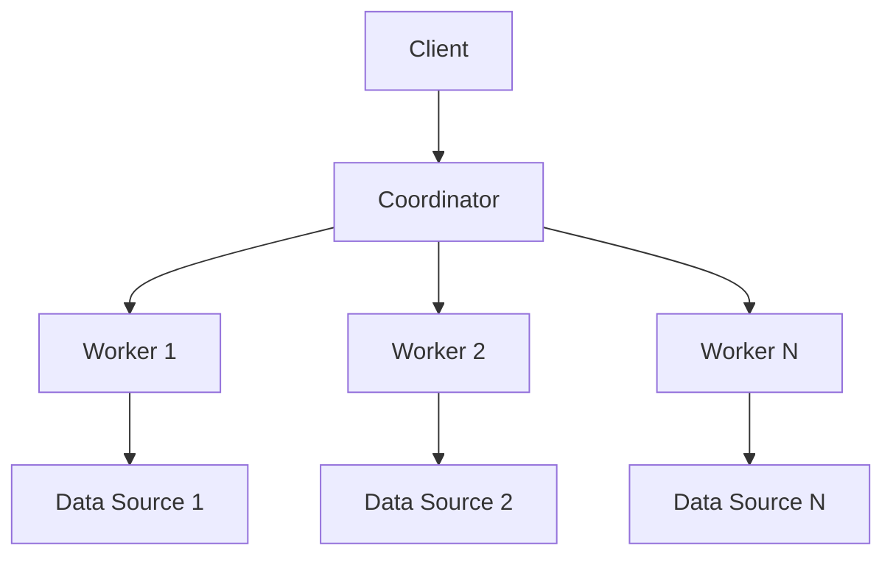

# Presto查询计划：优化Hive数据查询性能

作者：禅与计算机程序设计艺术

## 1. 背景介绍

### 1.1 大数据时代的挑战

在大数据时代，企业和组织每天都在生成和处理海量的数据。这些数据的管理和分析需求推动了分布式计算和存储技术的快速发展。Apache Hive作为一个基于Hadoop的数据仓库软件项目，提供了数据查询和分析的强大功能。然而，随着数据量的增加，Hive查询的性能问题也日益凸显。

### 1.2 Presto的出现

为了应对Hive查询性能的瓶颈，Presto应运而生。Presto是一个开源的分布式SQL查询引擎，专为高速数据查询而设计。它支持从多个数据源查询数据，包括Hive、Cassandra、关系型数据库等。Presto的无缝集成和高效的查询执行能力，使其成为优化Hive数据查询性能的理想选择。

### 1.3 本文目标

本文旨在深入探讨如何利用Presto优化Hive数据查询性能。我们将从核心概念、算法原理、数学模型、项目实践、实际应用场景、工具和资源推荐等方面进行详细讲解，帮助读者全面了解和掌握Presto的查询优化技术。

## 2. 核心概念与联系

### 2.1 Presto架构概述

Presto的架构主要包括以下几个核心组件：

- **Coordinator**：负责接收查询请求，解析SQL语句，生成查询计划，并调度各个Worker节点执行查询任务。
- **Worker**：执行查询任务，处理数据计算，并将结果返回给Coordinator。
- **Connector**：连接不同的数据源，实现数据的读取和写入。



### 2.2 Presto与Hive的关系

Presto与Hive的关系可以总结为以下几点：

- **数据共享**：Presto可以直接查询Hive中的数据，无需数据复制或迁移。
- **查询优化**：Presto通过其高效的查询执行引擎，显著提升了Hive数据查询的性能。
- **互补性**：Hive擅长批处理和数据仓库管理，而Presto则在实时查询和交互式分析方面表现出色。

### 2.3 查询计划的作用

查询计划是SQL查询执行的核心。它包括以下几个步骤：

1. **SQL解析**：将SQL语句解析为抽象语法树（AST）。
2. **逻辑计划生成**：将AST转换为逻辑执行计划。
3. **物理计划生成**：将逻辑计划转换为具体的执行操作。
4. **执行计划优化**：通过各种优化技术，生成高效的执行计划。

## 3. 核心算法原理具体操作步骤

### 3.1 SQL解析

SQL解析是查询计划的第一步。Presto使用ANTLR（Another Tool for Language Recognition）解析SQL语句，生成抽象语法树（AST）。

### 3.2 逻辑计划生成

逻辑计划生成是将AST转换为逻辑执行计划的过程。逻辑计划描述了查询的高层次操作，例如选择、投影、连接等。

### 3.3 物理计划生成

物理计划生成是将逻辑计划转换为具体的执行操作。物理计划考虑了数据的存储方式和访问路径，生成具体的执行步骤。

### 3.4 执行计划优化

执行计划优化是查询计划的关键步骤。Presto通过以下几种优化技术，生成高效的执行计划：

- **谓词下推**：将过滤条件尽可能早地应用，以减少数据处理量。
- **列剪裁**：只读取和处理查询所需的列，减少数据传输和计算量。
- **连接重排序**：根据连接条件和数据分布，选择最优的连接顺序。
- **分区裁剪**：利用数据分区信息，减少扫描的数据量。

## 4. 数学模型和公式详细讲解举例说明

### 4.1 查询成本模型

查询成本模型用于估算查询执行的成本。成本通常包括CPU时间、I/O时间和网络传输时间。Presto使用查询成本模型来评估不同执行计划的优劣，选择最优的执行计划。

$$
\text{Cost} = \sum_{i=1}^{n} (C_{CPU_i} + C_{I/O_i} + C_{Network_i})
$$

其中，$C_{CPU_i}$、$C_{I/O_i}$和$C_{Network_i}$分别表示第$i$个操作的CPU成本、I/O成本和网络传输成本。

### 4.2 谓词下推示例

假设我们有一个表`orders`，包含以下列：

- `order_id`
- `customer_id`
- `order_date`
- `total_amount`

我们需要查询总金额大于1000的订单：

```sql
SELECT * FROM orders WHERE total_amount > 1000;
```

谓词下推会将过滤条件`total_amount > 1000`尽早应用到数据读取阶段，减少后续处理的数据量。

### 4.3 列剪裁示例

假设我们有一个表`customers`，包含以下列：

- `customer_id`
- `name`
- `email`
- `phone_number`
- `address`

我们需要查询所有客户的姓名和邮箱：

```sql
SELECT name, email FROM customers;
```

列剪裁会只读取和处理`name`和`email`列，减少数据传输和计算量。

## 5. 项目实践：代码实例和详细解释说明

### 5.1 环境搭建

首先，我们需要搭建Presto和Hive的运行环境。可以使用Docker或Kubernetes来简化部署过程。

```bash
# 使用Docker部署Presto
docker run -d --name presto-coordinator -p 8080:8080 prestosql/presto
docker run -d --name presto-worker prestosql/presto

# 使用Docker部署Hive
docker run -d --name hive-server -p 10000:10000 bde2020/hive
```

### 5.2 配置Presto连接Hive

在Presto的配置文件中，添加Hive连接器的配置：

```ini
# etc/catalog/hive.properties
connector.name=hive-hadoop2
hive.metastore.uri=thrift://hive-server:9083
hive.config.resources=/etc/hadoop/conf/core-site.xml,/etc/hadoop/conf/hdfs-site.xml
```

### 5.3 查询示例

我们可以使用Presto CLI或JDBC连接器来执行查询。以下是一个使用Presto CLI执行查询的示例：

```bash
presto --server localhost:8080 --catalog hive --schema default
```

在Presto CLI中，执行以下查询：

```sql
SELECT * FROM orders WHERE total_amount > 1000;
```

### 5.4 性能优化

通过分析查询执行计划，我们可以识别和优化性能瓶颈。使用以下命令查看查询执行计划：

```sql
EXPLAIN SELECT * FROM orders WHERE total_amount > 1000;
```

## 6. 实际应用场景

### 6.1 数据分析

Presto在数据分析领域有广泛应用。它支持多种数据源的查询，能够快速响应复杂的分析查询需求。

### 6.2 实时查询

Presto的高性能查询引擎使其非常适合实时查询和交互式分析。用户可以在几秒钟内获得查询结果，提升数据分析的效率。

### 6.3 数据集成

Presto支持从多个数据源查询数据，能够实现数据集成和统一查询。企业可以利用Presto整合不同数据源的数据，进行全面的数据分析。

## 7. 工具和资源推荐

### 7.1 Presto CLI

Presto CLI是一个命令行工具，方便用户执行查询和管理Presto集群。

### 7.2 Presto JDBC驱动

Presto JDBC驱动允许用户通过Java应用程序连接和查询Presto。

### 7.3 Presto管理工具

Presto管理工具（如Presto Manager）提供了集群管理、监控和调优功能，帮助用户高效管理Presto集群。

## 8. 总结：未来发展趋势与挑战

### 8.1 发展趋势

随着大数据技术的发展，Presto将继续在数据查询和分析领域发挥重要作用。未来，Presto可能会在以下几个方面取得进展：

- **更高的查询性能**：通过优化查询引擎和执行计划，进一步提升查询性能。
- **更广的数据源支持**：支持更多类型的数据源，实现更广泛的数据集成。
- **智能查询优化**：利用机器学习和人工智能技术，自动优化查询执行计划。

### 