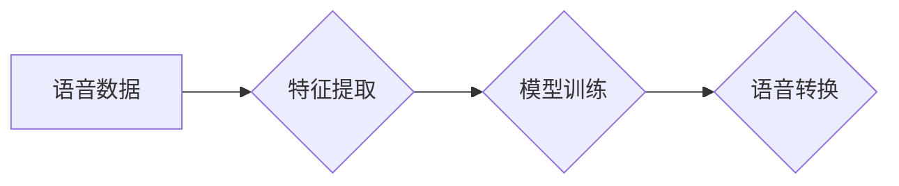

## Python深度学习实践：实时语音转换技术探索

作者：禅与计算机程序设计艺术

## 1. 背景介绍

### 1.1 语音转换技术概述
语音转换技术（Speech-to-Speech, STS），也称为语音克隆，是一种能够将一个人的语音转换为另一个人的语音的技术。这项技术近年来发展迅速，其应用场景也越来越广泛，例如：

* **个性化语音助手**:  用户可以使用自己的声音创建个性化的语音助手，提升用户体验。
* **娱乐**: 语音转换可以用于电影配音、游戏角色配音等娱乐领域。
* **辅助技术**:  为语音障碍人士提供语音合成的可能性。

### 1.2 实时语音转换技术的挑战
实时语音转换技术需要克服以下几个挑战：

* **语音质量**:  转换后的语音需要保持原始语音的音色、情感和韵律。
* **实时性**:  语音转换需要在较短的时间内完成，以满足实时交互的需求。
* **数据需求**:  训练高质量的语音转换模型需要大量的语音数据。

### 1.3 本文目标
本文将介绍如何使用Python和深度学习技术实现实时语音转换，并探讨该技术的未来发展趋势。


## 2. 核心概念与联系

### 2.1 语音信号处理
* **采样**:  将连续的语音信号转换为离散的数字信号。
* **量化**:  将每个采样点的幅度值转换为有限个离散值。
* **编码**:  使用特定的编码方式将量化后的数据表示成二进制码流。

### 2.2 语音识别
* **声学特征提取**:  从语音信号中提取出能够表征语音内容的声学特征，如MFCCs、spectrograms等。
* **声学模型**:  建立声学特征和音素之间的映射关系。
* **语言模型**:  根据语言规则对识别结果进行修正，提高识别准确率。

### 2.3 语音合成
* **文本分析**:  对输入文本进行分词、词性标注等处理。
* **韵律预测**:  预测合成语音的音调、语速等韵律信息。
* **声学模型**:  根据输入文本和韵律信息生成语音信号。

### 2.4 深度学习
* **人工神经网络**:  由大量简单的神经元组成的计算模型，可以用于学习复杂的非线性关系。
* **卷积神经网络 (CNN)**:  擅长处理图像和语音等具有局部相关性的数据。
* **循环神经网络 (RNN)**:  擅长处理序列数据，如文本和语音。


## 3. 核心算法原理具体操作步骤

### 3.1 基于深度学习的语音转换模型
目前主流的语音转换模型大多基于深度学习，其中比较流行的模型包括：

* **Autoencoder**:  自编码器可以将高维数据压缩到低维空间，并尽可能地保留原始信息。在语音转换中，可以使用自编码器提取语音的特征表示，然后使用另一个解码器将特征表示转换为目标说话者的语音。
* **Generative Adversarial Networks (GANs)**:  生成对抗网络由生成器和判别器两个网络组成。生成器负责生成逼真的目标语音，判别器负责区分真实语音和生成语音。通过对抗训练，生成器可以逐渐生成越来越逼真的目标语音。

### 3.2 具体操作步骤
1. **数据准备**:  收集大量的源说话者和目标说话者的语音数据，并进行预处理，如降噪、静音切除等。
2. **特征提取**:  使用语音识别技术从语音数据中提取声学特征，如MFCCs、spectrograms等。
3. **模型训练**:  使用深度学习框架（如TensorFlow、PyTorch）训练语音转换模型。
4. **语音转换**:  将需要转换的语音输入到训练好的模型中，模型会输出转换后的语音。

### 3.3 流程图




## 4. 数学模型和公式详细讲解举例说明

### 4.1 自编码器
自编码器由编码器和解码器两部分组成，其目标是最小化输入数据和重构数据之间的差异。

**编码器**:  将输入数据 $x$ 映射到低维特征表示 $z$。
$$
z = f(x)
$$

**解码器**:  将低维特征表示 $z$ 映射回原始数据空间，得到重构数据 $\hat{x}$。
$$
\hat{x} = g(z)
$$

**损失函数**:  通常使用均方误差 (MSE) 来衡量输入数据和重构数据之间的差异。
$$
L = \frac{1}{N} \sum_{i=1}^{N} ||x_i - \hat{x_i}||^2
$$

### 4.2 生成对抗网络 (GANs)
GANs 由生成器和判别器两个网络组成。

**生成器**:  生成器 $G$ 接收随机噪声 $z$ 作为输入，并生成逼真的目标数据 $G(z)$。

**判别器**:  判别器 $D$ 接收真实数据 $x$ 或生成数据 $G(z)$ 作为输入，并输出一个概率值，表示输入数据是真实数据的概率。

**训练过程**:
* **训练判别器**:  最大化判别器正确区分真实数据和生成数据的概率。
* **训练生成器**:  最小化判别器将生成数据识别为真实数据的概率。

**损失函数**:
$$
\min_G \max_D V(D,G) = \mathbb{E}_{x\sim p_{data}(x)}[log D(x)] + \mathbb{E}_{z\sim p_z(z)}[log(1-D(G(z)))]
$$

## 5. 项目实践：代码实例和详细解释说明

```python
import tensorflow as tf

# 定义自编码器模型
class Autoencoder(tf.keras.Model):
  def __init__(self, latent_dim):
    super(Autoencoder, self).__init__()
    self.latent_dim = latent_dim
    self.encoder = tf.keras.Sequential([
      tf.keras.layers.Input(shape=(input_dim,)),
      # ... 编码器网络层 ...
    ])
    self.decoder = tf.keras.Sequential([
      tf.keras.layers.Input(shape=(latent_dim,)),
      # ... 解码器网络层 ...
    ])

  def call(self, x):
    encoded = self.encoder(x)
    decoded = self.decoder(encoded)
    return decoded

# 定义损失函数和优化器
loss_fn = tf.keras.losses.MeanSquaredError()
optimizer = tf.keras.optimizers.Adam()

# 训练模型
def train_step(x):
  with tf.GradientTape() as tape:
    reconstructed_x = model(x)
    loss = loss_fn(x, reconstructed_x)
  gradients = tape.gradient(loss, model.trainable_variables)
  optimizer.apply_gradients(zip(gradients, model.trainable_variables))
  return loss

# 加载数据
# ...

# 训练循环
epochs = 100
batch_size = 32
for epoch in range(epochs):
  for batch in dataset:
    loss = train_step(batch)
  print('Epoch:', epoch, 'Loss:', loss.numpy())

# 保存模型
model.save('autoencoder_model')

# 加载模型
loaded_model = tf.keras.models.load_model('autoencoder_model')

# 语音转换
# ...
```

## 6. 实际应用场景

* **个性化语音助手**:  用户可以使用自己的声音创建个性化的语音助手，提升用户体验。
* **娱乐**: 语音转换可以用于电影配音、游戏角色配音等娱乐领域。
* **辅助技术**:  为语音障碍人士提供语音合成的可能性。


## 7. 工具和资源推荐

* **编程语言**: Python
* **深度学习框架**: TensorFlow, PyTorch
* **语音处理库**: Librosa, SpeechRecognition
* **数据集**: LibriSpeech, VoxCeleb


## 8. 总结：未来发展趋势与挑战

### 8.1 未来发展趋势
* **更自然的语音**:  未来的语音转换技术将更加注重语音的自然度，例如情感、韵律等方面的提升。
* **更低的延迟**:  随着硬件和算法的进步，实时语音转换的延迟将进一步降低。
* **更广泛的应用**:  语音转换技术将在更多领域得到应用，例如虚拟主播、在线教育等。

### 8.2 挑战
* **数据需求**:  训练高质量的语音转换模型需要大量的语音数据。
* **伦理问题**:  语音转换技术可能被用于恶意目的，例如伪造证据、进行诈骗等。


## 9. 附录：常见问题与解答

### 9.1  如何提高语音转换的质量？
* 使用高质量的语音数据进行训练。
* 使用更强大的深度学习模型，例如GANs。
* 对语音进行预处理，例如降噪、静音切除等。

### 9.2  如何降低语音转换的延迟？
* 使用更快的硬件，例如GPU。
* 优化算法，提高计算效率。

### 9.3  如何解决语音转换的伦理问题？
* 建立相关的法律法规，规范语音转换技术的应用。
* 加强技术监管，防止语音转换技术被滥用。
