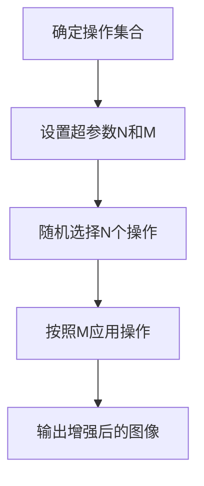

# RandAugment原理与代码实例讲解

作者：禅与计算机程序设计艺术

## 1.背景介绍

在深度学习和计算机视觉领域，数据增强（Data Augmentation）技术是提高模型泛化能力的重要手段。近年来，随着自动数据增强方法的提出，如AutoAugment和RandAugment，研究者们在如何通过自动化手段增强数据集方面取得了显著进展。RandAugment作为一种无需搜索策略的简单而有效的数据增强方法，因其高效性和易用性受到广泛关注。

### 1.1 数据增强的重要性

数据增强是通过对训练数据进行各种变换（如旋转、缩放、翻转等）来生成新的训练样本，从而增加数据集的多样性，防止模型过拟合的一种技术。传统的数据增强方法通常依赖于人工设计的变换策略，这不仅费时费力，而且效果往往不理想。

### 1.2 自动数据增强的兴起

为了克服传统数据增强方法的局限性，研究者们提出了自动数据增强的方法，如AutoAugment。这些方法通过搜索最佳的增强策略来提升模型性能。然而，AutoAugment的搜索过程非常耗时，需要大量的计算资源，限制了其在实际应用中的推广。

### 1.3 RandAugment的提出

为了解决上述问题，RandAugment应运而生。RandAugment通过随机选择和组合数据增强操作，简化了增强策略的设计过程。它无需搜索策略，只需两个超参数，即可实现高效的数据增强效果。本文将深入探讨RandAugment的原理、具体操作步骤、数学模型、项目实践、实际应用场景、工具和资源推荐、未来发展趋势与挑战，并解答常见问题。

## 2.核心概念与联系

RandAugment的核心理念是通过随机选择和组合数据增强操作，简化增强策略的设计过程。它主要涉及以下几个核心概念：

### 2.1 数据增强操作

数据增强操作是指对图像进行各种变换的操作，如旋转、平移、缩放、剪切、颜色调整等。这些操作可以增加数据集的多样性，提高模型的泛化能力。

### 2.2 操作集合

操作集合是指所有可用的数据增强操作的集合。RandAugment从这个集合中随机选择操作来进行数据增强。

### 2.3 操作次数（N）

操作次数（N）是指对每个图像进行数据增强操作的次数。N是RandAugment的一个超参数，用户可以根据实际需求进行设置。

### 2.4 操作强度（M）

操作强度（M）是指每个数据增强操作的强度。M也是RandAugment的一个超参数，用户可以根据实际需求进行设置。

### 2.5 随机选择与组合

RandAugment通过随机选择和组合操作集合中的数据增强操作，实现对图像的多样化变换。其核心思想是通过简单的随机策略，避免了复杂的策略搜索过程，从而提高了效率。

## 3.核心算法原理具体操作步骤

RandAugment的核心算法非常简洁，其具体操作步骤如下：

### 3.1 确定操作集合

首先，确定所有可用的数据增强操作的集合。常见的操作包括旋转、平移、缩放、剪切、颜色调整等。

### 3.2 设置超参数N和M

接下来，设置两个超参数：操作次数N和操作强度M。N表示对每个图像进行数据增强操作的次数，M表示每个操作的强度。

### 3.3 随机选择操作

对于每个图像，随机选择N个操作集合中的数据增强操作。

### 3.4 应用操作

按照操作强度M，对每个图像依次应用选定的N个数据增强操作。

### 3.5 输出增强后的图像

最终，输出经过随机选择和组合的数据增强操作后的图像。

以下是RandAugment的流程图，用Mermaid表示：



## 4.数学模型和公式详细讲解举例说明

RandAugment的数学模型可以用以下公式表示：

### 4.1 操作集合

设操作集合为 $O = \{o_1, o_2, \ldots, o_k\}$，其中 $o_i$ 表示第 $i$ 个数据增强操作。

### 4.2 操作次数和操作强度

设操作次数为 $N$，操作强度为 $M$。

### 4.3 随机选择操作

对于每个图像 $x$，随机选择 $N$ 个操作 $o_{i_1}, o_{i_2}, \ldots, o_{i_N}$，其中 $i_j \in \{1, 2, \ldots, k\}$。

### 4.4 应用操作

按照操作强度 $M$，依次对图像 $x$ 应用选定的 $N$ 个操作：

$$
x' = o_{i_N}( \ldots o_{i_2}( o_{i_1}(x, M), M) \ldots, M)
$$

### 4.5 举例说明

假设操作集合 $O = \{旋转, 平移, 缩放, 剪切, 颜色调整\}$，操作次数 $N = 3$，操作强度 $M = 5$。对于图像 $x$，随机选择三个操作 $o_{i_1} = 旋转, o_{i_2} = 缩放, o_{i_3} = 颜色调整$。按照操作强度 $M = 5$，依次对图像 $x$ 应用这三个操作，得到增强后的图像 $x'$：

$$
x' = 颜色调整( 缩放( 旋转(x, 5), 5), 5)
$$

## 5.项目实践：代码实例和详细解释说明

在本节中，我们将通过一个具体的代码实例，演示如何在实际项目中使用RandAugment进行数据增强。

### 5.1 环境准备

首先，确保您的环境中安装了必要的库，如Pillow和numpy。您可以使用以下命令安装这些库：

```bash
pip install pillow numpy
```

### 5.2 定义数据增强操作

接下来，定义RandAugment中使用的数据增强操作。以下是一些常见的操作定义：

```python
import numpy as np
from PIL import Image, ImageEnhance, ImageOps

def rotate(img, magnitude):
    return img.rotate(magnitude)

def translate_x(img, magnitude):
    return img.transform(img.size, Image.AFFINE, (1, 0, magnitude, 0, 1, 0))

def translate_y(img, magnitude):
    return img.transform(img.size, Image.AFFINE, (1, 0, 0, 0, 1, magnitude))

def shear_x(img, magnitude):
    return img.transform(img.size, Image.AFFINE, (1, magnitude, 0, 0, 1, 0))

def shear_y(img, magnitude):
    return img.transform(img.size, Image.AFFINE, (1, 0, 0, magnitude, 1, 0))

def color(img, magnitude):
    enhancer = ImageEnhance.Color(img)
    return enhancer.enhance(magnitude)

def contrast(img, magnitude):
    enhancer = ImageEnhance.Contrast(img)
    return enhancer.enhance(magnitude)

def brightness(img, magnitude):
    enhancer = ImageEnhance.Brightness(img)
    return enhancer.enhance(magnitude)

def sharpness(img, magnitude):
    enhancer = ImageEnhance.Sharpness(img)
    return enhancer.enhance(magnitude)
```

### 5.3 定义RandAugment函数

定义RandAugment函数，随机选择和应用数据增强操作：

```python
import random

def rand_augment(img, n, m):
    operations = [rotate, translate_x, translate_y, shear_x, shear_y, color, contrast, brightness, sharpness]
    for _ in range(n):
        op = random.choice(operations)
        magnitude = random.uniform(0, m)
        img = op(img, magnitude)
    return img
```

### 5.4 应用RandAugment进行数据增强

加载图像并应用RandAugment进行数据增强：

```python
if __name__ == "__main__":
    img = Image.open("example.jpg")
    augmented_img = rand_augment(img, 3, 5)
    augmented_img.show()
```

在上述代码中，我们加载了一张名为“example.jpg”的图像，并使用RandAugment进行数据增强。设置操作次数为3，操作强度为5。最终显示增强后的图像。

## 6.实际应用场景

RandAugment在多个实际应用场景中表现出色，以下是一些典型的应用场景：

### 6.