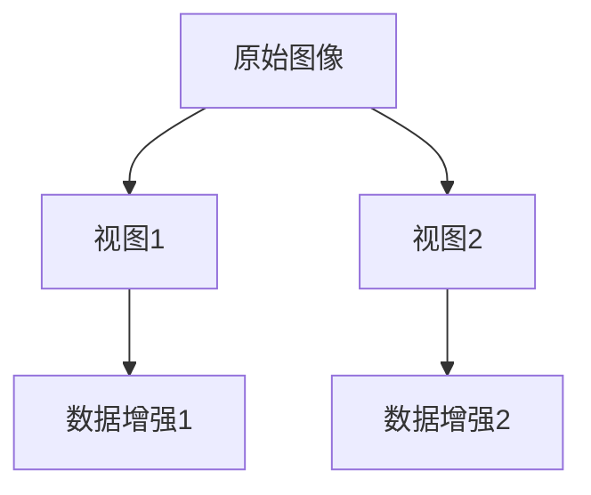
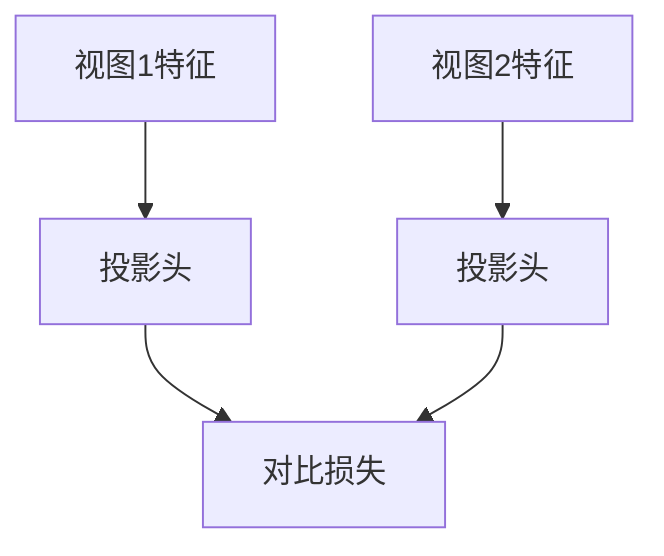

# SimCLR原理与代码实例讲解

作者：禅与计算机程序设计艺术

## 1. 背景介绍

在过去的几年中，深度学习在图像识别、自然语言处理等领域取得了巨大的进展。然而，深度学习模型的成功在很大程度上依赖于大量标注数据的可用性。获取高质量的标注数据既费时又昂贵，因而自监督学习（Self-Supervised Learning, SSL）逐渐成为研究热点。SimCLR（Simple Framework for Contrastive Learning of Visual Representations）是SSL领域的一项重要突破，它通过对比学习（Contrastive Learning）来学习图像的有用表示，而无需大量的标注数据。

SimCLR由Google Research提出，在无需标签的情况下，通过数据增强和对比学习方法，实现了与监督学习相媲美的性能。本文将详细介绍SimCLR的原理、核心算法、数学模型，并通过代码实例进行讲解，最后探讨其实际应用场景和未来发展趋势。

## 2. 核心概念与联系

### 2.1 自监督学习

自监督学习是一种无需人工标注数据的学习方法。模型通过构造伪标签（pseudo-labels）来进行训练。与传统的监督学习不同，自监督学习的目标是从未标注数据中学习有用的表示。

### 2.2 对比学习

对比学习是一种自监督学习方法，其核心思想是通过比较样本之间的相似性和差异性来学习表示。对比学习的目标是使相似样本在表示空间中尽可能接近，而使不相似样本尽可能远离。

### 2.3 SimCLR的基本思想

SimCLR通过对比学习的方式来学习图像表示。其基本思想是：给定一张图像，通过不同的数据增强方法生成两个视图（views），然后通过神经网络（通常是卷积神经网络）提取其表示，并通过对比学习的方法使得同一图像的不同视图在表示空间中尽可能接近，而不同图像的视图尽可能远离。

## 3. 核心算法原理具体操作步骤

SimCLR的训练过程可以分为以下几个步骤：

### 3.1 数据增强

SimCLR使用随机的数据增强方法生成不同的视图。常用的数据增强方法包括随机裁剪、随机翻转、颜色抖动、模糊等。



### 3.2 特征提取

通过卷积神经网络（如ResNet）提取视图的特征表示。

### 3.3 投影头

将特征表示通过一个小的神经网络（投影头）映射到对比学习的表示空间。投影头通常是一个多层感知机（MLP）。

### 3.4 对比损失

使用对比损失函数（如NT-Xent Loss）来优化模型。对比损失的目标是使同一图像的不同视图在表示空间中尽可能接近，而不同图像的视图尽可能远离。



## 4. 数学模型和公式详细讲解举例说明

### 4.1 数据增强

数据增强是SimCLR的关键步骤之一。通过不同的数据增强方法生成不同的视图，使得模型能够学习到更鲁棒的表示。

### 4.2 特征提取

给定一张图像 $x$，通过数据增强生成两个视图 $x_i$ 和 $x_j$，然后通过神经网络 $f(\cdot)$ 提取其特征表示：

$$
h_i = f(x_i), \quad h_j = f(x_j)
$$

### 4.3 投影头

将特征表示 $h_i$ 和 $h_j$ 通过投影头 $g(\cdot)$ 映射到对比学习的表示空间：

$$
z_i = g(h_i), \quad z_j = g(h_j)
$$

### 4.4 对比损失

对比损失函数的目标是使得同一图像的不同视图在表示空间中尽可能接近，而不同图像的视图尽可能远离。SimCLR使用NT-Xent Loss作为对比损失函数：

$$
\ell_{i,j} = -\log \frac{\exp(\mathrm{sim}(z_i, z_j) / \tau)}{\sum_{k=1}^{2N} \mathbb{1}_{[k \neq i]} \exp(\mathrm{sim}(z_i, z_k) / \tau)}
$$

其中，$\mathrm{sim}(z_i, z_j)$ 表示 $z_i$ 和 $z_j$ 的余弦相似度，$\tau$ 是温度参数，$N$ 是批次大小。

## 4. 项目实践：代码实例和详细解释说明

下面我们通过一个代码实例来详细讲解SimCLR的实现过程。

### 4.1 数据增强

```python
import torch
import torchvision.transforms as transforms

# 定义数据增强方法
data_transforms = transforms.Compose([
    transforms.RandomResizedCrop(224),
    transforms.RandomHorizontalFlip(),
    transforms.ColorJitter(0.4, 0.4, 0.4, 0.4),
    transforms.RandomGrayscale(p=0.2),
    transforms.GaussianBlur(kernel_size=(3, 3), sigma=(0.1, 2.0)),
    transforms.ToTensor()
])

# 加载数据集并应用数据增强
dataset = torchvision.datasets.CIFAR10(root='./data', train=True, download=True, transform=data_transforms)
data_loader = torch.utils.data.DataLoader(dataset, batch_size=256, shuffle=True, num_workers=4)
```

### 4.2 特征提取和投影头

```python
import torch.nn as nn
import torchvision.models as models

# 定义特征提取网络（ResNet）
class ResNetSimCLR(nn.Module):
    def __init__(self, base_model, out_dim):
        super(ResNetSimCLR, self).__init__()
        self.backbone = models.resnet50(pretrained=False, num_classes=out_dim)
        self.backbone.fc = nn.Identity()  # 移除最后的全连接层

        self.projection_head = nn.Sequential(
            nn.Linear(out_dim, 2048),
            nn.ReLU(),
            nn.Linear(2048, 128)
        )

    def forward(self, x):
        h = self.backbone(x)
        z = self.projection_head(h)
        return h, z

# 初始化模型
model = ResNetSimCLR(base_model='resnet50', out_dim=2048)
```

### 4.3 对比损失

```python
import torch.nn.functional as F

def nt_xent_loss(z_i, z_j, temperature=0.5):
    N = z_i.shape[0]
    z = torch.cat((z_i, z_j), dim=0)
    sim = F.cosine_similarity(z.unsqueeze(1), z.unsqueeze(0), dim=2)
    sim_i_j = torch.diag(sim, N)
    sim_j_i = torch.diag(sim, -N)

    positives = torch.cat((sim_i_j, sim_j_i), dim=0)
    negatives = sim[~torch.eye(2 * N, dtype=bool)].view(2 * N, -1)

    labels = torch.zeros(2 * N).to(positives.device).long()
    logits = torch.cat((positives.unsqueeze(1), negatives), dim=1)
    logits /= temperature

    loss = F.cross_entropy(logits, labels)
    return loss

# 计算对比损失
h_i, z_i = model(x_i)
h_j, z_j = model(x_j)
loss = nt_xent_loss(z_i, z_j)
```

### 4.4 模型训练

```python
import torch.optim as optim

# 定义优化器
optimizer = optim.Adam(model.parameters(), lr=1e-3)

# 训练模型
for epoch in range(num_epochs):
    for x_i, x_j in data_loader:
        optimizer.zero_grad()
        _, z_i = model(x_i)
        _, z_j = model(x_j)
        loss = nt_xent_loss(z_i, z_j)
        loss.backward()
        optimizer.step()
```

## 5. 实际应用场景

SimCLR在多个实际应用场景中展现了其强大的性能。以下是一些典型的应用场景：

### 5.1 图像分类

通过预训练SimCLR模型，然后在下游分类任务上进行微调，可以显著提升分类性能。

### 5.2 目标检测

SimCLR的预训练表示可以用于目标检测任务，通过迁移学习提高检测精