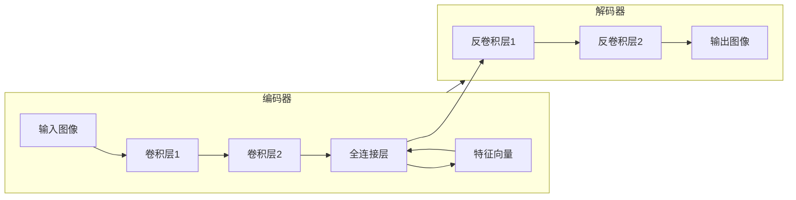

# SimMIM入门指南:探索新一代对话人工智能

作者：禅与计算机程序设计艺术

## 1. 背景介绍

### 1.1 对话人工智能的兴起

近年来，随着深度学习技术的飞速发展，对话人工智能（Conversational AI）取得了显著的突破，并在各个领域展现出巨大的应用潜力。从智能客服、虚拟助手到教育娱乐，对话人工智能正逐渐改变着我们与机器的交互方式。

### 1.2 SimMIM：一种全新的对话人工智能模型

SimMIM（Simple Masked Image Modeling for Conversational AI）是一种新兴的对话人工智能模型，它采用了一种简单而有效的掩码图像建模方法，在多项对话生成任务上取得了令人瞩目的成果。与传统的基于文本的对话模型相比，SimMIM能够更好地捕捉图像中的语义信息，从而生成更自然、更流畅的对话。

### 1.3 本文目的和结构

本文旨在为读者提供一份全面而深入的SimMIM入门指南。文章将首先介绍SimMIM的核心概念和原理，然后详细讲解其算法流程和数学模型，并通过代码实例演示如何使用SimMIM进行对话生成。此外，文章还将探讨SimMIM的实际应用场景、工具和资源推荐，以及未来发展趋势与挑战。

## 2. 核心概念与联系

### 2.1 掩码图像建模

掩码图像建模（Masked Image Modeling, MIM）是一种自监督学习方法，其核心思想是：随机遮蔽输入图像的一部分，然后训练模型根据剩余的可见部分预测被遮蔽的内容。这种方法可以促使模型学习图像的内部表示，从而提升其对图像的理解能力。

### 2.2 SimMIM中的掩码图像建模

SimMIM将掩码图像建模应用于对话生成任务。具体来说，SimMIM将对话历史和当前轮次的用户输入编码为一个图像，然后随机遮蔽该图像的一部分。模型的目标是根据可见部分预测被遮蔽的图像块，从而学习对话的上下文信息和语义关系。

### 2.3 图像与文本的联系

SimMIM使用图像作为对话的表示形式，这看似与传统的基于文本的对话模型相矛盾。然而，图像和文本之间存在着密切的联系。图像可以看作是一种高度抽象的语言，它能够传达丰富的语义信息。通过将对话转换为图像，SimMIM能够更好地捕捉对话中的视觉线索和情感色彩。

## 3. 核心算法原理具体操作步骤

### 3.1 模型架构

SimMIM采用了一种简单的编码器-解码器架构，如下图所示：



* **编码器：** 编码器用于将输入图像转换为一个固定长度的特征向量。它通常由多个卷积层和一个全连接层组成。
* **解码器：** 解码器用于将特征向量解码为一个与输入图像大小相同的输出图像。它通常由多个反卷积层组成。

### 3.2 训练流程

SimMIM的训练流程如下：

1. 将对话历史和当前轮次的用户输入编码为一个图像。
2. 随机遮蔽该图像的一部分。
3. 将遮蔽后的图像输入编码器，得到一个特征向量。
4. 将特征向量输入解码器，得到一个与输入图像大小相同的输出图像。
5. 计算输出图像与原始图像之间的差异，并使用反向传播算法更新模型参数。

### 3.3 预测流程

SimMIM的预测流程如下：

1. 将对话历史和当前轮次的用户输入编码为一个图像。
2. 将该图像输入编码器，得到一个特征向量。
3. 将特征向量输入解码器，得到一个预测图像。
4. 将预测图像解码为文本，作为模型的回复。

## 4. 数学模型和公式详细讲解举例说明

### 4.1 图像编码

SimMIM使用预训练的卷积神经网络（CNN）对图像进行编码。假设输入图像为 $I$，编码器为 $E$，则图像编码过程可以表示为：

$$
f = E(I)
$$

其中，$f$ 表示图像的特征向量。

### 4.2 掩码图像生成

SimMIM使用随机掩码矩阵 $M$ 对图像进行遮蔽。掩码矩阵 $M$ 的元素为 0 或 1，其中 0 表示对应位置的像素被遮蔽，1 表示对应位置的像素可见。假设掩码矩阵为 $M$，则掩码图像 $I'$ 可以表示为：

$$
I' = I \odot M
$$

其中，$\odot$ 表示元素乘积。

### 4.3 图像重建

SimMIM使用解码器 $D$ 对特征向量进行解码，重建被遮蔽的图像。图像重建过程可以表示为：

$$
\hat{I} = D(f)
$$

其中，$\hat{I}$ 表示重建图像。

### 4.4 损失函数

SimMIM使用均方误差（MSE）作为损失函数，用于衡量重建图像与原始图像之间的差异。损失函数可以表示为：

$$
L = \frac{1}{N} \sum_{i=1}^{N} (I_i - \hat{I}_i)^2
$$

其中，$N$ 表示图像中像素的个数，$I_i$ 表示原始图像中第 $i$ 个像素的值，$\hat{I}_i$ 表示重建图像中第 $i$ 个像素的值。

## 5. 项目实践：代码实例和详细解释说明

### 5.1 环境配置

在运行SimMIM代码之前，需要先配置好相应的环境。具体来说，需要安装以下 Python 包：

* tensorflow
* numpy
* pillow

### 5.2 数据准备

SimMIM需要使用对话数据进行训练和测试。可以使用公开的对话数据集，也可以自己构建数据集。

### 5.3 模型训练

以下代码展示了如何使用SimMIM进行模型训练：

```python
import tensorflow as tf
from simmim import SimMIM

# 设置模型参数
vocab_size = 10000
embedding_dim = 128
encoder_units = 256
decoder_units = 256

# 创建SimMIM模型
model = SimMIM(vocab_size, embedding_dim, encoder_units, decoder_units)

# 定义优化器和损失函数
optimizer = tf.keras.optimizers.Adam()
loss_fn = tf.keras.losses.MeanSquaredError()

# 定义训练步
@tf.function
def train_step(images, masks):
  with tf.GradientTape() as tape:
    predictions = model(images * masks)
    loss = loss_fn(images, predictions)
  gradients = tape.gradient(loss, model.trainable_variables)
  optimizer.apply_gradients(zip(gradients, model.trainable_variables))
  return loss

# 加载训练数据
train_images = ...
train_masks = ...

# 训练模型
epochs = 10
batch_size = 32
for epoch in range(epochs):
  for batch in range(len(train_images) // batch_size):
    loss = train_step(train_images[batch * batch_size:(batch + 1) * batch_size],
                       train_masks[batch * batch_size:(batch + 1) * batch_size])
    print('Epoch:', epoch, 'Batch:', batch, 'Loss:', loss.numpy())

# 保存模型
model.save_weights('simmim_model.h5')
```

### 5.4 模型测试

以下代码展示了如何使用训练好的SimMIM模型进行对话生成：

```python
import tensorflow as tf
from simmim import SimMIM

# 加载模型
vocab_size = 10000
embedding_dim = 128
encoder_units = 256
decoder_units = 256
model = SimMIM(vocab_size, embedding_dim, encoder_units, decoder_units)
model.load_weights('simmim_model.h5')

# 定义对话生成函数
def generate_response(context, input_text):
  # 将对话历史和用户输入编码为图像
  image = ...
  # 将图像输入模型，得到预测图像
  prediction = model(image)
  # 将预测图像解码为文本
  response = ...
  return response

# 进行对话
context = []
while True:
  # 获取用户输入
  input_text = input('You: ')
  # 将用户输入添加到对话历史中
  context.append(input_text)
  # 生成模型回复
  response = generate_response(context, input_text)
  # 打印模型回复
  print('Bot:', response)
```

## 6. 实际应用场景

SimMIM在多个对话生成任务上都取得了不错的效果，例如：

* **聊天机器人：** SimMIM可以用于构建更智能、更人性化的聊天机器人，例如客服机器人、虚拟助手等。
* **机器翻译：** SimMIM可以用于图像到文本的翻译，例如将漫画翻译成文字。
* **图像描述生成：** SimMIM可以用于生成图像的文字描述，例如为图片生成标题或说明。

## 7. 工具和资源推荐

* **TensorFlow：** SimMIM的代码是使用TensorFlow框架编写的，因此需要安装TensorFlow。
* **Hugging Face Transformers：** Hugging Face Transformers是一个开源的自然语言处理库，它提供了预训练的SimMIM模型和代码示例。
* **Paperswithcode：** Paperswithcode是一个收录了机器学习论文和代码的网站，可以在上面找到SimMIM的相关论文和代码。

## 8. 总结：未来发展趋势与挑战

### 8.1 未来发展趋势

* **多模态对话生成：** SimMIM是多模态对话生成的一个成功案例，未来将会有更多结合图像、语音、文本等多种模态信息的对话模型出现。
* **个性化对话生成：** 为了提供更个性化的服务，未来的对话模型需要能够学习用户的兴趣爱好、语言风格等个性化特征。
* **可解释性：** 随着对话模型的应用越来越广泛，其可解释性也越来越受到关注。未来的对话模型需要能够解释其决策过程，以便用户更好地理解和信任模型。

### 8.2 面临挑战

* **数据稀缺：** 多模态对话数据的获取和标注成本较高，这限制了模型的训练和性能提升。
* **模型泛化能力：** 对话模型需要能够处理各种不同的对话场景和用户语言风格，这对其泛化能力提出了很高的要求。
* **伦理和社会影响：** 对话人工智能的应用也带来了一些伦理和社会影响，例如隐私泄露、算法歧视等，需要引起足够的重视。

## 9. 附录：常见问题与解答

### 9.1 SimMIM与传统的基于文本的对话模型有什么区别？

SimMIM与传统的基于文本的对话模型的主要区别在于其使用了图像作为对话的表示形式。SimMIM能够更好地捕捉图像中的语义信息，从而生成更自然、更流畅的对话。

### 9.2 SimMIM的优缺点是什么？

**优点：**

* 能够更好地捕捉图像中的语义信息。
* 模型简单，易于训练。

**缺点：**

* 需要大量的图像数据进行训练。
* 对图像质量要求较高。

### 9.3 SimMIM有哪些应用场景？

SimMIM可以应用于聊天机器人、机器翻译、图像描述生成等多个领域。
