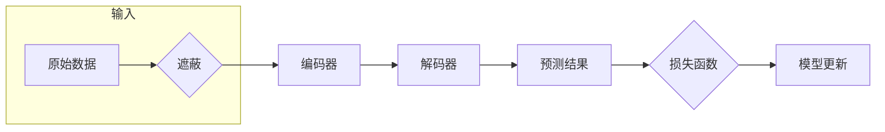

# SimMIM在智能写作辅助中的应用:提高创作效率的新工具

作者：禅与计算机程序设计艺术

## 1. 背景介绍

### 1.1 智能写作辅助的兴起与挑战

近年来，随着人工智能技术的飞速发展，智能写作辅助工具逐渐走进了大众的视野。从语法纠错、文风润色到内容生成，智能写作辅助工具在很大程度上解放了写作者的生产力，为创作提供了极大的便利。然而，现有的智能写作辅助工具仍面临着诸多挑战：

* **缺乏对语义的深度理解:**  许多工具仅仅停留在语法和词法层面，难以真正理解文本的深层含义，导致生成的文本缺乏逻辑性和连贯性。
* **内容生成质量参差不齐:**  虽然一些工具可以生成流畅的文本，但内容往往缺乏深度和创意，难以满足专业写作的需求。
* **用户交互体验有待提升:**  现有的工具大多操作繁琐，难以与用户的写作思路和习惯 seamlessly  衔接，影响了创作效率。

### 1.2 SimMIM: 为智能写作辅助注入新活力

SimMIM (Simple Masked Image Modeling) 是一种新型的自监督学习方法，其在图像领域取得了令人瞩目的成就。其核心思想是通过遮蔽图像的部分区域，并训练模型预测被遮蔽的内容，从而学习到图像的语义信息。近年来，SimMIM 也被逐渐应用于自然语言处理领域，并展现出巨大的潜力。

### 1.3 本文目标与结构

本文旨在探讨 SimMIM 在智能写作辅助中的应用，并阐述其如何解决现有工具面临的挑战，为创作效率带来新的突破。

本文结构如下：

- **第二章** 将介绍 SimMIM 的核心概念与联系，包括自监督学习、掩码语言模型等。
- **第三章** 将深入剖析 SimMIM 的算法原理和具体操作步骤，并结合代码实例进行讲解。
- **第四章** 将详细阐述 SimMIM 的数学模型和公式，并通过举例说明其工作原理。
- **第五章** 将展示 SimMIM 在智能写作辅助中的项目实践，包括代码实例和详细解释说明。
- **第六章** 将探讨 SimMIM 在实际应用场景中的应用，例如文本生成、摘要提取、问答系统等。
- **第七章** 将推荐一些与 SimMIM 相关的工具和资源，方便读者进行更深入的学习和研究。
- **第八章** 将总结 SimMIM 在智能写作辅助中的未来发展趋势与挑战。
- **第九章 (附录)** 将解答一些与 SimMIM 相关的常见问题。

## 2. 核心概念与联系

### 2.1  自监督学习：从数据中学习

传统的机器学习方法通常需要大量的标注数据才能训练出有效的模型，而标注数据的获取往往成本高昂且耗时费力。为了解决这个问题，自监督学习应运而生。

自监督学习的核心思想是利用数据自身的结构和特征，设计出一些“伪任务”来训练模型，从而使模型能够在没有人工标注的情况下学习到数据的内在规律。

### 2.2 掩码语言模型：理解语言的利器

掩码语言模型 (Masked Language Model, MLM) 是一种经典的自监督学习方法，其通过随机遮蔽句子中的一部分词语，并训练模型预测被遮蔽的词语，从而学习到词语之间的语义关系。

例如，对于句子 “The quick brown fox jumps over the lazy dog.”，我们可以随机遮蔽掉 “fox” 这个词，得到 “The quick brown [MASK] jumps over the lazy dog.”，然后训练模型预测 [MASK] 应该是什么词。

### 2.3  SimMIM：图像与语言的桥梁

SimMIM  最初是应用于图像领域的，其通过遮蔽图像的部分区域，并训练模型预测被遮蔽的内容，从而学习到图像的语义信息。近年来，SimMIM 也被逐渐应用于自然语言处理领域，并展现出巨大的潜力。

在自然语言处理领域，我们可以将句子看作是“图像”，将词语看作是“像素”，从而将 SimMIM 应用于文本数据。例如，我们可以随机遮蔽掉句子中的一部分词语，并训练模型预测被遮蔽的词语，从而学习到词语之间的语义关系。

## 3. 核心算法原理具体操作步骤

### 3.1 整体框架

SimMIM 的核心思想是通过遮蔽输入数据的一部分，并训练模型预测被遮蔽的内容，从而学习到数据的语义信息。其整体框架如下图所示：



具体操作步骤如下：

1. **数据预处理:**  对原始数据进行预处理，例如分词、去除停用词等。
2. **数据遮蔽:**  随机遮蔽掉输入数据的一部分，例如词语、句子或段落。
3. **编码器:**  将遮蔽后的数据输入到编码器中，得到数据的特征表示。
4. **解码器:**  将编码器输出的特征表示输入到解码器中，预测被遮蔽的内容。
5. **损失函数:**  计算预测结果与真实结果之间的差异，例如交叉熵损失函数。
6. **模型更新:**  根据损失函数的值更新模型参数，例如使用梯度下降算法。

### 3.2  遮蔽策略

SimMIM 中的遮蔽策略对模型的性能至关重要。常用的遮蔽策略包括：

* **随机遮蔽:**  随机选择一部分数据进行遮蔽。
* **实体遮蔽:**  遮蔽掉文本中的实体，例如人名、地名、机构名等。
* **关键词遮蔽:**  遮蔽掉文本中的关键词。

### 3.3 编码器和解码器

SimMIM 中的编码器和解码器可以使用任何神经网络模型，例如循环神经网络 (RNN)、卷积神经网络 (CNN) 或 Transformer 等。

## 4. 数学模型和公式详细讲解举例说明

### 4.1 掩码语言模型的数学模型

给定一个句子 $s = (w_1, w_2, ..., w_n)$，其中 $w_i$ 表示句子中的第 $i$ 个词语。掩码语言模型的目标是最大化以下对数似然函数：

$$
\log p(s) = \sum_{i=1}^n \log p(w_i | w_1, ..., w_{i-1}, w_{i+1}, ..., w_n)
$$

其中，$p(w_i | w_1, ..., w_{i-1}, w_{i+1}, ..., w_n)$ 表示在给定上下文的情况下，第 $i$ 个词语是 $w_i$ 的概率。

### 4.2 SimMIM 的数学模型

SimMIM 的数学模型与掩码语言模型类似，其目标也是最大化对数似然函数。不同的是，SimMIM 使用遮蔽后的数据来训练模型。

给定一个遮蔽后的句子 $\tilde{s} = (\tilde{w}_1, \tilde{w}_2, ..., \tilde{w}_n)$，其中 $\tilde{w}_i$ 表示遮蔽后的第 $i$ 个词语。SimMIM 的目标是最大化以下对数似然函数：

$$
\log p(\tilde{s}) = \sum_{i=1}^n \log p(\tilde{w}_i | \tilde{w}_1, ..., \tilde{w}_{i-1}, \tilde{w}_{i+1}, ..., \tilde{w}_n)
$$

### 4.3 举例说明

假设我们有一个句子 “The quick brown fox jumps over the lazy dog.”，我们随机遮蔽掉 “fox” 这个词，得到 “The quick brown [MASK] jumps over the lazy dog.”。

对于掩码语言模型，其目标是预测 [MASK] 应该是什么词。例如，模型可能会预测 [MASK] 是 “fox” 或其他动物的名称。

对于 SimMIM，其目标也是预测 [MASK] 应该是什么词。但是，SimMIM 使用的是遮蔽后的句子 “The quick brown [MASK] jumps over the lazy dog.” 来训练模型，而不是原始句子 “The quick brown fox jumps over the lazy dog.”。

## 5. 项目实践：代码实例和详细解释说明

```python
import torch
from transformers import BertTokenizer, BertModel

# 加载预训练的 BERT 模型和词tokenizer
tokenizer = BertTokenizer.from_pretrained('bert-base-uncased')
model = BertModel.from_pretrained('bert-base-uncased')

# 定义输入句子
sentence = "The quick brown fox jumps over the lazy dog."

# 使用 tokenizer 对句子进行编码
input_ids = tokenizer.encode(sentence, add_special_tokens=True)

# 将输入转换为 PyTorch 张量
input_ids = torch.tensor([input_ids])

# 将输入输入到 BERT 模型中
outputs = model(input_ids)

# 获取模型输出的特征表示
hidden_states = outputs.last_hidden_state

# 打印特征表示的形状
print(hidden_states.shape)
```

**代码解释：**

1. 首先，我们加载了预训练的 BERT 模型和词 tokenizer。
2. 然后，我们定义了一个输入句子。
3. 接下来，我们使用 tokenizer 对句子进行编码，并将其转换为 PyTorch 张量。
4. 然后，我们将输入输入到 BERT 模型中，并获取模型输出的特征表示。
5. 最后，我们打印了特征表示的形状。

## 6. 实际应用场景

SimMIM 在智能写作辅助中有着广泛的应用场景，例如：

* **文本生成:**  SimMIM 可以用于生成高质量的文本，例如新闻报道、小说、诗歌等。
* **摘要提取:**  SimMIM 可以用于从长文本中提取关键信息，生成简洁的摘要。
* **问答系统:**  SimMIM 可以用于构建问答系统，回答用户提出的问题。
* **机器翻译:**  SimMIM 可以用于改进机器翻译系统的性能。
* **代码生成:**  SimMIM 可以用于生成代码，例如 Python、Java、C++ 等。

## 7. 工具和资源推荐

* **Hugging Face Transformers:**  一个开源的自然语言处理库，提供了各种预训练的模型和工具，包括 SimMIM。
* **Fairseq:**  另一个开源的自然语言处理库，也提供了 SimMIM 的实现。
* **Papers with Code:**  一个网站，提供了各种机器学习任务的最新研究成果和代码实现，包括 SimMIM。

## 8. 总结：未来发展趋势与挑战

SimMIM 作为一种新型的自监督学习方法，在智能写作辅助领域展现出巨大的潜力。未来，SimMIM 的发展趋势和挑战包括：

* **模型规模的扩展:**  随着计算能力的提升，我们可以训练更大规模的 SimMIM 模型，从而进一步提升模型的性能。
* **多模态数据的融合:**  将 SimMIM 应用于多模态数据，例如文本、图像、音频等，可以进一步提升模型的语义理解能力。
* **可解释性的提升:**  提升 SimMIM 模型的可解释性，可以帮助我们更好地理解模型的工作原理，并改进模型的设计。

## 9. 附录：常见问题与解答

**Q: SimMIM 和 BERT 有什么区别？**

A: SimMIM 和 BERT 都是基于 Transformer 的自监督学习方法，但是它们之间也有一些区别：

* **遮蔽策略:**  BERT 使用的是随机遮蔽策略，而 SimMIM 可以使用更灵活的遮蔽策略，例如实体遮蔽、关键词遮蔽等。
* **预训练任务:**  BERT 使用的是掩码语言模型和下一句预测任务进行预训练，而 SimMIM 只使用掩码语言模型进行预训练。

**Q: SimMIM 可以用于哪些自然语言处理任务？**

A: SimMIM 可以用于各种自然语言处理任务，例如文本生成、摘要提取、问答系统、机器翻译、代码生成等。

**Q: SimMIM 的优点是什么？**

A: SimMIM 的优点包括：

* **自监督学习:**  SimMIM 不需要人工标注数据，可以利用数据自身的结构和特征进行训练。
* **高效性:**  SimMIM 的训练效率比较高，可以在较短的时间内训练出有效的模型。
* **通用性:**  SimMIM 可以应用于各种自然语言处理任务，具有很强的通用性。


