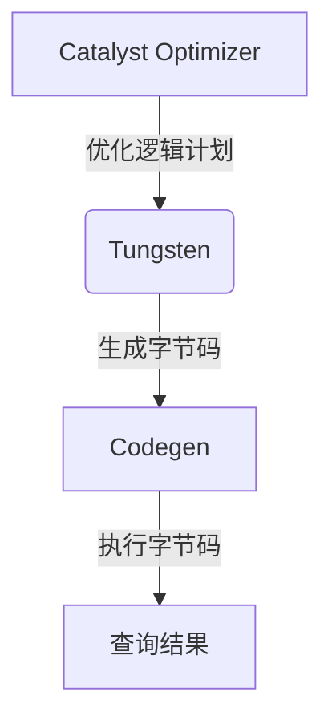
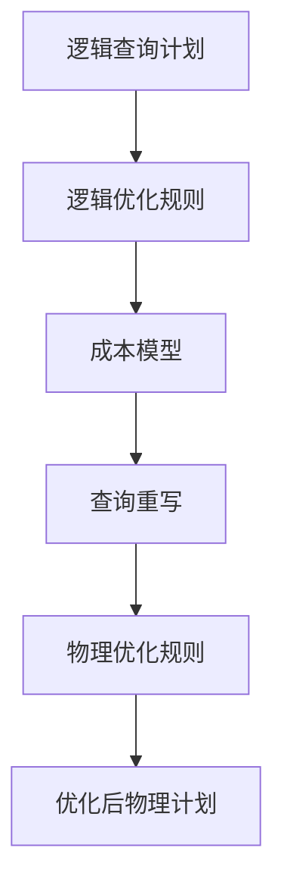

# SparkSQL性能优化指南

## 1.背景介绍

### 1.1 Spark简介

Apache Spark是一个开源的大数据处理框架,它提供了一种快速、通用的数据处理方式。Spark基于内存计算,可以显著提高大数据处理的效率,被广泛应用于机器学习、流式计算和SQL查询等领域。

### 1.2 SparkSQL介绍

SparkSQL是Spark中用于结构化数据处理的模块。它支持使用SQL或者Apache Hive版本的SQL语言(HiveQL)来查询数据,并且可以无缝地集成Python、Java和Scala等编程语言,提供了丰富的API供开发者使用。

### 1.3 优化SparkSQL的重要性

由于现实世界中的大数据查询任务通常涉及大量的数据,对性能要求很高。因此,优化SparkSQL查询的执行效率对于确保系统的整体性能至关重要。本文将探讨SparkSQL性能优化的各种技术和最佳实践。

## 2.核心概念与联系

### 2.1 SparkSQL的架构

SparkSQL的架构主要由以下几个核心组件组成:

- **Catalyst Optimizer**: 查询优化器,负责优化逻辑查询计划
- **Tungsten** : 整体执行引擎,负责物理执行
- **Codegen** : 代码生成器,将优化后的计划编译为Java字节码,提高执行效率

这些组件紧密协作,共同实现高效的查询执行。



### 2.2 核心概念

- **逻辑计划(Logical Plan)**: 描述查询的高级语义,由一系列逻辑操作组成
- **物理计划(Physical Plan)**: 由Catalyst根据逻辑计划生成,描述了具体的执行策略
- **RDD/DataFrame/DataSet**: Spark提供的分布式数据集API
- **Shuffle**: 数据重分区操作,性能开销大,应尽量减少
- **广播变量(Broadcast Variable)**: 将小数据集发送到每个执行器,避免重复传输
- **数据本地性(Data Locality)**: 尽量在存储数据的节点上执行计算,减少数据传输

理解这些概念有助于更好地优化SparkSQL查询。

## 3.核心算法原理具体操作步骤  

### 3.1 Catalyst优化器工作原理

Catalyst优化器通过以下步骤优化逻辑查询计划:

1. **逻辑优化规则(Logical Optimization Rules)**: 应用一系列规则,如投影剪裁、谓词下推等,对逻辑计划进行等价变换,以获得更优的逻辑计划。

2. **成本模型(Cost Model)**: 基于统计信息(如数据大小、分区数等),估算每个逻辑计划的开销成本。

3. **查询重写(Query Rewrite)**: 根据成本模型,尝试重写查询,以生成更优的逻辑计划。

4. **物理优化规则(Physical Optimization Rules)**: 将优化后的逻辑计划转换为物理计划,并应用物理优化规则(如连接重排序、数据采样等)进一步优化。



### 3.2 Tungsten执行引擎

Tungsten是SparkSQL的新一代执行引擎,主要包括以下优化:

1. **内存管理优化**: 使用Sun Unsafe API直接操作内存,避免JVM对象开销。

2. **编码优化**: 对热点代码路径进行手动优化,如循环展开、向量化等。

3. **缓存优化**: 使用缓存友好的数据格式,提高缓存利用率。

4. **编译优化**: 通过Codegen将查询计划编译为Java字节码,避免解释器开销。

### 3.3 Codegen代码生成优化

Codegen是SparkSQL中重要的优化技术,它将查询计划编译为Java字节码,提高了执行效率。主要步骤如下:

1. **生成Java源码**: 根据查询计划,生成等效的Java源代码。

2. **编译字节码**: 利用Java编译器(如javac)将源码编译为字节码。

3. **加载执行**: 通过Java的动态类加载机制,在运行时加载和执行字节码。

通过这种方式,SparkSQL避免了解释器开销,并且可以利用JIT编译器进一步优化热点代码。

## 4.数学模型和公式详细讲解举例说明

在SparkSQL的查询优化过程中,成本模型扮演着关键角色。成本模型通过估算每个查询计划的开销成本,为查询重写和物理优化提供依据。

### 4.1 成本模型公式

SparkSQL的成本模型主要考虑以下几个因素:

- 数据读取成本 $C_R$
- CPU开销成本 $C_{CPU}$  
- Shuffle开销成本 $C_S$
- 内存开销成本 $C_M$
- 网络传输成本 $C_N$

总成本可以表示为:

$$C = C_R + C_{CPU} + C_S + C_M + C_N$$

其中,每个成本项都由多个子因素决定,例如:

$$C_R = \sum\limits_{p}size(p) \times \lambda_R(p.loc)$$

这里 $size(p)$ 表示分区 $p$ 的大小, $\lambda_R(p.loc)$ 表示读取位置 $p.loc$ 处数据的开销因子。

### 4.2 成本估算示例

考虑以下JOIN查询:

```sql
SELECT * 
FROM lineitem l
JOIN orders o ON l.l_orderkey = o.o_orderkey;
```

假设lineitem表有1000个128MB的分区,orders表有100个64MB的分区。如果JOIN操作需要重分区,成本估算如下:

1. 读取成本 $C_R$:
   - lineitem: $1000 \times 128MB \times \lambda_R(HDFS) = 128000MB \times \lambda_R(HDFS)$
   - orders: $100 \times 64MB \times \lambda_R(HDFS) = 6400MB \times \lambda_R(HDFS)$

2. Shuffle写入成本 $C_S^{write}$:
   - lineitem分区数 $\times$ 分区大小 $\times$ 开销因子
     = $1000 \times 128MB \times \lambda_S^{write}$
   - orders同理

3. Shuffle读取成本 $C_S^{read}$:
   - 假设重分区后有200个分区,每个分区512MB
   - $200 \times 512MB \times \lambda_S^{read}$

4. JOIN的CPU成本 $C_{CPU}$:
   - 取决于JOIN类型、数据大小等,这里忽略细节

通过这种方式,查询优化器可以估算出不同查询计划的总成本,并选择最优方案。

## 4.项目实践: 代码实例和详细解释说明

为了更直观地展示SparkSQL优化技术的应用,我们将通过一个电商数据分析的实际项目案例,演示如何进行性能优化。

### 4.1 项目概述

该项目的目标是对电商网站的订单数据进行分析,以了解用户购买行为、热销商品等信息。数据集包括以下三个表:

- **orders** : 订单信息表,包含订单ID、用户ID、下单时间等字段。
- **order_items** : 订单商品明细表,包含订单ID、商品ID、购买数量等字段。
- **products** : 商品信息表,包含商品ID、商品名称、类别等字段。

我们将使用SparkSQL对这些表执行连接查询和聚合分析,并优化查询性能。

### 4.2 初始查询

假设我们想要统计每个商品类别的总销售额,初始SQL查询如下:

```sql
SELECT p.product_category, SUM(oi.quantity * p.price) AS total_revenue
FROM orders o
JOIN order_items oi ON o.order_id = oi.order_id  
JOIN products p ON oi.product_id = p.product_id
GROUP BY p.product_category;
```

这个查询需要执行三表连接,并对结果进行聚合计算。让我们先看看它的执行计划:

```scala
// 查看执行计划
spark.sql("""
  SELECT p.product_category, SUM(oi.quantity * p.price) AS total_revenue
  FROM orders o
  JOIN order_items oi ON o.order_id = oi.order_id
  JOIN products p ON oi.product_id = p.product_id
  GROUP BY p.product_category
""").explain()
```

执行计划输出显示,该查询涉及了大量的Shuffle操作,可能会导致性能低下。接下来我们将逐步优化这个查询。

### 4.3 优化1: 调整连接顺序

观察执行计划,我们发现orders表和order_items表的连接操作发生在products表连接之前。这可能会导致不必要的Shuffle开销,因为orders和order_items表的连接结果可能比原始表大很多。

我们可以先连接orders和order_items表,再与较小的products表连接,以减少Shuffle数据量:

```sql
SELECT p.product_category, SUM(oi.quantity * p.price) AS total_revenue  
FROM (
  SELECT oi.order_id, oi.product_id, oi.quantity
  FROM orders o
  JOIN order_items oi ON o.order_id = oi.order_id
) oi
JOIN products p ON oi.product_id = p.product_id
GROUP BY p.product_category;
```

这样做可以显著减少Shuffle写入和读取的数据量,从而提高性能。

### 4.4 优化2: 选择合适的连接类型

SparkSQL支持多种连接类型,如BroadcastHashJoin、ShuffledHashJoin等。选择合适的连接类型也是优化查询的重要手段。

在我们的案例中,products表相对较小,可以考虑使用BroadcastHashJoin广播products表到每个执行器,避免对它进行Shuffle操作:

```scala
import org.apache.spark.sql.functions._

val broadcastProducts = spark.table("products").persist()

val result = spark.table("orders").join(
    spark.table("order_items"),
    $"order_id" === $"order_id"
  ).join(
    broadcast(broadcastProducts),
    $"product_id" === $"product_id"
  ).groupBy($"product_category")
  .agg(sum($"quantity" * $"price") as "total_revenue")
  .show()
```

这种方式可以避免对products表进行Shuffle,从而提高查询效率。但需要注意,如果广播表过大,反而可能导致性能下降。

### 4.5 优化3: 分区裁剪和数据压缩

如果我们只需要分析近期订单数据,可以对orders表进行分区裁剪,只读取必要的分区,从而减少读取数据量。

此外,对数据进行压缩也可以减少网络传输开销。Parquet等列式存储格式具有高效的压缩编码,可以显著降低存储和传输开销。

```scala
// 分区裁剪
val recentOrders = spark.table("orders")
  .filter($"order_date" >= "2023-01-01")
  
// 数据压缩
recentOrders.write
  .mode("overwrite")
  .parquet("/path/to/compressed/orders")
  
val compressedOrders = spark.read.parquet("/path/to/compressed/orders")
```

### 4.6 优化4: 缓存热数据

如果某些中间结果需要被重复使用,可以考虑将它们缓存在内存中,避免重复计算。例如,我们可以缓存orders和order_items表的连接结果:

```scala
val ordersWithItems = spark.table("orders").join(
  spark.table("order_items"),
  $"order_id" === $"order_id"
).persist()

// 后续查询可以直接使用ordersWithItems
```

但需要注意,缓存也会占用内存资源,因此必须权衡利弊。

通过上述优化,我们可以显著提高查询性能。但是,优化过程需要根据具体场景进行调整和实验,以找到最佳的方案。

## 5.实际应用场景

SparkSQL广泛应用于各种大数据分析场景,如电子商务、金融、物联网等领域。以下是一些典型的应用案例:

### 5.1 电子商务用户行为分析

电商平台需要分析海量用户的浏览、购买记录,以发现用户偏好、提供个性化推荐等。SparkSQL可以高效地处理这些数据,并与机器学习模型相结合,为用户提供更好的服务体验。

### 5.2 金融风控和反欺诈

金融机构需要实时监控交